# C1 - Structure and Physical Properties of Organic Compounds

## C1.1 - Introducing Organic Compounds

### Brief History

- For 100s of years, up until the 1800s, scientists thought "organic" and "inorganic" matter were different
- "organic" used to describe matter from living things
- 1828: German chemist Friedrich Wöhler accidentally synthesized urea (organic) w/ silver cyanate and ammonium chloride (both inorganic)
- late 1800s: clear that same laws applied to organic matter as inorganic matter

### Organic Compounds

- **organic compound:** type of compound in which *carbon atoms* are nearly always bonded to each other to *hydrogen atoms*
	- ... and sometimes to atoms of a few specific elements
	- elements usually oxygen, nitrogen, sulfur, or phosphorus
	- has exceptions
- **inorganic compound:** type of compounds that do not contain carbon atoms, as well as organic exceptions like...
	- carbonates ($\ce{CO3^2-}$)
	- cyanides ($\ce{CN-}$)
	- carbides ($\ce{C2^2-}$)
	- oxides of carbon (i.e. $\ce{CO2, CO}$)

### Special Nature of Carbon Atom

- carbon has 4 valence electrons
- carbon much more likely to share electrons, then form ions
- carbon can form covalent bonds w/ up to four other atoms
- carbon forms *tetrahedral* shape when bonded w/ 4 other atoms

**Tetrahedral Shape of Carbon Atoms**

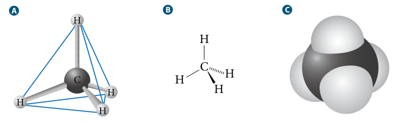

### Isomers

**isomers:** molecules that have the same molecular formula but their atoms have a different arrangement

#### Constitutional Isomers

- **constitutional isomers:** molecules that have the same molecular formula but their atoms are bonded together in a different sequence
	- a.k.a. *structural isomer*
- i.e. $\ce{C6H14}$ can form 5 constitutional isomers

**Fig. 1: Constitutional Isomers of $\ce{C5H12}$**

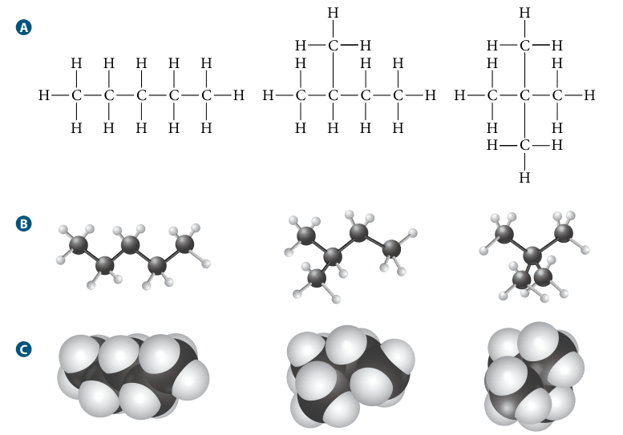

These molecules below are not isomers of molecules above, because they are the same as Fig. 1 (B)

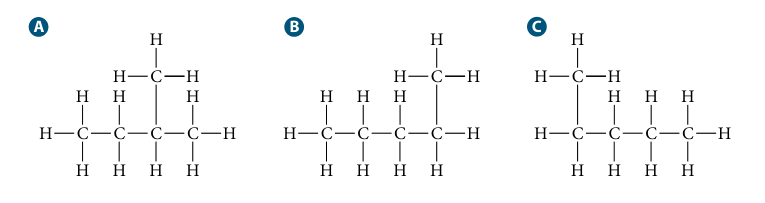

*All three are the same molecule, since atoms can rotate freely around single bond. Flip (A) to see similarity.*

##### Carbon Rings

- Carbon atoms can form rings of 3-6 or more atoms
- All *constitutional isomers* with each other and those in fig. 1

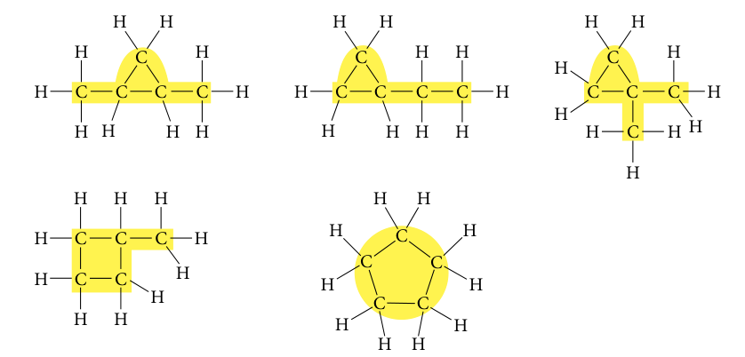

#### Stereoisomers

- **stereoisomers:** molecules that have same molecular formula and same bonding sequence
	- they differ in 3D orientation of atoms in space
	- one source is rigidity around double bond
- molecules w/ double bonds are flat and rigid, bcz. their atoms cannot rotate around double bond

**Rigidity of Double Bond**

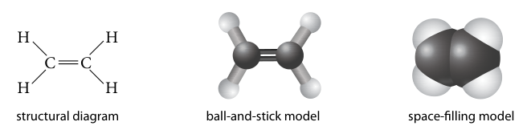

##### Diastereomers

- **diastereomers:** stereoisomer based on carbon double bond
	- ... where each carbon has different types of atoms or groups of atoms bonded to it
- **cis isomer:** diastereomer where 2 identical atoms / groups are on same side of double bond
- **trans isomer:** diastereomer where 2 identical atoms / groups are on opposite sides of double bond

*Cis vs. Trans Isomer*

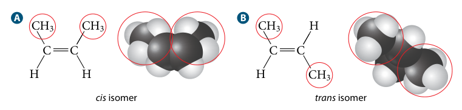

*All possible diastereomers of $\ce{C5H10}$*

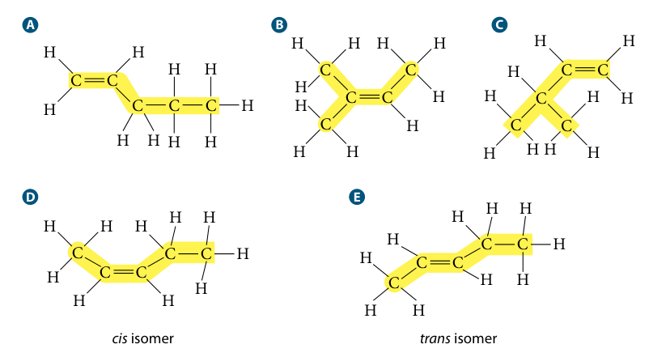

Structure around carbon triple bonds is flat and rigid; diastereomers not possible

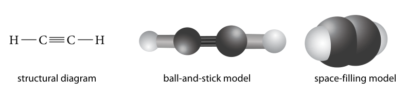

*Stereoisomers of carbon triple bonds, where there are longer chains ($\ce{C5H8}$)*

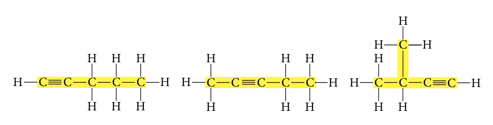

##### Enantiomers

- **enantiomers:** stereoisomer where molecules are mirror images of each other around single carbon atom bonded to 4 diff. atoms / groups
- they cannot be placed over each other

**Enantiomer Example:**

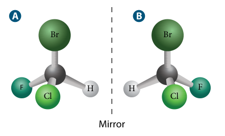

*Not enantiomers when F replaced with H, they are identical now:*

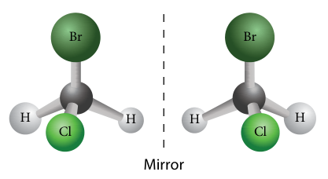

---

## C1.2 - Hydrocarbons

### Hydrocarbons

**hydrocarbon:** organic compounds that contain only carbon and hydrogen

### Alkanes

- **alkane:** hydrocarbon where carbon atoms are joined by single covalent bonds
	- no double or triple bonds
- **saturated hydrocarbon:** hydrocarbon containing only single bonds
	- ... so that each carbon atom is bonded to the max. possible no. of atoms
- methane is the simplest alkane
- each alkane differs by **structural unit**, $\ce{-CH2-}$
- each C atom is bonded to a min. of 2 hydrogens
- **General Alkane Formula:** $\ce{C_nH_{2n+2}}$
	- $n$ is # of carbon atoms
	- $2n + 2$ hydrogen atoms
- **homologous series:** series of molecules in which each member differs from the next by an additional specific structural unit

*First four alkanes*

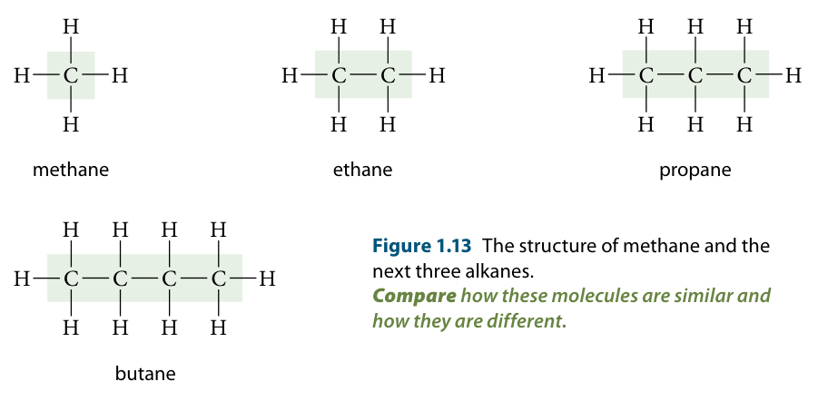

#### Modelling Alkanes

- chem. formula doesn't explain structure of alkanes very well
- **substituent group:** atom of group of atoms that have been subbed in place of a hydrogen atom on parent chain of org. comp.
	- more commonly k.a. *side groups*

**Models Used to Represent Alkane Structures**

|Model Name|Model Ex.|Description|
|-|-|-|
|Empirical molecular formula|$\ce{C5H12}$|Shows # and types of atoms present
|Expanded molecular formula|$\ce{CH3CH(CH3)CH2CH3}$|Shows groupings of atoms  &bull; brackets shows branched side chains  &bull; in ex., &ndash;CH3 side chain shown attached to 2nd C from left end|
|Structural formula|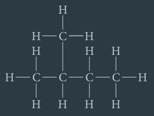|Gives clear picture of all atoms and bond locations|
|Condensed structural formula|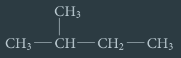|Saves space by not showing carbon-hydrogen bonds|
|Line structural formula|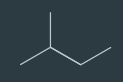|Uses lines to repr. chem. bonds  &bull; each end of line repr. carbon atom  &bull; each C assumed to have as much H as needed to have 4 bonds|

### Naming Alkanes

- IUPAC Naming Structure for Organic Compounds
	- **root** denotes number of carbon atoms in longest continuous chain of carbon atoms
	- **prefix** gives positions and names of any branches from main chain
	- **suffix** indicates series to which belongs
		- suffix for alkanes is "-ane"
- **alkyl group:** side group derived / based on an alkane
	- looks like an alkane with a "missing hydrogen"
	- same root as main alkane chain
	- suffix is "-yl" instead of "-ane"
	- i.e. $\ce{-CH3}$ = methyl group

**Root and Side Group Names for Alkanes:**

|No. of Carbon Atoms|Root Name|Side Group Name|
|-|-|-|
|1|meth-|methyl-|
|2|eth-|ethyl-|
|3|prop-|propyl|
|4|but-|butyl-|
|5|pent-|pentyl-|
|6|hex-|hexyl-|
|7|hept-||
|8|oct-||
|9|non-||
|10|dec-||

#### Steps for Naming Alkanes

1. **Identify Root**
	1. Identify longest continuous chain
	2. Find root for number of carbons in chain

*Example:*

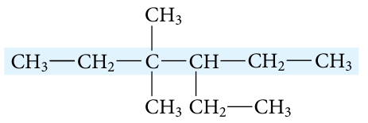

- longest chain: 6 carbons
- *root:* hex-

2. **Identify Suffix**
	- Compound is alkane
	- *suffix:* -ane
3. **Identify Prefix**
	1. Identify # of carbons in each side group
	2. Determine name of each side group based on no. of C
	3. If there is more than one type of side group, write names in alphabetical order
	4. Find position of each side
		1. Begin numbering at an end of the main chain
		2. ... so that side groups are given lowest possible numbers
		3. *"Quick" way:* Add up numbers for each possibility
	5. Precede name of each side group w/ the assigned number of the corresponding C on the main chain
		1. corresponding = which main chain C is the side group attached to?	
		2. use hyphen to sep. a number and a word
		3. use comma to sep. two nums.
	6. Use prefix to indicate how many of each type of side group is present, if there is more than one
		1. i.e. *di-*, *tri-*, or *tetra-* used when 2, 3, or 4 of same side group present
		2. does not affect alphabetical order in step 3

*Example, steps 3-1 to 3-3:*

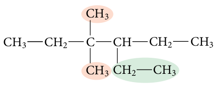

- 2 side groups have 1 C, 3rd side group has 2 Cs
- side groups w/ 1 C atom: *methyl* groups
- side group w/ 2 C: *ethyl* group
- alphabetic order: *ethyl*, *methyl*

*Steps 3-4 to 3-6:*

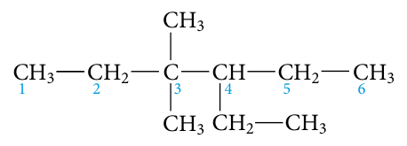

- compound numbered L to R
	- side groups have nums. 3, 3, 4
- ethyl group on carbon atom 4
	- individual prefix: *4-ethyl-*
- each methyl group on carbon atom 3
	- prefix for each groups: *3-methyl-*
	- prefix for both groups: *3,3-**di**methyl-*
- *combined prefix:* 4-ethyl-3,3-dimethyl-

4. **Name the compound**
	1. Combine prefix, root, and suffix
	2. No sep. between prefix and root

*Final name:* 4-ethyl-3,3-dimethylhexane

#### Drawing Alkanes

1. **Identify Root**
	1. Root of name gives # of carbons in main chain

*Example*

3-ethyl-3-methylpentane

- root: pent-
- 5 carbons in main chain

2. **Identify Suffix**
	1. Suffix gives structure of atoms
	2. ... and nature of C-C bonds

- suffix: -ane
- compound is alkane, single bonds only

3. **Draw and number main chain**
	1. Do not add hydrogens yet
	2. Chain will act as the base

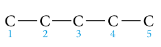

4. **Identify prefix and draw side groups**
	1. Prefix tells you what side groups are
	2. ... and which carbon atom of main chain they are attached to
	3. If 2 side groups on same chain, you can put them on either side
	
- prefix is 3-ethyl-methyl-
- $\therefore$ an ethyl and methyl group attached to 3rd carbon of main chain
- metyhl: 1 C &mdash; ethyl: 2 C
- drawing shown in step 5

5. **Complete condensed structural formula**
	1. Add number of hydrogens beside each carbon
	2. ... to give each carbon 4 bonds

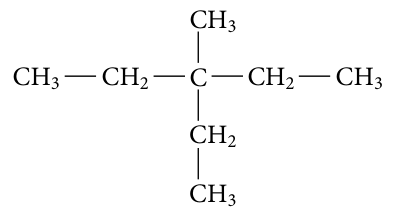

6. **Draw complete / line structural formula**, *if necessary*

*Line structural formula*

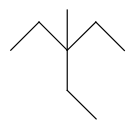

### Physical Properties of Alkanes

- alkanes are non-polar, insoluble in water
	- attractive forces between alkane molecules stronger
	- ... than attractive forces between water and alkanes
- soluble in benzene and other non-polar solvents
- states at SATP
	- small alkanes (i.e. methane, propane) are gases
	- medium-length alkanes are liquids
	- very large alkanes are waxy solids
- shape and size of molecules affect BPs
	- highly branched chains have lower BPs than straight chains

|Size (# of C / molecule)|Boiling Point Range (&deg;C)|Use Case Examples|
|-|-|-|
|1 - 4|<30|gases: fuels to heat homes and cook|
|5 - 16|30 - 275|liquids: automotive, diesel, and jet engine fuels; also raw material for pertrochemical industry|
|16 - 22|>250|heavy liquids: oil furances / lubricating oils|
|>18|>400|semi-solids: lubricating greases / paraffin waxes for candles, waxed paper, cosmetics|
|>26|>500|solid residues: asphalts and tars for paving and roofing|

### Alkenes

- **alkene:** hydrocarbon that contains 1+ carbon-carbon double bonds
	- all alkenes at least have 2 carbons
	- they are unsaturated hydrocarbons
- **unsaturated hydrocarbon:** hydrocarbon that contains C-C double or trips bonds
	- ... whose carbon atoms can potentially bond to additional external atoms
- **General Formula:** $\ce{C_nH_{2n}}$
	- alkenes have 2 fewer hydrogens than similar alkane
- i.e. ethene gas, plant hormone, is used to quickly ripen fruits after shipping

*Unsaturated hydrocarbon reacting to become saturated*

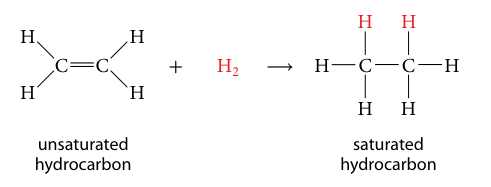

*First three alkenes*

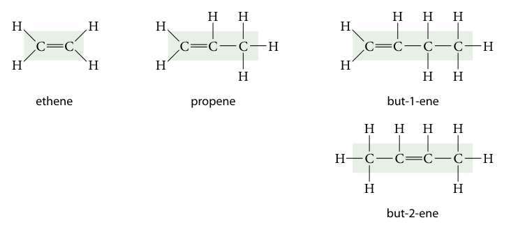

Alkenes with 4+ carbons can have >1 structure, since double bond can be in diff. positions

#### Modelling Alkenes

Same 5 types of formulas used as alkanes

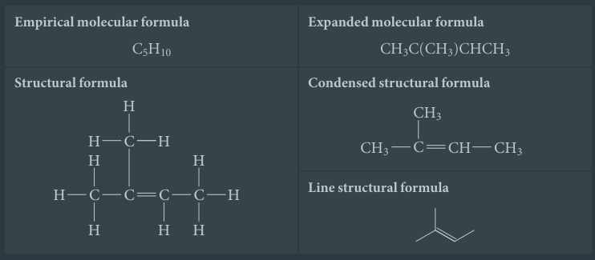

#### Naming Alkenes

*Similar to alkanes* &mdash; suffix ends with "-ene"

1. **Identify Root**
	1. Identify longest continuous chain that contains double bond
	2. Find root for no. of carbons in chain
		1. *Same root as alkane*

*Example:*

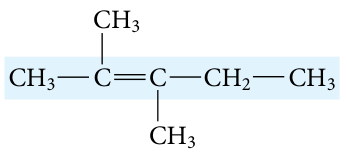

- longest chain has 5 carbons
- *root:* pent-

2. **Identify Suffix**
	1. Number main chain by starting at end nearest to double bond
		1. This gives double bond lowest possible carbon nos.
	2. If alkene contains 4+ carbons, give position of double bond
		1. ...by indicating no. of carbon *preceding* the double bond
		2. Suffix: -{carbon no.}-ene

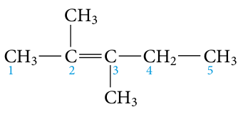

- main chain numbered L &rarr; R to give double-bond carbons lowest possible numbers
- compound is alkene, suffix ends w/ "-ene"
- compound contains 4+ carbons
	- double bond between 2 and 3
- *final suffix:* -2-ene

3. **Identify Prefix**
	1. Identify # of carbons in each side group
	2. Determine name of each side group based on no. of C
	3. If there is more than one type of side group, write names in alphabetical order
	4. Find position of each side
	5. Precede name of each side group w/ the assigned number of the corresponding C on the main chain
		1. corresponding = which main chain C is the side group attached to?	
		2. use hyphen to sep. a number and a word
		3. use comma to sep. two nums.
	6. Use prefix to indicate how many of each type of side group is present, if there is more than one
		1. i.e. *di-*, *tri-*, or *tetra-* used when 2, 3, or 4 of same side group present
		2. does not affect alphabetical order in step 3

- one methyl group bonded to C atom 2
- other methyl group bonded to C atom 3
- *prefix:* 2,3-dimethyl-

3. **Name the compound**
	1. Combine prefix, root, suffix

*Final name:* 2,3-dimethylpent-2-ene

*NOTE:* Chain containing double bond may not be the longest chain, but it is always the main chain

#### Drawing Alkenes

*Basically same as alkanes*

**Example:** 2-methylbut-2-ene

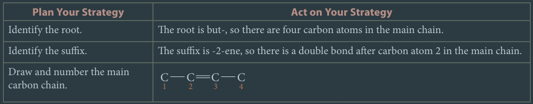

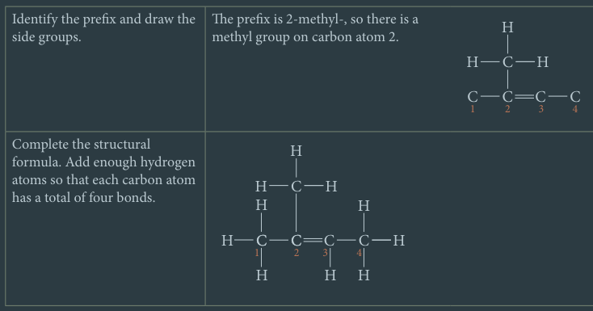

#### Physical Properties of Alkenes

- Similar to alkanes
- Non-polar, insoluble in water
- States of alkenes at SATP
	- ethene, propene, butene: gas
	- intermediate size: liquid
- BP of alkenes are slightly lower than alkane w/ same carbon count
	- i.e. BP of ethene: -103.8 &deg;C
	- BP of ethane: -88.6 &deg;C
- Slight differences in shapes of molecules affect boiling point
	- BP of but-1-ene: -6.3 &deg;C
	- BP of *trans*-but-2-ene: 0.88 &deg;C
	- BP of *cis*-but-2-ene: 3.71 &deg;C

### Alkynes

- **alkyne:** hydrocarbons that have at least 1 C-C triple bond
	- i.e. acetylene (correct IUPAC name: ethyne), fuel used by gas welders
	- also unsaturated hydrocarbons
- **General Formula:** $\ce{C_nH_{2n-2}}$
	- alkynes have 2 less hydrogens than similar alkenes

*First three alkynes*

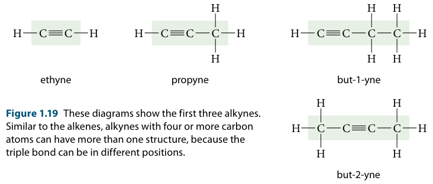

#### Modelling Alkynes

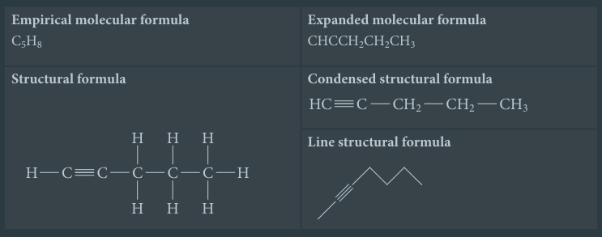

#### Naming Alkynes

*Basically same as alkanes* &mdash; suffix: "-yne"

**Example:**

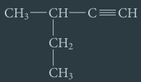

**Steps** as table:

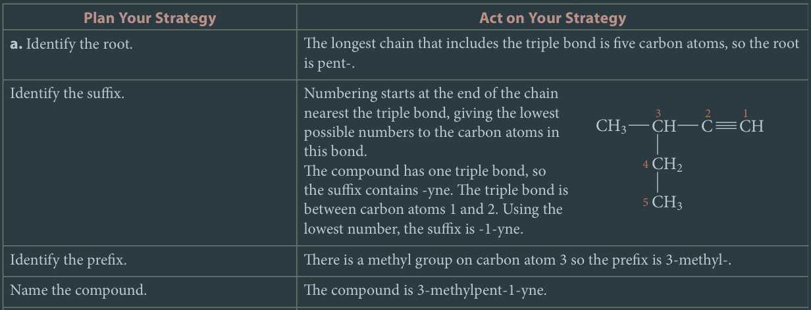

#### Drawing Alkynes

*Basically same as alkenes*

**Example:** 4-ethylhex-2-yne

**Steps** as table:

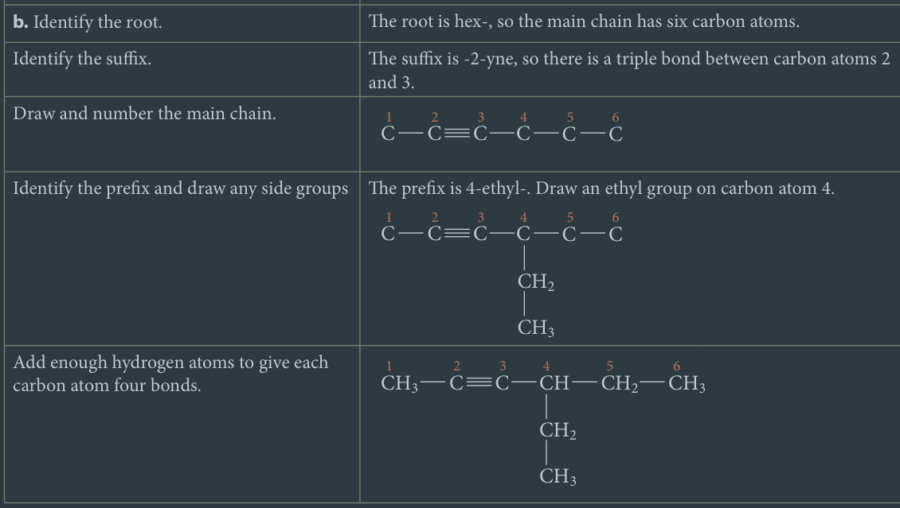

#### Physical Properties of Alkynes

- Similar to other hydrocarbons
- Non-polar, insoluble in water
- Few alkynes exist as gases
- Alkynes have higher BP than corresponding alkanes
	- linear structure and nature of triple bond...
	- ... causes alkynes to attract one another more strongly than alkanes or alkenes
	- more energy needed to overcome these forces

**Boiling Points of Small Alkanes, Alkenes, and Alkynes**

|Alkanes|BP (&deg;C)|Alkenes|BP (&deg;C)|Alkynes|BP (&deg;C)|
|-|-|-|-|-|-|
|ethane|-89|ethene|-104|ethyne|-84|
|propane|-42|propene|-47|propyne|-23|
|butane|-0.5|butene|-6.3|butyne|8.1|
|pentane|36|pentene|30|pentyne|39|
|hexane|69|hexene|63|hexyne|71|

### Cyclic Hydrocarbons

- **cyclic hydrocarbon:** hydrocarbon chain that forms a ring
- foundation of many important biological molecules
	- incl. cholesterol, testosterone (steroid hormone), estrogens
- can be alkanes, alkenes, and alkynes
	- *cyclic alkynes are rare and usually unstable*
- **General Formula for Cyclic Alkanes:** $\ce{C_nH_{2n}}$
	- carbon chain must have 3+ carbons to form a ring

*First four cyclic alkanes (w/ line structural formulas top-left)*

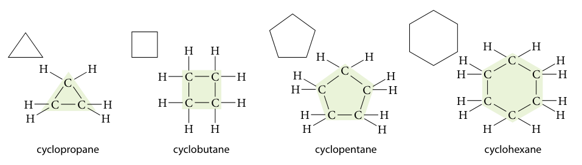

#### Naming Cyclic Hydrocarbons

1. **Identify Root**
	1. Determine no. of carbons in ring to find root
	2. Root is same as straight chain, but "cyclo-" precedes the root

*Example:*

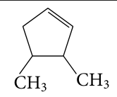

- 5 carbons in ring
- root: *cyclopent-*

2. **Identify Suffix**
	1. Determine whether molecule has...
		1. only single bonds
		2. at least a double bond
		3. at least a triple bond
	2. Determine suffix
		1. single bond: *-ane*
		2. double bond (DB): *-ene*
		3. triple bond (TB): *-yne*
	3. Not necessary to indicate location of DB or TB, always assumed to be between carbons 1 and 2

- Ring has 1 double bond
- *Suffix:* -ene

3. **Identify Prefix**
	1. Identify alkyl prefixes as you would w/ straight chain hydrocarbons
	2. If there are 0-1 side groups in an alkane, carbons are not numbered
	3. If there are 2+ side groups in an alkane, numbering starts at side group and proceeds
		1. ... in direction that gives lowest possible nos. to all side groups
		2. If nos. of 2+ side groups are same, side group that comes first alphabetically is assigned as carbon atom 1
	4. If molecule is alkene or alkyne, multiple bond takes highest priority
		1. Carbon on one side of multiple bond is carbon atom 1
		2. Carbon atom on other side is C atom 2
		3. If there are side groups, numbering starts in pos. that makes nos. of carbons bonded to side groups as small as possible

- molecule is cyclic alkene
- C atoms on 2 sides of DB must be numbered 1 and 2
- numbering must proceed so that side groups have lowest possible number

*Correct numbering:*

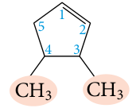

- numbering of carbons in DB must be 1 and 2
	- not necessary to specify in name
- 2 methyl groups in 3 and 4
- *prefix:* 3,4-dimethyl-

4. **Name the compound**
	1. Combine prefix, root, and suffix

*Final name:* 3,4-dimethylcyclopentene

#### Drawing Cyclic Hydrocarbons

**Example:** 4-ethyl-2-methylcyclopentene

**Steps** as table:

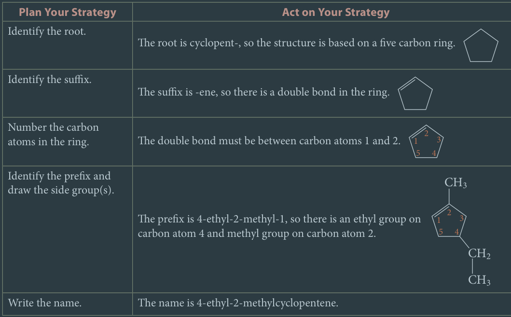

#### Properties of Cyclic Hydrocarbons

- non-polar, insoluble in water
	- *exception:* cyclopropane
- physical properties similar to straight chain counterparts
- boiling points of cyclic hydrocarbons slightly higher than straight chain variants w/ same no. of carbons

**Boiling and Melting Points of Alkanes and Cyclic Alkanes**

|Cyclic Alkane|BP (&deg;C)|MP (&deg;C)|Alkane|BP (&deg;C)|MP (&deg;C)|
|-|-|-|-|-|-|
|cyclopropane|-32.7|-127|propane|-42.1|-190|
|cyclobutane|12.0|-50.0|butane|-0.5|-138|
|cyclopentane|49.3|-93.0|pentane|36.1|-130|
|cyclohexane|80.7|6.6|hexane|68.9|-95.5|

### Aromatic Hydrocarbons

- *Interesting Backstory of Aromatic Hydrocarbons*
	- looks a lot like typical cyclic hydrocarbon
	- properties are very unique that they form a sep. class
	- name originally used for naturally occuring plant compounds w/ intense aromas
	- low hydrogen : carbon ratio and unusual stability
		- low ratio associated w/ presence of multiple bonds
		- multiple bonds usually leads to less stability
		- answered by discovery of benzene ring
- **benzene:** cyclic, aromatic hydrocarbon ($\ce{C6H6}$) where all 6 C-C bonds are intermediate in length between single and double bond
	- delocalized electrons are shared by all 6 carbon atoms
- **aromatic hydrocarbon:** hydrocarbon based on the benzene ring
- **aliphatic compound:** hydrocarbon where carbons form straight chains or non-aromatic rings
- ***Evolution of Benzene Structure***
	- benzene originally drew as alternating single and double bond
	- experimental observations showed that all 6 C-C bonds are identical in length and other props.
	- C-C bonds are intermediate between single and double bonds
	- benzene is a *resonance hybrid* (refer to [[c4-chem-bonding|chapter 4]])
	- **delocalized electrons:** electrons equally shared across all atoms in a bond
		- electrons in benzene delocalized across all 6 carbons
	- **conjugated double bonds:** double bonds where a single bond is between 2 DBs
		- DBs in benzene
		- electrons are delocalized
		- stable because electrons not readily available for reactions

***Evolution of Benzene's Structure***

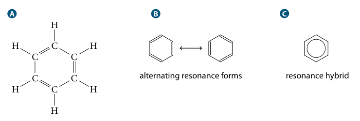

Chemists prefer to draw (C), where hexagon repr. C bonds and circular ring repr. delocalized electrons

#### Extra Rules for Naming / Drawing Aromatic Hydrocarbons

- **Side Groups w/ 6 or less C atoms**
	1. Draw benzene ring
	2. Add side groups as indicated
- **Benzene Attached to Hydrocarbon Chain w/ more than 6 C atoms**
	1. Benzene is a side group
	2. **phenyl group:** benzene ring that forms a substituent group on a hydrocarbon chain
	3. Phenyls are named like aliphatic hydrocarbons, w/ the same prefix as its name

#### Naming Aromatic Hydrocarbons

##### For Benzene Roots

Benzene is used as root, since it is the basis of aromatic HCs

**Steps** as table:

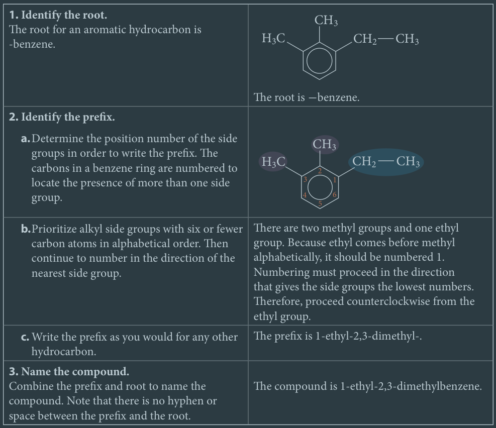

##### For Hydrocarbons w/ Phenyl Groups

**Example** where benzene is a phenyl group:

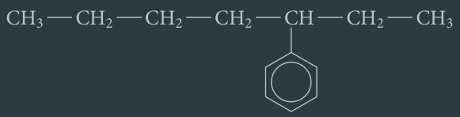 

**Steps** as table:

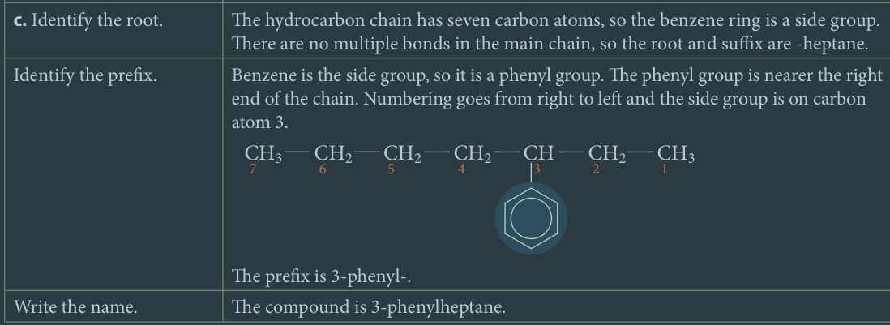

#### Drawing Aromatic Hydrocarbons

##### For Benzene Roots

**Example:** 1-ethyl-3-propylbenzene

**Steps** as table:

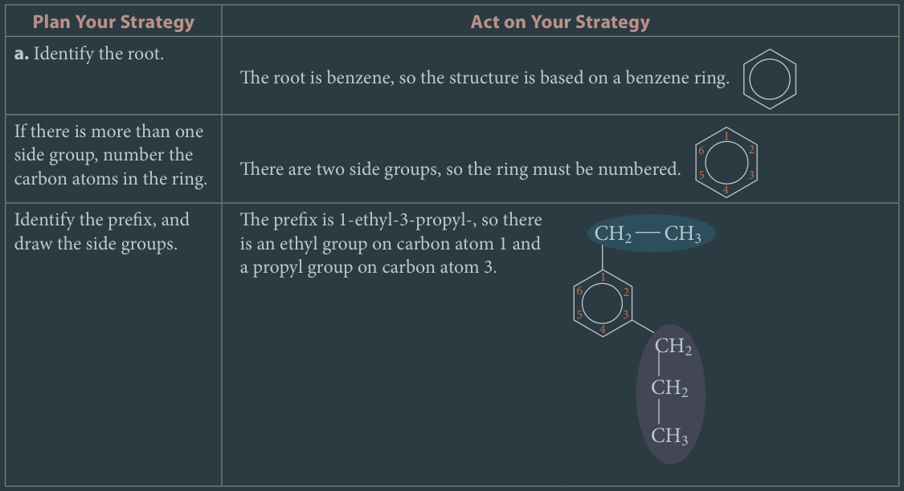

##### For Hydrocarbons w/ Phenyl Groups

**Example:** 4,6-diphenyloct-2-ene

**Steps**, simplified:

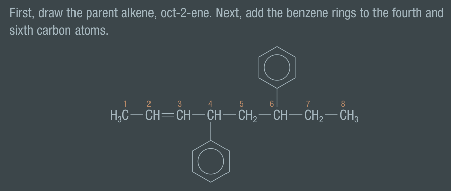

*Steps are from Nelson textbook*

#### Physical Properties of Aromatic Compounds

- benzene is liquid at SATP
- BP of simple aromatic HCs very similar to those of aliphatic HCs w/ same no. of carbons
- *aromatic* implies that these compounds often have strong aromas

*Examples of aromatic compounds*

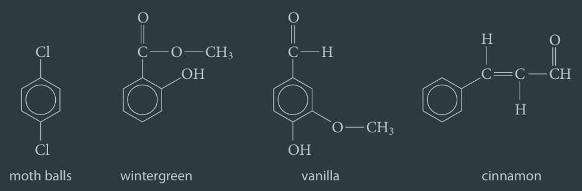

---

## C1.3 - Hydrocarbon Derivatives

### Functional Groups

- **functional group:** a certain group of atoms that is mainly responsible for the chemical behaviour of a molecule
- **hydrocarbon derivative:** a compound made of carbon atoms and at least one other atom that isn't hydrogen
	- made when a functional group subs in for H in a hydrocarbon

**Functional Groups Summary**

*R* is a generic hydrocarbon chain, where each tick means diff. from prev.

|Organic Compound|General Formula of Functional Group|Prefix / Suffix|
|-|-|-|
|Alcohol|$\ce{R-OH}$ (hydroxyl group)|-ol|
|Haloalkane|$\ce{R-X}$ (X = halogen)|prefix varies w/ halogen|
|Aldehyde|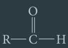 (formyl group)|-al|
|Ketone|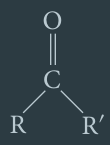 (carbonyl group)|-one|
|Carboxylic acid|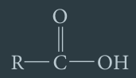 (carboxyl group)|-oic acid|
|Ester|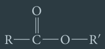|-oate|
|Ether|$\ce{R-O-R'}$ (alkoxy group)|-oxy; -yl|
|Amine|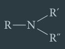|-amine|
|Amide|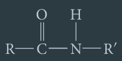|-amide|

### Alcohol

- **alcohol:** hydrocarbon derivative that contains hydroxyl group
- **hydroxyl group:** functional group consisting of a hydrogen and an oxygen atom ($\ce{-OH}$)

**Common Alcohols and Their Uses**

|IUPAC Name|Common Name(s)|Structure|BP (&deg;C)|Use(s)|
|-|-|-|-|-|
|methanol|wood alcohol, methyl alcohol|$\ce{CH3-OH}$|64.6|&bull; solvent in many chem. processes &bull; comp. of automobile antifreeze &bull; fuel|
|ethanol|grain alcohol, ethyl alcohol|$\ce{CH3-CH2-OH}$|78.2|&bull; solvent in many chem. processes &bull; comp. of alcoholic drinks &bull; antiseptic liquid &bull; fuel additive|
|propan-2-ol|rubbing alcohol, isopropyl alcohol, isopropanol||82.4|&bull; antiseptic liquid|
|ethane-1,2-diol|ethylene glycol|$\ce{HO-CH2-CH2-OH}$|197.6|&bull; main comp. of automobile antifreeze|

#### Naming Alcohols

- root of alcohol's name based on *parent alkene*
- **parent alkene:** alkane having same basic structure as hydrocarbon derivative
- suffix for alcohols: *-ol*

How to name:

1. **Identify Root**
	1. Identify longest chain that includes hydroxyl group(s)
	2. Name the parent alkane

*Example:*

- longest chain containing hydroxyls have 7 carbons
- *parent alkane:* heptane

2. **Identify Suffix**
	1. Number main carbon chain in direction that gives carbons bonded to hydroxyl group(s) the lowest numbers
	2. Suffix is always "-ol"; Indicate position of each hydroxyl group by placing no. of C bonded to each group in front of "-ol"
	3. If there is >1 hydroxyl groups, place a prefix (*di-*, *tri-*, *tetra-*) at beginning of suffix to indicate no. of hydroxyl groups

- numbering R &rarr; L gives Cs bonded to hydroxyls lowest possible nums.
- compound is alcohol (*ends with "-ol"*)
- hydroxyl groups bonded to carbons 2 and 3
- 2 hydroxyl groups
- *suffix:* -2,3-diol

3. **Identify Prefix**
	1. Identify prefix the same way as for a hydrocarbon
		1. Look at the alkyl groups and see what C atom they are bonded to
		2. Remember alphabetical order and add prefixes as needed

- ethyl group bonded to carbon no. 4
- *prefix:* 4-ethyl-

4. **Name Compound**
	1. Combine prefix, root, and suffix
	2. If suffix begins with vowel or *h*, drop *-e* on end of parent alkane

- suffix begins w/ consonant, *-e* not dropped
- *final name:* 4-ethylheptane-2,3-diol

#### Drawing Alcohols

**Example:** 4-methylpentane-1,2-diol

**Steps** as table:

#### Physical Properties of Alcohols

- hydroxyl group is very polar
	- small alcohols are polar as well
	- smallest alcohols (methanol and ethanol) are miscible (*can be mixed in all proportions*) w/ water
- as hydrocarbon chain becomes longer, non-polar characteristics take precedence over polar characteristics
- hydroxyl groups allow alcohols to hydrogen bond w/ one another
	- boiling points of pure alcohols are much higher than those of corresponding alkanes
	- all straight chain alcohols w/ <12 C are liquids at SATP
- all alcohols are **toxic**
	- methanol causes blindness or death
	- ethanol is consumed in booze, but can cause death if excessive amounts are consumed

### Haloalkanes

- **haloalkane:** hydrocarbon derivative that contains 1+ halogen atoms
- not found in living systems, artificial
- trichloromethane (commonly k.a. *chloroform*) once used as anaesthetic
	- no longer used as such bcz. now considered possible carcinogen
- chlorofluorocarbons (CFCs) once used as refrigerants and propellants in spray cans
	- banned substances now
	- potent greenhouse gases
	- damages ozone layer
	- ozone layer normally absorbs most UV light before it reaches Earth's surface
	- reduction of ozone layer allows dangerous levels of UV to reach ground
	- skin cancer and crop damage can result from high UV exposure

#### Naming Haloalkanes

Also named according to parent alkane

1. **Identify Root**
	1. Identify longest chain that includes halogen atom(s)
	2. Name parent alkane

*Example:*

- longest chain containing halogens is 4 carbons long
- *parent alkane:* butane

2. **Identify Prefix**
	1. Number main carbon chain in direction that gives carbons bonded to halogens lowest possible numbers
		1. Number cyclic alkane by assigning #1 to carbon bonded to halogen that provides lowest possible nos.
	2. Use prefix to identify specific halogens
		1. Prefixes: *chloro-*, *fluoro-*, *bromo-*, *iodo-*
			1. corresponds to Cl, F, Br, I
		2. Determine numbers of carbons bonded to halogens
		3. Write prefixes alphabetically
		4. If there are 2+ of same type of halogen, use prefix (*di-*, *tri-*, etc.) to indicate the number
		5. Prefixes are not considered in alphabetical order
	3. Name and number any alkyl side groups on main chain
		1. Write all prefixes alphabetically

- *orange:* chlorine halogen; *blue:* fluorine halogen; *green:* alkyl side group
- C bonded to halogens have lowest nums. when chain is numbered *left to right*
- 2 chlorines (*chloro-*) on carbons 1 and 3 and a fluorine (*fluoro-*) on carbon 3
	- *prefix, alphabetical:* 1,3-dichloro-3-fluoro
- methyl group on carbon atom 2
- *final prefix:* 1,3-dichloro-3-fluoro-2-methyl-

3. **Name Compound**
	1. Combine prefix, root, suffix

*Final name:* 1,3-dichloro-3-fluoro-2-methylbutane

#### Drawing Haloalkanes

Example shows line structural formula

**Example:** 4-bromo-2-chloro-3-fluoro-5-methylhexane

**Steps**, simplified:

1. **Identify Root**
	- *Root:* hexane
	- 6 carbons in main chain
2. **Draw and number chain**

3. **Identify prefix and add necessary structures**
	- *prefix:* 4-bromo-2-chloro-3-fluoro-5-methyl-
	- 1 bromine on carbon 4
	- 1 chlorine on carbon 2
	- 1 fluorine on carbon 3
	- 1 methyl group (1 C) on carbon 5
	- do not need to draw out methyl group fully because 
		- straight line implies there is carbon at end of line
		- ... and there are enough Hs to give 4 bonds	

#### Physical Properties of Haloalkanes

- similar properties to alkanes
- only smallest haloalkanes (*see sublist*) are slightly soluble in water
	- fluoromethane
	- chloromethane
	- bromomethane
	- iodomethane
- all other haloalkanes are insoluble in water
- BPs of haloalkanes are *significantly* higher than alkanes w/ same no. of carbon atoms

|Haloalkane|BP (&deg;C)|Alkane|BP (&deg;C)|
|-|-|-|-|
|methane|-161|chloromethane|-24.2|
| | |iodomethane|42|
|propane|-42.1|1-chloropropane|45.6|
| | |1-iodopropane|102.5|

### Aldehydes

- **carbonyl group:** functional group in which a carbon atom is double bonded to an oxygen atom
	- general formula: ($\ce{>C=O}$)
- **formyl group:** functional group in which a carbonyl group is also bonded to a hydrogen
	- general formula: ($\ce{-CHO}$)
	- only one free end for bonding
	- always found at end of hydrocarbon chain
- **aldehyde:** hydrocarbon derivative that contains a formyl group
	- i.e. formaldehyde (methanal)
	- water solution of formaldehyde called *formalin* is often used to preserve organisms for dissection in school labs
		- fed. and several prov. gov't. placed legal limits on human exposure to it
		- conc. of formaldehyde in labs like Ont. classrooms deemed safe
		- formalin has toxic effects in high concentrations

*(A) carbonyl group; (B) formyl group*

#### Naming Aldehydes

- Named similarly to alcohols
- Suffix for aldehydes: *-al*

**Steps** as table:

#### Drawing Aldehydes

Example wants line structural formula

**Example:** 5-ethyl-4-methyloctanal

**Steps** as table:

#### Physical Properties of Aldehydes

- carbonyl group of aldehydes is very polar
	- carbon-hydrogen bonds not polar
	- aldehydes cannot hydrogen bond w/ each other
	- but they can hydrogen bond w/ water
	- IMFs between aldehyde molecules weaker than IMFs between alcohol molecules
- BP of aldehydes lower than alcohols w/ same no. of carbons
	- only methanal (formaldehyde) is gas at room temp.
	- ethanal has BP at 20.1 &deg;C, very close to room temp.
	- aldehydes 3-14 C long: liquid at room temp.
	- aldehydes 15+ C long: waxy solids at room temp.
- Solubility in water of aldehydes
	- 1-4 C: soluble
	- 5-7 C: slightly soluble
	- \>7 C: insoluble
	- when carbon chain is >7 carbons, insoluble nature of HC chain overcomes solubility of polar carbonyl group
- Odour
	- short chain: very pungent odour
	- as chain gets larger, odour becomes more pleasant

### Ketones

- **ketone:** hydrocarbon derivative that contains a carbonyl group ($\ce{>C=O}$) that is bonded to 2 carbons or carbon chains
	- carbonyl carbon must be bonded to 2 other carbons
	- smallest ketone must have at least 3 carbons
- i.e. actone (IUPAC name: propanone)
	- dissolves many water-insoluble compounds like...
		- nail polish and ink stains from fingers
		- price-tag stickers from glass, metal, or porcelain objects
		- cannot be used on plastic surface w/o dissolving surface itself
	- smell may indicate dangerous cond. called *diabetic ketoacidosis*
		- occurs when diabetic person unable to produce enough insulin to use glucose as fuel source
		- body instead burns fatty acids
		- ketones are by-product of fatty acid metabolism
		- produces scent of acetone on breath
		- can cause diabetic coma / death if not treated immediately
- i.e. methylethylketone (MEK) / (IUPAC name: butanone)
	- common industrial solvent used in...
	- paints, lacquers, industrial cements, printing inks

*Structure of ketones*

*R* and *R'* symbolizes carbon atoms or chains

*Two of the smallest ketones*

- Neither of molecules above require number to indicate location of carbonyl group; one possible location
- For butanone, flipping molecule sideways = shifting carbonyl group

#### Naming Ketones

- Also named according to parent alkane
- Suffix ends w/ "*-one*"

**Steps** as table:

#### Drawing Ketones

**Example:** 5,5-dimethylheptan-3-one

**Steps** as table:

#### Physical Properties of Ketones

- ketones have very polar carbonyl group
- no hydrogen atoms bonded to strongly electronegative atoms
- ketones cannot hydrogen bond w/ one another but can HB w/ water
- ketones have similar BPs and solubilities as aldehydes
	- 1-14 C in chain: liquids at room temp.
	- 15+ C in chain: waxy solids at room temp.

### Carboxylic Acids

- **carboxylic acid:** hydrocarbon derivative that contains a carboxyl group
- **carboxyl group:** functional group made up of a carbonyl group w/ a hydroxyl group attached to it
	- general formula: $\ce{-COOH}$
	- 3 bonds on C atom are w/ other atoms in group
	- only 1 pos. available for bonding w/ other atoms
	- carboxyl group always at end of chain
- Examples
	- ethanoic acid (acetic acid) &mdash; found in vinegar
	- 3-carboxy-3-hydroxypentanedioic acid (citric acid)
		- found in oranges and citrus fruits
	- tartaric acid &mdash; found in tamarinds

*Examples of carboxylic acid structures*

*Ionization equation for carboxylic acids (weak acids)*

$$
\begin{equation*}
\ce{-COOH(aq) <=> -COO^-(aq) + H^+(aq)}
\end{equation*}
$$

#### Naming Carboxylic Acids

Carbon atom of carboxyl group is always assigned #1

**Steps** as table:

#### Drawing Carboxylic Acid

**Example:** 2-ethylpentanoic acid

**Steps** as table:

#### Physical Properties of Carboxylic Acids

- carboxyl group is very polar due to having
	- ... both $\ce{>C=O}$ and $\ce{-OH}$ group
- carboxylic acid molecules can form HBs w/ one another
- BPs of carboxylic acids are much higher than other hydrocarbons and derivatives w/ same no. of carbons
	- short-chain carboxylic acids: liquids at SATP
	- longer chains: waxy solids at SATP
- Solubility in Water
	- 1-4 C chain: completely miscible w/ water
	- 5-9 C: less soluble in water
	- 10+ C: insoluble in water
- weak acids &mdash; turns litmus paper red
- conducts electric current when dissolved in water

**Boiling Points of Carbon Compounds**

|Compound|BP (&deg;C)|
|-|-|
|butane|-0.5|
|butanal|74.8|
|butan-2-one|79.6|
|butan-1-ol|117.2|
|butanoic acid|165.5|

### Esters

- **ester:** hydrocarbon derivative that contains functional group w/ a carbon atom double bonded to one oxygen atom
	- ... and single bonded to another atom / group
- **General Formula:** $\ce{RCOOR'}$
	- R = hydrocarbon *or* hydrogen atom
	- R' = hydrocarbon
- responsible of aroma from fruit like raspberries
- esters can be thought of as combination of carboxylic acid and alcohol
	- 💡 ester name is comb. of names of carboxylic acid and alcohol

*Reaction that results in ester*

#### Naming Esters

Refer to reaction equation above to name ester

1. **Identify Root**
	1. Identify part of ester that contains $\ce{C=O}$ group
		1. This is the red part from the equation above
		2. Root of ester is based on name of carboxylic acid
	2. Name parent carboxylic acid
		1. Drop suffix to form root
	3. Number the main chain starting from $\ce{C=O}$, carbonyl group

*Example:*

- $\ce{>C=O}$ group is part of 4 carbon group
- main chain has 4 carbons
- parent carboxylic acid: butanoic acid
- *root:* butan-

2. **Identify Suffix**
	1. Suffix for an ester is *-oate*

Since comp. is ester &mdash; *suffix:* -oate

3. **Identify Prefix**
	1. First consider part of ester associated w/ alcohol (blue in react.)
		1. Ignore oxygen atom
		2. Name only alkyl group to write prefix
		3. This part of prefix is placed first when naming ester
	2. If there is side group on main chain...
		1. ... name same way that you would in simple hydrocarbon
		2. 2nd part of prefix
	3. Combine 2 components of prefix to get complete prefix
		1. Write prefix that identifies alkyl group bonded to oxygen (step 3-1) *first*
		2. Write prefix that gives alkyl group bonded to main chain (step 3-2) *second*
		3. In between the 2 prefixes, put a *space* sep.

*Step 3-1*

- 1st part of prefix is name of alkyl group attached to O SB'd to main chain
- alkyl group has 2 carbons
- *1st part of prefix:* ethyl

*Step 3-2*

- methyl group on C atom 3
- *2nd part of prefix:* 3-methyl-

*Step 3-3*

*Complete prefix:* ethyl 3-methyl-

4. **Name Compound**
	1. Combine prefix, root, suffix

*Final name:* ethyl 3-methylbutanoate

##### Summary of Components Involved in Ester

#### Drawing Esters

**Example:** butyl propanoate

**Steps** as table:

#### Physical Properties of Esters

- presence of carboxyl group makes esters somewhat polar
- esters cannot form hydrogen bonds, no $\ce{-OH}$ group
- BPs of esters lower than corresponding alcohols and carboxylic acids
	- smaller esters: liquid at SATP
	- longer chains: waxy solid at SATP
- Solubility in Water
	- 4 or less C: soluble
	- \>4 C: insoluble
- Esters are *volatile* (can easily vaporize from liquid to gas)
	- allows esters to generate aromas

### Ethers

- **ether:** hydrocarbon derivative in which an oxygen atom is single bonded to two carbon atoms ($\ce{-O-}$)
- **General Formula:** $\ce{R-O-R'}$
	- R and R' are alkyl groups
- i.e. ethoxyethane *or* diethyl ether
	- historical usage as anesthetic for surgery
	- first surgery w/ anesthetic (this comp.) done in 1842
	- very flammable
	- causes severe nausea and vomiting
	- doctors searched for alternatives but ether was used for many years
	- still used today for surgery in developing world (low cost)
	- still often used in "fly labs" to anesthetise fruit flies to study inheritance patterns
- Other Uses for Ether
	- starter for diesel engines in extremely cold weather
	- aerosol propellant, solvent, and plasticiser
	- i.e. methyl tertiary butyl ether (MTBE)
		- gasoline additive to help gas burn clenaer
		- spillage and leakage around gas stns. resulted in groundwater polllution
		- use greatly decreased

#### Naming Ethers

- IUPAC sys. identifies longer carbon chain as R
- R is the main chain of molecule and takes name of parent alkane
- **alkoxy group:** side group that includes oxygen and shorter carbon chain bonded to it ($\ce{-O-R'}$)
	- group named by adding -oxy to root name of R' group
- *Short Example*
	- $\ce{CH3-CH2-CH2-O-CH3}$
	- alkoxy group: methoxy-
	- main chain: propane

**Steps:**

1. **Identify Root**
	1. Locate longest chain (R group) bonded to oxygen atom
	2. Name parent alkane

*Example:*

- longest chain bonded to O atom is 6 carbons long
	- this is main chain
- *parent alkane:* hexane

2. **Identify Prefix**
	1. Number carbons in main chain, starting at end of chain nearest to oxygen atom
	2. First part of prefix involves alkoxy group
		1. No. of carbon atom bonded to O atom given first
		2. Name of alkoxy group given 2nd
			1. To name alkoxy group, identify root of shorter carbon chain (R' group)
			2. Then, add *-oxy* to root
	3. *2nd part of prefix:* If there are alkyl side groups on main chain
		1. ... name them as you would any alkane
	4. Combine 2 parts of prefix to complete prefix
		1. Write prefix that id. alkoxy group *first* (step 2-2)
		2. Write prefix that id. alkyl group *second* (step 2-3)

- O atom of alkoxy group bonded to C atom 3 of main chain
- alkoxy group is 3 carbons long &mdash; *root:* prop-
- add *oxy-* to root
- *1st part of prefix:* 3-propoxy-
- methyl group bonded to C atom 4 of main chain
- *2nd part of prefix:* 4-methyl-
- *complete prefix:* 3-propoxy-4-methyl-

3. **Name Compound**
	1. Combine prefix and root (no suffix)

*Final name:* 3-propoxy-4-methylhexane

##### Summary of Ether Components

#### Drawing Ethers

**Example:** 2-methoxy-4-methylpentane

**Steps** as table:

#### Physical Properties of Ethers

- Bond angle formed by C-O bonds in ethers makes ethers slightly polar
- Ethers are not as polar as any of other previous hydrocarbon derivatives
- Ethers cannot form hydrogen bonds w/ each other
	- ethers w/ 2-3 C: gases at room temp.
	- larger ethers: liquids at orom temp.
- Ethers can form hydrogen bonds w/ water
	- ethers w/ 2-3 C: soluble in water
	- straight-chain ethers w/ 4-6 C: slightly soluble
	- larger ethers: insoluble

*Bond angle of ethers:*

### Amines

- **amine:** hydrocarbon derivative that contains a nitrogen atom bonded to 1-3 carbon atoms
	- typically volatile (*vaporizes easily*)
	- 3 categories of amines, shown below
	- **primary amine:** amine w/ 1 C bonded to N
	- **secondary amine:** amine w/ 2 C bonded to N
	- **tertiary amine:** amine w/ 3 C bonded to N
- Examples and Uses
	- "fishy odour" from fish
		- lemons used to red. odour (citric acid neutralizes amine)
	- corrosion inhibitor in boiler
	- antioxidant in roofing asphalt
	- flotation agents in mining
	- components of important biological molecules
		- i.e. *adrenaline*
			- released in blood in "fight or flight" siutation
			- increases heartbeat and respiration
			- helps release more glucose in bloodstream

*Categories of Amines:*

*Nitrogen always has 3 bonds, either to carbon or filled by hydrogen*

#### Naming Amines

Longer hydrocarbon group bonded to nitrogen is main chain

1. **Identify Root**
	1. Locate longest chain bonded to nitrogen atom
	2. Name parent alkane. Drop *-e* at end to determine root

*Example:*

- longest chain bonded to N has 7 carbons
- *parent alkane:* heptane
- *root:* heptan-

2. **Identify Suffix**
	1. Number carbons in main chain, starting w/ carbon nearest to the nitrogen atom
	2. Suffix always ends with "-amine"
	3. Indicate position of N atom if main chain is 3+ carbons long
		1. Do this by placing # of carbon bonded to N in front of *-amine*

- main chain has 3+ carbons
- N is bonded to carbon no. 3
- *suffix:* -3-amine

3. **Identify Prefix**
	1. If a primary amine, there is *no* prefix
	2. For secondary amines, name smaller alkyl group bonded to N atom
		1. Write: *N-{name of alkyl group}*
	3. For tertiary amines, both smaller alkyl groups are bonded to N atom
		1. Write an *N-* in front of each group and order alphabetically
		2. If 2 groups are same, write: *N-N-di-{name of alkyl groups}*

- N bonded to 3 Cs &mdash; tertiary amine
- 1 ethyl group and 1 propyl group bonded to N atom
- *prefix:* N-ethyl-N-propyl-

4. **Name Compound**
	1. Combine prefix, root, and suffix

*Final name:* N-ethyl-N-propylheptan-3-amine

##### Summary of Amine Components

#### Draw Amines

**Example:** N-ethylpentan-3-amine

**Steps** as table:

#### Physical Properties of Amines

- N-H bonds in primary and secondary amines are very polar
- Tertiary amines do not have N-H bonds
- Only primary and secondary amines can HB
	- Primary and secondary amines have relatively high BPs compared to ethers and alkanes of similar size
	- They also have higher BPs than tertiary amines w/ same no. of carbons
	- i.e. BP: N-methylmethanamine < ethanamine (differ by 10 &deg;C)
	- i.e. BP: propan-1-amine < N,N-dimethylmethanamine (differ by >45 &deg;C)
- All amines can hydrogen bond w/ water
	- Smaller amines are very soluble in water

**Boiling Points of Some Amines**

|Amine|Type|Boiling Point (&deg;C)|
|-|-|-|
|methanamine|primary|-6.32|
|ethanamine|primary|16.5|
|N-methylmethanamine|secondary|6.88|
|N,N-dimethylmethanamine|tertiary|2.87|
|propan-1-amine|primary|47.2|
|N-ethylethanamine|secondary|55.5|
|N,N-diethylethanamine|tertiary|89.0|
|N-propylpropan-1-amine|secondary|109|
|N,N-dipropylpropan-1-amine|tertiary|156|

### Amides

- **amide:** hydrocarbon derivative containing functional group, $\ce{-CON-}$ ...
	- ... which is a carbonyl group bonded to a nitrogen atom
	- **primary amide:** amide where N bonded to 1 C
	- **secondary amide:** amide where N bonded to 2 C
	- **tertiary amide:** amide where N bonded to 3 C
	- R, R', and R" repr. alkyl groups or hydrogen atoms in gen. form.
- Examples
	- acetaminophen &mdash; commonly used in pain medications excl. Aspirin&reg;
	- pencillin &mdash; another pain medication, very complex
	- dimethylformamide (common name) &mdash; commonly used industrial organic solvent
	- commonly used in polymers like nylon and polyacrylamide

*Structure of acetaminophen*

*General formula and categories of amides*

Amides can be thought of as the product of a reaction between carboxylic acid + ammonia / *primary or secondary amine*

#### Naming Amides

- root of amide comes from part of amide that contains carbonyl carbon
- suffix: *-amide*

**Steps** as table:

##### Summary of Amide Components

#### Drawing Amides

**Example:** N,N-diethyl-2-ethylpentanamide

**Steps** as table:

#### Physical Properties of Amides

- amides have polar carbonyl group
- primary and secondary amides have at least one -NH group
	- they can form strong HBs w/ themselves
	- BPs are much higher than other hydrocarbon derivatives of similar size
- amides can form HB w/ water
	- small amides are very soluble in water

**Melting and Boiling Points of 2 Carbon Derivatives and an Amine**

|Hydrocarbon Derivative|MP (&deg;C)|BP (&deg;C)|State in Room Temp.|
|-|-|-|-|
|ethanamide|80.16|222|solid|
|ethanoic acid|16.64|117.9|liquid|
|ethanamine|-80.5|16.5|gas|

Polarity and potential of forming HBs makes huge diff. in physical properties of compounds

Order of hydrocarbon derivatives of similar size in terms of polarity, from greatest to least:

$$
\begin{equation*}
\text{amide} > \text{acid} > \text{alcohol} > \text{ketone} \approx \text{aldehyde} > \text{amine} > \text{ester} > \text{ether} > \text{alkane}
\end{equation*}
$$

### Hydrocarbon Derivatives w/ Multiple Functional Groups

- **amino sugar:** organic comp. made up of carbohydrate and amino acid
- glucosamine is an amino sugar
	- has a formyl group ($\ce{-CHO}$)
	- an amino group ($\ce{-NH2}$)
	- 4 hydroxyl groups ($\ce{-OH}$)
- combination of several functional groups is very common for organic compounds
- IUPAC priority list for naming compounds shown in appendix B

*Structure of glucosamine*

### Benzene Derivatives w/ Substituted Functional Groups

- many other benzene derivatives substituted w/ diff. functional group
- many benzene derivatives commonly used in industry and laboratory
- common names are widely used
	- so well-established that IUPAC accepts them
	- not recommended as first choice
	- naming rules and common names in appendix B