# C2 - Reactions of Organic Compounds

## C2.1 - Types of Organic Reactions

### Brief Introduction

- By using combinations of organic reactions, scientists can convert simple molecules into large, complex molecules
- i.e. TAXOL&trade; synthesized through organic reactions from organic comp. found in needles / twigs of European yew tree
	- used to treat ovarian cancer
- chemical reactions also used to convert petrol and natural gas into large, complex molecules like plastic
- rearrangement of bonds in organic compounds are slow
	- require continuous input of energy
	- catalysts may be used to speed up reactions that would take days, months, or longer
	- nearly all reactions result in mixture of products
	- unwanted products must be sep. from wanted product

### Addition, Elimination, and Substitution Reactions

#### Addition Reactions

- **addition reaction:** reaction in which atoms are added to a C-C double or triple bond
	- undergone by alkenes and alkynes
	- check whether carbons in products bonded to *more* atoms than carbons in reactant

***General Formula:***

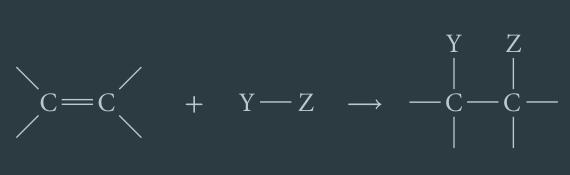

***Steps in Typical Reaction:***

1. Small molecule added to alkene or alkyne
	1. Usually $\ce{H2O(l), H2, HX, X2}$ where X = F, Br, Cl, I
	2. When bonds of water break in reaction, water often written as $\ce{HOH}$
2. Reaction results in 1 major product or 2 products that are isomers of each other
	1. *isomers* have same mol. form. but diff. struct.

***Examples of Addition Reactions Involving Alkene:***

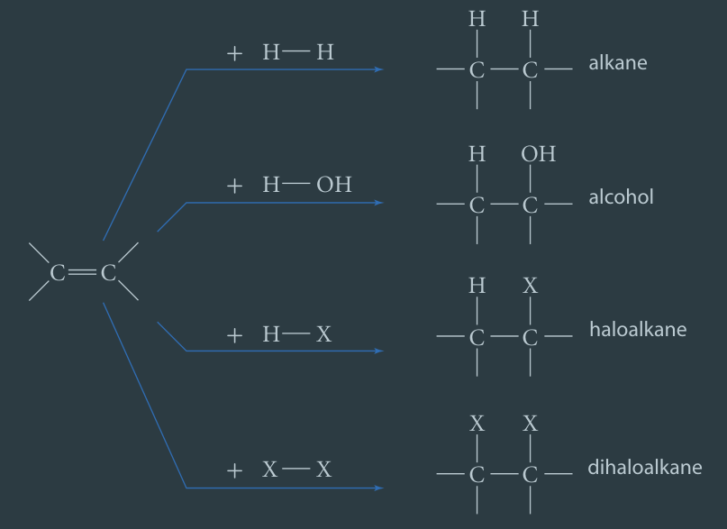

Addition of chlorine + but-2-ene

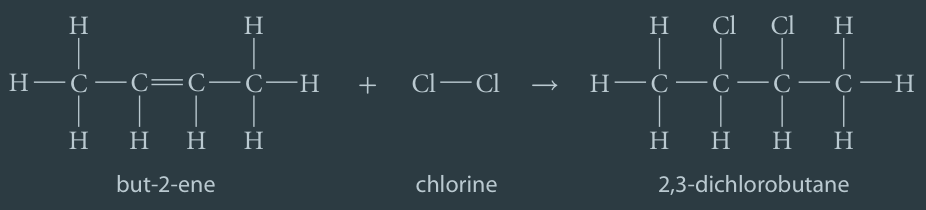

*Double bond between C repl. by single bonds w/ Cl atoms*

- Chemists use addition of bromine + alkene (or alkyne) as colour test
	- ... for presence of multiple bonds
	- when bromine is added to compound w/ double or triple bonds ...
	- ... bromine loses its brownish colour

*Bromine colour test &mdash; (A) has double / triple bonds*

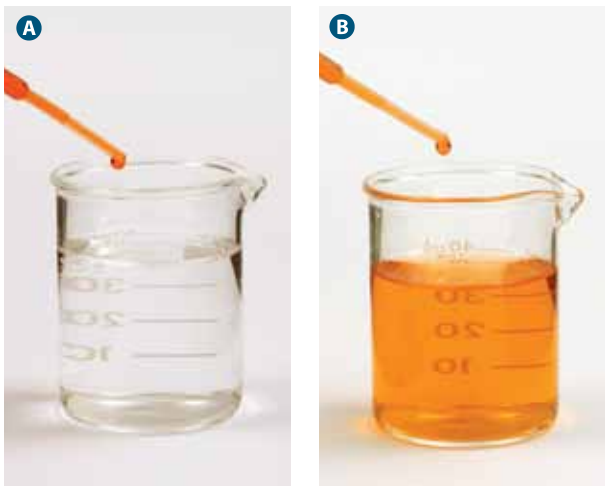

- In alkyne, max. of 4 bonding electrons can be rearranged to form bonds w/ 3 new atoms
	- leaves single bond between 2 carbons
- i.e. excess chlorine added to ethyne forms an alkane
	- TB replaced w/ SBs between C-C and C-Cl
- i.e. limited chlorine added to ethyne form an alkene
	- TB replaced w/ C-C DB and C-Cl SBs

*Excess v. limited chlorine added to ethyne*

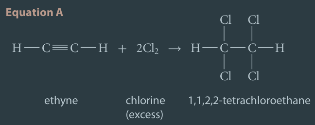

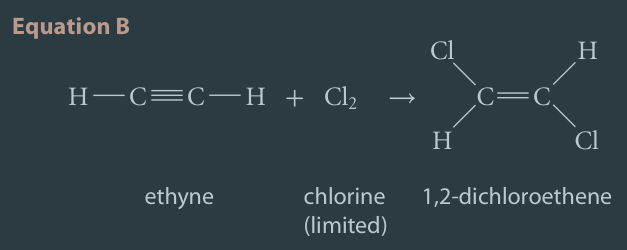

- When alkenes and alkynes w/ >2 C react w/ small molecule
	- more than 1 product might form
- i.e. hydrogen chloride (gas) + pent-2-ene
	- 2 constitutional isomers form
- If 2 atoms being added to alkene are different, they can be placed on either of 2 carbons w/ double bond
	- same ex. as before
	- Cl can be added to either carbon 2 (H added to C 3)
	- ... or carbon 3 (H added to C 2)

*Addition of hydrogen chloride + pent-2-ene*

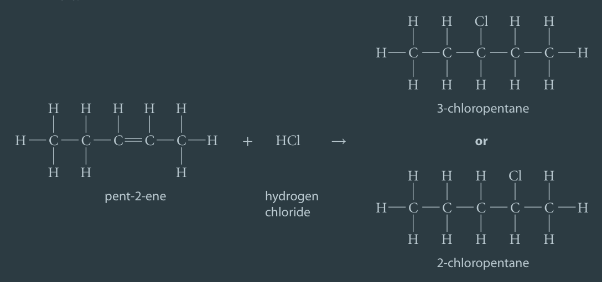

- When small molecule added to asymmetric alkene, like propene, use *Markovnikov's Rule*
- **Markovnikov's Rule:** rule to predict which isomer will be more abundant when small mol. added to asymmetric alkene
	> The hydrogen atom of the small molecule will attach to the carbon of *double bond* that is bonded to *most* hydrogen atoms.

*i.e. propene + hydrogen chloride &rarr; 2-chloropropane*

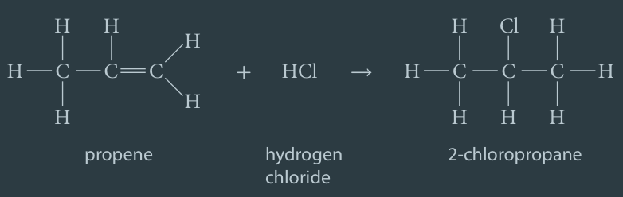

#### Sample Problem: Addition Reactions

Complete equation for following reaction:

$$
\ce{H2C=CHCH2CH3 + H2 ->[Pt or Pd]}
$$

**Steps** as table:

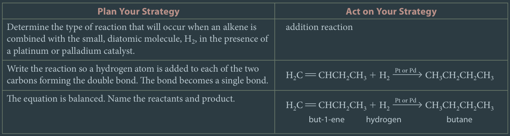

#### Elimination Reactions

- **elimination reaction:** reaction where atoms are removed from organic molecule to form double bond
- *how to recognize:* determine whether carbons in product bonded to *fewer* atoms than in reactant

***General Formula:***

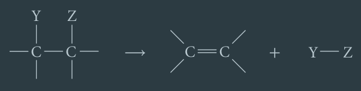

- Alcohols undergo elimination to form alkenes ...
- ... when they are heated in presence of a strong acid, like sulfuric acid
- strong acid acts as catalyst
- small, stable molecule, like water, is formed as 2nd product

*Elimination of propan-2-ol*

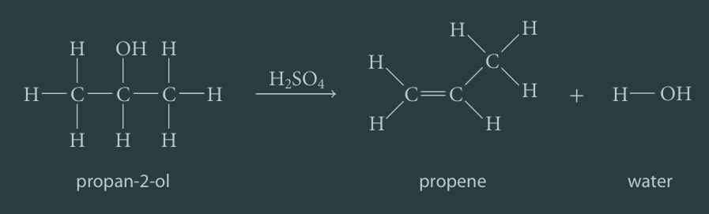

Haloalkenes can undergo elimination if heated in presence of strong base, like sodium ethoxide ($\ce{NaOCH2CH3}$)

*Elimination of bromoethane*

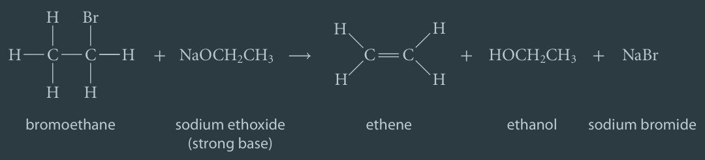

- When asymmetric molecule undergoes elimination, more than 1 constitutional isomer may be formed
- **General rule:** Hydrogen is most likely to be removed from carbon w/ most C-C bonds
- i.e. elimination of 2-bromobutane
	- hydrogen atom can be removed from either 1st or 3rd carbon in chain to form DB
	- H atom most likely to be removed from 3rd carbon
	- *major product:* but-2-ene
	- *minor product:* but-1-ene
	- but-2-ene has cis and trans isomer

*Elimination of 2-bromobutane*

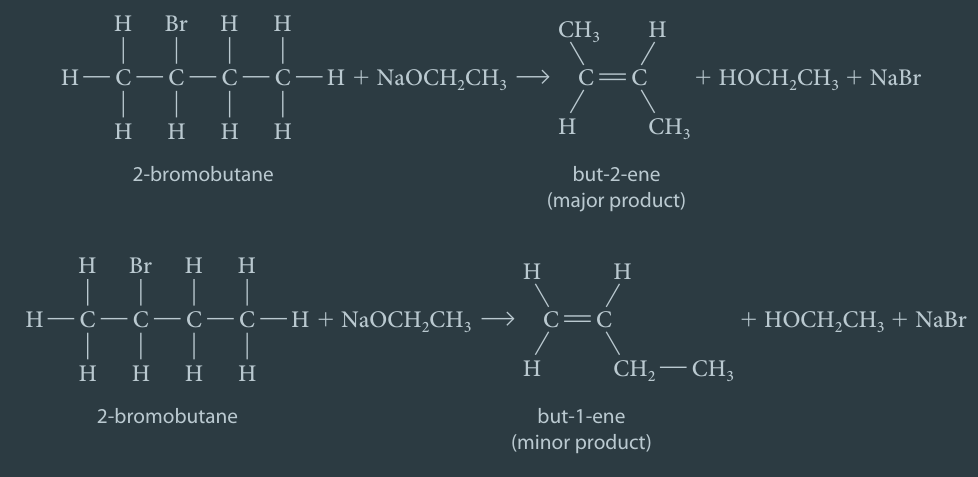

#### Sample Problem: Elimination Reactions

Complete equation for elimination reaction:

$$
\ce{HO-CH2CH2CH3 ->[H2SO4][\Delta]}
$$

**Steps** as table:

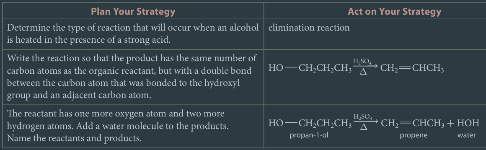

#### Substitution REaction

- **substitution reaction:** reaction where hydrogen atom or functional group is replaced by a different atom or functional group
- *How to Recognize* &mdash; look for:
	- *two* compounds react to form 2 diff. compounds
	- *carbon* atoms are bonded to the *same* number of atoms in the product as the reactant

***General Formula:***

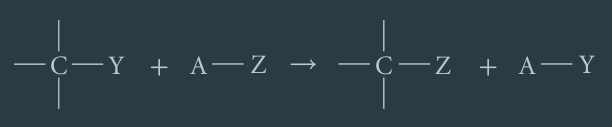

- Alcohols and haloalkanes commonly undergo substitution
- When alcohol reacts w/ acid containing halogen, halogen atom is subbed for hydroxyl group of alcohol
	- acid containing halogen may incl. hydrogen chloride or HBr
	- Product: haloalkane

*Substitution of ethanol w/ hydrogen chloride*

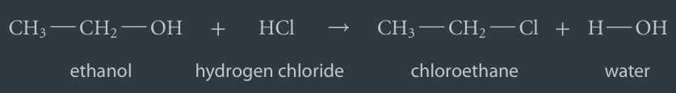

- Haloalkane can undergo substitution w/ hydroxide ion to produce alcohol
- However, haloalkane can also undergo elimination w/ base
	- not easily controlled
	- for this course, assume haloalkane + hydroxide is substitution

*Substitution of chloroethane w/ hydroxide ion*

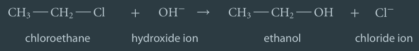

- Alkanes also undergo substitution, but are relatively unreactive
- Considerable energy is required for alkane substitution
	- typically alkanes react in presence of UV light
- i.e. alkanes react w/ chlorine or bromine to produce haloalkanes
	- under UV light
	- if enough chlorine is present, 4 possible products can form
- sub. of alkanes not useful in lab because they result in mixture of products

*Substitution of methane with chlorine*

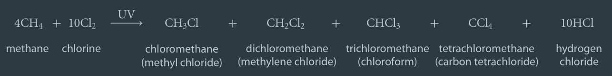

- Most aromatic hydrocarbons are also fairly stable
- They undergo substitution w/ Cl or Br only in presence of catalyst

*Substitution of benzene w/ bromine where iron(III) bromide is catalyst*

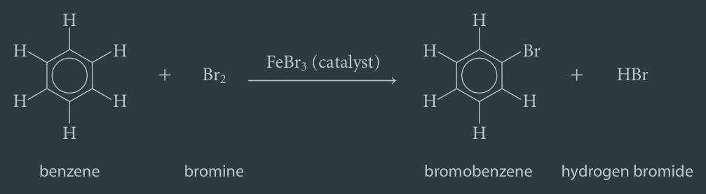

#### Sample Problem: Substitution Reaction

Complete equation for substitution reaction:

$$
\ce{CH3CH(CH3)CH2CH3 + Br2 ->[UV light]}
$$

**Steps** as table:

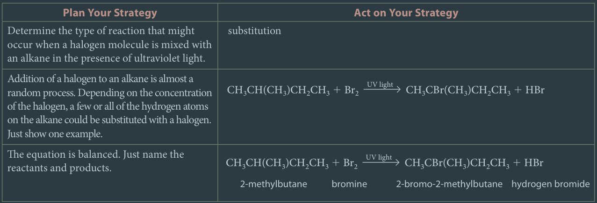

### Condensation Reactions

- **condensation reaction:** reaction where 2 large molecules combine and form one larger molecule and
	- ... a very small, stable molecule (usually water) as 2nd product or functional group
- i.e. carboxylic acid + ammonia / amine &rarr; amide + water

*Condensation reaction between carboxylic acid and ammonia / amine*

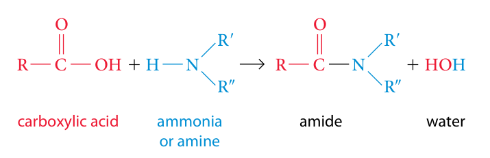

- Condensation reactions very important for living things
- Type of reaction that forms most of large biomolecules, like:
	- proteins
	- carbohydrates
	- fats
	- DNA
- **amino acid:** building block of protein
	- every amino acid has *amine group* on one end, ...
	- ... *carboxyl group* on other end, and ...
	- R group &ndash; *variable side chain* in middle
	- 20 diff. amino acids that make up all proteins
	- R groups distinguishes them

***Structure of Amino Acid:***

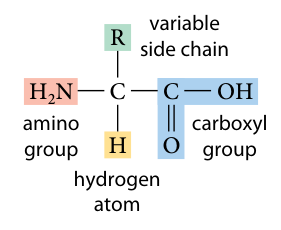

- **Reaction of Amino Acids**
	- Symbols $\ce{R_1, R_2, R_3}$ represent R groups of 3 diff. amino acids
	- Carboxyl group on one amino acid reacts w/ amino group on another amino acid
	- Process continues and makes very long chains of amino acids = protein
	- Red boxes show which atoms are removed to form water
	- Blue boxes show newly formed amide groups that link amino acids together
		- called *amide linkages* in polymers
		- in proteins, they are called ***peptide bonds***

*The actual reaction:*

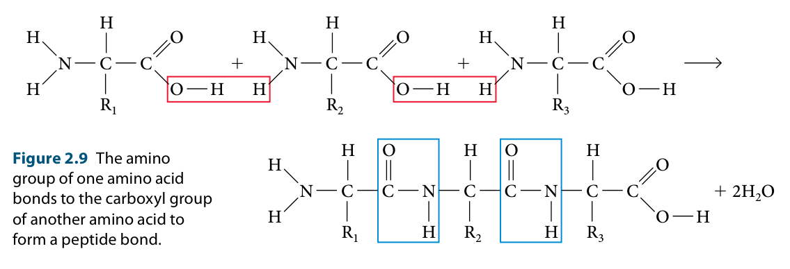

#### Esterification Reaction

**esterification reaction:** special type of condensation reaction where carboxylic acid reacts w/ alcohol to form an ester and water

***General Formula:***

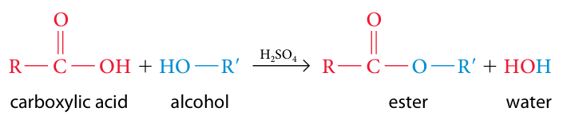

- Used to create many useful products like acetylsalicylic acid (k.a. Aspirin&trade;)
- Many flavours and aromas of fruits / spices are due to esters
- Synthesized esters used to make artificial flavours

*Structure of ethyl benzoate, responsible for flavour in cherries*

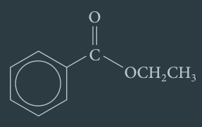

*Esterification of benzoic acid w/ ethanol to form cherry flavour*

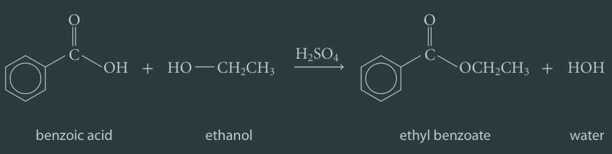

*Esterification of propanoic acid and pentan-1-ol*

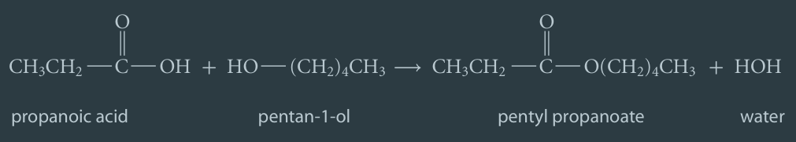

Forms pentyl propanoate, which gives apricots their smell

#### Hydrolysis Reaction

- **hydrolysis reaction:** reaction where a molecule is broken apart by adding hydroxyl group from a water molecule to one side of a bond...
	- ... and the corresponding H atom to the other side of the bond
	- *hydrolysis* = "break apart using water"
	- reverse of condensation reaction
- the bonds can incl. ester or amide bonds

***General Formula:***

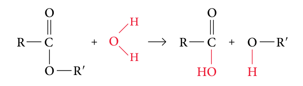

- Reaction can be opposite of esterification reaction
- $\therefore$ esterification reaction is reversible

*Reversibility of esterification reactions:*

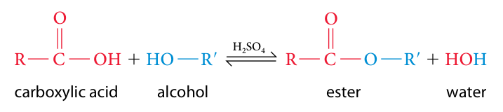

- Some reactant and some product will always be present after esterification reaction is carried out
- Reaction will go further in one direction by adjusting certain factors
	- i.e. concentration of reactants increases &rarr; reaction shifts right
		- yields more products
	- i.e. base used to catalyze hydrolysis reaction
		- conds. favour hydrolysis
- In bio. sys., condensation and hydrolysis reactions performed in several steps
	- Each set of steps catalyzed by diff. enzymes
	- That controls direction of reactions

#### Sample Problem: Esterification Reaction

Complete equation for esterification reaction:

$$
\ce{CH3CH2CH2COOH + CH3CH2OH ->[H2SO4]}
$$

**Steps** as table:

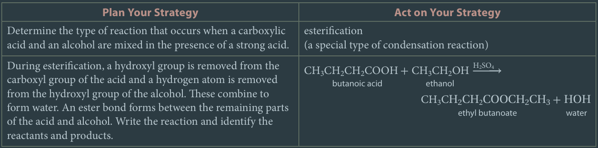

### Oxidation and Reduction Reactions

#### Oxidation

- **oxidation:** reaction where carbon atom forms more bonds to oxygen (O) atoms
	- or fewer bonds to hydrogen (H) atoms
	- occurs when organic compound reacts w/ oxidizing agent
- ox. that forms double $\ce{C-O}$ bonds are also elimination react.
- i.e. alcohols can be oxidized to form aldehydes and ketones
- *Common Oxidizing Agents*
	- acidified potassium permanganate, $\ce{KMnO4}$
	- acidified potassium dichromate, $\ce{K2Cr2O7}$
	- ozone, $\ce{O3}$
- $\ce{[O]}$ used to *symbolize* oxidizing agent

*Examples of oxidation reactions:*

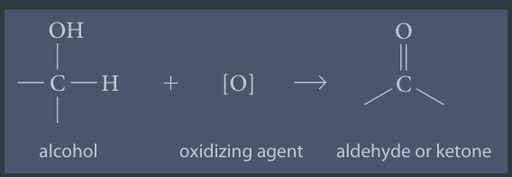

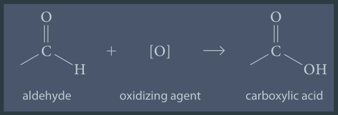

- Ox. eq. often left unbalanced
- To identify oxidation, count C-H and C-O bonds in reactant and product
- It is oxidation if there are more C-O bonds and fewer C-H bonds in product than reactant

#### Reduction

- **reduction:** reaction where a carbon atom forms fewer bonds to oxygen (O) atoms
	- or more bonds to hydrogen (H) atoms
	- occurs when organic compound reacts w/ reducing agent
- A $\ce{C=O}$ or $\ce{C=C}$ bond is reduced to single bond by reduction
	- DB &rarr; SB reactions are also addition reactions
- i.e. aldehydes, ketones, and carboxylic acids can be reduced to form alcohols
- *Common reducing agents*
	- lithium aluminum hydride: $\ce{LiAlH4}$
	- hydrogen gas over platinum catalyst $\ce{H2/Pt}$
- $\ce{[H]}$ used to *symbolize* reducing agent

*Examples of reduction reactions:*

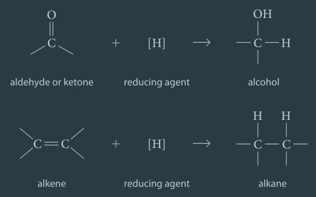

- red. eq. often left unbalanced
- To identify reduction, count C-H and C-O bonds in reactant and product
- If there are fewer C-O bonds and more C-H bonds in product than reactant &rarr; reduction

#### Combustion Reaction

- **combustion reaction:** reduction reaction where a compound reacts w/ oxygen
	- ... to produce oxides of elements that make up compound
	- also process used for cellular respiration (obtain energy)
- **complete combustion reaction:** reaction hydrocarbon reacts w/ excess oxygen to produce carbon dioxide, water vapour, and release energy
	- produces blue flame
	> If excess oxygen is present, *all hydrocarbons will burn completely to produce carbon dioxide and water vapour.*

***General Formula for Complete Combustion:***

$$
\ce{hydrocarbon + O2(g) -> CO2(g) + H2O(g) + energy}
$$

- **incomplete combustion reaction:** combustion reaction that occurs when insufficient oxygen present
	- all elements in fuel will not combine w/ oxygen to greatest extent possible
	- produces orange / yellow flame
- *Products*
	- carbon monoxide (deadly gas)
	- **soot:** tiny pieces of unburned carbon

***General Formula for Incomplete Combustion,*** *(may vary):*

$$
\ce{hydrocarbon + O2(g) -> C(s) + CO(g) + CO2(g) + H2O(g) + energy}
$$

- orange colour in flame is glow from soot particles in flame
- carbon monoxide binds to hemoglobin in blood 20x more tightly than oxygen
	- prevents hemoglobin from transporting oxygen
- *not possible* to balance incomplete combustion equations
	- too difficult to predict how far combustion will go
	- ... and what combination of products will be formed

#### Sample Problem: Combustion Reaction

Complete and balance the following equation below. Then identify products.

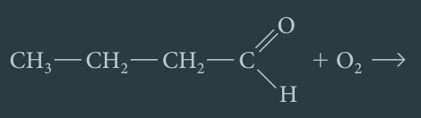

**Steps** as table:

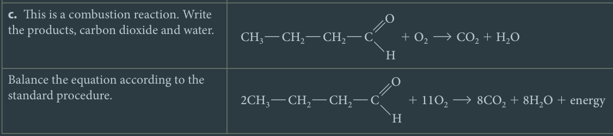

---

## C2.2 - Polymer Equations

### Polymer Chemistry

- **polymer:** very long molecule made by linking together repeating units of monomers
	- think of: chaining together paper clips (monomers)
	- i.e. polyethylene terephthalate (PET) used to make soft drink bottles
- **monomer:** a small molecule, linked covalently to others of same / similar type to form a polymer
- **plastic:** synthetic polymer that can be heated and moulded into specific shapes and forms

#### Examples

- adhesives, chewing gum, and polystyrene also made from synthetic polymers
- name of synthetic polymer usually written w/ prefix *poly-* before name of monomer
	- common name often used instead of proper IUPAC name
	- i.e. polyethylene = polymer made from ethene
		- common name is ethylene
	- i.e. polyvinylchloride (PVC) = polymer made from chloroethene
		- used to make numerous items
		- from adhesives to auto parts
	- i.e. *plasticizer* to PVC makes it very flexible
		- used in items like hoses, inflatables, and wire insulation
	- i.e. polypropylene = polymer made from propene
		- used to make plastics for labs and medical facilities
		- can withstand high temps. needed for sterilization
- some synthetic polymers can also be used to make fabric
	- i.e. rayon, polyester, nylon
- natural polymers also used to make fabrics
	- i.e. cotton, linen, and wool

### Making Synthetic Polymers

#### Addition Polymerization

- **addition polymerization:** reaction where alkene monomers are joined through multiple addition reactions to form a polymer
	- characterized by red. of DBs in polymer

*Addition Polymerization of Ethene &rarr; Polyethene*

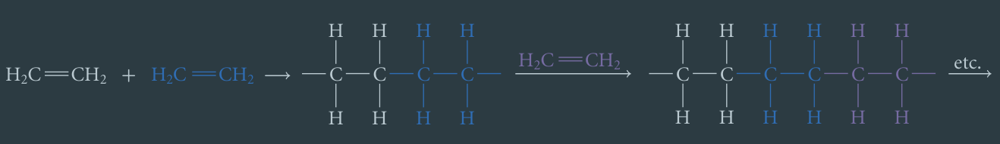

*Examples of addition polymers*

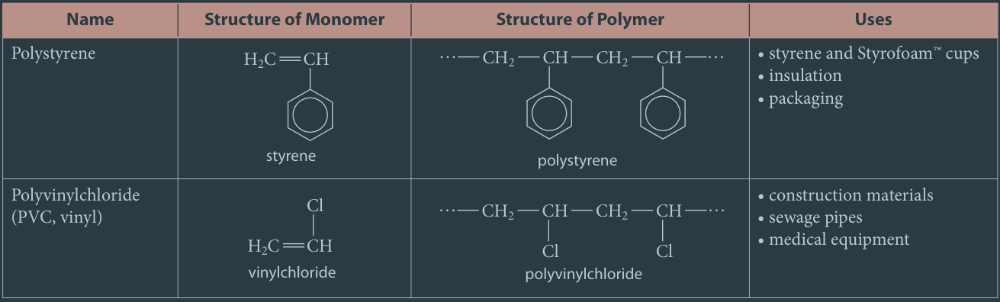

##### Addition Polymer: Polyacrylamide Gel

- **gel electrophoresis:** technique used to separate and analyze samples of proteins and DNA fragments
- *polyacrylamide*: addition polymer; gel used to sep. proteins
	- unique bcz. cross links can be made between polymer chain
	- results in 3D network
- **crosslinking:** process where bonds are formed from one strand to another at several points along polymer strand
- *Formation of polyacrylamide* 
	- (A) formed from acrylamide (monomer)
	- (B) acrylamides under go addition polymerization
	- (B) resulting polymer is single chain
- *Creating cross links*
	- (C) ingredient commonly k.a. *bisacrylamide* must be added
	- (C) bisacrylamide looks like 2 acrylamides joined by $\ce{-CH2-}$ group bonded to Ns in each molecule
	- (C) bisacrylamide added while polymer is forming
- Polymer that contains many crosslinks is stronger and less flexible...
	- ... than straight-chain relative
	- some cases: cross links allow polymer to stretch and return back to original shape after force rem.

*Figures that show formation of polyacrylamide and its crosslinks*

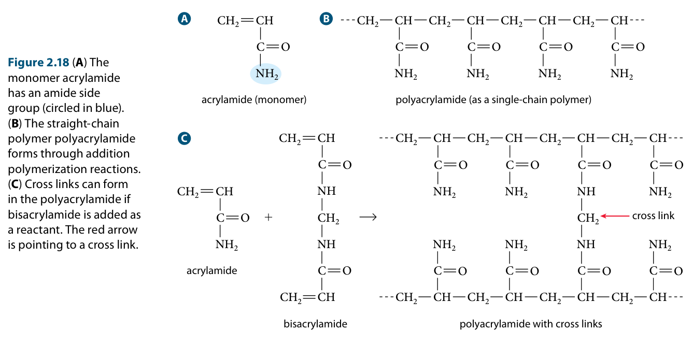

#### Condensation Polymerization

**condensation polymerization:** reaction where monomers are combined through multiple condensation reactions to form a polymer

##### Condensation Polymers: PET and Kevlar

- *Formation of PET via esterification*
	- terephthalic acid, one of the monomers, has carboxyl group on each end of molecule
	- ethane-1,2-diol, other monomer, has alcohol group on each end
	- **ester linkage:** covalent bonds between 2 esters in polymers
	- *ester linkages* forms on both ends of each monomer; forms long polymer chain
	- resulting polymer: polyethylene terephthalate (PET)

*Formation of PET reaction:*

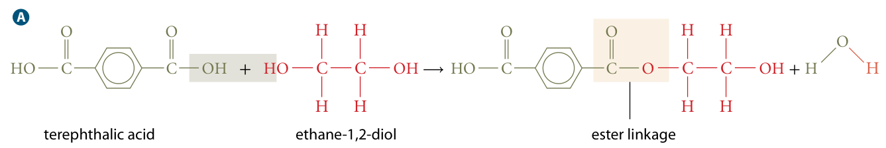

- *Formation of polymers w/ repeating amide functional groups*
	- polymers formed from 2 diff. monomers
	- 1 monomer has a carboxyl group at both ends
	- other monomer has an amine at both ends
	- an *amide linkage* forms from these monomers
	- **amide linkage:** covalent bond formed when each carboxyl group on one monomer reacts w/ an amine group other monomer
	- water also produced in reaction
- Example: polyparaphenylene terepthalamide (a.k.a. *Kevlar&reg;*)
	- monomers:
		- 1,4-diaminobenzene
		- benzene-1,4-dicarboxylic acid
	- used for bulletproof vests,
		- radial tires, boat hulls
		- bikes, and helicopter blades
	- lightweight, strong, highly resistant to heat

*Polyparaphenylene terepthalamide (Kevlar) reaction and polymer*

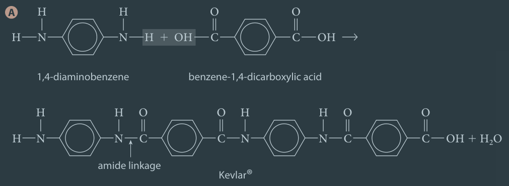

#### Other Common Condensation Polymers

To determine whether condensation polymerization has occurred, look for:

- formation of ester or amide linkages in product
- 2nd smaller product, usually water

**Examples of Condensation Polymers:**

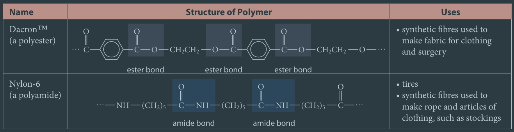

#### Sample Problem: Classifying Polymerization Reaction

Classify following polymerization reaction to make Teflon&trade;, then name the product:

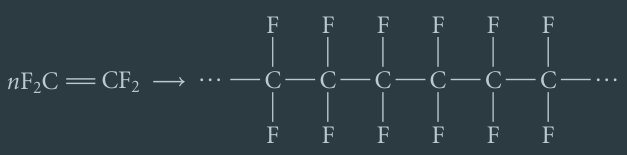

**Steps** as table:

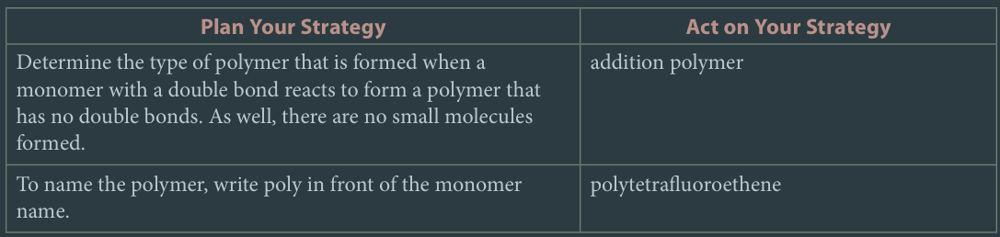

### Polymers and Industry

- Organic compounds that industries use to make polymers start out as *petroleum*
- **petroleum:** fossil fuel that contains mixture of hydrocarbons, such as alkanes and alkenes
- **petrochemical:** product derived from petroleum that is converted into plastics and other synthetic materials
	- various organic reactions used to...
	- conv. petroleum &rarr; petrochemicals

**Production of Ethene:**

- Ethene prod. at large scale through process called "cracking at plants"
- Ethane from petroleum refines is heated to 800 &deg;C and undergoes following cracking reaction:

$$
\ce{C2H6(g) ->[\ Pt\ ] CH2 = CH2(g) + H2(g)}
$$

- DB makes ethene much more reactive than ethane
- Petrochemical industry uses ethene to synthesize useful materials like...
	- ethylene glycol &mdash; used in antifreeze
	- polyethylene
	- polyvinyl chloride

#### The Manufacture of Polyvinyl Chloride (PVC)

1. Ethene first reacted w/ chlorine in addition reaction to produce 1,2-dichloroethane:

$$
\ce{C2H4(g) + Cl2(g) -> C2H4Cl2(g)}
$$

2. 1,2-dichloroethane product is then cracked at high temps. to produce chloroethene (vinyl chloride) and hydrogen chloride via elimination:

$$
\ce{C2H4Cl2(g) -> C2H3Cl(g) + HCl(g)}
$$

3. By-product of cracking reaction, HCl(g) reacted further w/ oxygen and more ethene to produce more 1,2-dichloroethane for cracking:

$$
\ce{2C2H4(g) + 4HCl(g) + O2(g) -> 2C2H4Cl2(g) + 2H2O(g)}
$$

4. Vinyl chloride reacted in addition polymerization to produce PVC:

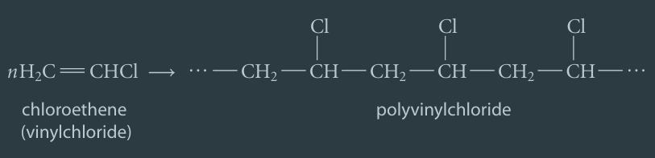

#### Polymer Production: Risks and Solutions

- 1970s: Workers at a U.S. plastic plant developed liver cancer due to long-term exposure to vinyl chloride, a carcinogen.  
- Vinyl chloride exposure is now regulated, but trace amounts persist in the environment from PVC production emissions and wastewater.  
- PVC manufacturing and disposal also release **dioxins**
	- **dioxins:** highly toxic chlorinated hydrocarbons formed during production or burning.  
	- Regulations and industry efforts have reduced dioxin emissions; backyard garbage burning is now the largest human source.  
	- Burning plastics releases harmful compounds like dioxins.  
- Most plastics degrade very slowly—taking hundreds of years.  
- **Recycling** is a key solution: plastics (~7% of garbage mass) can be reused to make products like bottles, bags, lumber, furniture, and fleece fabric (from PET bottles).  
	- Recycling has costs due to transport, sorting, cleaning, and processing.  
	- The **three R’s**—reduce, re-use, recycle—are essential for managing polymer waste.  
- **Bioplastics** offer an additional solution; they degrade faster under environmental conditions.  
	- **Hydrobiodegradable bioplastics** come from natural polymers (starch, cellulose) but may include some petroleum-based material.  
	- **Oxobiodegradable bioplastics** are petroleum-based with added catalysts that speed up degradation.

### Natural Polymers

Found in almost every living system

#### Polysaccharides

- **polysaccharides:** polymers made of saccharides
- **saccharides:** sugar monomers
- i.e. cellulose
	- provides most of plant structure
	- monomer: glucose
	- wood, paper, cotton, flax all made of cellulose
- i.e. *starch:* energy storage unit in plants

##### Cellulose vs. Starch

- cellulose forms **beta linkages**
	- indigestible by humans
	- bond from C to O drawn upward
- starch forms **alpha linkages**
	- digestible by humans
	- bond from C to O drawn downward
- *linkages* differ by orientation
- enzymes in our bodies recognize and break down alpha linkages in starch
- no animal has enzymes to digest beta linkages
- some animals host bacteria that can digest beta linkages for them
	- i.e. cows and termites

*Structure of cellulose:*

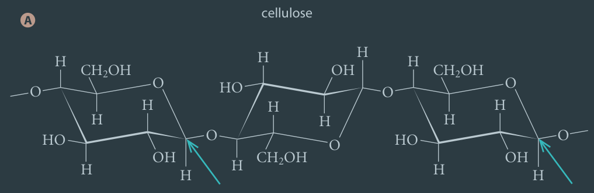

Arrows point to beta linkages

##### Branched Chains

- Starch can also have branched chains, but cellulose can't
- **amylose:** straight-chain starch
- **amylopectin:** branched-chain starch
	- there is a branch after every 24-30 glucose monomers
- **glycogen:** 3rd glucose polymer; energy storage unit in animals
	- has alpha linkage, digestible by humans
	- glycogen has many more branches than starch
	- it branches every 8-12 glucose units
	- extensive branching creates many free ends that allow enzymes to act on glycogen polymer at many pts. simultaneously
		- increases rate at which glucose can be released from storage

*Structure of starch:*

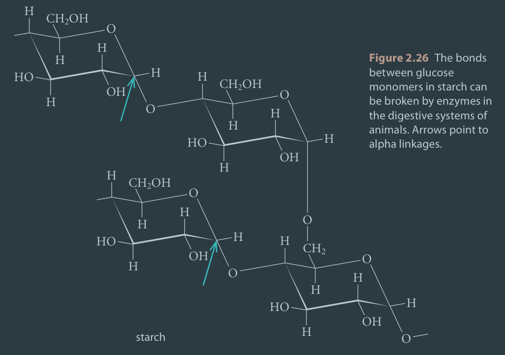

#### Proteins

- **protein:** natural polymer composed of monomers called amino acids
- Importance
	- speeds up chem. reactions (enzymes)
	- transports oxygen in blood (hemoglobin)
	- regulates body responses (hormones)
- **amino acid:** building block of protein
- *Protein Synthesis*
	- very complex process in cells
	- amide linkages form between amino acids to make proteins
	- cell's DNA determines sequence of amino acids in proteins
	- sequence determines structure and function of protein

*2 of 20 amino acids:*

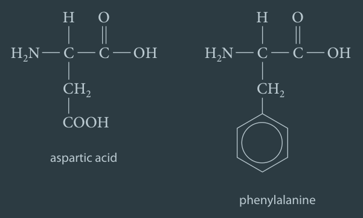

#### DNA

- **deoxyribonucleic acid (DNA):** biological molecule found in cell nuclei that codes for amino acid sequence in all proteins of organisms
	- ultimately controls cellular development and function
- **nucleotide:** repeating unit in DNA
- each strand of DNA is a polymer composed of nucleotides
- **3 Parts of Nucleotides**
	- sugar (S)
	- phosphate group (P)
	- **nitrogenous base:** cyclic organic molecule containing nitrogen
- S is linked to P via condensation polymerization to form strand of DNA

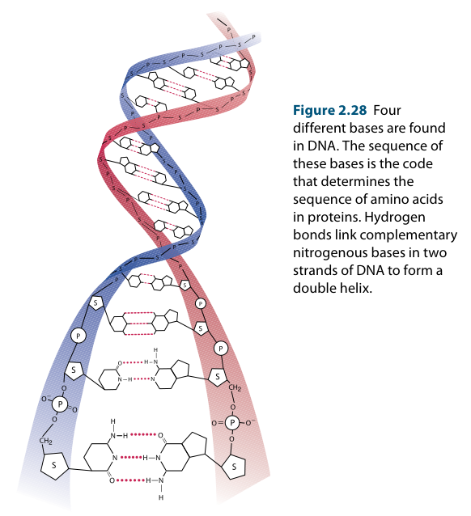