# C3 - Atomic Model & Properties

## C3.1 - Developing a Nuclear Model of the Atom

### Empirical Evidence vs. Theory

- **empirical evidence:** hard evidence derived from experiments or observations
- **theory:** possible explanation given supported by empirical evidence

### Dalton's Atomic Model (1805)

*Matter thought to be made of tiny hard spheres called "atoms"*

- John Dalton (1766-1844): schoolteacher and scientist
- Marked the beginning of atomic theory
- Used *experimental* results to support his theory
- Dalton compared the particles that make up matter to small, hard spheres he called **atoms**

> *Theoretical Knowledge*
>
> - Matter is composed of indestructible, indivisible atoms
> - Atoms of the same element are identical
> - Atoms of different elements are different

**❌LIMITATIONS**

- Does not explain how things acquire electrical charge
- Does not explain the existence of smaller particles like "electrons"

**Other things Dalton's known for**

*Empirical Knowledge*

- law of definite proportions
- law of conservation of mass

### Thomson's Plum Pudding Model (1897)

- Discovery of the electron by Joseph John (J.J.)  Thomson (1856-1940)
- Thomson studying electric currents in gas discharge tubes

*Diagram of cathode-ray tube (CRT):*

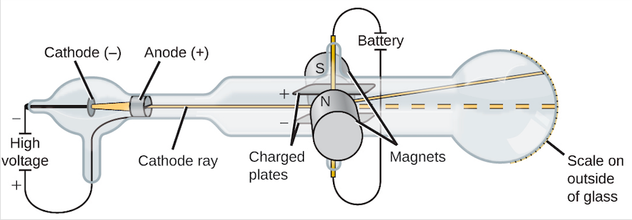

**How a CRT works and setup:**

- **cathode ray tube (CRT):** glass tubes where most of the air has been removed
- Fitted with 2 electrodes sealed in place and connected to external source of energy
- When power is turned on, a "ray" appears from the cathode (-) and travels to to the anode (+)
- Charged plates were placed on either side to observe the behaviour of electrons

**Observations:**

- Cathode rays would be **deflected** from the **negatively charged plate**
- Cathode rays would be **attracted** to the **positively charged plate**
- Results did not differ when cathode materials were changed

#### The Plum Pudding Model

> Matter is composed of atoms that contain electrons embedded in positive material.
>
> Kind of element characterized by # of electrons

*Modelled after a plum pudding, common English dessert*

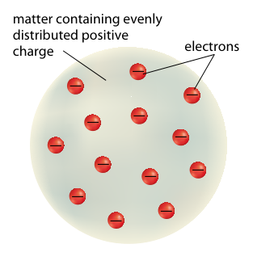

**Mass of Electrons**

- Mass of electrons determined by seeing how much rays deflected by varying voltage
- Mass of electrons 2000x smaller than hydrogen-1 (smallest known atom)

**❌ LIMITATIONS**

Did not explain scattering in gold foil experiment

**Other Things Thomson's Known For**

Electrical nature of solution 

### Rutherford's Nuclear Model (1911)

#### Discovery of Radioactive Materials (late 19th c.)

- Discovered by French physicists Henri Becquerel, Marie Curie, and Pierre Curie
- Certain elements are radioactive
- Natural emission of:
	- alpha particles ($\alpha$): positively charged He-4 nuclei
	- beta particles ($\beta$): negatively charged high-speed electrons
	- gamma radiation ($\gamma$): high frequency electromagnetic energy

#### The Gold Foil Experiment

- Nuclear model proposed by New Zealand-born British chemist Ernest Rutherford (1871-1937)
- Experiment done by his 2 students

**Experimental Setup:**

- Students aim alpha particles at extremely thin sheets of gold foil
- Gold foil surrounded by zinc sulfide-coated screen that "lit up" where alpha particles hit

**Expectations**

- Large, fast-moving alpha particles would only be slightly deflected by nearby electron collisions
- Even distribution of positive charge would not affect paths of electrons
- Alpha particles would be deflected $\frac 1{200}\degree$ at most

*Expectation of what would happen:*

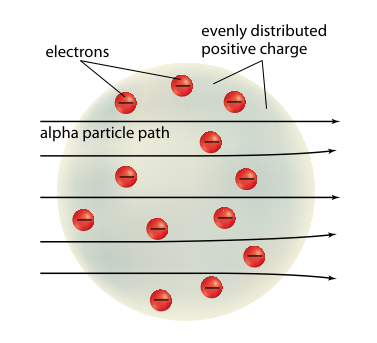

**Reality**

- Some alpha particles (~1 in 8,000) were deflected at very large angles
- ~1 in 20,000 were deflected by angles >90&deg;
- Strained credibility of Thomson's model

*What actually happened + experimental setup*

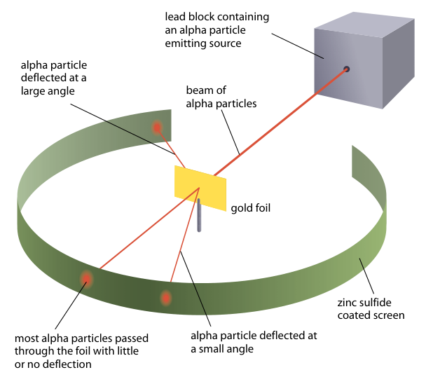

#### Development of the Nuclear Model (pub. 1911)

- Rutherford proposed that deflections caused by intense electric field at center of atom
- Rutherford calculated that all of the positive charge
- ... and most of the mass confined to small region at center of atom called the **nucleus**
- **nuclear model:** model of the atom where electrons move around an extremely small, positively charged nucleus
	- *a.k.a. planetary model*

*Visualization of Rutherford's Model*

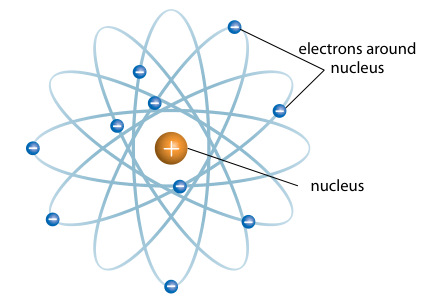

*More accurate picture of gold foil experiment*

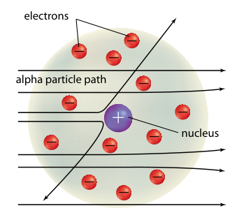

#### Discovery of the Neutron (1932)

- Discovered by James Chadwick
- Artificial fusion reactions
- Existence of neutral particles theorized

$$
\begin{equation*}
\ce{^27Al + \alpha -> ^30P + n^0}
\end{equation*}
$$

#### The Rutherford Model

- **proton ($\ce{p+}$):** positively charged subatomic particle found in atomic nucleus
- **neutron ($\ce{n^0}$):** neutral subatomic particle found in atomic nucleus
- **electron ($\ce{e-}$):** negatively charged subatomic particle found in the orbitals of atoms
- **nucleus:** a tiny core region that holds most of an atom's mass and all of its positive charge

> - An atom is made up of an **equal number** of **electrons** and **protons**
> - Most of the atom's **mass** and all of its **positive charge** is contained within the **nucleus**
> - *Protons* and *neutrons* have approximately the **same mass**
> - **atomic number ($Z$):** no. of protons
> - **mass number ($A$):** total no. of protons and neutrons

#### ❌ Limitations

- Original model could not account for all of  mass until Chadwick's neutron discovery (1932)
- Nucleus composed entirely of positive charges should break apart from electrostatic forces of repulsion
- Electron in motion around central body *must* continuously emit radiation
	- One must expect continuous spectrum or "rainbow" of light energy
- Electron would also lose energy and spiral in to the nucleus

*Why are atoms stable? This should happen if Rutherford's model were true*

### Beginnings of Quantum Theory

- **electromagnetic radiation:** oscillating, perpendicular electric and magnetic fields moving through space as waves
	- i.e. visible light
	- constant speed in vacuum: $c=3.00\times 10^8\text{ m/s}$ 

#### Characteristics of Electromagnetic Radiation

- **cycle:** a complete periodic motion
- **wavelength ($\lambda$):** shortest distance between two equivalent points on a wave
	- unit: meters (m)
	- determines the "colour" of a wave
- **frequency ($\nu$ or $f$):** number of complete wave cycles that pass a given point in a unit of time
	- SI unit: hertz (Hz)
	- 1 Hz = 1 cycle per second (s-1)
- **amplitude ($A$):** the distance between rest point and furthest point
	- units: meters (m)
	- higher amplitude = "brighter light"
- **period ($T$):** the time it takes to complete one cycle
	- unit: seconds (s)
- **distance ($\Delta d$):** length that wave travels
	- unit: meters (m)
- Other Properties
	- **peak:** the highest point of a wave
	- **trough:** the lowest point of a wave
	- **number of cycles ($N$):** self-explanatory
	- **total time ($\Delta t$):** total time taken of wave to travel its distance

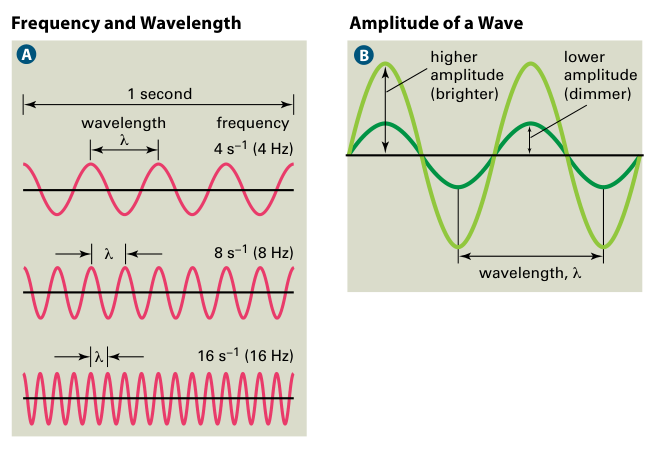

#### The Electromagnetic Spectrum

**electromagnetic spectrum:** the spectrum consisting of all forms of electromagnetic radiation

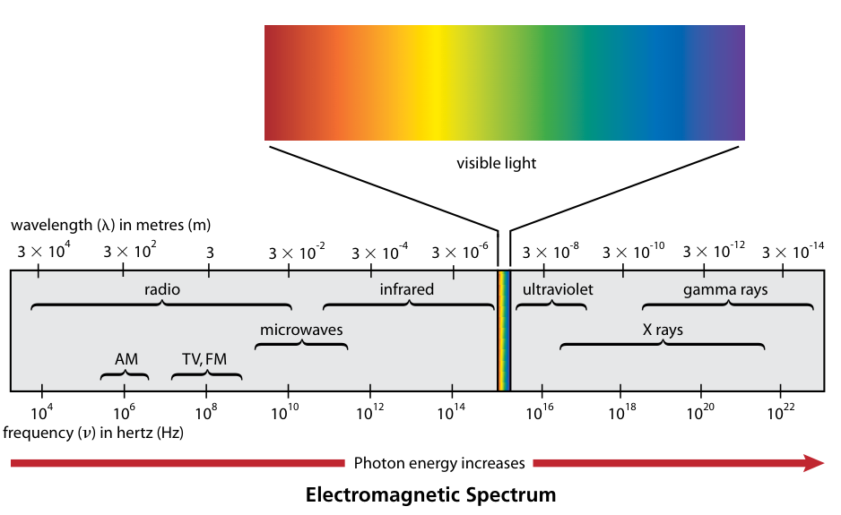

#### Frequency-Period Relationships + Distance

$$
\begin{gather*}
f = \nu = \frac N{\Delta t} \\
T = \frac{\Delta t} N \\
f = \nu = \frac 1 T \\
T = \frac 1 f = \frac 1 \nu \\
\Delta d = c\Delta t
\end{gather*}
$$

#### The Photoelectric Effect

- Discovered by Albert Einstein
- **photoelectric effect:** release of electrons from a substance due to light striking the surface of a metal
- **quantum:** small, discrete, indivisible packet of energy that must be absorbed on emitted fully (no in between)
- **photon:** a packet or quantum of electromagnetic energy
- **energy ($E$):** ability to do work
	- **work:** acting of a force causing an object to displace
	- both qtys. have unit: joules (J)

Energy of a photon depends on the wavelength or frequency

*Wave and frequency relationship equations*

$$
\begin{gather*}
c = f\lambda = \nu\lambda \\
\nu = \frac c \lambda \ \lor\ \lambda = \frac c \nu
\end{gather*}
$$

**The Planck Equation**

The energy of a photon is directly related to the frequency of electromagnetic radiation

$$
\begin{equation*}
E_\text{photon} = hf = h\nu = \frac{hc}\lambda
\end{equation*}
$$

- $E_\text{photon}$ is the energy of a photon (J)
- $h$ is Planck's constant (J/Hz)
- $f$ or $\nu$ is frequency (Hz)

*Planck's constant*

$$
h = 6.626 \times 10^{-34}\text{ J/Hz}
$$

### Atomic Spectra

- **spectroscopy:** technique for analyzing electromagnetic radiation spectra
- **continuous spectrum:** spectrum including all wavelengths in the visible spectrum
- **absorption spectrum:** a series of dark lines produced on a continuous spectrum, showing the light absorbed by electrons
	- a.k.a. *dark-line spectrum*
- **emission spectrum:** series of separate lines of different colours of light emitted by atoms of specific element as they lose excitation energy
	- series of bright lines of light
	- emitted by gas excited by heat / electricity
	- a.k.a. *line spectrum* or *bright-line spectrum*

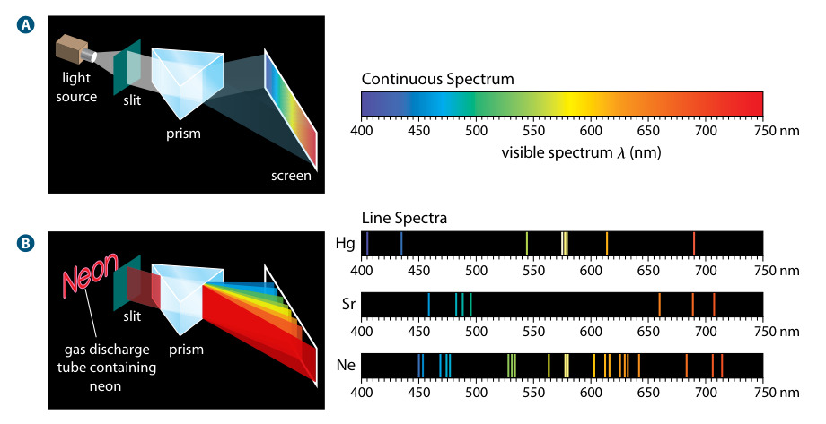

### Bohr's Model of the Atom

- Developed by Danish scientist Niels Bohr (1885-1962)
- Inspired by works of Einstein, Planck, and line spectra of atoms
	- 1900 paper of Planck: hot matter emitted EM energy as discrete packets of energy
	- 1905 paper of Einstein: when matter absorbs light, it can only absorb in packets fully or not at all
- Based on line spectra observed from hydrogen gas

#### Bohr's Postulates

*Bohr's model of the atom*

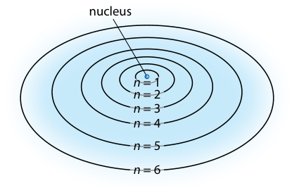

$n$ used to describe energy level number

*higher number = further from nucleus*

**Pre-Postulates**

- Electrons exist in **circular orbits**
	- The central force holding them in orbit is the electrostatic force
	- ... between positive nucleus and neg. charge of electrons
- Electrons can exist only in series of "allowed" orbits
	- Electrons have diff. amounts of energy in each orbit
	- **energy level:** a place where an electron orbits

**Bohr's First Postulate**

- Electrons do not radiate energy while it remains in one orbit
- Each orbit corresponds to a ground state
- **stationary / ground state:** state of constant energy

**Bohr's Second Postulate**

- Electrons can change their energy only by undergoing transition from one stationary state to the other
- Electrons "jump" between orbits by absorbing or emitting photons

> Elec. carries **quantum of energy** equal to diff. in energy levels jumped

**Ways to Excite an Atom**

- **excite** = absorb energy
- Atom collides with highly energetic particle
	- i.e. electron in electric current passing through gas
- Atom absorbs photon w/ energy equal to $\Delta E$ between 2 orbits
- Excited atoms quickly return to ground state by emitting photons

#### Line Spectrum of Hydrogen

*The Bohr model and line spectrum of hydrogen*

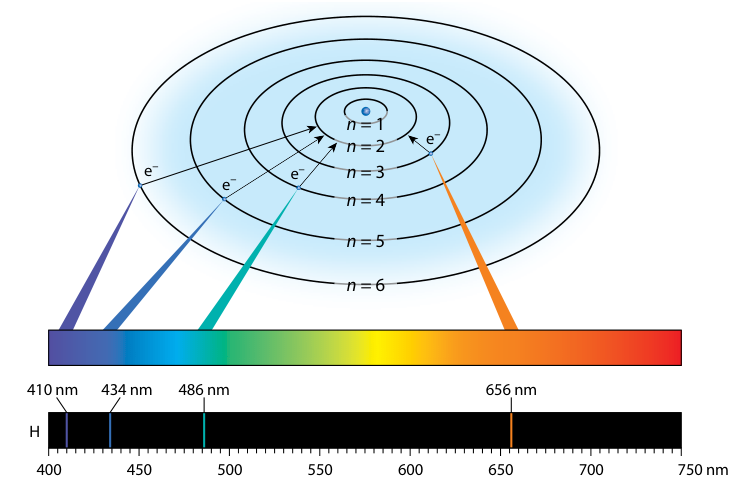

- Bohr's model explains line spectrum of hydrogen
- Bohr used Planck's equation to calculate wavelengths of visible spectrum

**Wavelengths of Hydrogen Light**

- $n=6\to 2$ &mdash; violet (410 nm)
- $n=5\to 2$ &mdash; indigo / blue (434 nm) 
- $n=4\to 2$ &mdash; turquoise / green (486 nm)
- $n=3\to 2$ &mdash; red-orange (656 nm)

#### ❌ LIMITATIONS

- Explains line spectrum of hydrogen
- Explains line spectrum of single-electron ions like $\ce{He+}$ and $\ce{Li^2+}$
- Does not explain line spectra for atoms with more than 1 electron

---

## C3.2 - Quantum Mechanical Model

### Quantum Mechanics

- Louis de Borglie (1923) first proposed idea of electron behaving as wave
	- Light interacts w/ matter as photons
	- He reasoned that matter should also have wavelike properties

#### Louis de Borglie's Thoery

*Wavelength of particles*

$$
\lambda = \frac h{mv}
$$

- $h$ is Planck's constant (J&middot;s)
- $m$ is mass of particle (kg)
- $v$ is speed of particle (m/s)

*Frequency of matter*

$$
f = \nu = \frac{E_k}h
$$

- $f$ or $\nu$ is frequency (Hz)
- $E_k$ is kinetic energy of particle (J)

Theory published in 1923

- Within 3 years of pub., 2 diff. groups of researchers found supporting evidence
- George P. Thomson showed wave nature of electrons
	- son of J.J. Thomson
- Wave nature of particles never observed before because large objects have very small wavelengths

**The Bohr Model**

- Radius of orbit would equal int. # of wavelengths or waves would cancel out
- Results of his theory matched Bohr's results
	- radii of allowed orbits

### Quantum Mechanical Model of the Atom

- Erwin Schrödinger, Viennese physicist, realized wave theory and equation needed to explain "matter waves"
- 1926: Publication of the **Schrödinger wave equation**
	- contains three variables: $n, l, m_l$
> - **quantum mechanical model of the atom:** atomic model where electrons are treated as having wave characteristics
> - **atomic orbital:** region in space around a nucleus related to a specific wave function

- Meaning of "Matter Waves"
	- German physicist Max Born's interpretation
	- Wave functions used to determine probability of finding electron at any point within orbital described by wave function
- Nearly all observable characteristics of atoms, incl. spectra describable by wave functions

##### Empirical Evidence

 
Empirical evidence such as ionization energies provide support for theoretical knowledge of energy sublevels.

#### Electron Orbitals

- **atomic / electron orbital:** 3D region of space around nucleus where elctron likely to be found
	- distance from nucleus varies
- **electron probability density:** mathematical / graphical representation of chance of finding electron in a given space

#### Heisenberg's Uncertainty Principle (1927)

- Paper by Werner Heisenberg
- **Heinsenberg's uncertainty principle:** Mathematically impossible to know both the position and momentum of a particle w/ precision

$$
\Delta x\Delta mv \le \frac h{4\pi}
$$

- $x$: position
- $mv$: momentum (mass * velocity)
- $\Delta$: range of values
- $\dfrac h{4\pi} = 5.2728 \times 10^{-35}\text{ J}\cdot\text{s}$
- *Explanation:*
	- as one range becomes smaller (more precise)
	- other range becomes larger (less precise)
	- to keep the same product

### Quantum Numbers

- **quantum number:** integers arising from solutions to wave equation
	- describes specific properties of electrons in atoms

#### Principal Quantum Number, $n$

- **principal quantum number ($n$):** positive whole number that indicates ***energy level*** and ***relative size*** of orbital
	- **shell:** main energy level associated w/ a given value of $n$
	- higher $n$ = higher energy level
	- range: $n = 1 \to n = \infty$
- Total # of electrons in shell = $2n^2$

#### Orbital-Shape Quantum Number, $l$

- **orbital-shape quantum number ($l$):** integer that describes shape of atomic orbitals
	- **sublevel / subshell:** energy subshell assoc. w/ $l$, within each primary shell
	- range: $l = 0 \to l = (n-1)$
		- i.e. if $n=3$, $l$ can be $0,1,2$
		- \# of $l$ values = vol. of $n$ (arises from $n$)

Values of $l$ identified by specific letter:

|$l$|0|1|2|3|
|-|-|-|-|-|
|Letter|s|p|d|f|
|Name|sharp|principal|diffuse|fundamental|

- Identifying a specific sublevel:
	- *Combine $n$ and letter for $l$*
	- If $n=3, l=0$ then sublevel is $3s$

Number of orbitals per sublevel

|$l$|Sublevel sym.|No. of orbitals|
|-|-|-|
|0|$s$|1|
|1|$p$|3|
|2|$d$|5|
|3|$f$|7|

#### Magnetic Quantum Number, $m_l$

- **magnetic quantum number ($m_l$):** integer indicating orientation of an orbital in the space around the nucleus 
	- range: $m_l = -l \to m_l = +l$
		- i.e. if $l=0$, $m_l$ can only be $0$
		- i.e. if $l=1$, $m_l$ can be $-1,0,+1$
		- $2l+1$ values for $m_l$
	- Naming for each $m_l$ when $l>0$
		- (no specific order IRL, ordered from left to right of diagram)
		- $l=1$
			- $m_l = 0 \to p_z$
			- $m_l = -1 \to p_y$
			- $m_l = +1 \to p_x$
		- $l=2$
			- $m_l = +2 \to d_{x^2 - y^2}$
			- $m_l = -2 \to d_{xy}$
			- $m_l = -1 \to d_{xz}$
			- $m_l = +1 \to d_{yz}$
			- $m_l = 0 \to d_{z^2}$

**Possible Orbitals for $s$, $p$, and $d$**

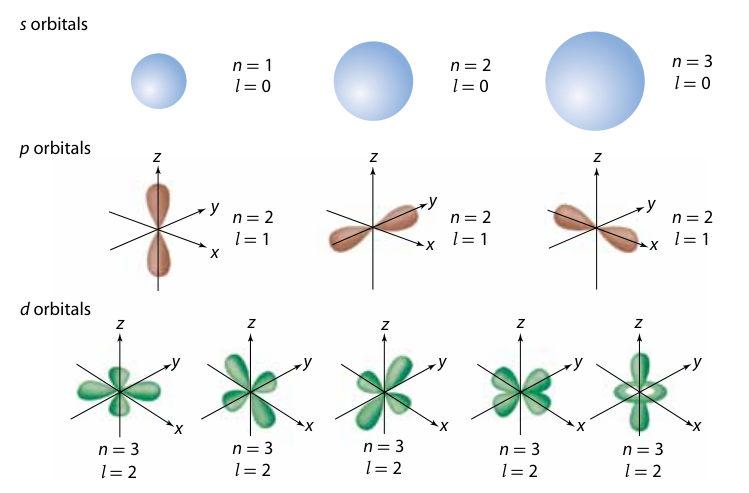

*Showing region where electrons can exist*

#### Spin Quantum Number, $m_s$

- derived from exp. observations and verified mathematically
- *"electron spinning on its axis"*
- **spin quantum number ($m_s$):** number that specifies orientation of axis on which electron is spinning
	- only 2 values: $+\frac 1 2$ or $-\frac 1 2$

#### Summary of Quantum Numbers

|Name|Symbol|Allowed Values|Property|
|-|-|-|-|
|Principal (shell)|$n$|Integers: $1\to\infty$|Orbital size and energy level|
|Orbital-shape (subshell)|$l$|Integers $0\to(n-1)$|Orbital shape (s, p, d, f)|
|Magnetic|$m_l$|Integers $-l\to+l$|Orbital orientation|
|Spin|$m_s$|$-\frac 1 2$ or $+\frac 1 2$|Spin orientation|

### Pauli Exclusion Principle

- Proposed by Austrian physicist Wolfgang Pauli in 1925
- **Pauli exclusion principle:** principle stating...
	- max. of 2 electrons can occupy an orbital
	- electrons must have opposite spins
- no 2 electrons can have same 4 quantum \#s

#### Identifying Electrons w/ Quantum Numbers

- $n$ can be thought of as an electron's city
- $l$ can be thought of as the street
- $m_l$ can be thought of as the street # (building)
- $m_s$ can be thought of as the electron's "name"

Quantum Numbers for Hydrogen and Helium

|Atom|Electron|Quantum Numbers|
|-|-|-|
|hydrogen|Lone|$n=1, l=0, m_l=0, m_s=+\frac 1 2$|
|helium|1st|$n=1, l=0, m_l=0, m_s=+\frac 1 2$|
| |2nd|$n=1, l=0, m_l=0, m_s=-\frac 1 2$|

---

## C3.3 - Electron Configurations (Part I)

### Atomic Orbital Energies

**Diagram of Interelectron Forces**

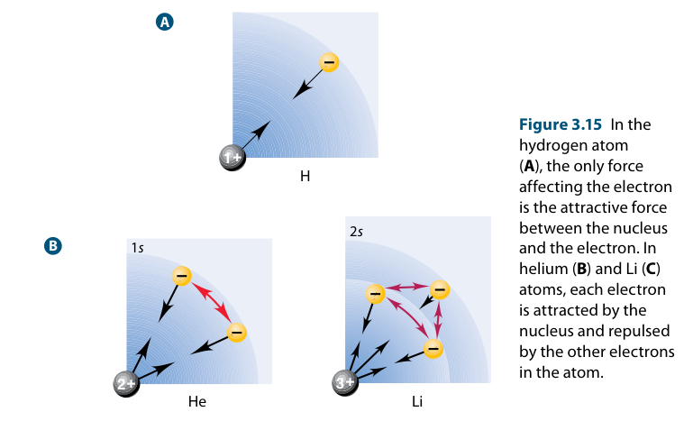

- In hydrogen (A), only attractive force is between nucleus and electron
	- No difference in energy of electron no matter which orbital or level it's in
- In helium and lithium (B), attractive forces between electron and nucleus
	- repulsive forces between electrons
	- energies of orbitals different within same shell
	- $2s$ orbital closer than $2p$ electrons
		- lower energy level of $2s$ electrons

### Electron Configurations

- **electron configuration:** shorthand notation that shows the number and arrangement of electrons in an atom's orbitals
	- infinite number of possible electron configurations
	- convention: electron configurations drawn in ground state
	- provide information about quantum nos. $n$ and $l$
- Meaning
	- Big number: Principal Quantum Number ($n$)
	- Letter: Orbital-shape Letter ($l$)
	- Superscript: # of electrons in subshell

> Electron configuration for hydrogen: $1s^1$

*Breakdown of electron configuration*

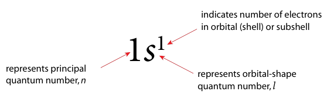

#### Orbital Diagrams

- **orbital diagram:** a diagram that uses a box for each orbital in any given principal energy level
	- empty box = no electrons in orbital
	- 1 arrow = half-filled orbital
	- 2 opposite arrows = filled orbital

*Orbital diagram example*

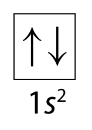

#### Describing Electrons in Lithium

- By convention, the first spin is always +1/2
- The electrons fill the first shell with just an $s$ subshell
- Then, they fill the first $s$ subshell in the 2nd shell

**Atom:** Lithium

|Electron|Quantum Numbers|
|-|-|
|1st|$n=1, l=0, m_l=0, m_s=+\frac 1 2$|
|2nd|$n=1, l=0, m_l=0, m_s=-\frac 1 2$|
|3rd|$n=2, l=0, m_l=0, m_s=+\frac 1 2$|

**Electron Configuration:** $1s^2\ 2s^1$

**Orbital Diagram:**

$$
\begin{array}{c @\ @\ c}
\boxed{\uparrow\downarrow} & \boxed{\uparrow\ }
\boxed{\phantom\uparrow\ \ } &  
\boxed{\phantom\uparrow\ \ }
\boxed{\phantom\uparrow\ \ }
\boxed{\phantom\uparrow\ \ } \\
1s & 2s & 2p
\end{array}
$$

### Determining Electron Configurations & Orbital Diagrams

- **aufbau principle:** each electron occupies the lowest energy orbital available
	- each electron is added from the lowest energy level, building up
	- electrons fill shells incrementing by $n + l$
	- the next electron has higher energy levels than the previous
- **Hund's rule:** single electrons with the same spin must occupy each equal-energy orbital ...
	- ... before additional electrons w/ opposite spins can occupy the same orbitals
	- an orbital is occupied by one electron first
	- then second electrons join in later
	> - The term with the maximum multiplicity has the lowest energy
	> - Multiplicity = # of unpaired electrons + 1
- **condensed electron configuration:** electron configuration shortened by adding a configuration to a noble gas's config.
	- [noble gas] extra config

#### Guidelines for "Filling" Orbitals

1. Place electrons into orbitals in order of increasing energy level
	1. By convention, **fill from left to right**
2. Completely fill orbitals of same energy level before proceeding to next orbital or series of orbitals
3. When electrons are added to orbitals of same energy sublevel, each orbital receives one electron before any pairing occurs *(Hund's rule)*
4. When electrons are added indiviudaly to different orbitals of same energy, they all must have the same spin *(Hund's rule)*

##### Rules for Irregular / Anomalous Elements

- **anomalous element:** an atom whose electron configuration doesn't follow the aufbau principle
	- *Guilty:* group 5 (Cr, Mo, W, Sg)
	- *Guilty:* group 11 (Cu, Ag, Au, Rg)

5. If your element is anomalous, remove 1 electron from $n_\text{max}s$'s orbital and add 1 electron to $n_\text{max}p$'s orbital
	1. where $n_\text{max}$ is the element's highest principal number

##### Rules for Ions

6. If the atom is an ion, add or remove electrons from orbitals of the highest principal shell
	1. subshell order for removing: f &rarr; p (whatever is available)
	2. subshell order for adding: the next available empty subshell
7. Then move on to the next shell, if necessary

#### Order Orbitals are Filled (Aufbau Order)

*Aufbau diagram*

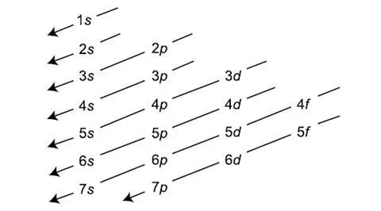

In direction of the arrows, from top to bottom rows, the electrons fill each subshell

### Energy-Level Diagrams

- **energy-level diagram:** a diagram that shows the electronic configuration of all orbitals in order of increasing energy,...
	- where each $l$ value is in its own column
- Use same guidelines as filling orbitals

*Example:* $\ce{Fe}\ 1s^2\ 2s^2\ 2p^6\ 3s^2\ 3p^6\ 4s^2\ 3d^6$ 

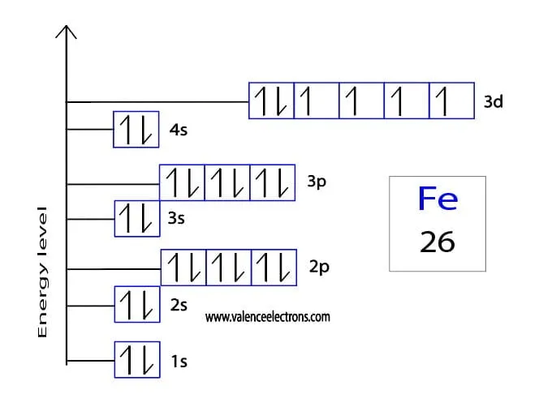

### Common Electronic Configurations

orbital diagrams in one line to save space / technical limitations

| Atomic # | Name | Symbol | Full $e^-$ configuration [Standard Format] | Orbital diagram for valence shell | No. of valence $e^-$ | Closest noble gas | Abbreviated $e^-$ configuration [Condensed Format] |
| :---: | :---: | :---: | :--- | :--- | :---: | :---: | :--- |
| 13 | Aluminum | Al | $1s^2 2s^2 2p^6 3s^2 3p^1$ | $\boxed{\uparrow\downarrow} \ (3s) \ \ \ \boxed{\uparrow\phantom{\downarrow}}\boxed{\phantom{\uparrow\downarrow}}\boxed{\phantom{\uparrow\downarrow}} \ (3p)$ | 3 | Ne | $[\text{Ne}] 3s^2 3p^1$ |
| 25 | Manganese | Mn | $1s^2 2s^2 2p^6 3s^2 3p^6 4s^2 3d^5$ | $\boxed{\uparrow\downarrow} \ (4s) \ \ \ \boxed{\uparrow}\boxed{\uparrow}\boxed{\uparrow}\boxed{\uparrow}\boxed{\uparrow} \ (3d)$ | 7 | Ar | $[\text{Ar}] 4s^2 3d^5$ |
| 35 | Bromine | Br | $1s^2 2s^2 2p^6 3s^2 3p^6 4s^2 3d^{10} 4p^5$ | $\boxed{\uparrow\downarrow} \ (4s) \ \ \ \boxed{\uparrow\downarrow}\boxed{\uparrow\downarrow}\boxed{\uparrow} \ (4p)$ | 7 | Ar | $[\text{Ar}] 4s^2 3d^{10} 4p^5$ |
| 24 | Chromium | Cr | $1s^2 2s^2 2p^6 3s^2 3p^6 4s^1 3d^5$ | $\boxed{\uparrow} \ (4s) \ \ \ \boxed{\uparrow}\boxed{\uparrow}\boxed{\uparrow}\boxed{\uparrow}\boxed{\uparrow} \ (3d)$ | 6 | Ar | $[\text{Ar}] 4s^1 3d^5$ |
| 47 | Silver | Ag | $1s^2 2s^2 2p^6 3s^2 3p^6 4s^2 3d^{10} 4p^6 5s^1 4d^{10}$ | $\boxed{\uparrow} \ (5s) \ \ \ \boxed{\uparrow\downarrow}\boxed{\uparrow\downarrow}\boxed{\uparrow\downarrow}\boxed{\uparrow\downarrow}\boxed{\uparrow\downarrow} \ (4d)$ | 11 | Kr | $[\text{Kr}] 5s^1 4d^{10}$ |
| 29 | Copper | Cu | $1s^2 2s^2 2p^6 3s^2 3p^6 4s^1 3d^{10}$ | $\boxed{\uparrow} \ (4s) \ \ \ \boxed{\uparrow\downarrow}\boxed{\uparrow\downarrow}\boxed{\uparrow\downarrow}\boxed{\uparrow\downarrow}\boxed{\uparrow\downarrow} \ (3d)$ | 11 | Ar | $[\text{Ar}] 4s^1 3d^{10}$ |
| 42 | Molybdenum | Mo | $1s^2 2s^2 2p^6 3s^2 3p^6 4s^2 3d^{10} 4p^6 5s^1 4d^5$ | $\boxed{\uparrow} \ (5s) \ \ \ \boxed{\uparrow}\boxed{\uparrow}\boxed{\uparrow}\boxed{\uparrow}\boxed{\uparrow} \ (4d)$ | 6 | Kr | $[\text{Kr}] 5s^1 4d^5$ |
| 82 | Lead | Pb | $1s^2 2s^2 2p^6 3s^2 3p^6 4s^2 3d^{10} 4p^6 5s^2 4d^{10} 5p^6 6s^2 4f^{14} 5d^{10} 6p^2$ | $\boxed{\uparrow\downarrow} \ (6s) \ \ \ \text{(no diag. for } 4f/5d) \ \ \ \boxed{\uparrow}\boxed{\uparrow}\boxed{\phantom{\uparrow\downarrow}} \ (6p)$ | 4 | Xe | $[\text{Xe}] 6s^2 4f^{14} 5d^{10} 6p^2$ |
| 50 | Tin(II) ion | $\ce{Sn^2+}$ | $1s^2 2s^2 2p^6 3s^2 3p^6 4s^2 3d^{10} 4p^6 5s^2 4d^{10} 5p^2$ | $\boxed{\uparrow\downarrow} \ (5s) \ \ \ \boxed{\uparrow\downarrow}\boxed{\uparrow\downarrow}\boxed{\uparrow\downarrow}\boxed{\uparrow\downarrow}\boxed{\uparrow\downarrow} \ (4d) \ \ \ \boxed{\uparrow}\boxed{\uparrow}\boxed{\phantom{\uparrow\downarrow}} \ (5p)$ | 4 | Kr | $[\text{Kr}] 5s^2 4d^{10} 5p^2$ |
| 34 | Selenium ion | $\ce{Se^2-}$ | $1s^2 2s^2 2p^6 3s^2 3p^6 4s^2 3d^{10} 4p^4$ | $\boxed{\uparrow\downarrow} \ (4s) \ \ \ \boxed{\uparrow\downarrow}\boxed{\uparrow\downarrow}\boxed{\uparrow\downarrow}\boxed{\uparrow\downarrow}\boxed{\uparrow\downarrow} \ (3d) \ \ \ \boxed{\uparrow\downarrow}\boxed{\uparrow}\boxed{\uparrow} \ (4p)$ | 6 | Ar | $[\text{Ar}] 4s^2 3d^{10} 4p^4$ |

### Periodic Table to Predict Electron Configurations

- ***s*-block elements:** elements whose valence electrons occupy only the $s$ orbitals
	- groups 1 and 2
	- valence config:
		- $ns^1$ (group 1)
		- $ns^2$ (group 2)
- ***p*-block elements:** elements whose valence electrons occupy the $s$ and $p$ orbitals
	- groups 13 to 18
	- valence config: $ns^2\ 2p^x$
	- group 18: $ns^2\ 2p^6$ (noble gases)
- ***d*-block elements:** elements with filled $s$ orbitals and filled / partially filled $d$ orbitals of shell $n - 1$
	- transition metals (groups 3 - 12)
- ***f*-block elements:** elements w/ filled *s* orbitals and filled / partially filled $f$ orbitals
	- inner transition elements
	- lanthanides and actinites

#### The Periodic Table Blocks

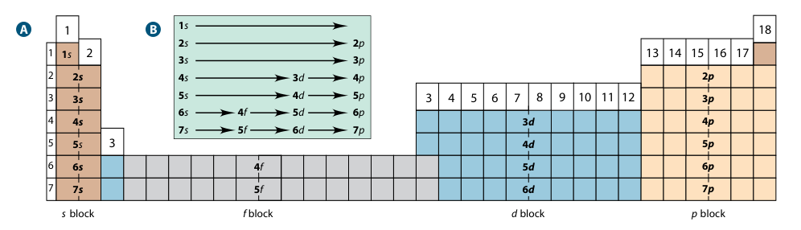

*With elements*

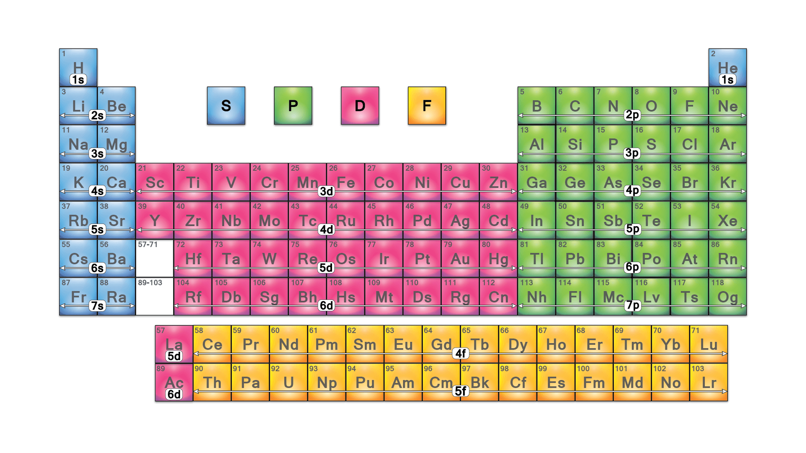

#### How to Fill

1. Find your element on the periodic table
2. From top to bottom, move left to right to each block
3. Fill the orbitals corresponding to each block
4. Do this until you reach the row and block your element is in
5. From the start of the block, count left to right until you reach your element
6. That count is the number of electrons in the last orbital
7. Use the rules for anomalous elements or ions to correct your configuration

#### Patterns in Groups and Periods

- **valence electrons** = the last digit of the group number
- **period number** = principal quantum number ($n$)
- **max. # of orbitals in an energy level** = $n^2$
- **max. # of electrons in an energy level** = $2n^2$
- periods can be shorted than $2n^2$ filling capacity
- orbital filling follows **energy order**, not just $n$

---

## C3.3 - Periodic Trends (Part II)

### Influencing Factors

- **periodic trends:** trends observed in properties of elements in the periodic table
- Electron Filling
	- left &rarr; right: electrons fill up the same energy level gradually
	- up &rarr; down: electrons fill up different energy levels
- **shielding effect (screening effect):** ability of electrons to lessen the nuclear attraction of the outer shell "above" it
	- the shell "shields" the next higher energy level
	- left &rarr; right: shielding effect is constant
	- up &rarr; down: shield effect increases (more shells)
- **net nuclear attraction / effective nuclear charge ($Z_\text{eff}$):** attraction of each electron toward the nucleus
	- more protons = higher nuclear charge
	- left &rarr; right: net nuclear attraction increases
	- up &rarr; down: cannot use to determine properties
		- may increase, but electron shielding also increases
	- $Z_\text{eff} = Z - \text{shielding eff.}$
- **Coulomb's law:** like charges repel and opposite charges attract
	- $F$: electrical force (N)
	- $r$: distance (m)
	- $k$: Coulomb's constant (N&middot;m2/C2)
	- $q$: charges of two particles (C)
	- $\epsilon_0$: permittivity of free space, constant (C2/(N&middot;m2))
	- $$
	F = \frac{kq_1q_2}{r^2} = \frac{q_1q_2}{4\pi\epsilon_0r^2}
	$$

### Trends

#### Atomic Radii

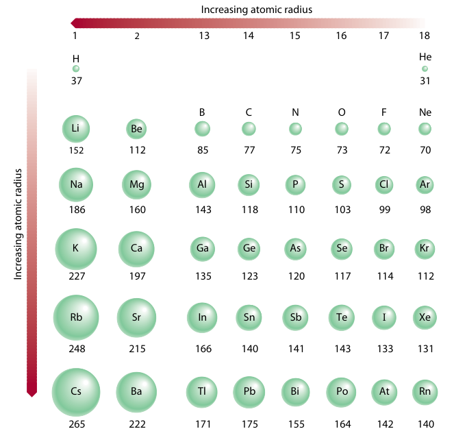

- **atomic radius:** the distance between the nucleus and the outermost "end" of an atom
	- *or* half-distance between nuclei of two identical adjacent or bonded atoms
- decreases left to right across a period
	- increasing net nuclear attraction
	- electrons pulled closer to nucleus
- increases down a group
	- increasing electron shielding
	- electrons move further away from nucleus

*Graph of atomic radii*

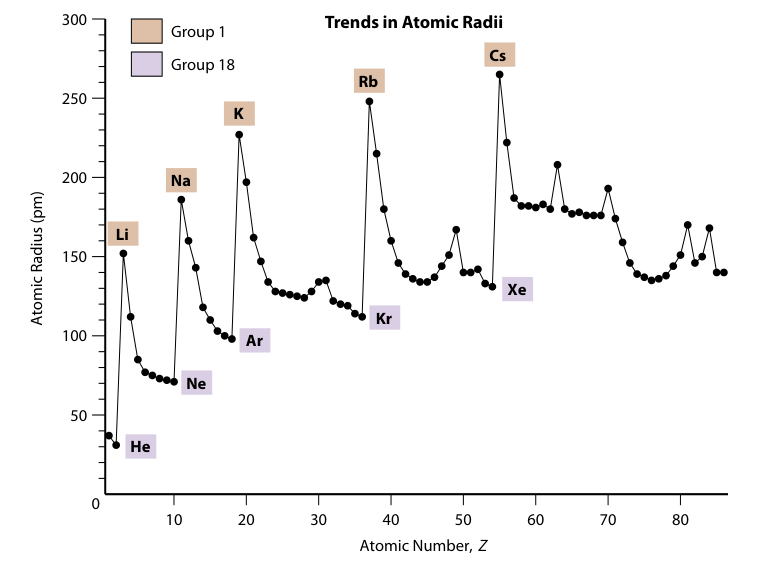

#### Ionic Radius

- **cation:** atom who lost an electron
- **anion:** atom who gained an electron
- **cations** have smaller radii than their neutral atom
	- less electrons, one less shell
	- less electron shielding
	- nuclear attraction stronger
- **anions** have larger radii than their neutral atom
	- more electrons
	- nuclear attraction weaker
- **isoelectronic series:** series of atoms where the number of electrons stay constant, but # of protons increases w/ atomic number
	- a.k.a. *isoelectronicity*
	- (largest to smallest)
	- 10 electron series: $\ce{N^3- > O^2- > F- > Ne > Na+ > Mg^2+ > Al^3+}$
	- 18 electron series: $\ce{P^3- > S^2- > Cl- > Ar > K+ > Ca^2+}$

#### Ionization Energy (IE)

- **ionization energy (IE):** energy required to remove an electron from a ground-state atom in the gaseous state
- **first ionization energy (IE1):** IE to remove first outermost electron
	- decreases down a group *(weaker nuclear attraction)*
	- increases left to right across period *(stronger nuclear attraction)*
- **second ionization energy (IE2):** IE to remove 2nd electron
	- more than 1st IE because nuclear attraction increases when electron is removed
	- plus we are removing electron from positive ion
	- same logic for successive IEs
- IE1 is lower for metals who need to get rid of an "electron" to have a filled valence shell
	- but higher for stable electronic configs. like half-flled or full configs.

First ionization reaction of sodium:

$$
\begin{gather*}
\ce{_11Na(g) ($1s^2\ 2s^2\ 2p^6\ 3s^1$) -> _11Na(g)+ ($1s^2\ 2s^2\ 2p^6$) + 1e-} \\
\text{IE}_1 = 495.8\text{ kJ/mol}
\end{gather*}
$$

Second ionization reaction of sodium:

$$
\begin{gather*}
\ce{_11Na(g)+ ($1s^2\ 2s^2\ 2p^6$) -> _11Na(g)^2+ ($1s^2\ 2s^2\ 2p^5$) + 1e-} \\
\text{IE}_2 = 4,562\text{ kJ/mol}
\end{gather*}
$$

*Trends in 1st IE*

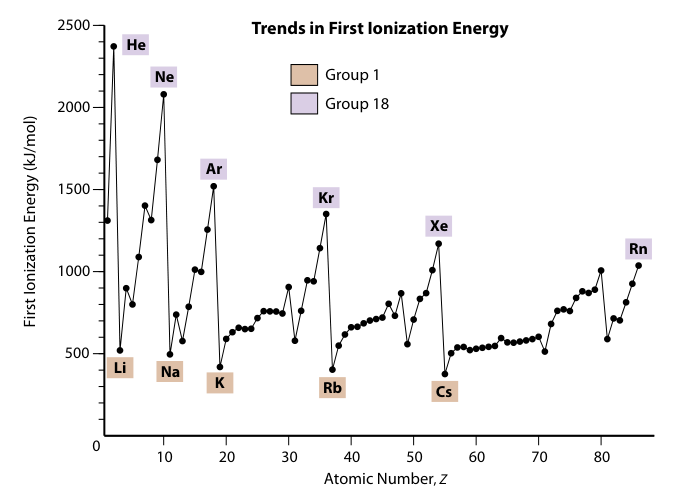

##### Determining Valence Electrons from Ionization Energies

*Successive ionization energies for Li until Ne*

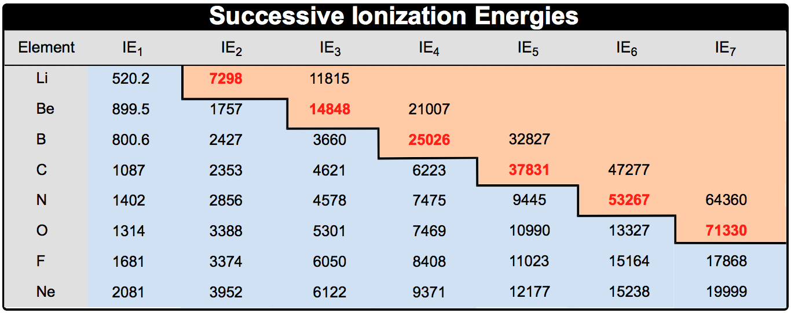

- The valence electrons will have similar ionization energies
- After the valence electrons are removed, there will be a **big jump** in ionization energy
- The $n$th IE before the "big jump" is the $n$ no. of valence electrons

#### Electronegativity

- **electronegativity:** scale of the relative attraction an atom has in a bond
	- measures how strongly an atom can "pull" an electron towards itself
	- "tug of war"
	- decreases down a group
	- increases across a period L-R (excl. noble gases)

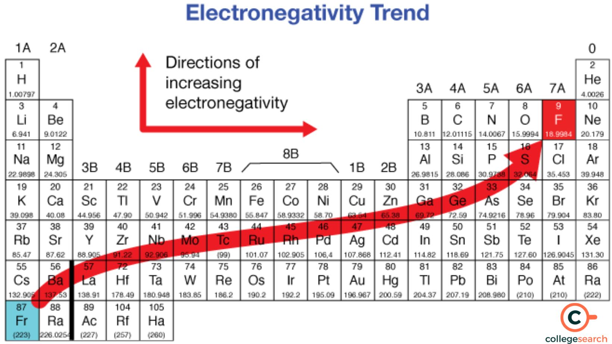

#### Reactivity

**Metals**

- Metals tend to readily lose electrons during chemical reactions
	- Due to low IE
- Chemical reactivity increases down a group
	- increases R to L across period

**Non-Metals**

- Non-metals are readily wanting to accept electrons
	- Due to high IE
- Chemical reactivity increases up a group
	- increases L to R across period

#### Electron Affinity

- **electron affinity (EA):** energy change (kJ/mol) when an electron is accepted by an atom in gaseous state
	- decreases down a group
	- increases across a period L-R
	- more unstable elements (i.e. halogens) releases most energy when gaining electron
	- some elements become less stable when they gain electrons (i.e. noble gases)
- negative EA = energy released
- positive EA = energy absorbed
- **first electron affinity (EA1):** electron affinity to accept first electron
	- usually negative (atom wants electrons)
- **second electron affinity (EA2):** electron affinity to accept 2nd electron (after 1st)
	- usually positive
	- must overcome electrostatic repulsion
	- adding electron to negative ion
- **Trends**
	- *reactive non-metals (G. 17, 16):* they need electrons to reach stability (high IE and EA)
	- *reactive metals (G. 1, 2)*: they want to get red of electrons to reach stability (low IE and EA)
	- *noble gases (G. 18):* high IE and low EA
		- in nature, they do not share, take, or give electrons

*Chart of electron affinities (groups 3-8 are 13-18)*

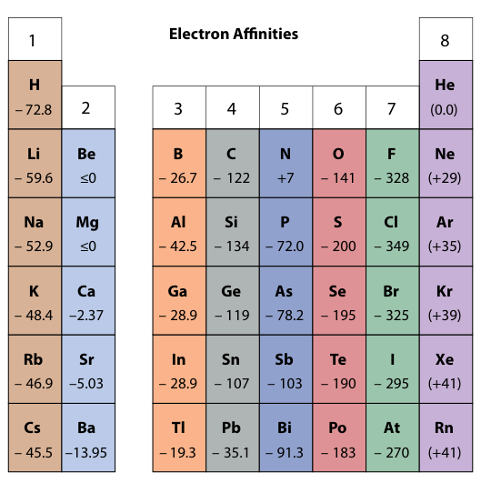

## Sources

- Mr. Thirukkumaran
- McGraw-Hill Ryerson Chemistry 12
- https://edu.rsc.org/feature/the-trouble-with-the-aufbau-principle/2000133.article
- https://valenceelectrons.com/iron-electron-configuration/
- https://sciencenotes.org/periodic-table-blocks-of-elements/
- https://www.clutchprep.com/chemistry/periodic-trend-successive-ionization-energies
- https://www.collegesearch.in/articles/electronegativity