# C4 - Chemical Bonding and Properties of Matter

## C4.1 - Models of Chemical Bonding

### 3 Types of Chemical Bonding

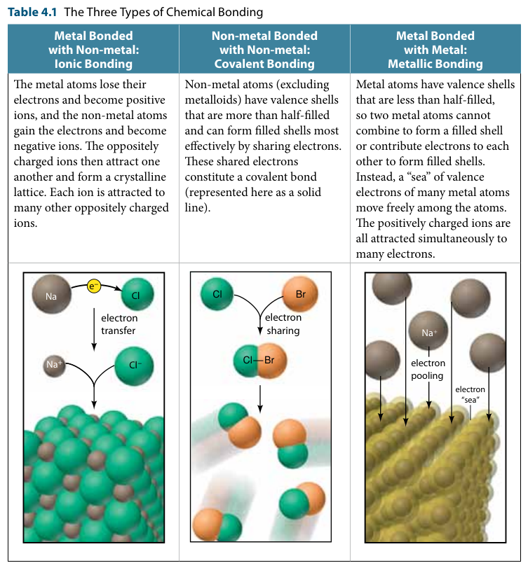

### Chemical Bonding Summary

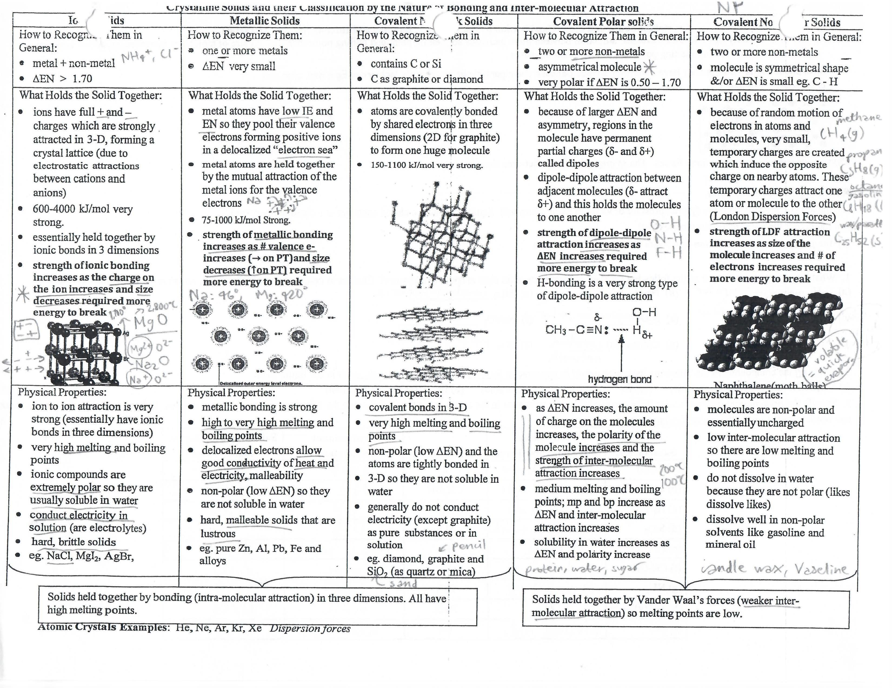

### Electronegativity

- **electronegativity ($EN$):** relative ability of an atom to attract shared electrons in a bond
	- highest: F &mdash; $EN = 4.0$
	- lowest: Fr &mdash; $EN = 0.7$
- decreases down a group
- increases across a period
- **electronegativity difference ($\Delta EN$):** the difference in electronegativities of two bonded atoms

#### Electron Sharing and Electronegativity

- ***Mostly Ionic:*** $1.7 \le \Delta EN \le 3.3$
	- Behaviour like ionic compounds
	- Electrons spend majority of time with its own atom
	- Minimal electron sharing
- ***Polar Covalent:*** $0.4 < \Delta EN < 1.7$
	- I usually use: $0.5 \le \Delta EN < 1.7$
	- molecular behaviour
	- more electronegative element attracts more electrons
		- *slightly negatively charged:* $\delta-$
		- electrons spend more time here
	- the other element is:
		- *slightly positively charged:* $\delta+$
	- $\delta$ = partial charge
- ***Mostly Covalent / Non-Polar Covalent:*** $0.0 \le \Delta EN \le 0.4$
	- no significant sep. of charge
	- electrons spend majority of time between atoms
	- equal sharing

***Density of Electrons:***

|Non-polar|Polar|Mostly Ionic|
|-|-|-|
||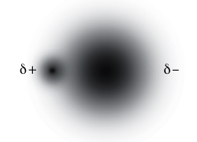|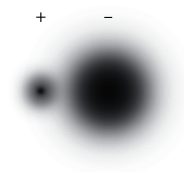|

***Electronegativity and Polarity Chart:***

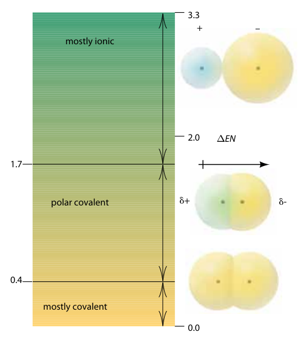

### Metallic Bonding

- Metals have low ENs
- Valence shells that are less than half-filled
- Electrons of metals are weakly attracted
- Electrons free to move around
- **delocalized:** valence electrons that are not associated w/ a specific atom but move among many metal ions
- **electron-sea model:** model of metallic bonding that says valence electrons of metal atoms move freely among ions, ...
	- ... which forms a "sea" of delocalized electrons holding metal ions in place
	- more valence elec. / atom &rarr; more strength

*Electron-sea visual:*

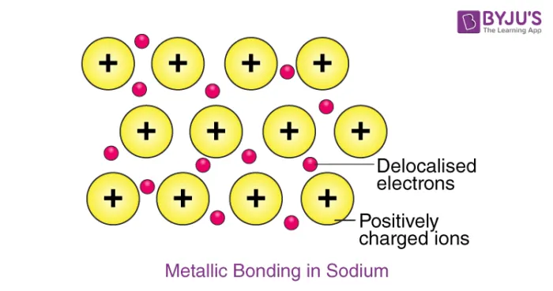

#### Structure of Metals

- most atoms form a uniform crystalline pattern in the microscopic level
- metals made of millions of tiny crystals called **grains**
- atoms of grains form precise, regularly repeating patterns
- atoms at boundaries between grains arranged randomly

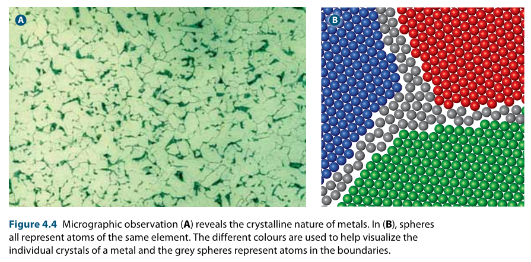

### Properties of Metals

#### Melting and Boiling Points

- **melting point:** temp. where a substance starts to melt
- **boiling point:** temp. where a substance starts to boil
- particles cannot have enough kinetic energy to pull away from adjacent particles
- high melting and boiling points
	- large kinetic energy needed to pull particles apart

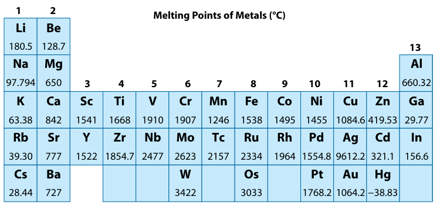

- Group 1: Decreasing MPs down a group
	- as you go down a group, atoms have one more electron shell
	- valence electrons go further from nucleus
	- lower strength of attractive forces
- Groups 1-6: Increasing MPs across a period
	- no. of valence electrons increases across period
	- ions have larger positive charge
	- stronger attractive force
	- do not continue past group 6, since electronic structure becomes more complex from $d$ orbital filling
- Group 12: Decreasing MPs down a group
	- $d$ shells in group 12 filled
	- electrons cannot freely move away from atom
	- fewer electrons in "electron sea"

#### Electrical and Thermal Conductivity

- **conductivity:** the ability to allow heat *or* electricity to flow easily
- **Good conductors of electricity**
	- valence electrons free to move from one atom to another
	- potential difference applied to ends
		- electrons drawn toward pos. end
		- repelled from neg. end
- **Good conductors of heat**
	- freely moving electrons receive kinetic energy from heat
	- pass it along readily to other electrons

#### Malleability and Ductility

- **malleability:** ability of metals to be hammered and shaped without breaking
- **ductility:** ability to be drawn into fine wires without breaking
- some metals must be heated to be malleable or ductile
- ***Gold*** &mdash; most malleable and ductile
	- 1 g of gold = size of small ball bearing
	- *malleability:* 1 g of gold can be hammered into sheet w/ area 1.0 m2 and thickness of 230 atoms
	- *ductile:* 1 g of gold can be drawn into wire 20 &mu;m thick and 165 m long
- Ions in metals can slide past each other because it makes little change to the "electron sea"

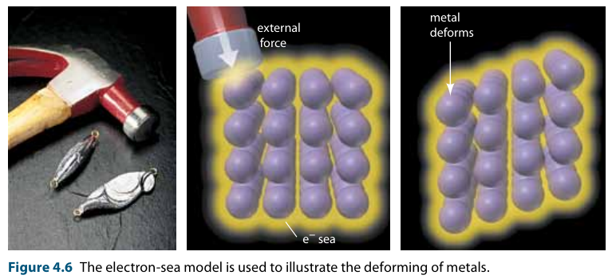

#### Hardness

- **hardness:** ability to resist scratching, denting, or bending
- diff. metals have diff. hardness (affected by # of elec. in the "sea")
- boundaries of grains resist sliding because atoms not aligned in layers that slide smoothly
	- metal w/ more crystals harder
	- than metal w/ larger grain size
- greater hardness &rarr; greater brittleness
	- hard metal atoms in boundaries of grains not held as tightly
	- cracks can form around grains
- ***Hardening Metals***
	- heat metal to temp. where it just becomes to be soft
	- cool metal very quickly
	- causes crystals to melt (lose uniform array)
	- rapid cooling prevents atoms from realigning and reforming crystals
- ***Softening Metals***
	- **tempering:** process where metal is softened but made less brittle
	- metal heated to temp. lower than temp. used for hardening
	- metal doesn't start to melt
	- metal atoms have enough energy to settle into uniform arrangement
	- metal than cooled very slowly to allow crystals to grow and remain intact

### Alloys

- **alloy:** solid mixture of 2+ diff. types of metal atoms
	- in some cases, non-metals like carbon can also be mixed to form alloy
- addition of another metal in small amounts can significantly change physical props.
- **substitutional alloy:** atoms of the second metal take places of atoms in pure metal
	- occurs when metal atoms similar in size
- **interstitial alloy:** atoms of second metal fit into spaces between larger atoms
	- occurs when 2nd metal's atoms much smaller than first

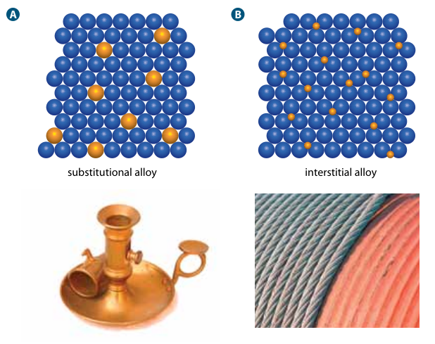

### Ionic Bonding

#### Visual Representation

**Formation of lithium fluoride**

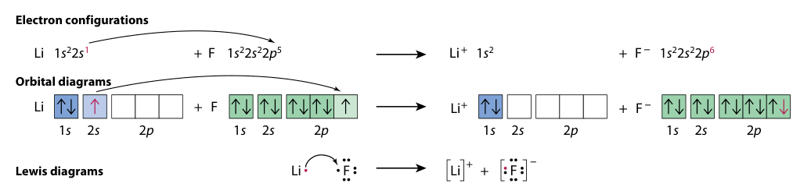

**Formation of sodium oxide**

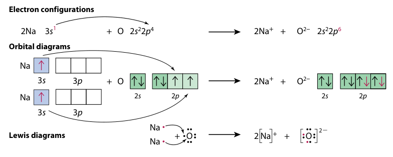

#### Crystal Lattice and Formula Units

- Electron transfer between metal (or polyatomic cation) and non-metal (or polyatomic anion)
- Attractive forces between positive and negative charges of ions
- Ions pack tightly into an alternating 3D pattern
- **crystal lattice:** 3D pattern of alternating positive and negative ions
	- each cation (i.e. sodium ion) adjacent to several anions (i.e. chloride) and vice versa
- **formula unit:** the smallest ratio of ions in a crystal
	- derived from the formula
	- i.e. $\ce{NaCl(s)}$ &rarr; ratio of Na:Cl = 1:1

*Crystal Lattice of Sodium Chloride*

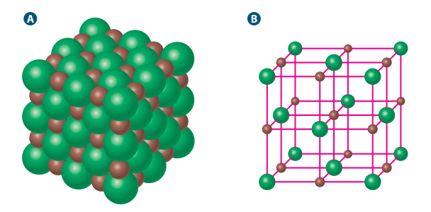

Green = chloride | brown = sodium | pink sticks = attractive forces

#### Ionic Crystals

- shape of macroscopic crystals influenced by way individual ions pack together
- ions pack together so that oppositely charged ions are close together as possible
- slow formation of crystals creates very uniform patterns (gives crystals symmetrical shape)
- **unit cell:** smallest group of ions in a crystal where the pattern is repeated over and over
- ***Factors Affecting Packing*** 
	- relative size of ions
	- relative charge

*Unit cell of sodium chloride*

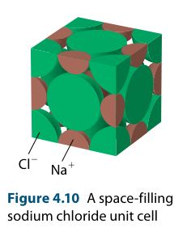

Sodium ion is about half the size of chloride

*Unit cell models of cesium chloride*

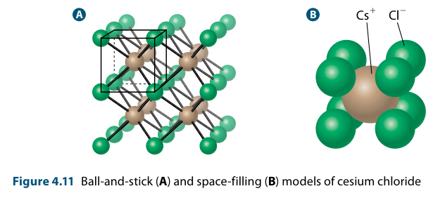

- Cesium ion is more than twice the size of chloride
- causes offset layers (Cs ion adjacent to 8 Cl ions)

*Unit cell model of calcium fluoride*

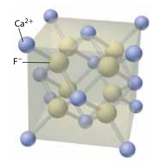

2 fluoride ions / calcium ion

### Properties of Ionic compounds

#### Melting and Boiling Points

**MPs and BPs of Some Common Ionic Compounds**

|Substance|Melting Point (&deg;C)|Boiling Point (&deg;C)|
|-|-|-|
|$\ce{CsBr(s)}$|636|1,300|
|$\ce{NaI(s)}$|661|1,304|
|$\ce{MgCl2(s)}$|714|1,412|
|$\ce{NaCl(s)}$|801|1,465|
|$\ce{MgF2(s)}$|1,263|2,227|
|$\ce{MgO(s)}$|2,825|3,600|

- MgO(s) has much higher MP and BP than some others
	- Mg and O ions packed more closely bcz. they are smaller
	- larger charges (2+) and (2-) = stronger attractive forces
- MP of magnesium fluoride > MP of magnesium chloride
	- same charges
	- F ion is smaller than Cl ion

#### Solubility

- **solubility:** the ability of a substance to dissolve in water
- ***Solubility Rule***
	- Attractive forces between ions and water molecules
	- ... MUST be stronger than attractive forces between ions
	- Insoluble compounds have strong attractive forces
- When soluble ionic compound dissolves
	- Pos. and neg. poles of water molecules attract ions
	- Ions are drawn apart
	- Ionic bonds broken

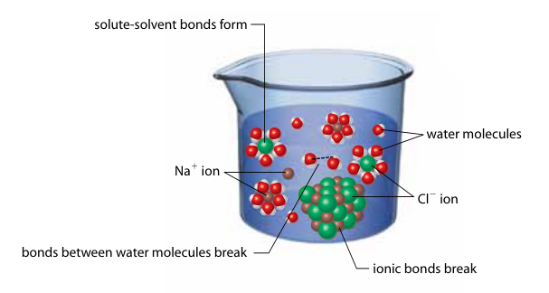

**Solubilities of Some Common Ionic Compounds**

|Substance|Solubility at 25 &deg;C (g/100 mL)|
|-|-|
|$\ce{CsBr(s)}$|123|
|$\ce{NaI(s)}$|184|
|$\ce{MgCl2(s)}$|56.0|
|$\ce{NaCl(s)}$|36.0|
|$\ce{MgF2(s)}$|0.013|
|$\ce{MgO(s)}$|very low|

#### Mechanical Properties

- Ionic compounds are hard and brittle
- External force (i.e. hammer) can cause like charges to align
- Crystal breaks along line of like charge alignment
- Like charges repel

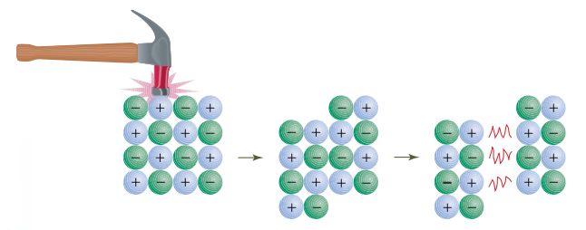

#### Conductivity

- **current:** directional flow of charged particles
- *No current flows through an ionic solid*
	- attractive forces between oppositely charged ions very strong
	- electrical force from electrons cannot pass through compound
- *Current flows in an ionic solution or liquid*
	- ions free to move past one another
	- ions migrates to electrodes

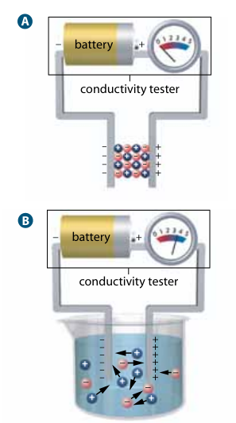

### Covalent Bonding

- **covalent bonding:** bond formed when two atoms share electrons
- **octet rule:** an atom bonds to have 8 electrons in its valence shell
	- many compounds violate this rule

#### Forces in Covalent Bonds

- sep. of positive and negative charges
- electrons and nuclei repel each other
- electrons are attracted to nuclei and vice versa
- distance between nuclei determined by balance of attractive and repulsive electrostatic forces

Forces in hydrogen molecule

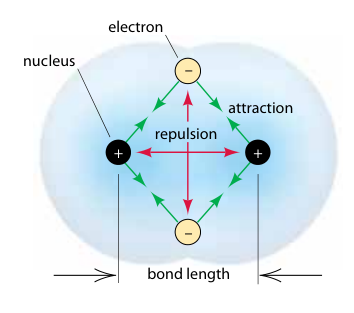

#### Quantum Mechanics and Bonding

- **valence bond (VB) theory:** theory based on the principle that a covalent bond forms when...
	- atomic orbitals of two atoms overlap to share common region in space
	- ... and a pair of electrons occupies overlapping region
- **molecular orbital (MO) theory:** theory saying that overlapping atomic orbitals combine to form new molecular orbitals
- chemists pick VB or MO theory, depending on problem

**3 Guiding Principles of VB Theory**

1. Region of orbital overlap has max. capacity of 2 electrons w/ opposite spins *(Pauli exclusion principle)*
2. There "is" maximum overlap of orbitals. Greater orbital overlap means stronger and more stable bond.
	- Extent of overlap depends on shapes and directions of bonding orbitals
3. Concept of **atomic orbital hybridization** used to explain observed molecular shapes of some molecules
	- Combine / mix orbitals &rarr; form new orbitals

#### Shortcut for Determining Bonds

- single bond: 1 sigma bond
- double bond: 1 sigma bond, 1 pi bond
- triple bond: 1 sigma bond, 2 pi bonds

#### Explaining Single Bonds

- $s$ orbitals overlap and combine
- **sigma bond ($\sigma$):** bond that is symmetrical around bound axis of 2 nuclei
	- the new orbital formed
	- rotating bond around bond axis would not change anything
	- lower energy level than $s$ orbitals in H atoms
	- explains why hydrogen molecules are more stable
	- created from the *head-on* overlapping of 2 orbitals

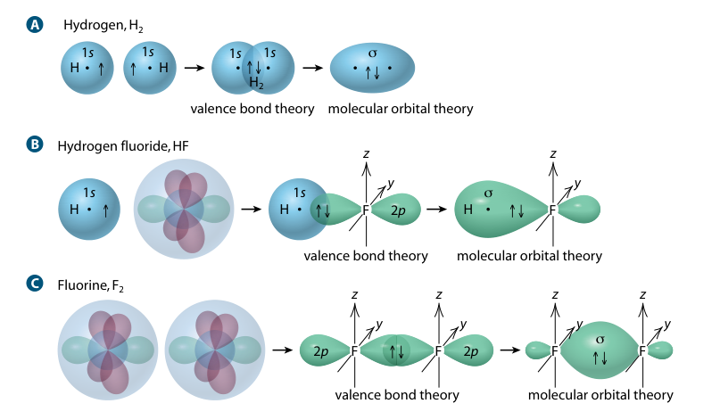

- In HF, half-filled $s$ orbital overlaps w/ half-filled $p$ orbital of fluorine
- $\sigma$ bond symmetrical around line connecting hydrogen and fluorine nuclei

> A single bond consists of 1 sigma ($\sigma$) bond.

#### Hybrid Orbitals

- **hybrid orbital:** orbitals formed by combination of 2+ orbitals in valence shell of atom
- needed when not all single bonds derived directly from *s* and *p* orbitals (i.e. methane)
- carbon: $1s^2 2s^2 p^2$
- How to Form (CH4)
	- carbon has 4 single bonds or 4 $\sigma$ bonds
	- carbon needs 4 orbitals: $sp^3$
	- carbon atom forms 4 hybrid orbitals by combining $2s$ and 3 $2p$ orbitals
- named after the orbitals that make them
	- $sp^3$ orbital for methane (1 &times; $s$ and 3 &times; $p$)

*Lewis structure of methane*

$$
\begin{array}{c}
      \ce{H} \\
       | \\
\ce{H - C - H} \\
       | \\
      \ce{H}
\end{array}
$$

*Hybridization of methane*

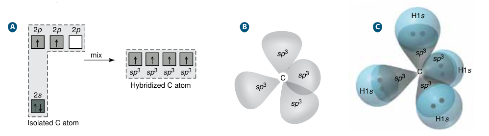

#### Explaining Double Bonds

- Hybrid orbitals explain structure of ethene $\ce{CH2 = CH2}$
	- planar molecule (atoms on same plane)
	- all bond angles ~120&deg;
	- $2s$ orbital mixes w/ 2 $2p$ to form 3 $sp^2$ orbitals
- **partial hybridization:** when not all valence orbitals are used to make hybrid orbitals
	- see figure 4.20 below
- Hybridization of half-ethene
	- each C has 2 single bonds, and one double bond
		- or 3 singles and a leftover
	- each C has 3 $\sigma$ bonds and 1 $\pi$ bond
	- hybrid orbitals needed: $sp^2$ (for each sigma bond)
	- half-ethene form 3 $sp^2$ hybrid orbitals and leaves 1 unhybridized $2p$ orbital for &pi; bond

*Lewis structure of ethene*

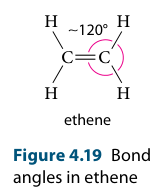

*Orbital structure of half ethene*

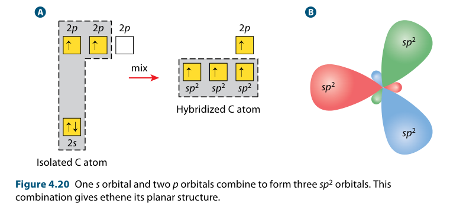

- Double bonds form when
	1. $\sigma$ bonds are formed
	2. $p$ orbitals combine into another orbital, called a $\pi$ bond
- **pi bond ($\pi$):** bond w/ 2 lobes on opposite sides of line joining nuclei of 2 atoms
- ***Bond Formation of Ethene***
	- One of $sp^2$ orbitals of each C atom overlaps to form $\sigma$ bond
	- Remaining $sp^2$ orbitals overlaps w/ $1s$ orbital of hydrogen atom and forms $\sigma$ bonds
	- $2p$ orbitals of C overlap to form a new $\pi$ bond

*Bond formation of ethene*

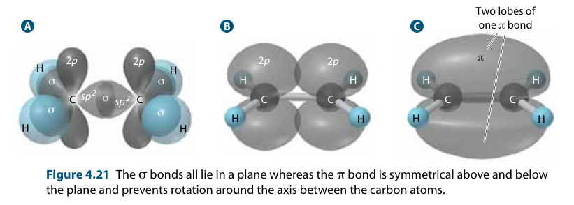

(B) is showing $\sigma$ bonds as bars

> A double bond has 1 $\sigma$ and 1 $\pi$ bond

#### Explaining Triple Bonds (or 2 Double Bonds)

- Molecule being analyzed: ethyne &rarr; $\ce{H - C # C - H}$
	- completely linear
	- hybrid orbitals required to explains tructure
- Hybridization of ethene
	- each carbon has 1 single bond and 1 triple bond
	- each carbon has 2 $\sigma$ bonds and 2 $\pi$ bonds
	- hybrid orbitals needed: $sp$ (for each sigma bond$
	- $2s$ and 1 $2p$ orbital combine to form 2 hybrid $sp$ orbitals
	- remaining $p$ orbitals unchanged

*Orbital hybridization of ethyne*

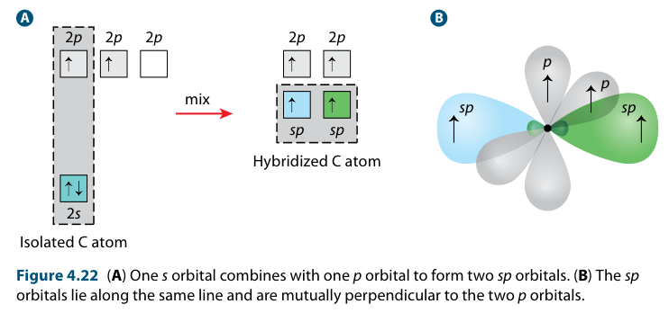

**Formation of ethyne:**

1. One of $sp$ orbitals in each C atom overlaps w/ $1s$ orbital of hydrogen atom
	- Forms $\sigma$ bond
2. Other $sp$ orbitals overlap w/ each other
	- Forms $\sigma$ bond
3. 2 &times $p$ orbitals of each C overlap w/ each other
	- Forms 2 $\pi$ bonds

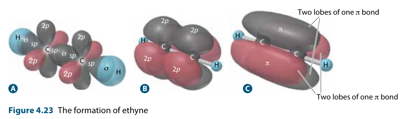

#### Types of Hybridization

- $d$ orbitals hybridize w/ $s$ and $p$ orbitals in period 3 and beyond
- name of hybrid orbitals indicate what orbitals made it
	- i.e. $sp^3d^2$ orbital made of 1 &times; $s$, 3 &times; $p$, 2 &times; $d$

**Types of Hybrid Orbitals:**

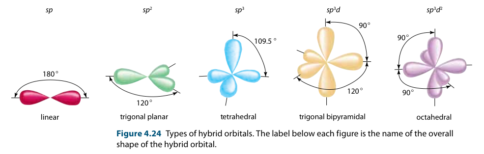

### Allotropes

- **allotropes:** compounds consisting of the same element but having different physical properties
- Carbon is an allotrope

#### Allotropes of Carbon

- **graphite:** slippery, black carbon substance
	- C have 3 short bonds w/ other C atoms
	- Creates layers
	- 4th bond on each carbon not as strong
		- easily broken and reformed
		- gives slippery feel
	- good lubricant
	- good material for pencils (layers slide onto paper)
- **diamond:** hardest substance on Earth
	- each C atom is perfectly tetrahedral
	- C&ndash;C bonds have greatest strength
	- gives diamond its hardness
	- creates many planes of carbon atoms within diamonds reflecting light (src. of sparkle)
- **fullerenes:** spherical allotropes of carbon
	- discovered in 1985 by chemists
		- Robert F. Curl Jr.
		- Richard E. Smalley
		- Sir Harold W. Kroto
	- buckminsterfullerene ($\ce{C60}$) shown
		- named after architect R. Buckminster Fuller
		- he designed geodesic dome structures that looked like fullerenes
		- a.k.a. "buckybulls"
		- bonds form pattern nearly same as stitching on football
		- 2 sing. bonds and 1 double bond / C atom
- **nanotube:** small tubes of carbon used in nanotechnology
	- R&D of devices sized 1-100 nm
	- useful in microelectronics and medicine

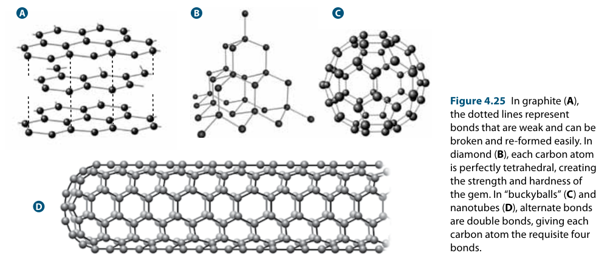

### Covalent Network Solids

- **network solid:** substance in which all atoms are covalently bonded together in a continuous 2D / 3D array
	- w/ no natural beginning or end
- incl. diamond and graphite
- incl. silicon dioxide ($\ce{SiO2(s)}$)
	- does not form double bonds w/ oxygen
	- instead, it bonds to 4 oxygen atoms to form tetrahedral shape around Si atom
	- each O atom then bonded to another Si to form a network
	- *simplest repeating unit:* $\ce{SiO2}$
	- *network description:* $\ce{(SiO2)_n}$
- high melting and boiling points due to strong covalent forces

*Silicon dioxide network*

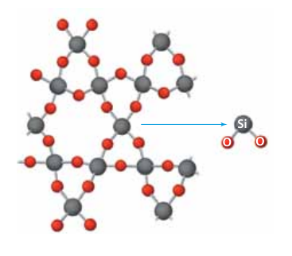

---

## C4.2 - Shapes, IMFs, and Properties of Molecules

### Drawing Lewis Structures

- **Lewis symbol:** a symbol that shows the chemical symbol and the valence electrons of an atom
- **Lewis structure:** a "diagram" that shows the bonds involved of a compound using Lewis symbols

#### Textbook Solution

1. Place the least electronegative atom in the centre of the molecule or polyatomic ion
2. Place the other atoms surrounding the central atom
	1. Carbon is usually always in the center
	2. Fluorine or hydrogen is usually always surrounding
3. Draw a skeleton structure by drawing a single bond between the central and the surrounding atoms
4. Determine total number of valence electrons ($V$)
	1. Subtract the charge from this number, if a polyatomic ion
	2. i.e. Subtract 2 for 2+ charge and add 2 for 2- charge
5. Determine total # of electrons ($T$) needed for each for each electron to achieve a noble gas configuration
	1. 2 electrons for hydrogen
	2. 8 electrons for everything else (*octet rule*)
6. Subtract # of valence electrons ($V$) from electrons needed to satisfy octet rule ($T$)
	1. Represents # of shared electrons in bonding ($S$)
	2. $S = T - V$
7. Divide $S$ by 2 to get number of bonds $B$
	1. $B = S/2$
	2. Double bonds = 2 bonds
	3. Triple bonds = 3 bonds
	4. Add bonds to skeleton structure, and don't excl. the initially added single bonds
8. Get number of non-bonding electrons ($N$) by subtracting # of shared electrons ($S$) from # of valence elec. ($V$)
	1. $N = V - S$
	2. Add these as lone pairs to atoms to achieve noble gas config.
9. Surround the pair with square brackets and a charge in the outer top right, if polyatomic

#### My solution

1. Get sum of all valence $e^-$ from all atoms
   2. If polyatomic, add absolute charge # of $e^-$ if charge is neg., otherwise subtract
3. Arrange elements so that one atom is in the center
   4. Central atoms are atoms w/ the highest bonding capacity, or the least electronegativity
   5. Carbon is always central
   6. Hydrogen is never central (peripheral)
7. Draw all the normal valence electrons for each atom
8. Create "pairs" between each atom until there is an octet
9. Move lone electrons or pairs if necessary to maintain an octet
10. *If molecule is polyatomic, add electrons or cut out electrons until there is an octet*
11. Draw the final Lewis structure with each bond as a line
12. *Draw square brackets around the the molecule if polyatomic; write charge*
13. Verify that # of total valence $e^-$ equals the original count

*Above requires practice*

Example for $\text{CHCl}_3$

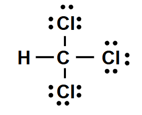

#### Sample Problem

Lewis structure for nitrogen fluoride, $\ce{NF3}$

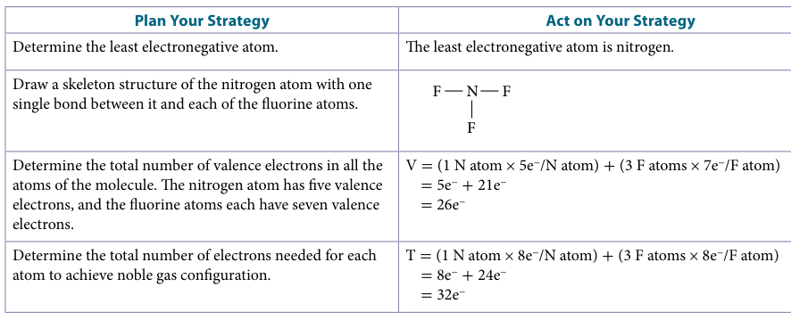

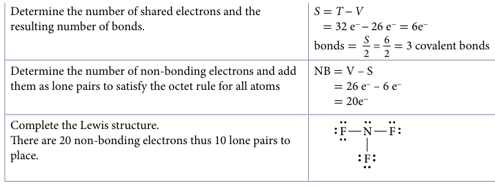

### Exceptions when Drawing Lewis Structures

#### Co-ordinate Covalent Bonds

- **co-ordinate covalent bond:** covalent bond in which one atom contributes both electrons to shared pair of electrons
- i.e. ammonium ($\ce{NH4+}$)
- behaves same way as single covalent bond after formation
	- not indicated in Lewis structure
- ***Explanation of Ammonium Bonding***
	- Config for N: $\text{[Ne]}2s^2 2p^3$
	- Each N atom has only 3 unpaired $2p$ electrons
	- One of the ammonium bonds have came from a filled orbital
		- $\therefore$ one of the bonds is co-ordinate

*Lewis structure for ammonium*

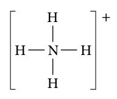

#### Expanded Octet

- Atoms of period 2 obey octet rule since $n = 2$ has max. of 1 $s$ and 3 $p$ orbitals = 8 valence electrons
- Atoms of period 3 up can form hybrid orbitals w/ $d$ orbitals
- **expanded valence / octet:** a valence energy level of a central atom w/ more than 8 electrons
	- i.e. sulfur hexafluoride, $\ce{SF6(g)}$
	- sulfur here forms 6 $sp^3d^2$ hybrid orbitals
	- each occupied by 1 of 6 valence electrons
	- each hybrid orbitals forms bond w/ half filled $p$ orbital of fluorine atom

*Lewis structure for sulfur hexafluoride*

#### Incomplete Octet

- Boron metalloid (B) and beryllium metal (Be) can form covalent bonds w/ halogens
- B only has 3 ve, Be only has 2 ve
- When they form bonds
	- In boron trifluoride, $\ce{BF3}$ &mdash; B has 6 ve
	- In beryllium chloride, $\ce{BeCl2}$ &mdash; Be has 4 ve
- **incomplete valence / octet:** an atom whose valence shell doesn't reach an octet after bonding

#### Resonance Structures

- some valid Lewis structures of molecules are not supported by experimental observations
- i.e. ozone, $\ce{O3(g)}$

*Acceptable Lewis structure for ozone:*

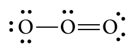

- experimental measurements of bond lengths show that bonds between oxygen atoms are identical
- ozone bonds have props. between a single and double bond

*More accurate depiction of ozone / resonance structure:*

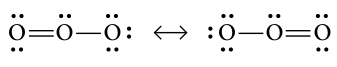

- **resonance structure:** one of two or more structures that differ only in the position of their bonding and lone pairs
	- double arrow indicates the actual structure is somewhere in between
- **resonance hybrid:** a molecule that is a combination of its resonance structures
- for ozone,
	- electrons forming $\pi$ bonds are delocalized
	- shared by all 3 oxygen atoms
- many more molecules or polyatomics can be repr. using resonance structures

*Resonance structures of carbonate:*

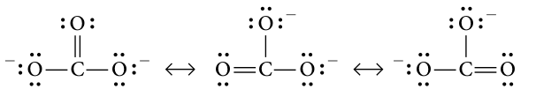

### Predicting Shapes of Molecules Using VSEPR Theory

- 3D shape of molecule affects physical and chem. props.
	- factors: bond lengths and angles
- *VSEPR History*
	- first developed in mid 1950s by English chemist Ronald Gillespie and Australian chemist Ronald Nyholm
	- they were colleagues at University College London
	- 1958: Dr. Gillespie begins long and highly successful career as professor in Chemistry Dept. at McMaster
- **bond angle:** angle formed between the nuclei of two atoms that surround the central atom of a molecule
- **valence-shell electron-pair repulsion (VSEPR) theory:** theory that proposes 3D arrangements of electron groups around a central atom
	- based on the idea that electron groups are positioned as far as possible from others to minimize repulsions
	- used to predict molecular shapes
	- 5 basic electron-group arrangements

#### Electron Groups and Molecular Shapes

- **electron-group arrangement:** ways in which groups of valence electrons are positioned around a specific atom
	- each bond or each lone pair is an ***electron group***
- **molecular shape:** relative positions of atomic nuclei in an entire molecule
- **molecule class:** a shorthand notation to describe the electron-group arrangement of the molecule
	- A represents central atom
	- X represents bonds from surrounding atoms
	- E represents lone pairs
	- subscript represents the number of electron groups

**Base Electron Arrangements (no lone pair):**

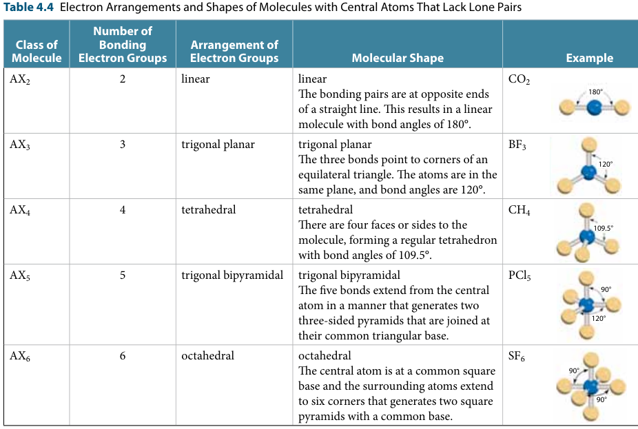

- linear, 2 bonds: $\ce{AX2}$
- trigonal planar, 3 bonds: $\ce{AX3}$
- tetrahedral, 4 bonds: $\ce{AX4}$
- trigonal bipyramidal, 5 bonds: $\ce{AX5}$
- octahedral, 6 bonds: $\ce{AX6}$

**What if there are lone pairs?**

- molecular shape is not given same name as electron group arrangement
- 3 types of repulsive forces
	- between bonding pairs (BP&ndash;BP)
	- between lone pairs (LP&ndash;LP)
	- between bonding and lone pair (BP&ndash;LP)

Repulsive forces (according to VSEPR) decrease in this order

$$
\ce{LP-LP > LP-BP > BP-BP}
$$

*Tetrahedral Electron Groups:*

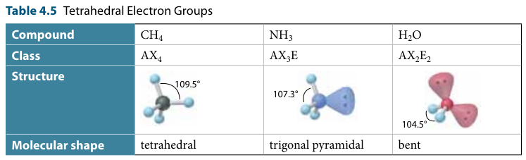

#### Summarizing Molecular Shapes

Key: A = central atom (red ball), X = surrounding atom (black ball), E = lone pair

**Linear Arrangement:**

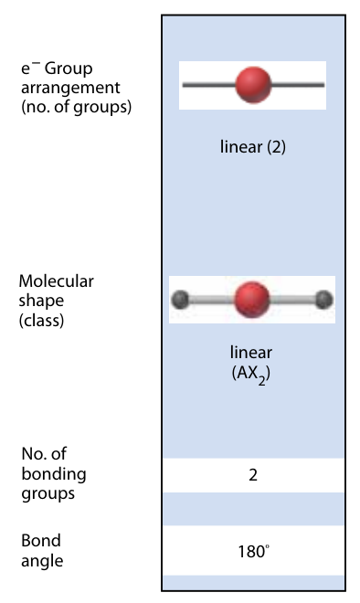

**Trigonal Planar Arrangement:**

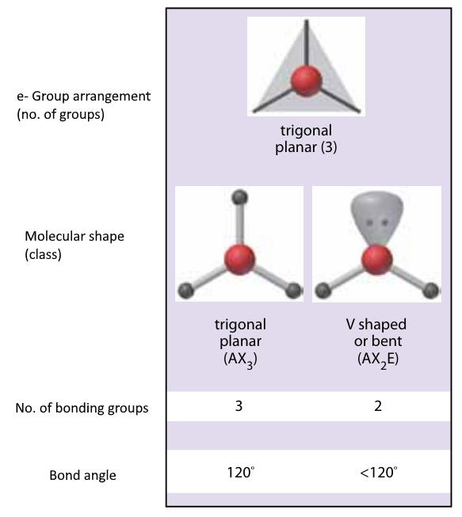

**Tetrahedral Arrangement:**

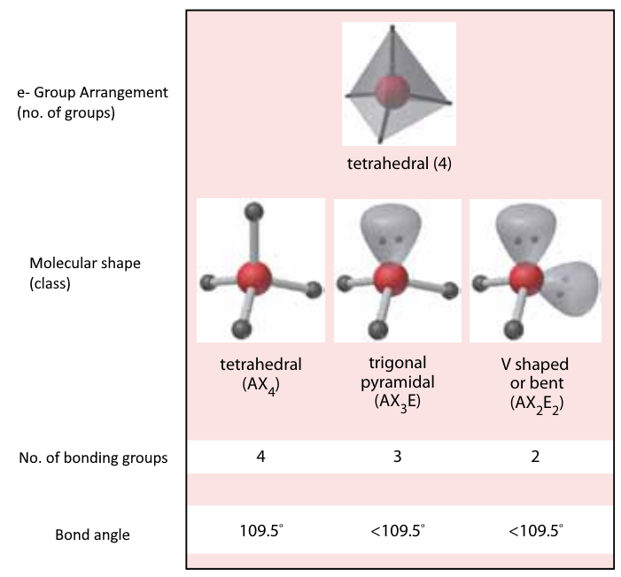

**Trigonal Bipyramidal Arrangement:**

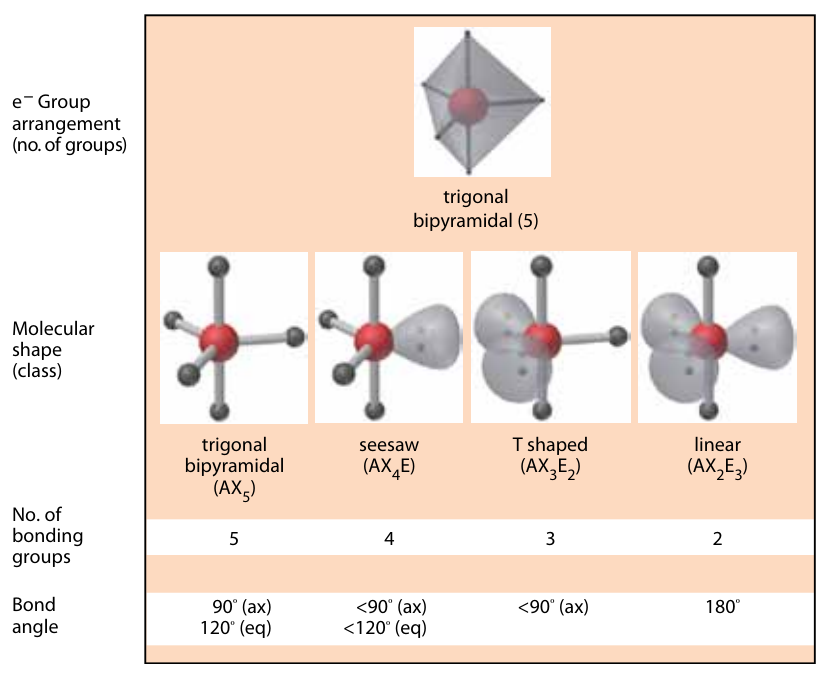

**Octahedral Arrangement:**

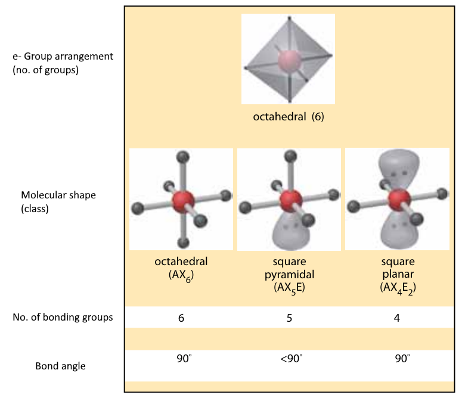

### VSEPR Guidelines for Prediciting Molecular Shape

1. Draw Lewis structure of molecule
2. Consider only the electron pairs on the central atom
3. Count the total number of electron groups around central atom (bonding + lone pairs)
	1. Double bond or triple bond = 1 group
4. Predict shape of molecule based on positions occupied by electron groups and lone pairs
	1. (see VSEPR chart above)
5. In predicting bond angles
	1. a lone pair repels another lone pair or a bonding pair more strongly than...
	2. a bonding pair repels another bonding pair
	3. refer to the chart to predict bond angles, there is no easy way

#### Sample Problem

Predict shape of $\ce{PF3}$

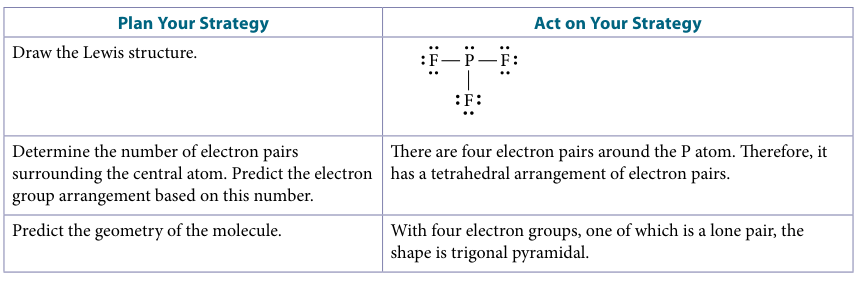

### Determining Hybridization of Central Atom in Molecules / Ions

#### Guidelines

*Textbook's solution will not work on a test*

1. Draw Lewis structure of molecule / polyatomic ion
2. Count the number of electron groups ($G$)
3. The hybridization is $sp^{G-1}$, if $2\le G\le 4$
4. If $G$ goes beyond 4, the hybridization is $sp^3d^{G-4}$
	1. $p$ maxes out at 3
	2. You are continuing the pattern by adding $d$ orbitals
5. The # of hybrid orbitals = $G$

#### Hybridization Table

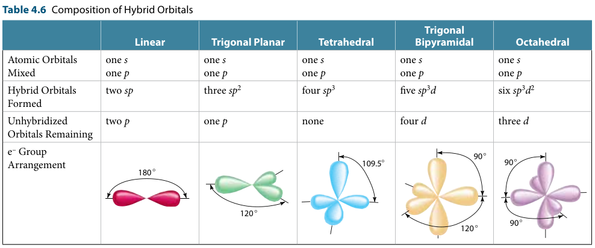

#### Example

1. In sample problem of $\ce{PF3}$, Lewis structure shows 4 electron groups
2. Since there are 4 electron groups, $p$ is one less than 4
3. $\therefore$ Hybridization is $sp^3$

### Molecular Shapes and Polarity

#### Bond Dipoles

- In HF(g), fluorine pulls electrons more strongly than hydrogen
	- creates a *bond dipole* between H-F
 - **bond dipole:** polarity in a bond
	 - vector drawn over Lewis bond to show direction of dipole
	 - vector points towards more electronegative atom

*Bond dipole of H-F*

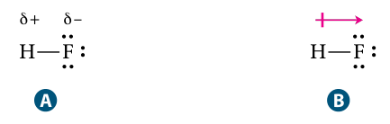

#### Determining Molecular Polarity

- Polarity of molecule can be determined by adding bond dipole vectors
	- bond dipoles represented by $F_n$
	- (where $n$ is a number used to differentiate different bond dipole vectors)
	- the sum is repr. using $F_\text{total}$
- If vectors cancel out, molecular is non-polar
- Otherwise, the molecular is polar
	- The direction indicates where the molecular is more neg. charged

*Determining polarity of water and carbon dioxide*

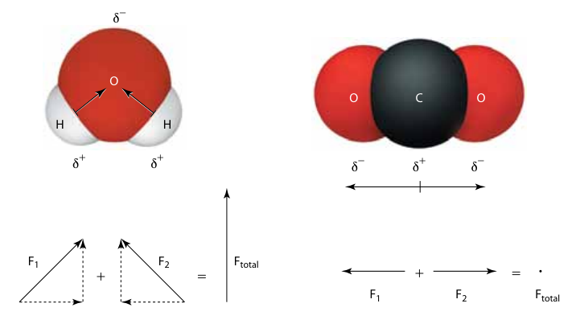

- Typically a polarity cancel out occurs when the shape is symmetrical
- And the surrounding bonds have the same $\Delta EN$s

*i.e. Polarity of $\ce{CCl4}$ and $\ce{CHCl3}$*

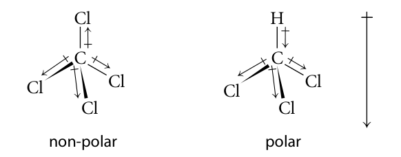

#### Summary of Polarities

*Y* represents a surrounding atom that is different from *X*

All other sym. remain the same

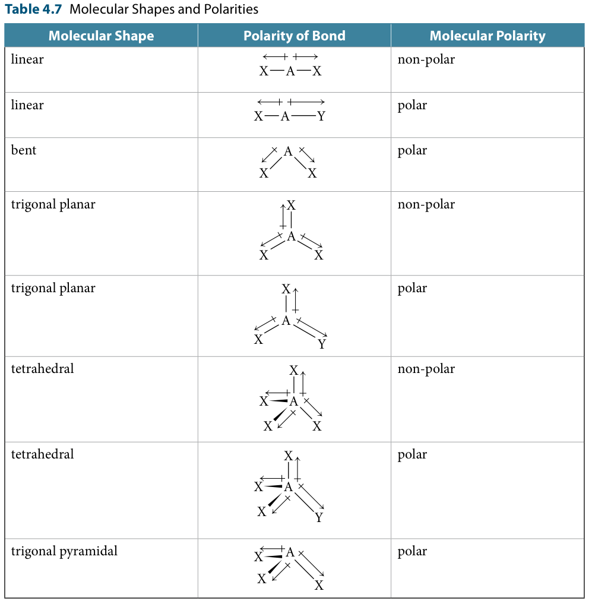

### Intramolecular and Intermolecular Forces

- **intramolecular force:** forces that are exerted within a molecule or polyatomic ion
	- influence chem. properties
	- force that holds atoms / ions together
	- in metals, a force between metal cations and free electrons
	- forms the basis of chemical bonding
	- *chemical changes* overcomes these forces to form new substances
- **intermolecular force (IMF):** forces exerted between molecules or ions
	- influence physical properties
- **van der Waals forces:** a collective group of forces involving dipole-dipole, dipole-induced dipole, and dispersion forces
	- named after Dutch physicist Johannes van der Waals (1837-1923)

*Physical properties of some molecular compounds*

|Compound|Molar Mass (g)|Melting Point (&deg;C)|Boiling Point (&deg;C)|
|-|-|-|-|
|water|18.0|0|100|
|ammonia|17.0|-77.7|-33.3|
|methane|16.0|-182.5|-161.6|

### Dipole-Dipole

- **permanent dipole:** region of partial charges that always exist in a polar molecule
	- polar molecules have region w/ partial neg. charge
	- and another region w/ partial pos. charge
- **dipole-dipole force (DDF):** an IMF between opposite partial charges of polar molecules
	- the partial charges attract the molecules to each other

*Dipole-dipole force diagram*

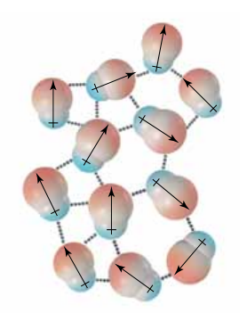

Molecules orient themselves so that $\delta+$ side faces $\delta-$ side

#### Hydrogen Bonding

- **hydrogen bonding (HB):** strong dipole-dipole force between molecules w/ H-F, H-O, or H-N bonds
- electronegative atoms pull electrons away from hydrogen most of time
- leaves hydrogen nuclei nearly bare, making pos. partial charge ($\delta+$) of hydrogen very strong
- lone pairs of electronegative atom increase neg. partial charge ($\delta-$)

*Hydrogen bonding of water*

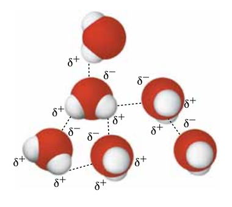

- HBs are ~5% as strong as 1 covalent bond
- explains physical properties of similar atoms
	- water ($\ce{H2O}$) has higher MP and BP than ammonia ($\ce{NH3}$)
	- bcz. O is more electronegative than N
	- O-H is more polar than N-H
- single oxygen of water can be HB'd up to 6 H atoms of diff. water molecules
- ***Solid Water***
	- each water molecule HB'd to 4 other waters
	- HBs are longer (waters further apart) in ice than in liquid water
		> *This is why ice is less dense than water*
	- HBs are stronger because of orientation of atoms and bonds
	- HBs are strongest when they are oriented as shown in (B) below

*Hydrogen bonding in ice*

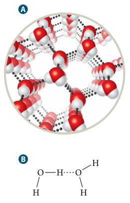

### Ion-Dipole

- **ion-dipole force:** IMF between partial charges of polar molecules and ions
	- between polar mcl. and {cation / anion}
- strength of this IMF depends on...
	- charge and size of ion
	- magnitude of dipole
	- size of molecule
- cations attract dipoles more strongly
	- bcz. charges are more concentrated
	- cations smaller than anions

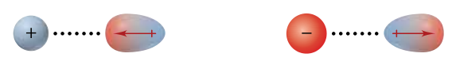

- **hydration** involves ion / molecule being surrounded by water molecules
	- the process responsible for dissolving
	- water molecules arranged in specific manner
- happens when ion-dipole forces overcomes ionic forces

*Hydration of sodium chloride*

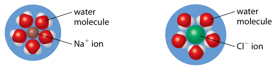

### Induced Dipoles

- possible to induce dipole in non-polar molecule
- electrons are constantly moving very fast
	- for brief instant, electrons can be distributed so that one point is $\delta+$ and another point is $\delta-$
	- a charge can distort the electron distribution by attracting or repelling electrons 
- **dipole-induced dipole forces:** IMF caused by inducing a dipole on a non-polar molecule w/ a permanent dipole
	- charges are then attracted to each other
- **ion-induced dipole force:** IMF caused by inducing a dipole on a non-polar molecule w/ an ion

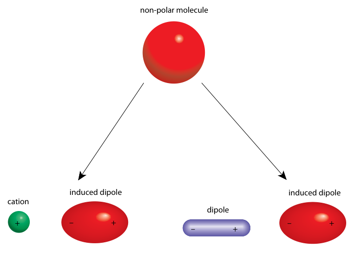

### London Dispersion Forces

explains the physical properties of non-polar substances like the halogens

*Physical properties of the halogens*

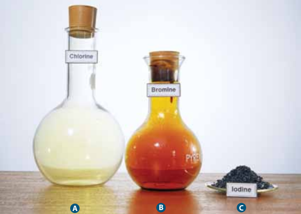

- **London dispersion force (LDF):** weak IMF between all molecules, incl. non-polar molecules due to temporary dipoles
	- named after German physicist Fritz London (1900-1954), who explained force mathematically 
- non-polar molecules spontaneously form ***temporary dipoles***
	- shared pair of electrons in covalent bonds are in constant motion
	- motion causes momentary uneven distributions of charge
	- this *temporary dipole* induces a temporary dipole in the molecule beside it
	- can continue throughout the group of molecules
- ***Factors affecting strength of LDFs***
	- Size and Mass
		- attraction becomes larger when mass (influenced by protons) in molecules becomes larger
		- reason: increased # of electrons as well
		- probability of temp. dipole increases
	- Shape of Molecule
		- attraction is larger in more linear molecules
		- greater area of contact in linear molecules

*Shapes of molecules affect the LDFs*

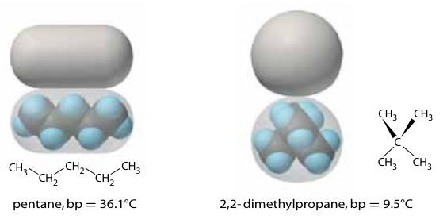

Pentane has stronger LDFs than dimethylpropane