# C5 - Energy Changes

## C5.1 - Nature of Energy and Heat

### Foundational Concepts for Thermochemistry

- **thermochemistry:** study of energy changes involved in chemical and physical processes
- **kinetic energy:** energy causing motion
- **potential energy:** stored energy an object has as a result of its condition
	- i.e. chemical potential energy from the nature of particles in relation w/ one another
	- SI unit, derived: joule (J) = kg &middot; m2/s2
	- energy involving chemical reactions uses kilojoules (kJ), since joule is too small

#### System and Surroundings

- **system:** any sample under observation
	- *surroundings:* anything that is not part of the system
	- universe = system + surroundings
- *Types of Systems*
	- **open system:** a system that can exchange both matter and energy with the surroundings
	- **closed system:** a system that cannot exchange matter, but can exchange energy with the surroundings
	- **isolated system:** a system that cannot exchange matter or energy with the surroundings
		- difficult to completely isolate a system
		- some scientists say there is no isolated system, except the universe itself

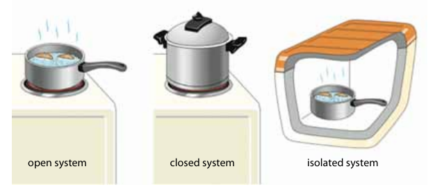

#### Measurable and Calculated Variables of a System

- **thermal energy:** sum of all kinetic energies of all the particles of a sample of matter
	- cannot be measured directly
- **temperature ($T$):** measure of the average kinetic energy of all the particles of a sample of matter
	- can be measured
	- SI unit: kelvin (K)
	- common unit, usable in science: (&deg;C)
- **specific heat capacity ($c$):** the amount of energy needed to increase the temperature of 1 g of a substance by 1 &deg;C / 1 K

*Specific Heat Capacities of Some Common Substances:*

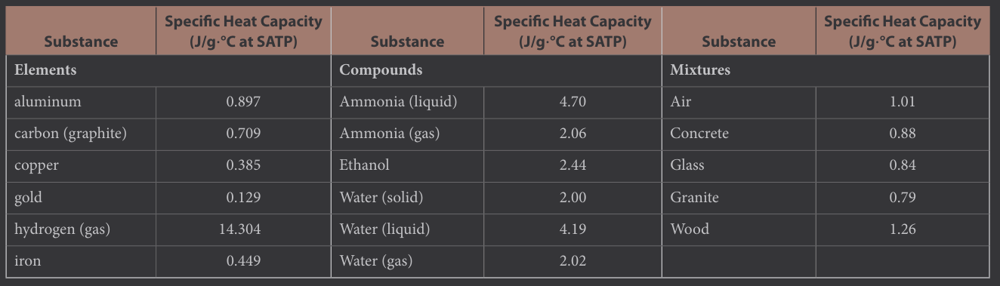

#### Calculating Heat Entering / Leaving a System

- change in temp: $\Delta T = T_f - T_i$
	- f = final, i = initial
	- $\Delta T$ is (+), heat entered system
	- $\Delta T$ is (-), heat left the system
- $Q$ &mdash; amount of heat that left or entered the system (J)

*The equation:*

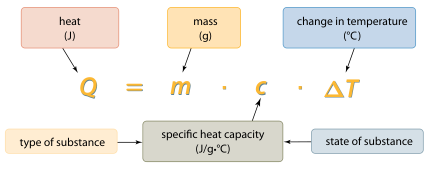

#### Sample Problem: Calc. Absorption of Heat

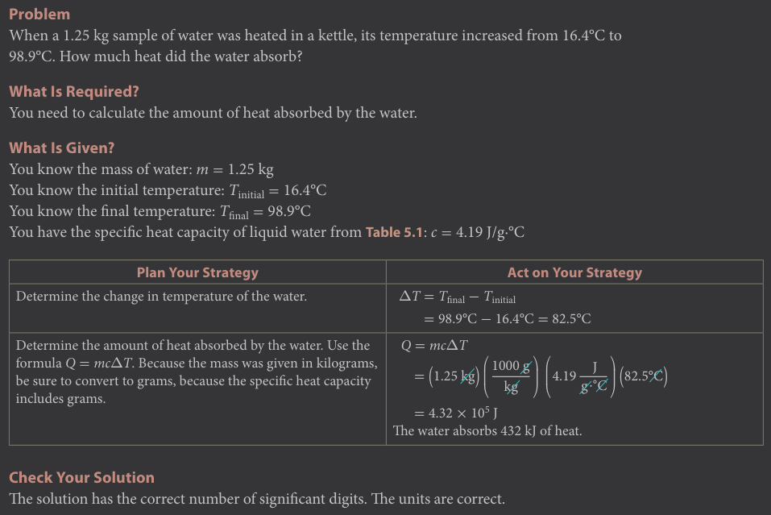

### First Law of Thermodynamics: Energy is Conserved

- system absorbs energy, surroundings release it, and vice versa
- energy going from one system to another is often transformed
	- i.e. car's gasoline's chem. potential energy &rarr; car's kinetic energy
- **first law of thermodynamics:** law stating that the energy of the universe is constant...
	- energy cannot be created or destroyed, can only change form

*First law of thermodynamics in many equations, marked as (\*):*

$$
\begin{gather*}
E_\text{universe} = \text{constant} \tag{*} \\
\Delta E_\text{universe} = 0 \tag{*} \\ \\
\text{universe} = \text{system} + \text{surroundings} \\
E_\text{universe} = E_\text{system} + E_\text{surroundings} \\
\Delta E_\text{universe} = \Delta E_\text{system} + \Delta E_\text{surroundings} = 0 \tag{*} \\ \\
\therefore \Delta E_\text{system} = -\Delta E_\text{surroundings} \tag{*, main}
\end{gather*}
$$

#### Enthalpy, $H$

- **enthalpy ($H$):** total energy of a system, plus pressure times volume
	- a.k.a. *heat content* of system
	- $H = E + PV$
- not possible to measure enthalpy, but possible to measure change in enthalpy
- *change in enthalpy* &mdash; $\Delta H$

Enthalpy change of system depends on initial state (condition) and final state

$$
\Delta H = \Delta E = \Delta(PV)
$$

- for reactions of solids and liquids, it is assumed there is no change in pressure or volume
	- work done by reaction on surroundings is zero
	- $\therefore \Delta H = \Delta E = Q$
- enthalpy change at one pressure is diff. from change at another pressure
	- SATP (std. atmospheric temp. and pressure) typically used in thermochemical experiments
	- easy to achieve and specific heat capacities reported at SATP
- **endothermic:** heat enters the system during a process
- **exothermic:** heat leaves the system during a process

### Second Law of Thermodynamics

- **second law of thermodynamics:** when two objects in contact, heat is always transferred from object w/ higher temp. to object w/ lower temp. until both objects have same temp.
- result: no process is 100% efficient
- when 2 objects in contact
	- high-energy (hot) particles can collide with other object's low-energy (cold) particles
	- with each collision, particles transfers some of its energy to the other particle
	- keeps happening until particle energies are balanced
- **thermal equilibrium:** when both objects in contact have the same temperature

*Illustration of 2nd law of thermodynamics*

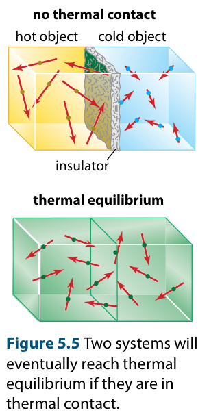

### Comparing Categories of Enthalpy Changes

#### Physical Changes

- **physical change:** change that doesn't alter a substance's chemical properties
- Physical Changes w/ Significant Enthalpy Effects
	- dissolving of a substance
	- phase change

##### Enthalpy of Solution

*Steps required for solute to dissolve in solvent:*

1. Bonds between molecules / ions of solute must be broken to make room for solvent molecules
2. Bonds between solvent molecules must be broken to make room for solute molecules
3. Bonds must form between solvent molecules and solute molecules/ions
4. Enthalpy change associated w/ each step

*Enthalpy of Solution:*

- **enthalpy of solution ($\Delta H_\text{solution}$):** sum of enthalpy changes associated w/ solute dissolving in solvent
	- $\Delta H_\text{solution} = \Delta H_\text{solvent} + \Delta H_\text{solute} - \Delta H_\text{mix}$
	- energy required to break bonds
	- energy released when bonds form (mixing)
- endothermic if $\Delta H_\text{solution}$ is positive, otherwise exothermic

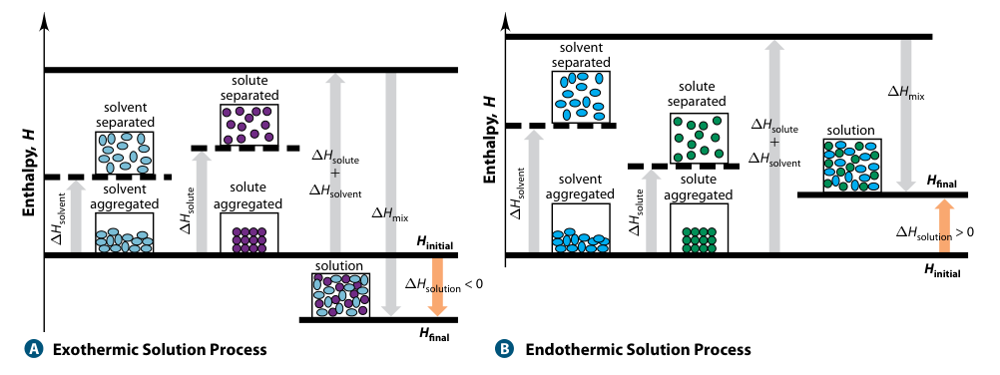

##### Enthalpy of Phase Changes

- **phase:** any distinct, homogeneous part of a system
	- i.e. physical state (solid, liquid, gas, plasma)
- significant amount of heat needed to change phase
- &deg =  "naught" (represents SATP)

*4 Phase Changes:*

- **enthalpy of melting ($\Delta H^\circ_\text{melt}$):** energy needed to change solid into liquid
- **enthalpy of vaporization ($\Delta H^\circ_\text{vap}$):** energy needed to change liquid into gas
- **enthalpy of condensation ($\Delta H^\circ_\text{cond}$):** energy released when gas changes into liquid
- **enthalpy of freezing ($\Delta H^\circ_\text{fre}$):** energy released when liquid changes into solid

$$
\begin{gather*}
\Delta H^\circ_\text{melt} = -\Delta H^\circ_\text{fre} \\
\Delta H^\circ_\text{vap} = -\Delta H^\circ_\text{cond}
\end{gather*}
$$

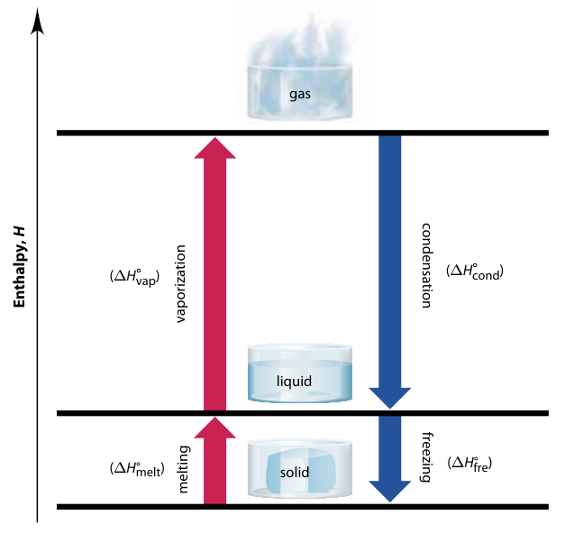

*Terminology Differences*

- heat or latent heat used in some other textbooks
- most advanced chemistry textbooks use $\Delta H^\circ_\text{vap}$ for both vaporization and cond.
	- and $\Delta H^\circ_\text{fus}$ for melting and freezing

##### Heating Curve of Water

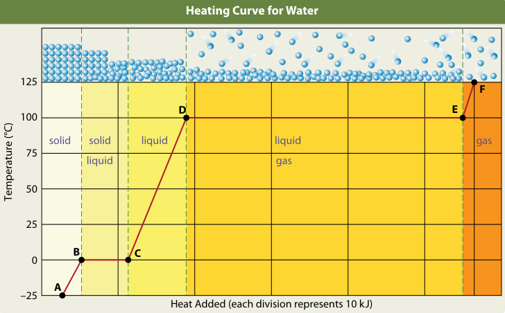

*Shows how much heat must be added to increase 1 mol of water temperature from -25 &deg;C to 125 &deg;C*

- Points A to B: water is solid and absorbing heat to go from -25 &deg;C &rarr; 0 &deg;C
	- $c$ for solid water is diff. from liquid water's $c$
- Points B to C: 6.01 kJ of heat added to 1 mol of water to break intermolecular bonds between water molecules
	- enthalpy of melting
- Points C to D: water temperature increases again from heat added
- Points D to E: 40.7 kJ of heat added to 1 mol of water to vaporize
- Points E to F: heat is added to water until it reaches 125 &deg;C

#### Chemical Changes

- every chemical reaction has associated enthalpy change
- taught more in 5.2 and 5.3

*Example:*

Decomposition of hydrogen peroxide

- $\ce{2H2O2(l) -> 2H2O(l) + O2(g)}$
- enthalpy of reaction for oxygen: $\Delta H_{r,\ce{O2}} = -196.4\text{ kJ/mol }\ce{O2}$

#### Nuclear Changes

Missing mass in nuclear changes converted into energy

$$
E = mc^2
$$

##### Alpha ($\alpha$) Decay

- **alpha decay:** nucleus emits alpha particle (He-2 nucleus)
- -2 protons and -2 neutrons &rarr; -2 Z & -2 A

i.e. alpha decay of radium-223 into radon-219

$$
\ce{^223_88Ra -> ^4_2He + ^219_86Rn + energy}
$$

1 mol of Ra-223 alpha decay releases $5.64\times 10^8\text{ kJ}$ of energy

##### Beta ($\beta$) Decay

- **beta decay:** nucleus emits beta particle (high-speed electron)
- neutron in nucleus becomes proton

i.e. beta decay of cesium-137 into barium-137

$$
\ce{^137_55Cs -> ^0_-1e + ^137_56Ba + energy}
$$

1 mol of Cs-137 beta decay releases $1.13\times 10^8\text{ kJ}$ of energy

##### Nuclear Fission

**nuclear fission:** process where heavier nucleus splits into smaller, lighter nuclei w/ the release of energy

i.e. bombarding uranium-235 w/ neutrons

$$
\ce{^235_92U + ^1_0n -> ^141_56Ba + ^92_36Kr + 3^1_0n + energy}
$$

- sum of product masses is 0.215 u less (3.57 &times; 10-28 kg) less than products
- 1 mol of U-235 fissions = 2.15 &times; 10-4 kg fissions

$$
\begin{align*}
E &= mc^2 \\
&= (2.15\times 10^{-4}\text{ kg})(3.00\times 10^8\text{ m/s})^2 \\
&= 1.93\times 10^{13}\text{ J}
\end{align*}
$$

- Approx. 2 &times; 1010 kJ of energy released when 1 mol of U-235 fissions
- fission produces *radioactive products*

*Nuclear fission of U-235, diagram:*

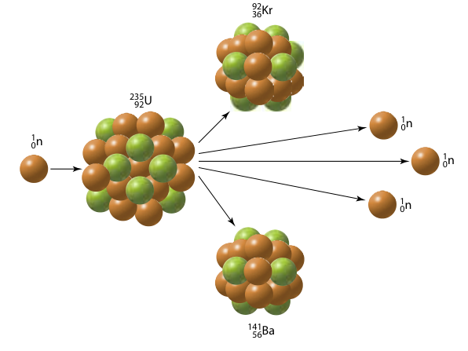

##### Nuclear Fusion

**nuclear fusion:** process where two smaller nuclei combine (fuse) to form a larger nucleus

i.e. in the Sun, deuterium and tritium fuse to form very unstable helium-5, which breaks down into helium-4 and a neutron

$$
\ce{^2_1H + ^3_1H -> ^5_2He -> ^4_2He + ^1_0n}
$$

*Nuclear fusion of deuterium (H-2) and tritium (H-3), diagram:*

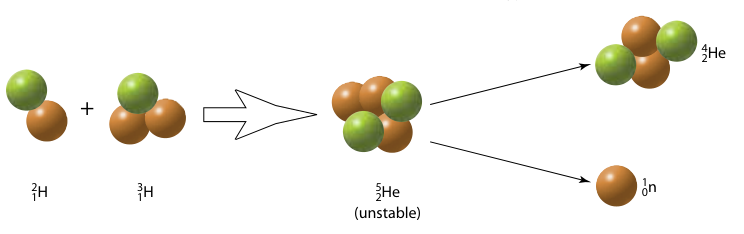

- sum of helium-4 and neutron less than reactants
- when 1 mol of H-2 and H-3 fuse, 1.7 &times; 109 kJ of energy is released
	- ~10x smaller than fission of U-235
	- sum of masses of H-2 and H-3 is 47x smaller than U-235
	- energy released per unit mass greater in fusion than fission
- fusion does not produce radioactive products
- fusion requires collision of two atoms w/ huge amounts of kinetic energy
	- high temp. and pressure in Sun gives enough energy
	- humans cannot currently efficiently cause fusion reactions of H-2 and H-3
		- more energy required for fusion than energy released

#### Comparing Enthalpy Changes

|Type of Change|$\Delta H$ Range (kJ/mol)|
|-|-|
|Physical|&pm;0.44 to &pm;40.7|
|Chemical|&pm;196.4 to &pm;890|
|Nuclear|-113.8 &times;108 to -2 &times; 1010|

---

## C5.2 - Thermochemical Equations and Calorimetry

### Steps of a Chemical Reaction

1. All bonds are broken
	1. Energy required to break bonds
	2. Bond breaking is *endothermic*
2. New bonds are formed
	1. Energy released when bonds are formed
	2. Bond forming is *exothermic*

*Example: Combustion of methane*

$$
\ce{CH4(g) + 2O2(g) -> CO2(g) + 2H2O(l)}
$$

- 890.8 kJ of heat released when 1 mol methane combusts
- 2 mol oxygen used
- products: 1 mol carbon dioxide and 2 mol water

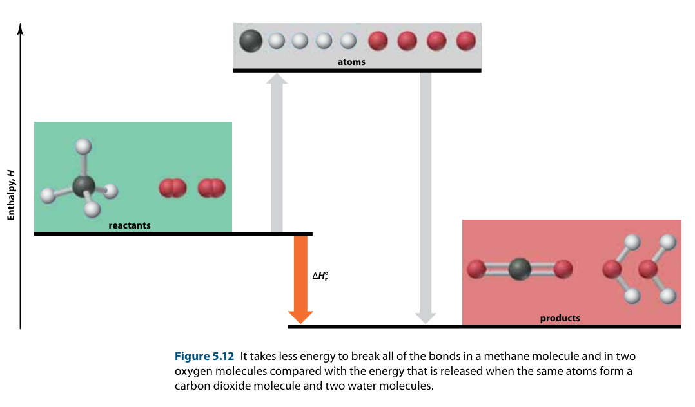

### Thermochemical Equations

Instead of writing "energy", you write the actual energy released (product side) or absorbed (reactant side)

*Energy released*

$$
\ce{CH4(g) + 2O2(g) -> CO2(g) + 2H2O(l) + 890.8 kJ}
$$

*Energy absorbed*

$$
\ce{N2(g) + 2O2(g) + 66.4 kJ -> 2NO2(g)}
$$

coefficients represent moles, adjust it and energy values as needed

#### $\Delta H$ Notation

Above equations can be written as:

$$
\begin{array}{ccl}
\ce{CH4(g) + 2O2(g) -> CO2(g) + 2H2O(l)} && \Delta H_r = -890.8\text{ kJ} \\
\ce{N2(g) + 2O2(g) -> 2NO2(g)} && \Delta H_r = 66.4\text{ kJ}
\end{array}
$$

$\Delta H_r$ or $\Delta H_\text{rxn}$ &rarr; enthalpy of reaction

### Enthalpy Diagrams

- **enthalpy diagram:** diagram that shows the enthalpy change over "time"
	- a.k.a. potential energy diagram
	- y-axis: enthalpy $H$, (kJ)
	- x-axis: time (if needed) / reaction progress
- no zero point (cannot measure absolute enthalpy)
	- only change in enthalpy
- no x-axis
	- enthalpy change only depends on initial and final state

*Enthalpy diagram example*

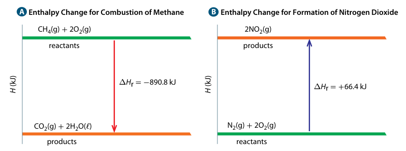

### Molar Enthalpy of Combustion

- $\Delta H_\text{comb}$ &mdash; enthalpy of combustion
- $\Delta H^\circ_\text{comb}$ &mdash; enthalpy of combustion at SATP
	- reaction starts and ends at 25&deg; C and 100 kPa
	- heat produced during reaction
- by definition, the hydrocarbon is 1 mol (fractional coefficients used if necessary)
	- calculation done for 1 mol of hydrocarb.

*Equations for combustion, 1 mol hydrocarbon:*

$$
\begin{gather*}
\ce{CH3OH(l) + $\dfrac 5 2$O2(g) -> CO2(g) + 4H2O(l)} \\
\ce{C4H10(g) + $\dfrac{13} 2$O2(g) -> 4CO2(g) + 5H2O(l)}
\end{gather*}
$$

**Standard Molar Enthalpies of Combustion:**

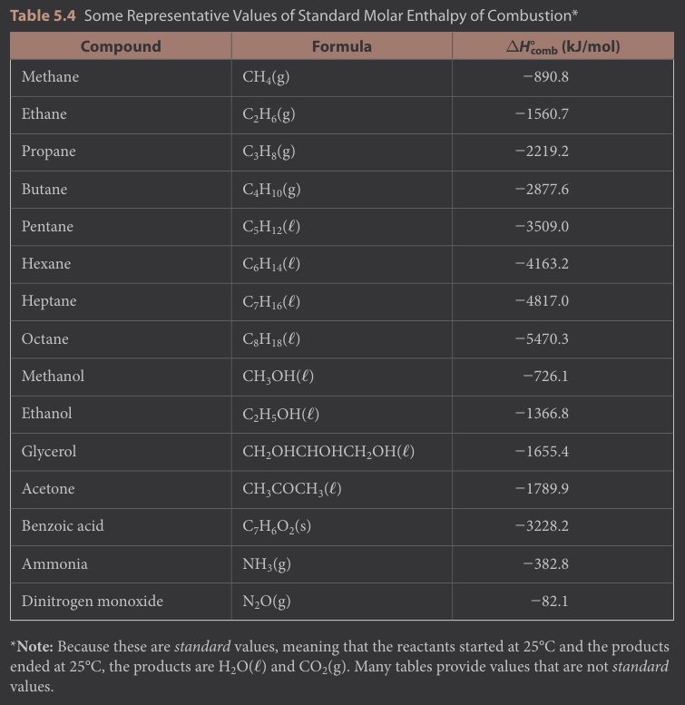

### Reactant Amounts and Enthalpy of Reaction

- Enthalpy change (associated w/ reaction) depends on amounts of reactants involved
- *Enthalpy of reaction* is directly **proportional to** the *amounts of the reactants*

*i.e. Combustion of pentane*

coefficients repr. amount (mol) of substance

$$
\begin{gather*}
\ce{C5H12(l) + 8O2(g) -> 5CO2(g) + 6H2O(l) + 3509.0 kJ} \\
\ce{2C5H12(l) + 16O2(g) -> 10CO2(g) + 12H2O(l) + 7018.0 kJ}
\end{gather*}
$$

> Enthalpy change of reaction in SATP = amount (mol) $n$ of specified reactant / product mult. by standard molar enthalpy change
> 
> $\therefore \Delta H^\circ_r = n\Delta H^\circ_r$

### Enthalpy Sample Problems

#### 1) Calc. Enthalpy Change

(a) What is the enthalpy change when a 50.00 g sample of methane undergoes complete combustion according to the equation $\ce{CH4(g) + 2O2(g) -> CO2(g) + 2H2O(ℓ)}$?

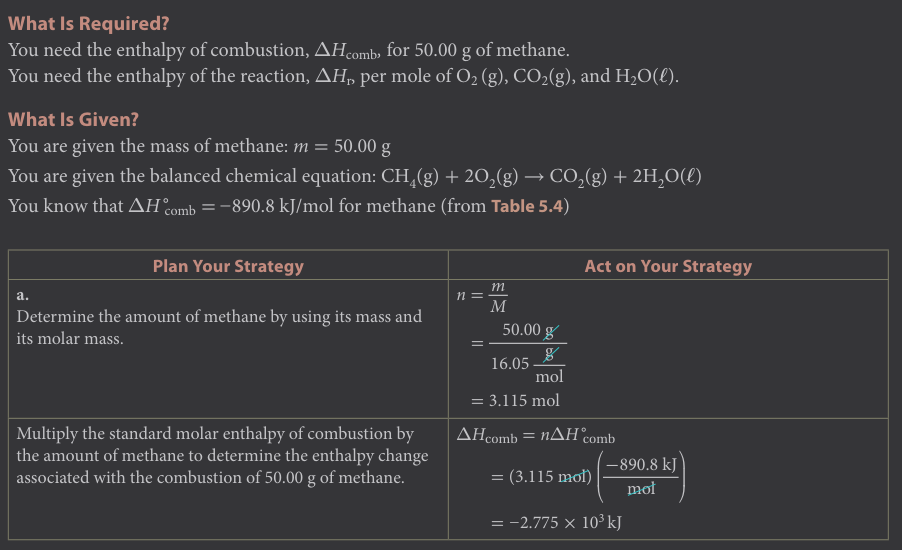

(b) What is the enthalpy of the reaction per mole of $\ce{O2(g)}$ consumed, $\ce{CO2(g)}$ produced, and $\ce{H2O(ℓ)}$ produced?

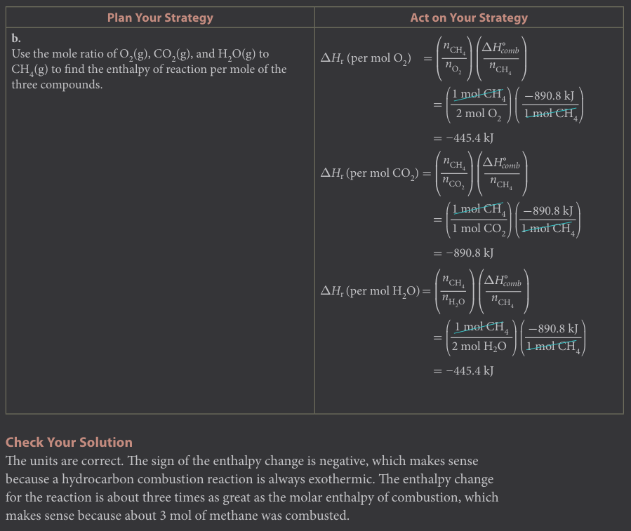

#### 2) Mass of Products

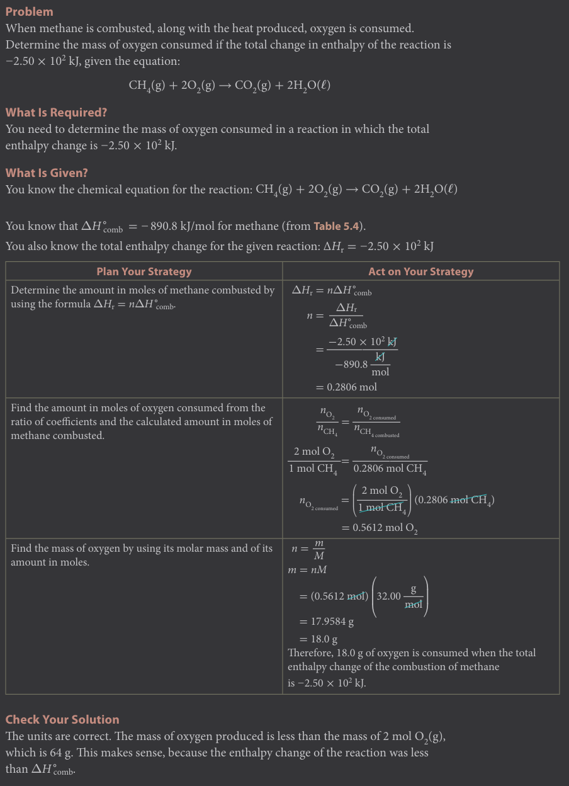

### Calorimetry

- **calorimeter:** device used to measure heat released or absorbed during chemical / physical process
- **calorimetry:** technological process of measuring heat released / absorbed during chemical or physical process
- **calorie (cal):** amount of heat needed to increase temp. of 1 g of water by 1 &deg;C
	- 1 cal = 4.184 J
	- 1 Calorie (in food labels) = 1,000 calories
		- 1 Calorie = 4.184 kJ
		- better to use 1 kilocalorie (kcal)
	- not SI unit

*Calorimeter example:*

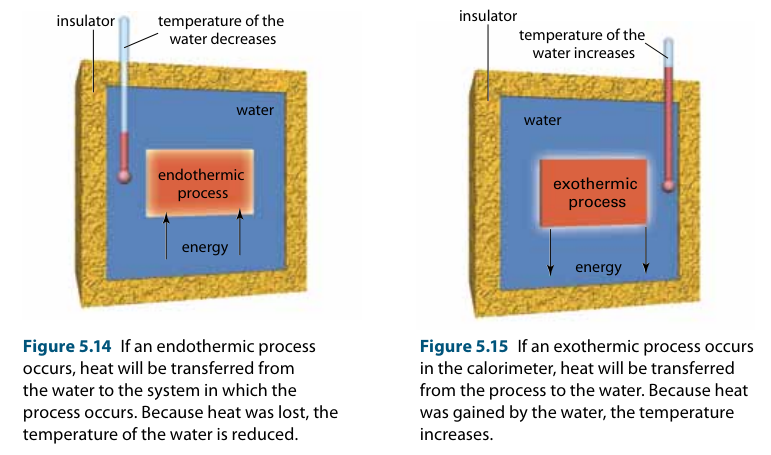

#### Theoretical Basis of Calorimetry

> **Second Law of Thermodynamics:**
> 
> Thermal energy is spontaneously transferred from an object at a higher temperature to an object at a lower temperature until the two objects reach the same temperature.

- 2nd law ensures measurement taken after
	- process taken place in equilibrium temp. of all systems in thermal contact
- energy is released / absorbed by chem. reaction in calorimeter
	- results in change of temp. of calorimeter surrounding reaction
- 1st law: consv. of energy also used

### Simple Calorimeter

- **simple calorimeter:** calorimeter made of 2 stacked vessels covered by lid w/ holes in top just large enough for thermometer and stirrer
	- i.e. 2 stacked polystyrene cups w/ lid
- reaction occurs in inner cup, w/ known mass of water
- polystyrene cups and air between both cups prevent escape of thermal energy (insulation)
- liquids remain inside inner cup, gases can escape via holes
- $\therefore$ calorimeter measures energy changes at constant pressure

*Simple Calorimeter:*

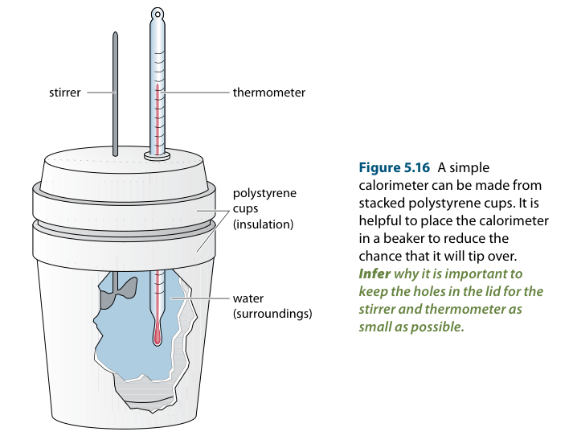

#### Assumptions

- The system is isolated
	- thermal energy exchanged w/ surroundings is small enough to be ignored
- The thermal energy exchanged w/ calorimeter cups, thermometer, lip, and stirring rod is *small enough to be ignored*
- If something dissolves or reacts w/ water in calorimeter, resulting solution retains props. of water
	- i.e. density and specific heat capacity remain same
- Process takes place under *constant pressure*

Then, following equations can be used

> thermal energy released by system = -(thermal energy absorbed by surroundings)
> heat lost/gained by system = -(heat gained/lost by surroundings)

$$
\begin{gather*}
Q_\text{system} = -Q_\text{surroundings} \\
\end{gather*}
$$

#### How to Use Simple Calorimeter

1. Ensure water in calorimeter and all other solutions at room temp.
	1. Measure initial temp. of water in calorimeter
2. Add reactants to calorimeter
	1. Water surrounds and in direct contact w/ chem. reaction
3. Allow reaction to proceed and stir solution to ensure even temperature throughout
	1. Record changing temp. of water throughout reaction
	2. Identify max. and min. temp.
4. *Exothermic reaction:* final temp. = max. temp (energy released)
	1. *Endothermic reaction:* final temp. = min. temp (energy absorbed)
	2. Use $Q = mc\Delta T$ for calculations

### Determining Enthalpy of Reaction

- water in calorimeter absorbs / provides energy of reaction (opp. to reaction)
- *solution itself* absorbs or releases energy
	- when reaction happens in dilute solution
- if solution is dilute, solution can be assumed to have same spec. heat capacity as water
	- cannot be assumed in concentrated solution

*Specific heat capacity v. concentration of solution:*

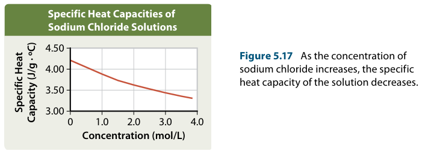

Thermal energy absorbed by water

$$
Q_w = m_wc_w\Delta T_w
$$

Heat absorbed / released by reaction

$$
Q_r = -Q_w
$$

Determine molar enthalpy change of reaction

$$
\begin{gather*}
Q_r = \Delta H \\
\Delta H = n\Delta H_r \\
\therefore \Delta H_r = \frac{\Delta H} n
\end{gather*}
$$

#### Sample Problem: Det. Enthalpy Change

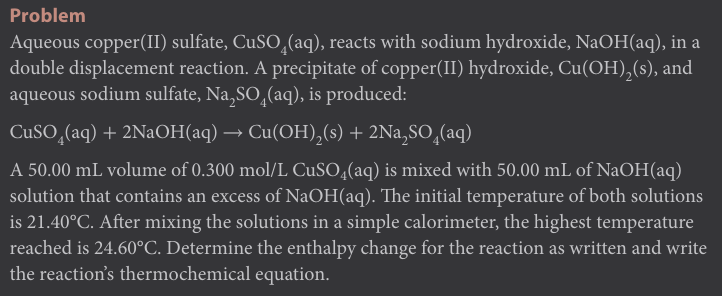

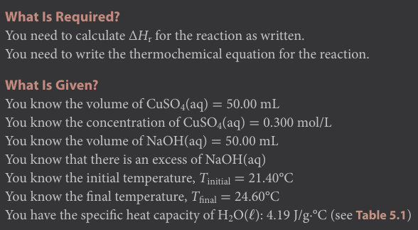

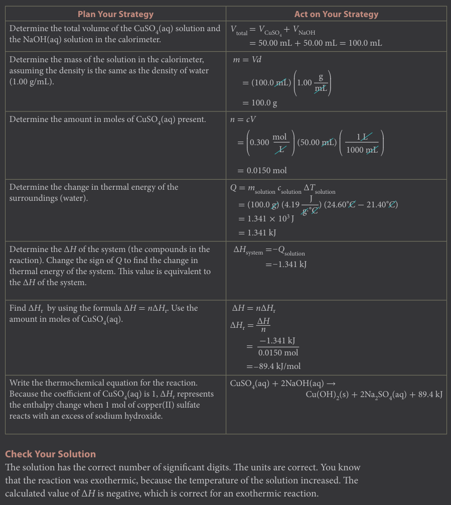

### Flame Calorimetry

- **flame calorimeter:** calorimeter that uses small flame to det. *enthalpy of combustion*
- Advantages
	- fire-resistant
- Drawbacks
	- absorbs significant amount of energy
	- heat absorbed by calorimeter itself must be incl. in energy calc.
- fuel being tested is burned under small can
	- heats both can and water inside
- molar enthalpy of combustion used for pure substances
- mixtures: enthalpy of combustion given in kJ/g
	- or kJ/serving (for food)

*Flame calorimeter*

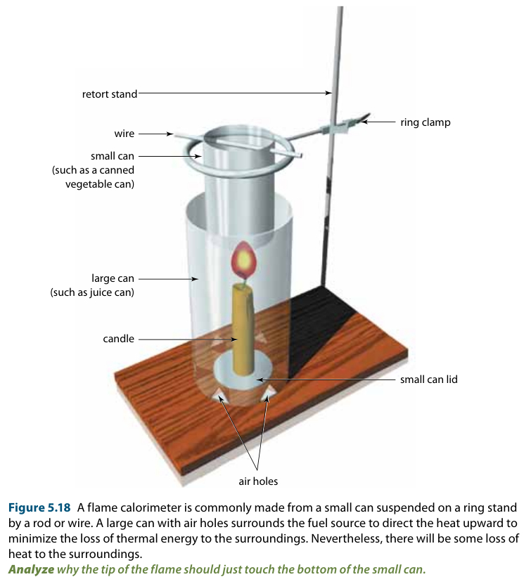

### Bomb Calorimetry

- **bomb calorimeter:** device that measures heat released during combustion at constant volume
- How it Works
	- reaction takes place inside a *bomb*
		- **bomb:** inner metal chamber
		- bomb contains pure oxygen
	- reactants ignited using electric coil
	- known qty. of water surroundings bomb and absorbs energy released by reaction
- *Accurate Measurements*: no assumptions of negligible heat losses
	- need heat capacity ($C$) of entire bomb calorimeter
	- bomb calorimeter calibrated for constant mass of water / mass constant
	- units of $C$: J/&deg; C

$$
C_\text{bomb calorimeter} = C_\text{water} + C_\text{thermometer} + C_\text{stirrer} + C_\text{container}
$$

- heat capacity of calorimeter given by manufacturer
- heat capacity ($C$) accounts for mass of calorimeter
	- $\therefore Q = C\Delta T$
- closed system under pressure
	- non-constant pressure
	- amount of heat transferred from system to calorimeter **&ne;** change in system enthalpy

Correction factor for varying pressures:

$$
Q = C\Delta T = RT\Delta n_\text{(gas)}
$$

- where $R$ is universal gas constant
- $\Delta n_\text{(gas)}$ = change in total gas moles
- assumed in gr. 12 pressure is constant

#### Sample Problem: Thermal Energy from Bomb Calorimeter

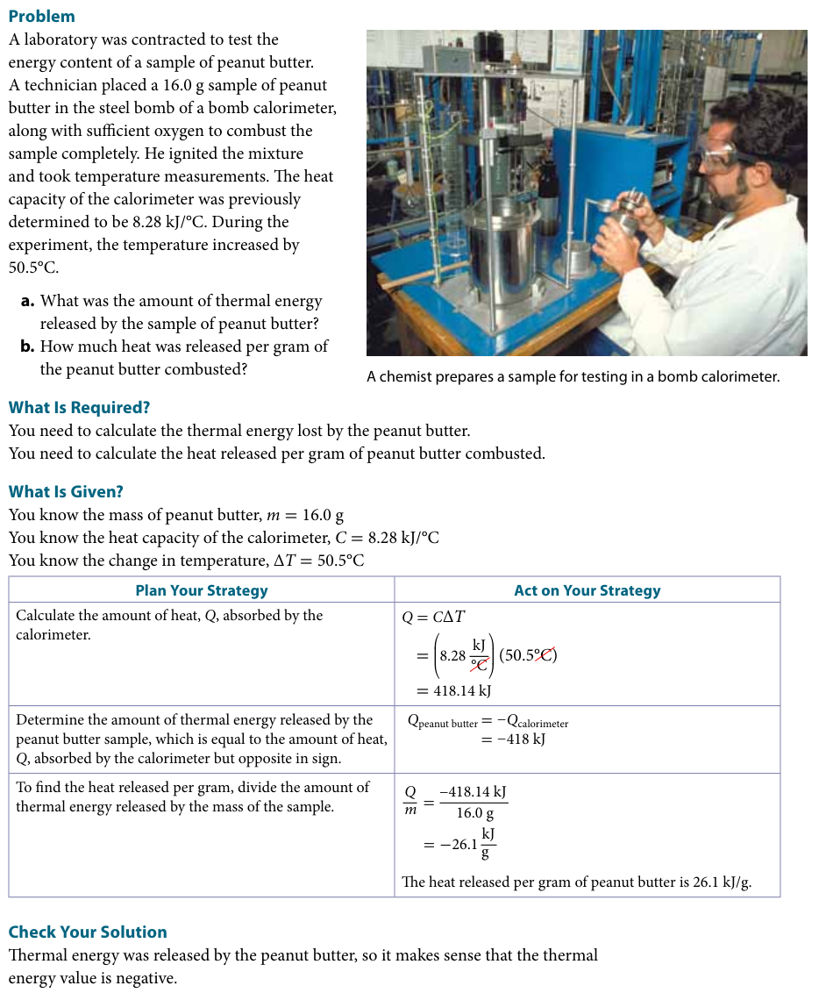

---

## C5.3 - Hess's Law

### Hess's Law

**Hess's Law:**

> The enthalpy change of a physical or chemical process depends only on the initial and final conditions of the process. The enthalpy change of a multistep process is the sum of the enthalpy changes of its individual steps.

1840: Russian chemist Germain Henri Hess stated law

*Example:*

carbon dioxide can form in one step or two steps

> According to Hess's law: sum of enthalpy changes for both reactions in two steps = enthalpy change of reactions in one step

So long as moles of product are the same (1 mol)

**Two Steps**

$$
\begin{array}{ccl}
\ce{C(s) + 1/2O2(g) -> CO(g)} && \Delta H^\circ_r = -110.5\text{ kJ} \\
\ce{CO(g) + 1/2O2(g) -> CO2(g)} && \Delta H^\circ_r = -283.0\text{ kJ} \\
\hline
&& \Delta H^\circ_{rT} = -393.5\text{ kJ}
\end{array}
$$

**One Step**

$$
\begin{array}{ccl}
\ce{C(s) + O2(g) -> CO2(g)} && \Delta H^\circ_r = -393.5\text{ kJ}
\end{array}
$$

*Enthalpy diagram of carbon dioxide formation:*

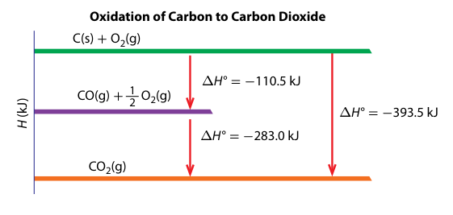

### Two Pathways, One Change; State Functions

- **state function:** any physical property whose value does not depend on the system's history (i.e. temperature, pressure volume)
	- enthalpy change ($\Delta H$) is a state function
- Hess's law only depends on initial and final conditions of system
	- not dependent on pathway of system
- Hess's law useful when not practical to use calorimeter to measure change in enthalpy

Can compare enthalpy with potential energy of mtn. biker

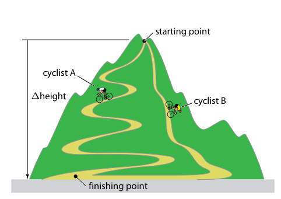

*Change in potential energy depends only on initial and final position*

### Combining Sets of Chemical Equations

*Example:* Synthesis of sulfuric acid

Diagram of industrial production of sulfuric acid:

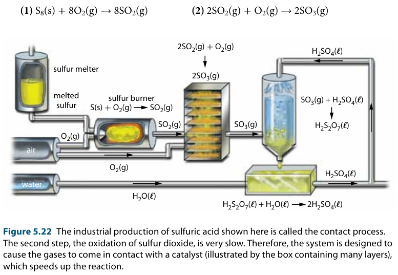

**Goal:** Find standard enthalpy of reaction of sulfur trioxide

1. Setup equations (1) and (2) which allows for 1 mol of final product (1 mol SO2 : 1 mol SO3)

$$
\begin{gather}
\ce{1/8S8(s) + O2(g) -> SO2(g)} \tag 1 \\
\ce{SO2(g) + 1/2O2(g) -> SO3(g)} \tag 2
\end{gather}
$$

2. Add both equations and enthalpies. Write like an addition equation (math).

$$
\begin{array}{cccl}
& \ce{1/8S8(s) + O2(g) -> SO2(g)} && \Delta H^\circ_r = -296.8\text{ kJ} \\
+& \ce{SO2(g) + 1/2O2(g) -> SO3(g)} && \Delta H^\circ_r = -99.2\text{ kJ} \\
\hline & \ce{1/8S8(s) + SO2(g) + O2(g) + 1/2O2(g) -> SO2(g) + SO3(g)} && \Delta H^\circ_r = -396.0\text{ kJ}
\end{array}
$$

3. Simplify the equation by cancelling out terms or combining terms

$$
\begin{gather*}
\ce{1/8S8(s) + \cancel{\ce{SO2(g)}} + (O2(g) + 1/2O2(g)) -> \cancel{\ce{SO2(g)}} + SO3(g)} & \Delta H^\circ_r = -396.0\text{ kJ} \\
\ce{1/8S8(s) + 3/2O2(g) -> SO3(g)} & \Delta H^\circ_r = -396.0\text{ kJ}
\end{gather*}
$$

4. *Note:* You can cancel out terms before adding.

*Enthalpy diagram of prod. of sulfur trioxide:*

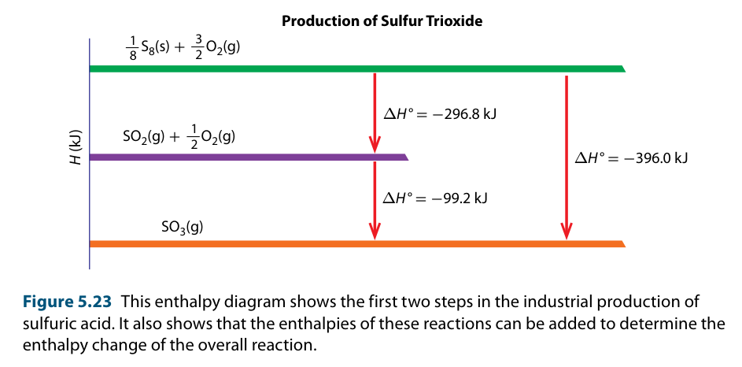

### Techniques for Manipulating Equations

- *Reverse an equation*
	- reactants become products and vice versa
	- $\Delta H$ is multiplied by -1 (sign flip)
- *Multiply each coefficient* by same number $n$
	- $\Delta H$ is also multiplied by $n$
	- enthalpy change directly related to amounts of substances in reaction

### Sample Problem: Det. Enthalpy Change

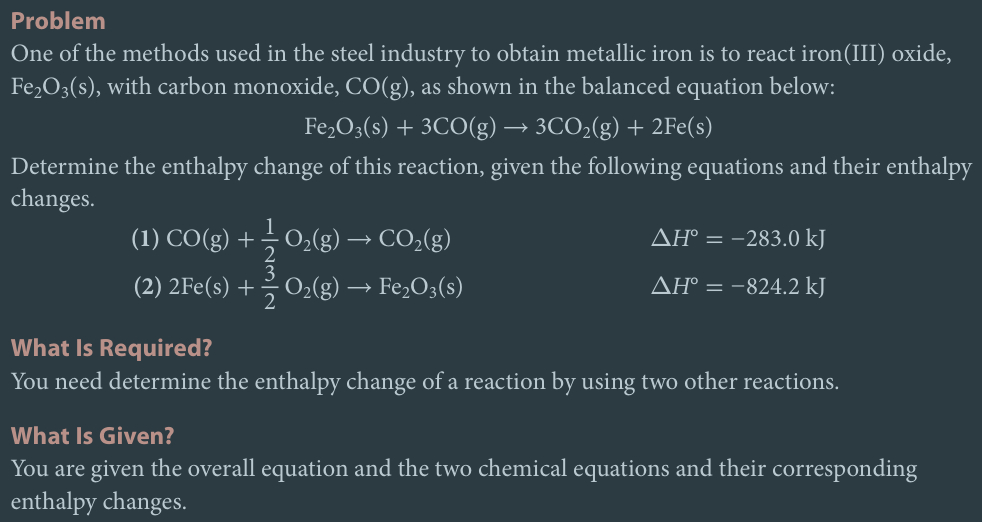

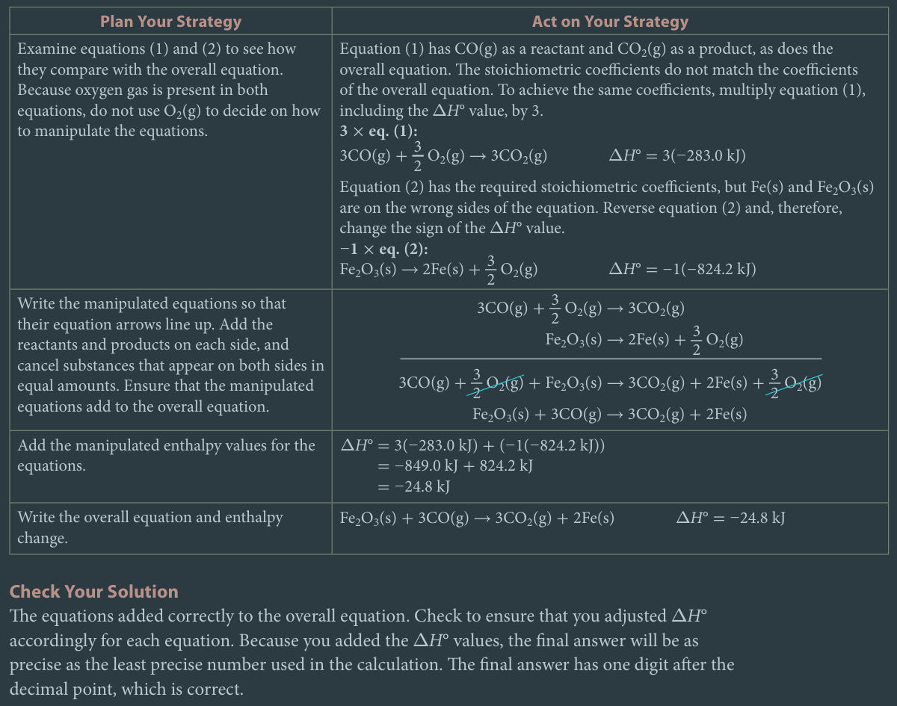

### Standard Molar Enthalpies of Formation

- **standard molar enthalpy of formation ($\Delta H^\circ_f$):** change in enthalpy when 1 mol of a compound is formed directly from its elements in their most stable state at SATP
	- SATP: 25 &deg;C and 100 kPa
	- all solutions have a 1.0 mol/L concentration
- std. molar enthalpy of form. of *elements* arbitrarily set as **zero**
	- elements in most stable state used as reference

#### Working with Std. Molar Enthalpies of Formation

*List of standard molar enthalpies:*

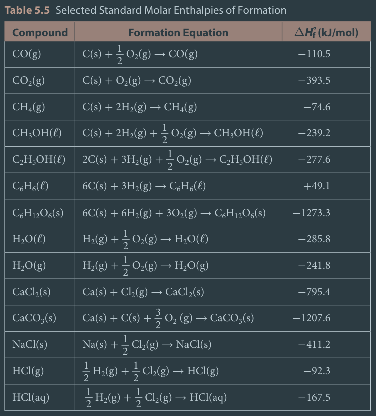

- i.e. 1 mol carbon (graphite) and 0.5 mol oxygen produce 1 mol carbon monoxide, which releases 110.5 kJ of energy
- some elements exist in more than one form *(allotropes)*
	- i.e. carbon: graphite and diamond
	- graphite at most stable state, $\Delta H^\circ_{f,\text{graphite}} = 0$
	- diamond: $\Delta H^\circ_{f,\text{diamond}} = +1.9\text{ kJ/mol}$

### Formation Reactions and Thermal Stability

- **thermal stability:** ability of a substance to resist decomposition when heated
- enthalpy of formation = -(enthalpy of deocmposition)
	- reverse of formation = decomposition
- greater the enthalpy change of decomp. reaction, the more stable

*Examples:*

Methane's enthalpy of decomposition is 74.6 kJ/mol

$$
\begin{gather*}
\ce{C(s) + 2H2(g) -> CH4(g)} & \Delta H^\circ_f = -74.6\text{ kJ/mol} \\
\ce{CH4(g) -> C(s) + 2H2(g)} & \Delta H^\circ_r = 74.6\text{ kJ/mol}
\end{gather*}
$$

Calcium carbonate's enthalpy of decomposition is 1,207.6 kJ/mol

$$
\begin{gather*}
\ce{CaCO3(s) -> Ca(s) + C(s,graphite) + 3/2O2(g)} & \Delta H^\circ_r = 1,207.6\text{ kJ/mol}
\end{gather*}
$$

$\therefore$ Calcium carbonate is more thermally stable than methane

### Summation Formula

> $\Delta H^\circ_r = \Sigma n(\Delta H^\circ_f \text{ products}) - \Sigma n(\Delta H^\circ_f \text{ reactants})$
> 
> $n$ = stoichiometric coefficient of each substance
> $\Sigma$ = the sum of (every product / reactant)

*Example:* Find enthalpy of form. for comb. of methane

$$
\ce{CH4(g) + 2O2(g) -> CO2(g) + 2H2O(g)}
$$

Calculate enthalpy of formation

$$
\begin{align*}
\Delta H^\circ_r &= \Sigma n(\Delta H^\circ_f \text{ products}) - \Sigma n(\Delta H^\circ_f \text{ reactants}) \\
&= [(1\text{ mol})(\Delta H^\circ_f\ \ce{CO2(g)}) + (2\text{ mol})(\Delta H^\circ_f\ \ce{H2O(g)}] - [(1\text{ mol})(\Delta H^\circ_f\ \ce{CH4(g)}) + (2\text{ mol})(\Delta H^\circ_f\ \ce{O2(g)})] \\
&= [(1\cancel{\text{mol}})(-393.2\text{ kJ/}\cancel{\text{mol}}) + (2\cancel{\text{mol}})(-241.9\text{ kJ/}\cancel{\text{mol}})] - [(1\cancel{\text{mol}})(-74.6\text{ kJ/}\cancel{\text{mol}}) + \cancel{(2\text{ mol})(0\text{ kJ/mol})}] \\
&= (-877.1\text{ kJ}) - (-74.6\text{ kJ}) \\
&= -802.5\text{ kJ}
\end{align*}
$$

#### Relating Enthalpies of Formation and Hess's Law

Using Hess's law to manually add up equations of formations yields the same result

*Using example above*

Equations of formation:

$$
\begin{gather}
\ce{H2(g) + 1/2O2(g) -> H2O(g)} && \Delta H^\circ_f = -241.8\text{ kJ/mol} \tag 1 \\
\ce{C(s) + O2(g) -> CO2(g)} && \Delta H^\circ_f = -393.5\text{ kJ/mol} \tag 2 \\
\ce{C(s) + 2H2(g) -> CH4(g)} && \Delta H^\circ_f = -74.6\text{ kJ/mol} \tag 3
\end{gather}
$$

Adding equations together

$$
\begin{array}{crccl}
& 2\cdot(1) & \ce{\cancel{\ce{2H2(g)}} + O2(g) -> 2H2O(g)} && \Delta H^\circ_f = 2(-241.8\text{ kJ/mol}) \\
+& (2) & \ce{\cancel{\ce{C(s)}} + O2(g) -> CO2(g)} && \Delta H^\circ_f = -393.5\text{ kJ/mol} \\
+& -1\cdot(3) &\ce{CH4(g) -> \cancel{\ce{C(s)}} + \cancel{\ce{2H2(g)}}} && \Delta H^\circ_f = -1(-74.6\text{ kJ/mol}) \\
\hline && \ce{CH4(g) + 2O2(g) -> CO2(g) + 2H2O(g)} && \Delta H^\circ_f = -802.5\text{ kJ/mol}
\end{array}
$$

*Enthalpy diagram of summation formula:*

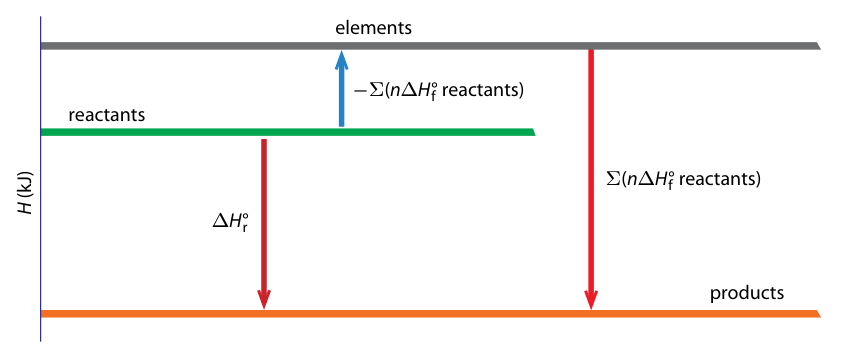

*NOTE:* Reactants do not actually break down into their elements and then react to form products

### Bond Energies (Nelson 5.3)

#### Measuring Bond Energies

- **bond disassociation energy:** qty. of energy required to break a chemical bond
- i.e. C-H has bond energy of 413 kJ/mol
	- 413 kJ of energy needed to break 1 mol of C-H bonds
	- 413 kJ of energy released when 1 mol of C-H bonds form
- energy needed to break bonds
- energy released when bonds form

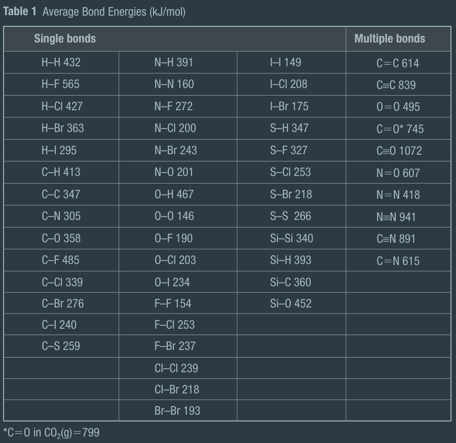

Average bond energy because diff. amounts of energy needed each time to break the same bond

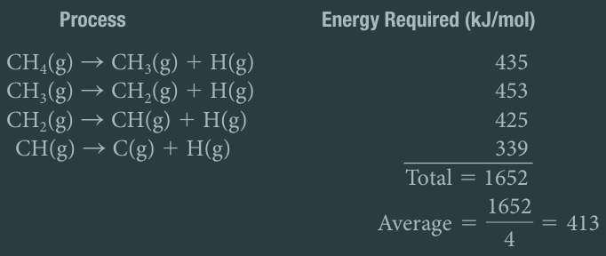

#### Multiple Bonds and Bond Energies

- More energy needed to break double / triple bonds than single bonds
- as # of bonds increases, bond length decreases

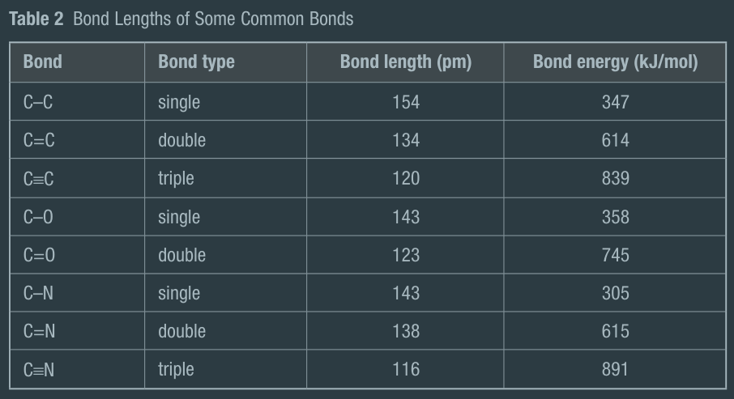

#### Enthalpy and Bond Energies

*Chemical reaction bond process:*

1. Bond first breaks (+&Delta;*E*) &mdash; endothermic
2. Bond then forms (-&Delta;*E*) &mdash; exothermic

> $\therefore \Delta H_r = \Sigma n(D\text{ (bonds broken)}) - \Sigma n(D\text{ (bonds formed)})$
>
> *or* $\Delta H_r = \Sigma n(D\text{ (reactant bonds)}) - \Sigma n(D\text{ (product bonds)})$
>
> $n$ = mol of each bond, $D$ = bond energy / mol of bonds

### Sample Problem: Using Summation Formula

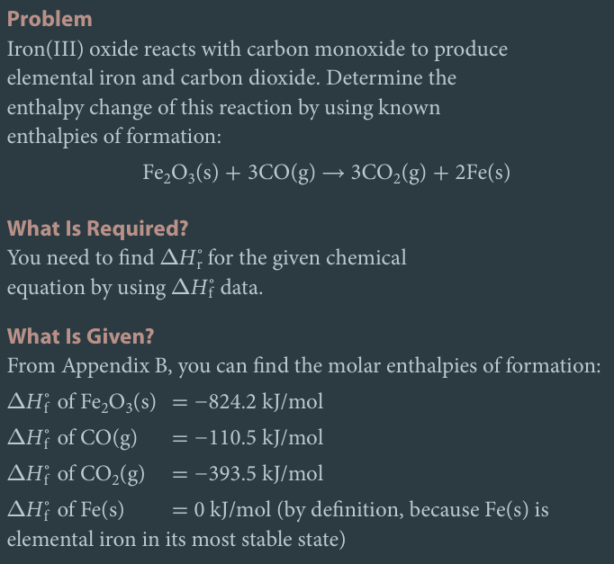

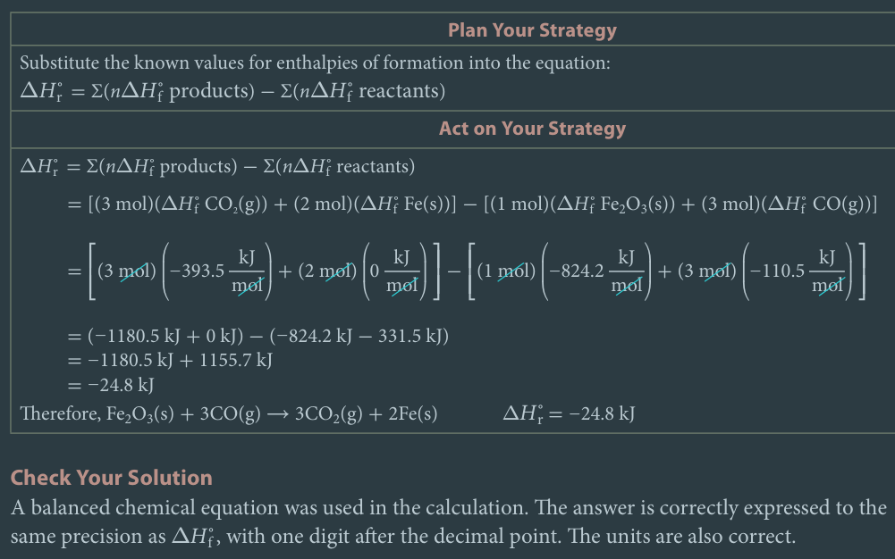

### Sample Problem: Determining Enthalpy  from Bond Energies

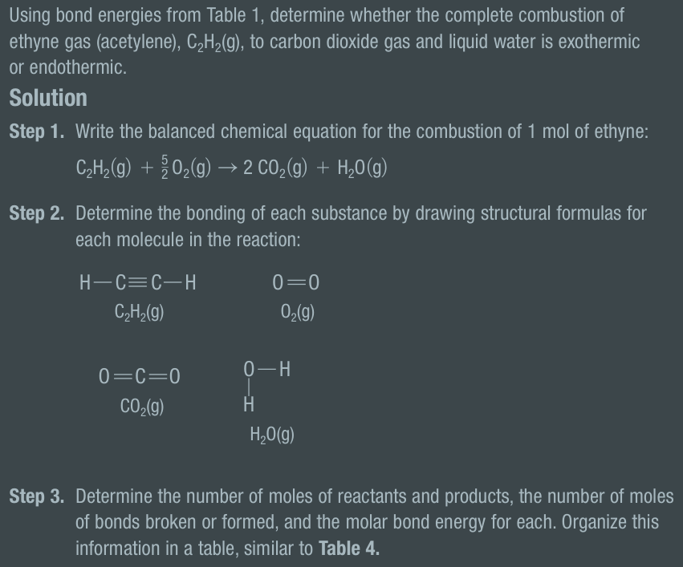

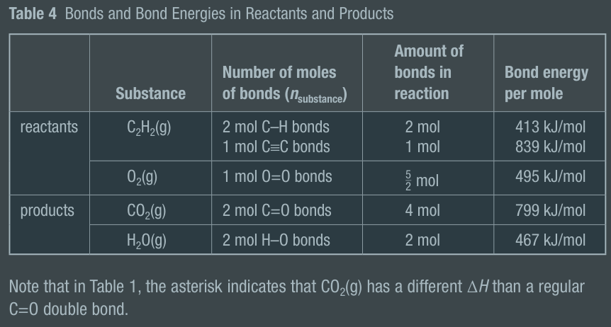

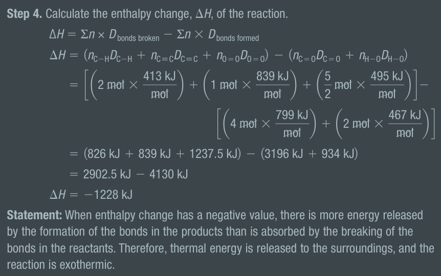