# C6 - Rates of Reaction

## C6.1 - Chemical Reaction Rates

### Determining Reaction Rates

- **reaction rates:** speed at which a reaction occurs
	- *a.k.a. kinetics*
	- or "rate of reaction"
- **reaction rate** = amount of reactants consumed or products formed &div; time interval

$$
\text{rate} = \frac{\Delta\text{qty.}}{\Delta t}
$$

- reaction rate usually given as change in concentration
- chemists determine rate of reaction by measuring
	- *increase* in product concentration
	- or *decrease* in reactant concentration
- $[A]$ &rarr; concentration of compound w/ formula $A$

let $r$ be reaction rate

$$
\begin{align*}
r &= \frac{[A]_f - [A]_i}{t_f - t_i} \\
&= \frac{\Delta[A]}{\Delta t}
\end{align*}
$$

*Example of reaction rates in action:*

- Assume compound A converts into compound B in 1.0 L of solution
- Each black dot repr. 1.0 mmol of compound A
- Each red dot repr. 1.0 mmol of compound B
- Initial concentration: 40.0 mmol/L

*Reaction progress:*

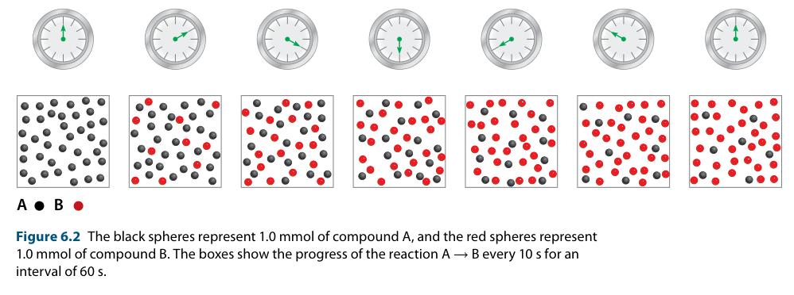

*Table of values and graph of concentration v. time*

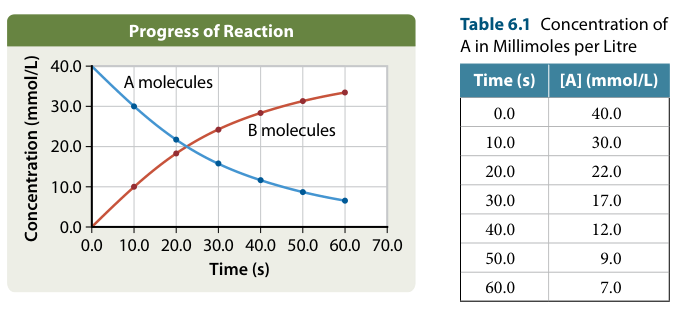

Reaction rate ($r$) of in terms of compound B

$$
r = \frac{\Delta[B]}{\Delta t}
$$

Reaction rate in terms of compound A *($\Delta[A]$ is (-) since its decreasing)*

$$
r = -\frac{\Delta[A]}{\Delta t}
$$

### Average and Instantaneous Reaction Rates

- **average rate of reaction:** avg. change in concentration of reactant and product over given time interval during reaction
	- avg. rate of reaction = slope of secant
	- $r_\text{av} = \dfrac{[A]_2 - [A]_1}{t_2 - t_1}$
- **secant line:** line connecting two points together
- in reality, the rate of reaction changes over time

*How to find avg. rate of reaction from graph:*

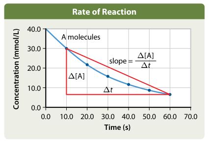

- **instantaneous rate of reaction:** rate of chemical reaction at a particular point in time
	- instantaneous rate = slope of tangent
- **tangent line:** a line that touches a curve only at one particular point
	- points converge at POI and diverge away from POI

*How to find instantaneous rate of reaction from graph:*

Only focus on bottom-right triangle

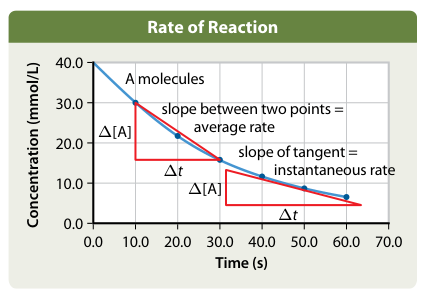

### Expressing Reaction Rates of All Substances via Mole Ratio

- measuring rate of change of just one reactant / product allows all other rates of change to be calculated
- calculated using mole ratio

*Example:* Decomposition of hydrazine

$$
\ce{3N2H4(l) -> 4NH3(g) + N2(g)}
$$

- Find rate of reaction of nitrogen gas
- 3 mol hydrazine : 1 mol nitrogen gas

$$
\begin{gather*}
\frac{\text{rate of consumption of }\ce{N2H4(l)}}{\text{rate of production of }\ce{N2(g)}} = \frac 3 1 \\
-\frac{\Delta[\ce{N2H4}]}{\Delta t} \div \frac{\Delta[\ce{N2}]}{\Delta t} = \frac{3\text{ mol}}{1\text{ mol}} \\ \\
\frac{\quad{-\dfrac{\Delta[\ce{N2H4}]}{\Delta t}}\quad} 1 = \frac{\quad\dfrac{\Delta[\ce{N2}]}{\Delta t}\quad} 3 \\
\text{or} \\
\frac{\Delta[\ce{N2}]}{\Delta t} = -\frac 1 3\left(\dfrac{\Delta[\ce{N2H4}]}{\Delta t}\right)
\end{gather*}
$$

### Sample Problems

#### Ex: Determining Avg. Reaction Rate

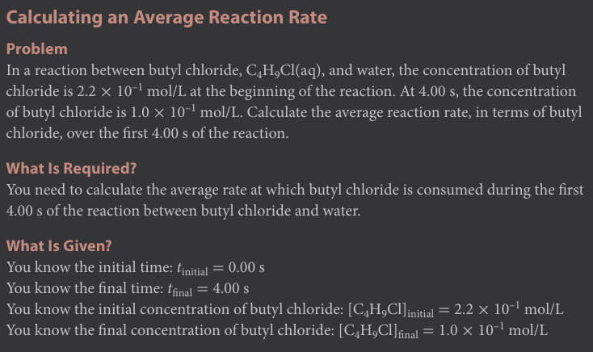

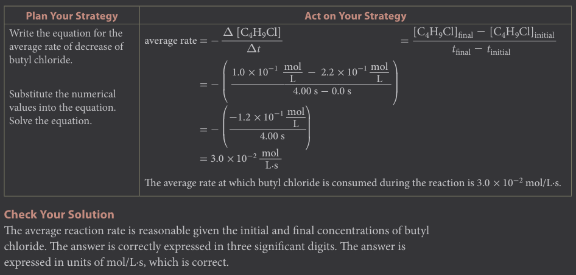

#### Ex: Determining Rates using Mole Ratio

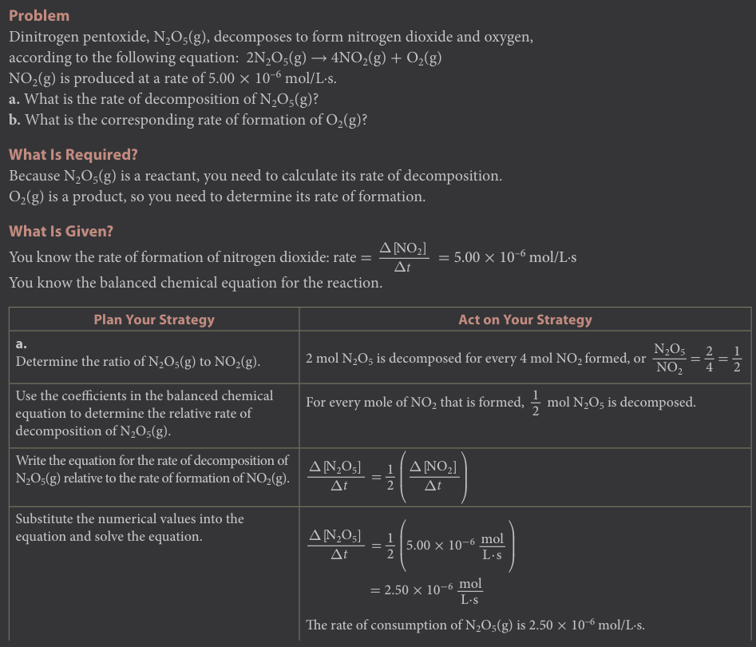

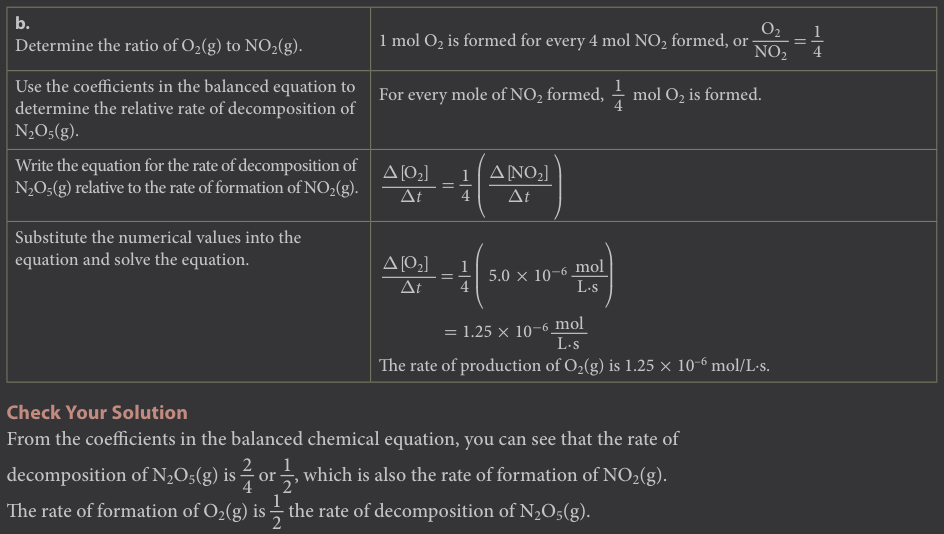

### Methods for Measuring Rates of Reaction

- Various methods to det. rate of reaction
- Must monitor rate at which reactant is consumed / product is formed
- *One Example:* reactant / product has specific colour
	- measure qty. of substance using spectrophotometer

*Example Reaction:*

$$
\ce{CaCO3(s) + 2HCl(aq) -> CaCl2(aq) + H2O(l) + CO2(g)}
$$

- Gaseous product being formed
- 2 methods to gather measurement data
- good practice to also measure ambient pressure and temp. since gas volumes affected by that

#### Measuring Volume of Gas Produced

- *Goal:*
	- collect gas product (i.e. carbon dioxide) being formed and measure volume during reaction
- *Process:*
	- connect reaction vessel (i.e. flask) to syringe w/ tubing
	- when reaction begins, plunger of syringe pushed all the way in
	- as gas escapes, it goes into syringe, pushing plunger back
	- scale on syringe shows how much gas collected

*Experimental setup to measure gas volume:*

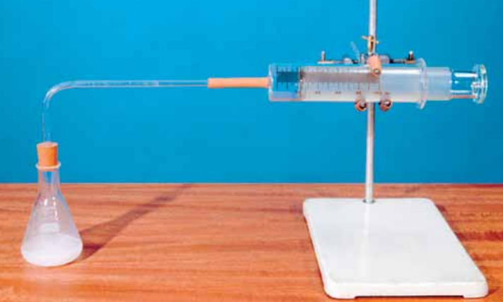

#### Measuring Remaining Mass

- 2nd method
- *Goal:*
	- measure decrease of mass as gaseous product escapes open container
- *Process:*
	- setup reaction vessel onto balance
	- plug open end w/ cotton wool to prevent liquids from splashing out
		- ex. carbon dioxide can easily escape cotton wool though
	- measure decrease of mass over time
- method works well for reactions generating carbon dioxide or oxygen
- does not work as well for hydrogen, due to its lower mass

*Experimental setup to measure decrease in mass:*

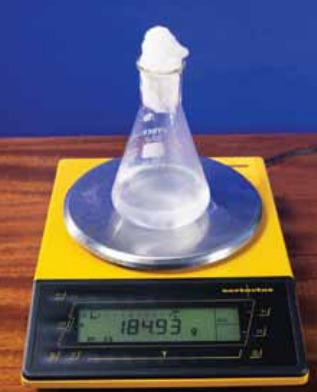

### Methods of Measuring Reaction Rates

| Property Measured        | Type of Data Collected                                                                 | Typical Equipment Used          | Equation for Determining Rate                             |
|--------------------------|------------------------------------------------------------------------------------------|----------------------------------|------------------------------------------------------------|
| Volume                   | Volume of gas formed                                                                     | Gas syringe                      | $\text{rate} = \dfrac{\Delta \text{volume}}{\Delta t}$     |
| Mass                     | Change in mass of a reactant or a product                                               | Balance                          | $\text{rate} = \dfrac{\Delta \text{mass}}{\Delta t}$       |
| Temperature              | Increase or decrease in temperature as reaction proceeds                                 | Thermometer                      | $\text{rate} = \dfrac{\Delta \text{temperature}}{\Delta t}$|
| Pressure                 | Change in pressure in a closed container as a gas is formed or consumed                  | Pressure sensor                  | $\text{rate} = \dfrac{\Delta \text{pressure}}{\Delta t}$   |
| Colour                   | Change in absorbance of a specific wavelength; varies with concentration of compound     | Spectrophotometer                | $\text{rate} = \dfrac{\Delta \text{absorbance}}{\Delta t}$ |
| pH                       | Change in concentration of $\mathrm{H_3O^+}$ or $\mathrm{OH^-}$ ions as reaction proceeds | pH meter                         | $\text{rate} = \dfrac{\Delta \text{pH}}{\Delta t}$         |
| Electrical conductivity  | Change in the concentration of dissolved ions as reaction proceeds                       | Electrical conductivity probe    | $\text{rate} = \dfrac{\Delta \text{conductivity}}{\Delta t}$ |

### Calculating Reaction Rates from Experimental Data

*Example reaction:*

$$
\ce{CaCO3(s) + 2HCl(aq) -> CaCl2(aq) + H2O(l) + CO2(g)}
$$

*Example data recorded:*

$$
\begin{gather*}
T = 291\text{ K} \\
P = 102.1\text{ kPa} \\
V_\ce{CO2} = 25.3\text{ mL} \\
\Delta m_\text{solution} = -47.0\text{ mg} \\
\Delta t = 5.00\text{ min}
\end{gather*}
$$

**Method 1**

*Calculating rate from volume of $\ce{CO2}$*

1. Convert volume from mL to L

$$
\begin{gather*}
V = V_\ce{CO2} \\
V = 25.3\cancel{\text{mL}}\left(\frac{1\text{ L}}{1,000\cancel{\text{mL}}}\right) = 0.0253\text{ L}
\end{gather*}
$$

2. Convert time from minutes to seconds (rate in mol/s)

$$
\Delta t = 5.00\cancel{\text{min}}\left(\frac{60\ \text s}{\cancel{\text{min}}}\right) = 300\text{ s}
$$

3. Find amount of moles of gas using ideal gas law

$$
\begin{align*}
PV &= nRT \\
n &= \frac{PV}{RT} \\
&= \frac{(102.1\cancel{\text{kPa}})(0.0253\cancel{\text L})}{(8.314\cancel{\text{kPa}\cdot\text L}/[\text{mol}\cdot\cancel{\text K}])(291\cancel{\text K})} \\
&= 1.0677 \times 10^{-3}\text{ mol}
\end{align*}
$$

3.  Calculate rate of change in mol/s

$$
\begin{align*}
r &= \frac{\Delta n}{\Delta t} \\
&= \frac{1.0677 \times 10^{-3}\text{ mol}}{300\ \text s} \\
&= 3.56\times 10^{-6}\text{ mol/s}
\end{align*}
$$

**Method 2**

*Calculating rate from change in mass of solution*

1. Convert time from minutes to seconds (see method 1)

$$
\Delta t = 300\ \text s
$$

2. Convert change in mass from milligrams to grams

$$
\begin{gather*}
m = -\Delta m_\text{solution} \\
m = 47.0\cancel{\text{mg}} \cdot \frac{1\ \text g}{1,000\cancel{\text{mg}}} = 0.0470\ \text g
\end{gather*}
$$

3. Determine molar mass of $\ce{CO2(g)}$

$$
\begin{align*}
M_\ce{CO2} &= M_\ce C + 2M_\ce O \\
&= 12.01\text{ g/mol} + 2(16.00\text{ g/mol}) \\
&= 44.01\text{ g/mol}
\end{align*}
$$

3. Determine moles using mass and molar mass

$$
\begin{align*}
n &= \frac m M  \\
&= \frac{0.0470\cancel{\text g}}{44.01\cancel{\text g}/\text{mol}} \\
&= 0.0010679\text{ mol} \\
&= 1.0679\times 10^{-3}\text{ mol}
\end{align*}
$$

4. Determine rate in mol/s

$$
\begin{align*}
r &= \frac{\Delta n}{\Delta t} \\
&= \frac{1.0679\times 10^{-3}\text{ mol}}{300\ \text s} \\
&= 3.56\times 10^{-6}\text{ mol/s}
\end{align*}
$$

---

## C6.2 - Collision Theory and Factors Affecting Rates of Reaction

### Effective Collisions

- **collision theory:** theory that a reaction occurs between two particles if they collide at the correct orientation
	- ...and w/ certain minimum energy
	- *particles:* atoms, molecules, or ions
- for collision to result in reaction, collision must be *effective*
	- small fraction of collisions effective

**Effective collision criteria:**

> 1. orientation of reactants must be favourable
> 2. collision must occur w/ enough energy

#### Criteria 1: Correct Orientation of Reactants

- for reaction, reacting particles must collide with the correct **collision geomtery**
	- collide w/ proper orientation rel. to one another

*Example reaction:*

$$
\ce{NO(g) + NO3(g) -> 2NO2(g)}
$$

- there are 5 ways nitrogen monoxide can collide w/ nitrogen trioxide
- only 1 of these collisions are effective
- in effective collision
	- angle at which nitrogen atom in NO is approaching oxygen atom in nitrogen trioxide
	- ... is same angle as that formed in nitrogen dioxide molecules

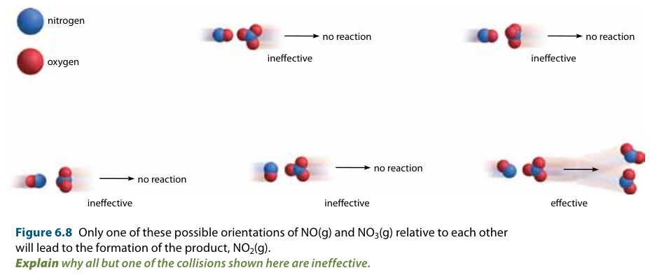

#### Criteria 2: Sufficient Activation Energy

- **activation energy ($E_a$):** minimum amount of (collision) energy required to initiate a chemical reaction
- collision energy depends on kinetic energy of particles
- **Maxwell-Boltzmann distribution:** distribution that compares relative number of collisions against kinetic energy at a given temp.
	- dotted line indicates activation energy
	- shaded part indicates collisions that have energy greater than or equal to activation energy
- activation energy is independent of temp.
- *Example:*
	- if there are 10,000 collisions/s
	- fraction of effective collisions: 1 reaction/50 collisions
	- reaction rate = 10,000 collisions/s &times; 1 reaction/50 collisions
	- reaction rate = 200 reactions/s
	- rate changes depending on collisions/s or fraction of effective collisions

*Maxwell-Boltzmann distribution curve:*

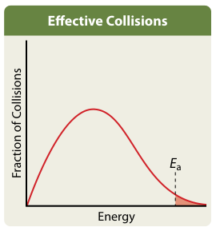

### Progress of Chemical Reaction via Potential Energy Diagrams

- **potential energy (PE) diagram:** diagram that plots the potential energy of a reaction throughout the reaction
- **transition state:** state between reactants and products
	- reaction can go forwards (products) or backwards (reactants) at this stage
- *Explanation of Reaction:*
	- reactants approach each other
	- potential energy increases as reactants get closer
	- if collision energy doesn't reach $E_a$, reactants bounce off each other
	- reactants that have sufficient kinetic energy change in configuration and enter their **transition state**
	- products form or reactants reform and move apart
	- *effective* collision if products form
- ℹ activation energy = max potential energy - PE of reactants
	- $E_a = E_\text{max} - E_\text{reactants}$
- ℹ enthalpy change = PE of products - PE reactants
	- $\Delta H = E_\text{products} - E_\text{reactants}$
	- decrease in PE &rarr; exothermic
	- increase in PE &rarr; endothermic

*Potential energy diagram of exothermic reaction:*

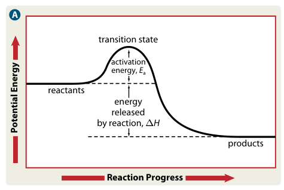

*Potential energy diagram of endothermic reaction:*

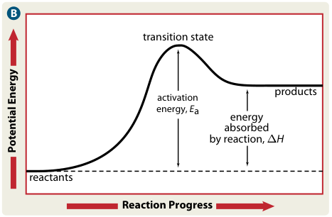

### Activation Energy and Enthalpy

- cannot predict activation energy from enthalpy change
- enthalpy change determined only based on PE diff. of products and reactants
- activation energy determined by analyzing reaction rate at various temps.
	- in general, reactions w/ low $E_a$ proceed fast in room temp.
	- reactions w/ high $E_a$ proceed slowly in room temp.
- a small energy input typically required for exothermic reaction to proceed
	- i.e. combustion of octane in gasoline
	- energy released gives other molecules energy to continue reaction

*Potential energy diagram for combustion of octane:*

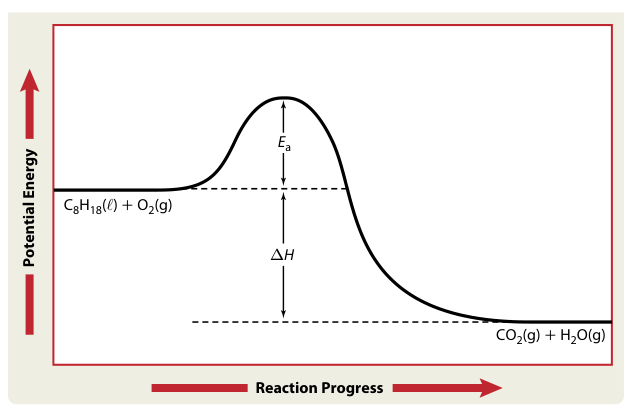

### Activation Energy for Reversible Reactions

*Example reversible reaction:*

$$
\begin{array}{lcl}
\text{Forward:} & \ce{CO(g) + NO2(g) -> CO2(g) + NO(g)} & \Delta H_r = -226.1\text{ kJ} \\
\text{Reverse:} & \ce{CO2(g) + NO(g) -> CO(g) + NO2(g)} & \Delta H_r = +226.1\text{ kJ}
\end{array}
$$

- reverse reaction has opposite enthalpy
- in PE diagram
	- *forward reaction:* left &rarr; right
	- *reverse reaction:* right &rarr; left
- $E_{a\text{(fwd)}}$ &mdash; activation energy for forward (fwd.) reaction
- $E_{a\text{(rev)}}$ &mdash; activation energy for reverse (rev.) reaction

$$
E_{a\text{(fwd)}} - E_{a\text{(rev)}} = \Delta H_r
$$

- **activated complex:** chemical species temporarily formed by the colliding reactant molecules before product is formed
	- contains partial bonds
	- highly unstable
	- could either break down into products or reactants

*Potential energy diagram of reversible reaction:*

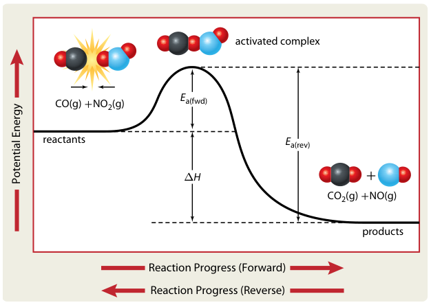

black = carbon / blue = nitrogen / red = oxygen

### Analyzing Reactions Using Potential Energy Diagrams

*Example reaction:*

Substitution between hydroxide ion and bromomethane

$$
\ce{BrCH3(aq) + OH-(aq) -> CH3OH(aq) + Br-(aq)}
$$

- in order for reaction...
- bromomethane and hydroxide must collide *effectively*
- kinetic energy (KE) of colliding molecules conv. into PE
- potential energy stored in partial bonds of activated complex
- when partial bonds of activated complex reforms, stored PE converts back into KE during separation
- $\therefore$ transistion state has highest PE

*Potential energy diagram of bromoethane + hydroxide reaction*

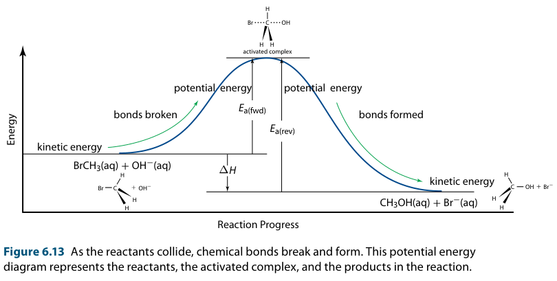

#### Sample Problem: Drawing Potential Energy Diagram

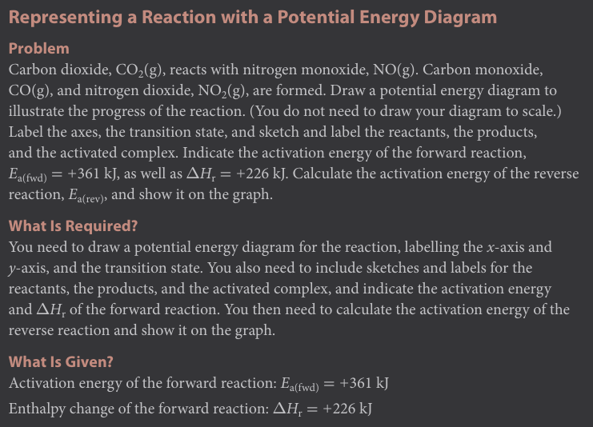

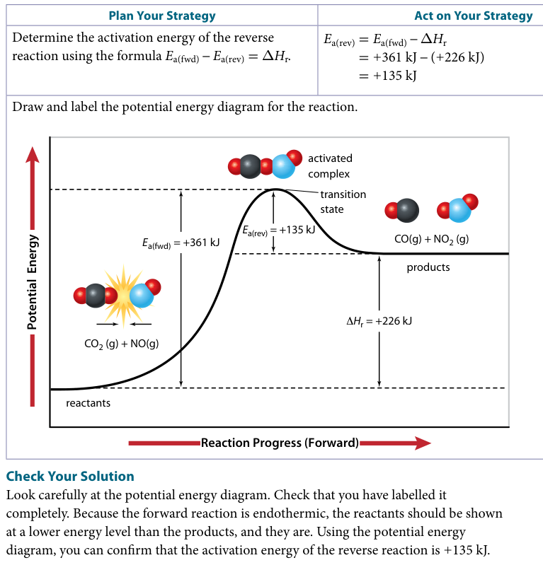

### Factors Affecting Reaction Rate

- any factor that increases frequency of collisions &rarr; increases reaction rates
	- and vice versa
- *Factors:*
	- nature of reactants
	- concentration of solution
	- temperature
	- pressure of gases
	- surface area of particles of solid reactant
	- presence of catalyst
- **catalyst:** substance that increases the rate of a chemical reaction without being consumed by the reaction

#### Factor 1: Nature of the Reactants

- reactions between solution ions tend to have rapid reaction rate
	- *Reason 1:* no bonds must be broken before new substances form
	- ions dissociate in water and move freely
	- *Reason 2:* unlike charges attract
- reactions between acids and bases also generally proceed rapidly
	- acids and bases often oppositely charged
- rates for molecules slower than ions
	- *Reason:* existing bonds must be broken first
	- if molecules are very large or have strong covalent bonds, rate is generally slow
	- if reaction is highly exothermic, and there is external src. of activation energy
		- few molecules react
		- those reacting molecules give enough energy for more molecules to react
		- chain reaction

#### Factor 2: Concentration

- increasing concentration &rarr; increasing number of collisions per unit time
- more particles in same volume
- as reaction progresses and conc. of products increases
	- reaction rate decreases bcz.
	- remaining reactants more likely to collide w/ products than reactants

*Illustration to show effect of greater concentration:*

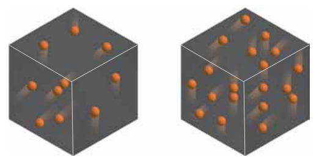

#### Factor 3: Temperature

- distribution of kinetic energy of each particle changes as temp. of substance changes
- when temp. increases, particles have more kinetic energy
	- $\therefore$ collision frequency ++
	- number of effective collisions / time ++

*Graph of effective collisions based on temperature:*

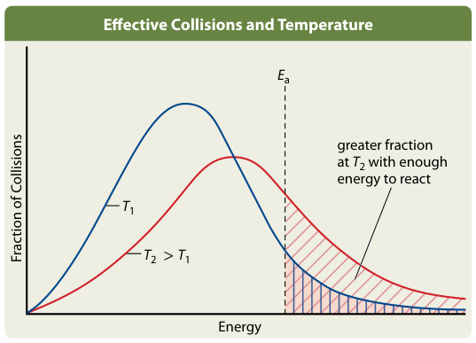

*Observations from graph:*

- at both temps, relatively small fraction of collisions have enough energy for a collision to result in reaction
- as temp. increases &rarr; collisions w/ enough energy increases significantly

#### Factor 4: Pressure

- for gaseous reactants, increasing pressure increases no. of collisions / unit time
- Boyle's law
	- pressure can be increased by adding more reactant gas particles to fixed volume
	- or by reducing volume of reaction container

#### Factor 5: Surface Area

- *Real-World Example, Sugar:*
	- powdered sugar dissolves faster than granular sugar
- smaller pieces of reactants have greater amount of exposed surface area
	- compared to larger pieces w/ same total mass
- $\therefore$ chances of effective collisions increase
- increase in reaction not always desirable
	- some powdered materials are highly combustible
	- i.e. coal dust in mines, flour dust in mills, sawdust in lumber mills
	- explosion if spark sets off reaction

#### Factor 6: Catalyst

- some chem. reactions have extremely high activation energies
	- reaction will either not occur
	- or occur very slowly (days or even years)
- **catalyst** increases rate of chemical reaction by lowering activation energy
	- $\therefore$ larger fraction of reactants have enough energy to meet / exceed activation energy
	- helps make reactions in industry practical and profitable
- **catalyzed reaction:** reaction where a catalyst has been used
- sometimes catalyst partakes in reaction
	- returns back to its original state after overall reaction finishes

*Potential energy diagram of reaction v. catalyzed reaction*

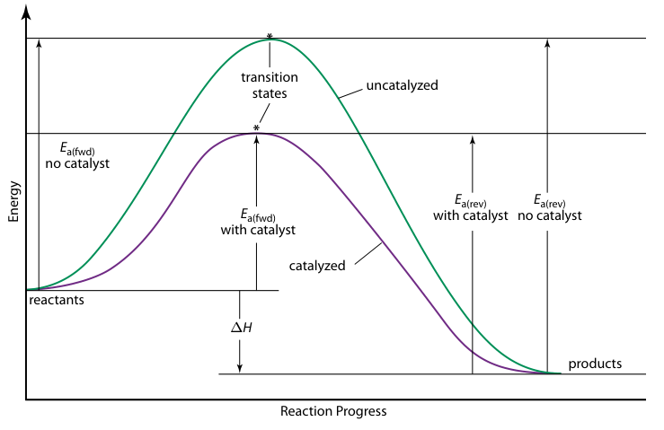

### Catalysts in Industry

- more than 3,000,000 t of catalysts produced / yr. in North America
- newly discovered catalysts are patented / kept as closely guarded secrets
- fast reactions requiring high temp. or pressures are expensive and dangerous to maintain

#### Production of Ammonia

- many uses of ammonia like
	- prod. of fertilizer
	- prod. of explosives

Formation of ammonia from nitrogen and hydrogen

$$
\begin{gather*}
\ce{N2(g) + 3H2(g) -> 2NH3(g)} && \Delta H^\circ_r = -92.6\text{ kJ/mol}
\end{gather*}
$$

- reaction very slow at room temp.
- increasing temp. increases rate, but also increases decomposition of ammonia
- 20th century: German chemist Fritz Haber discovered that reaction proceeds quickly at ~500 &deg;C
	- when catalyst of iron and small amnt. of potassium oxide & aluminum oxide used
- German chemical engineer Carl Bosch then determined how to apply reaction to prod. ammonia on industrial scale
- *Haber-Bosch process:* process where molecules of nitrogen and hydrogen break apart due to metal catalyst
	- broken apart molecules quickly react to form ammonia

*Synthesis of ammonia via Haber-Bosch process:*

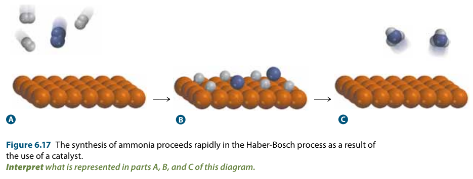

#### Production of Sulfuric Acid

- sulfur can be converted into sulfuric acid
- some uses of sulfuric acid:
	- manufacturing chemicals
	- refining ores
	- processing waste water
- *contact process:* the conversion process of sulfur &rarr; sulfuric acid
- catalyst: vanadium(V) oxide &mdash; $\ce{V2O5(s)}$
- reaction in step (2) would decrease overall reaction rate if catalyst not used

$$
\begin{gather}
\ce{S8(s) + 8O2(g) -> 8SO2(g)} \tag 1 \\
\ce{2SO2(g) + O2(g) ->[V2O5(s)] 2SO3(g)} \tag 2 \\
\ce{SO3(g) + H2SO4(aq) -> H2S2O7(aq)} \tag 3 \\
\ce{H2S2O7(aq) + H2O(l) -> 2H2SO4(aq)} \tag 4
\end{gather}
$$

#### Production of Nitric Acid

- *Ostwald process:* industrial process used to prod. nitric acid
- one major use of nitric acid:
	- production of ammonium nitrate (fertilizer)
- first step catalyzed using platinum-rhodium catalyst (Pt-Rh) at 800 &deg;C
- both nitric and nitrous acid formed in step 3
	- heating nitrous acid forms nitric acid in step 4

$$
\begin{gather}
\ce{4NH3(g) + 5O2(g) ->[Pt-Rh, 800\degree C] 4NO(g) + 6H2O(g)} \tag 1 \\
\ce{2NO(g) + O2(g) -> 2NO2(g)} \tag 2 \\
\ce{2NO2(g) + H2O(l) -> HNO2(aq) + HNO3(aq)} \tag 3 \\
\ce{3HNO2(aq) -> HNO3(aq) + H2O(l) + 2NO(g)} \tag 4
\end{gather}
$$

#### Catalysts to Reduce Pollution

- catalysts often used to convert pollutants emitted into less harmful forms
- harmful pollutants
	- sulfur dioxide
	- nitrogen oxides
	- source: comb. of fossil fuels
- catalysts convert sulfur dioxide into hydrogen sulfide 
	- and nitrogen oxides into nitrogen gas

#### Biological Catalysts (Enzymes) in Paper Production

- in living organism, all chem. reactions must proceed under conditions needed to sustain life
- in humans, reactions must take place at 37 &deg;C (body temp.)
- **enzyme:** biological catalyst (usually protein)
- manufacture of paper involves sep. plant fibres from other plant material
- then compressing fibres into thin sheets and drying them
- xylan (subst.) in plant fibres makes it more difficult to remove natural brown colour from fibres
	- chlorine-based bleaches typically used to make paper white
	- bleaches harmful to environ.
- xylanases (class of enzymes) break down xylans
	- naturally prod. by fungi and some bacteria
- addition of xylanases reduces qty. of bleach needed
	- fewer bleach in waste water
- amylase also used in paper prod.
	- used in prod. of starch that can be added to paper
	- starch improves paper strength and increases ability to withstand friction of erasers

---

## C6.3 - Reaction Rates and Reaction Mechanisms

### Measuring Effect of Concentration on Reaction Rate

- review: measuring instantaneous rate of reaction involves measuring slope of tangent at given point
- reaction slows down over time, since concentration of reactants decreases
- slope of tangent = $\dfrac{\Delta[A]}{\Delta t}$

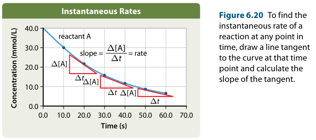

- products being to form as soon as reaction starts
- presence of products allows reverse reactions as well
- observed rate of reaction (after t = 0) is affected by rate of reverse reaction
- **initial rate:** rate of chemical reaction at time zero
	- only accurate relationship between concentration of reactant and reaction rate

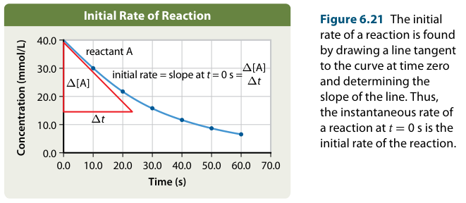

### Graphing Reaction Rate in Terms of Concentration

#### Determining a Rate Law

*Example is first-order*

- several experiments are carried out observe effects of concentration on rate
- (A) graphs are drawn showing concentration over time w/ diff. starting concentrations
	- initial rates are determined for each concentration
- (B) initial rates are plotted against starting concentration

*Graphs are described above*

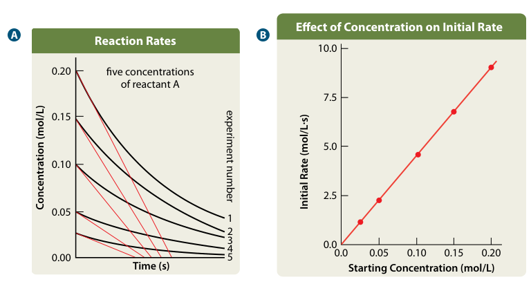

- graph in (B) shows that relationship between initial rate of reaction and starting conc. is linear
- linear equation: $y=mx+b$ where in (B)
	- $y$ = initial rate
	- $x$ = starting concentration
	- $m$ = slope
	- $b=0$

Rate relationship of above reaction in chemistry

$$
r = k[A]
$$

- $r$ = initial rate
- $k$ = the "slope"
- $[A]$ = concentration of substance A

#### First-order Reactions

- **first-order reaction:** reaction whose initial rate v. concentration has a linear relationship
- rate is proportional to concentration of A
- $k$ &mdash; proportionality constant
- if conc. doubled, rate doubled
- *example reactions:* many decompositions
	- rate prop. to concentration of single reactant
- for reactions w/ >1 reactant
	- experiments can be carried out on each reactant individually

*General reaction example:*

$$
\ce{A(aq) + 2B(aq) -> 3C(aq) + 4D(aq)}
$$

- experiments would be performed w/ excess of reactant B
	- its effect on rate negligible
- concentrations of A would be varied
- then experiments would be done w/ excess reactant A
- concentrations of B varied

if each set of experiments w/ each reactant gave a linear relationship

reaction is first order w/ respect to reactant A and to reactant B

$$
r = k[A] \land r = k[B]
$$

#### Second-order Reactions

- **second-order reaction:** reaction whose reaction rate v. concentration have a quadratic relationship
- many reactions do not have a linear relationship between reaction rate and concentration
- i.e. chlorine dioxide + hydroxide &rarr; chlorate + chlorite + water

$$
\ce{2ClO2(aq) + 2OH-(aq) -> ClO3-(aq) + ClO2-(aq) + H2O(l)}
$$

- shape of curve is parabolic (half of parabola, w/ vertex at origin)
- math equation: $y = ax^2$ ($a=k$)

*Equation for second-order relationship:*

$$
r = k[A]^2
$$

- concentration doubled &rarr; reaction 4x as fast
- concentration tripled &rarr; reaction 9x as fast

#### Rate Law

- possible (uncommon) for reactions to have an **order of zero** or fractional order (1/2, 3/4, etc.)
	- i.e. catalyzed reaction w/ respect to one reactant if catalyst was saturated
	- reaction rate *does not change*

**rate law:** general relationship between reaction rates and concentration of reactants:

$$
r = k[A]^m[B]^n \tag{rate law}
$$

- $m$ &mdash; order of reaction w/ respect to reactant A
- $n$ &mdash; order w/ respect to reactant B
- $k$ &mdash; *rate constant*
- ℹ order of overall reaction = $m+n$
	- each constant (order and *k*) must be calculated from experimental data

#### Sample Problem: Determining Order of Reaction and Rate Constant

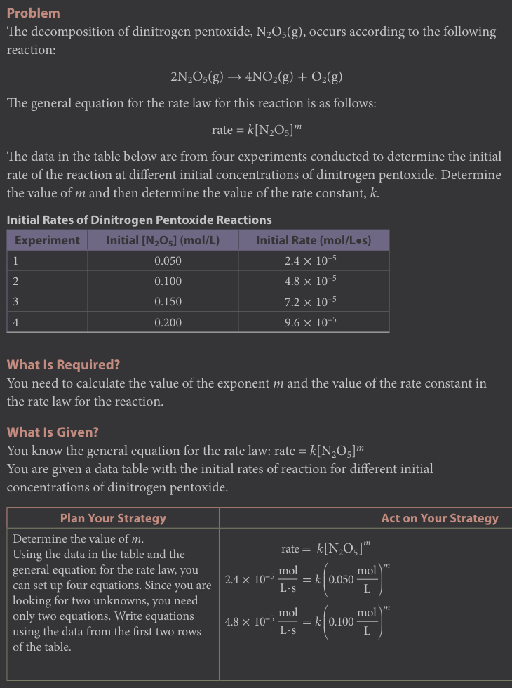

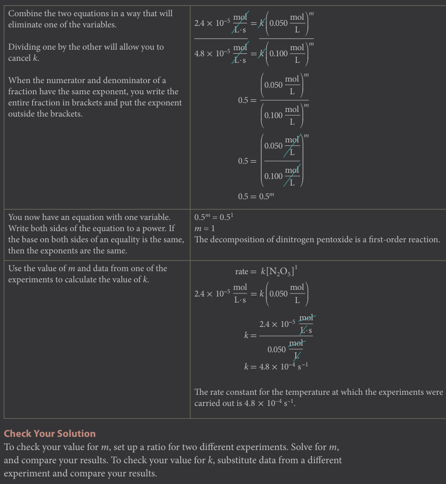

#### Sample Problem: Determining Rate Law

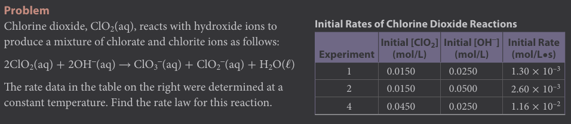

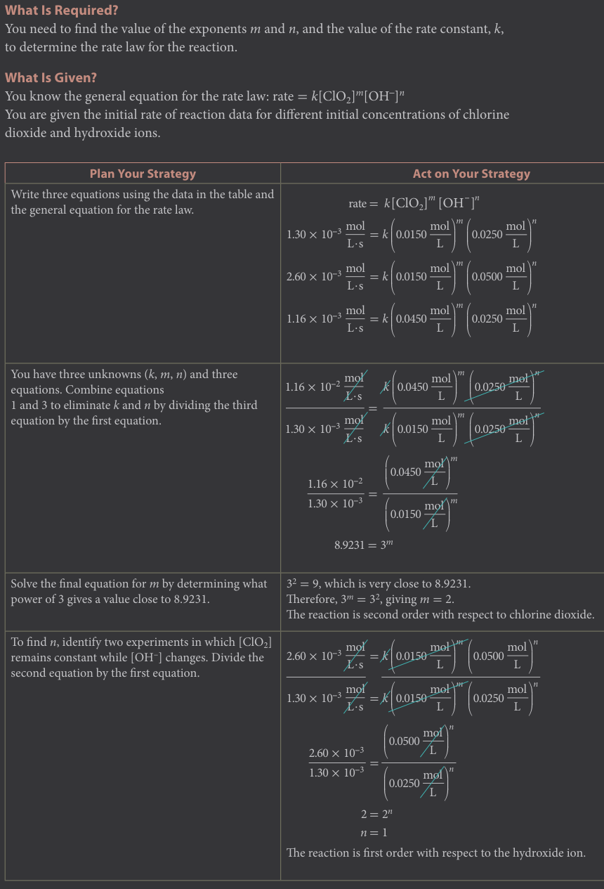

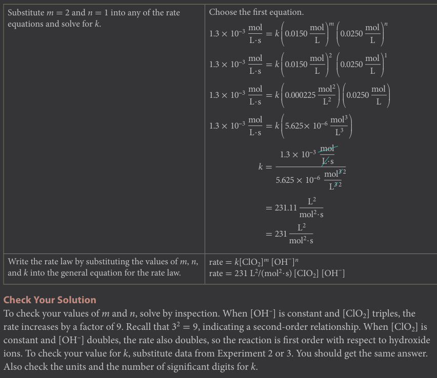

### Reaction Mechanisms

- **reaction mechanism:** series of elementary steps that add to the overall reaction
- in many reactions, there can be more than one activated complex
- **elementary step:** each individual step in a reaction composed of multiple steps at the molecular level

#### Determining Reaction Mechanisms

*Example:* 2-bromo-2-methylpropane + sodium hydroxide &rarr; 2-methyl-propan-2-ol + sodium bromide

Net ionic equation:

$$
\ce{(CH3)3CBr(aq) + OH-(aq) -> (CH3)3COH(aq) + Br-(aq)}
$$

- experiments show this reaction is first order w/ respect to 2-bromo-2-methylpropane
- zero order w/ respect to hydroxide
- observation that changing concentration is strong indication
	- that reaction is not simple, one-step reaction
- experiments cannot reveal molecular steps

##### Femtochemistry and Intermediates

- 1980s: chemists began using laser pulses to monitor chemical reactions
	- pulses extremely short (in order of femtoseconds)
- *Technique:* series of pairs of pulses
	- wavelength of laser light and time between pulses can be varied
	- in each pair of pulses, first pulse supplies activation energy to initiate reaction
	- absorbance of 2nd pulse can be measured to det. absorbance characteristics of any activated complexes
	- ... or intermediate chemical species
	- can identify some chemicals existing very briefly
	- *activated complexes* generally exist for only 10-1,000 fs
- data from femtosecond level pulses show changes in chemical bonds
	- allows det. of reaction mechanisms and factors affecting rate of reactions
- **femtochemistry:** field of study where the goal is to determine reaction mechanisms

*Example: Overall decomposition of dinitrogen monoxide*

$$
\ce{2NO2(g) -> 2N2(g) + O2(g)}
$$

Elementary steps:

1. Oxygen atom is briefly produced in first elementary step

$$
\ce{N2O -> N2 + O}
$$

2. Oxygen reacts w/ another molecule of dinitrogen monoxide to prod. nitrogen and oxygen

$$
\ce{N2O + O -> N2 + O2}
$$

*Sum of chemical reaction*

$$
\begin{array}{ccc}
& (1) & \ce{N2O -> N2 + O} \\
+& (2) & \ce{N2O + O -> N2 + O2} \\
\hline & \text{(sum)} & \ce{2N2O + \cancel{\ce O} -> 2N2 + \cancel{\ce O} + O2}
\end{array}
$$

- **intermediate:** chemical species that appears in the elementary steps of a chemical reaction but not in the overall balanced chemical reaction
	- oxygen above is *intermediate*

#### Rate-Determining Step

- rate of reaction that has more than 1 elementary step det. by rate of slowest elementary step
- *analogy:* in a one lane road, all vehicles can go only as fast as the slowest vehicle
- **rate-determining step:** slowest elementary step in a given multistep reaction
	- determines rate of overall reaction
	- a.k.a. *rate-limiting step*

i.e. nitrogen monoxide + hydrogen &rarr; nitrogen + water

$$
\ce{2NO(g) + 2H2(g) -> N2(g) + 2H2O(g)}
$$

Elementary steps:

$$
\begin{gather*}
\ce{2NO -> N2O2} \tag{1, fast} \\
\ce{N2O2 + H2 -> N2O + H2O} \tag{2, slow} \\
\ce{N2O + H2 -> N2 + H2O} \tag{3, fast}
\end{gather*}
$$

- 2nd step is rate-determining step
- each elementary step has its own activation energy

*Potential energy diagram of multistep reaction:*

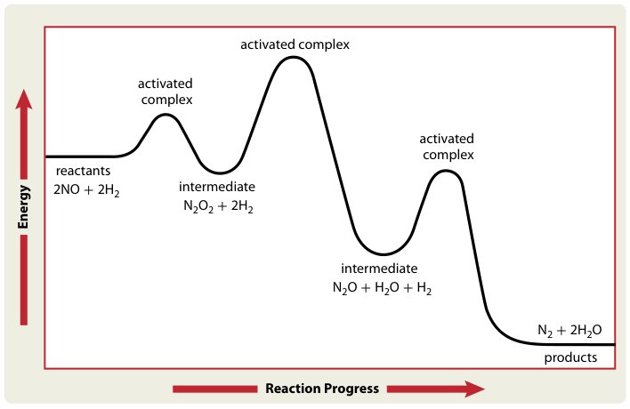

Second hill is highest &rarr; rate-determining step

#### Determining Rate Law for Elementary Steps (Nelson 6.6)

For elementary equation (general)

$$
\ce{aA + bB +cC -> products}
$$

Rate law: $r = k[\text A]^a[\text B]^b[\text C]^c$

- Can adjust rate law depending on number of reactants
- Exponents are derived from coefficients

### Proposed Reaction Mechanism

*Prev. Example:* reaction btwn. 2-bromo-2-methylpropane and hydroxide ion

Net ionic equation:

$$
\ce{(CH3)3CBr(aq) + OH-(aq) -> (CH3)3COH(aq) + Br-(aq)}
$$

*Mechanism:*

- order w/ respect to organic comp: 1
- order w/ respect to hydroxide: 0
- (1) 2-bromo-2-methylpropane ionizes and ejects bromide [very slow]
- (2) hydroxide forms covalent bond w/ positive carbon ion [fast]
	- increasing concentration of hydroxide has no effect since hydroxide is "waiting" for a positive charge
- when 2-methylpropan-2-ol forms, it is quite stable, bcz. activation energy for rev. reaction is too large

*Reaction steps of above example:*

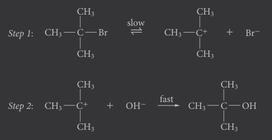

*Another example:* bromoethane and hydroxide react

$$
\ce{CH3CH2Br(aq) + OH-(aq) -> CH3CH2OH(aq) + Br-(aq)}
$$

- reaction is 1st order w/ respect to both bromoethane and hydroxide
- *Mechanism:*
	- activation for ionization of bromoethane is too high; so it doesn't occur
	- carbon-bromide bond is polar, so carbon is slightly pos. charged
	- neg. hydroxide approaches carbon and "pushes" bromide away
	- occurs in one step

*Reaction of above example:*

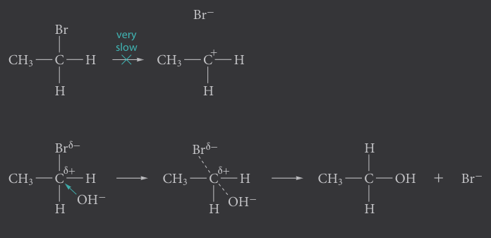

#### Sample Problem: Evaluating Mechanism using Rate Law (Nelson 6.6)

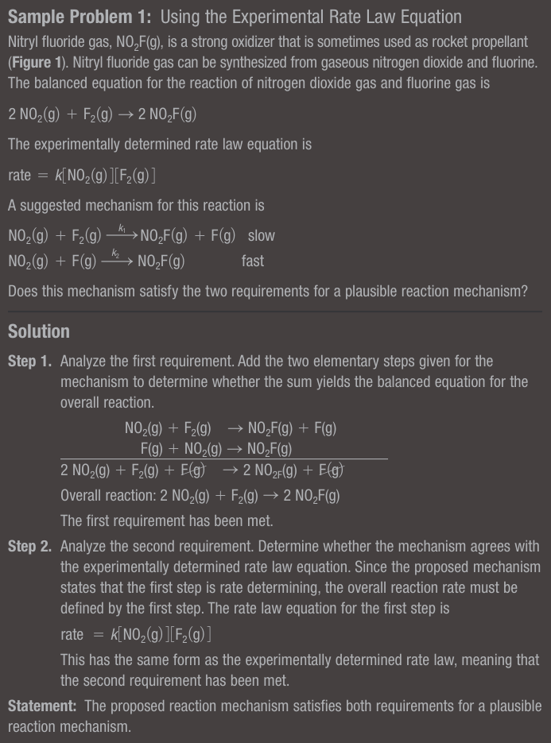

#### Sample Problem: Identifying Rate-Determining Step (Nelson 6.6)

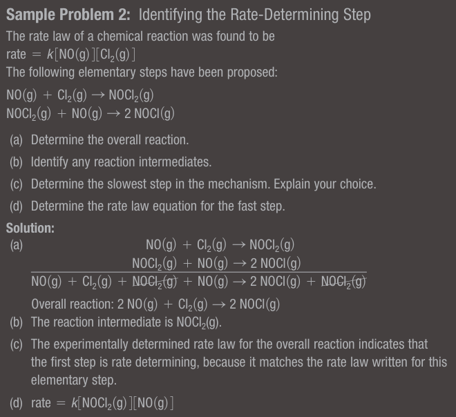