# C7 - Chemical Equilibrium

## C7.1 - Chemical Systems in Balance

### Reversible Reaction and Chemical Equilibrium

- **reversible reaction:** chemical reaction that proceeds in both forward and reverse directions

*Example reaction, ammonia prod:*

$$
\ce{N2(g) + 3H2(g) <=> 2NH3(g)}
$$

- Suppose nitrogen and hydrogen are put together
- Init concentration of reactants: high
- Init concentration of ammonia: 0
- As reaction proceeds, amnt. of reactant decreases
	- amnt. of ammonia increases
- System eventually reaches *equilibrium*
- **chemical equilibrium:** state in chemical system where the forward and reverse reaction are occuring at the same rate

*Equilibrium concentrations chart:*

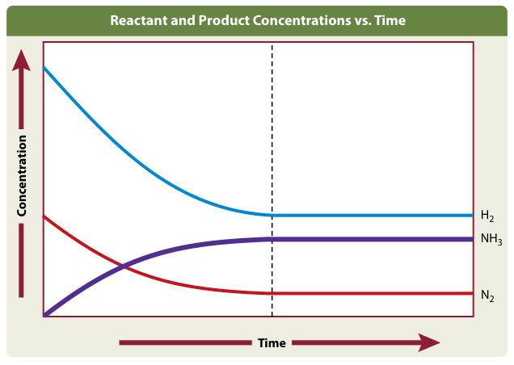

#### Dynamic Equilibrium

- in chemical equilibrium, reactions happen in both directions but at same rate
- no net change in products or reactants
- however, reactions in both directions continue to occur
- ammonia prod. in equilibrium has *macroscopic property* of constant concentrations
- **macroscopic property:** observable / measurable property
	- i.e. concentration, colour, temp. pressure, pH
- **dynamic equilibrium:** chemical system at equilibrium which is changing at molecular level
	- while macroscopic properties remain constant
- equilibrium does not mean concentrations have to be the same

#### Writing Equilibrium Equations

- double arrow ($\ce{<=>}$) indicates reversibility
- L to R: forward reaction
- R to L: reverse reaction

*Example*

$$
\ce{N2 + 3H2 <=> 2NH3}
$$

### Equilibrium Involving Physical Systems

- some equilibrium systems involve one substance in two physical states
- consider: water evaporating away from a flask
	- at surface of water, some water molecules have enough kinetic energy
	- and are moving in right direction to overcome IMFs of other water mcls.
	- these fast-moving water mcls. vaporize and escape into air
	- nearby water mcls. fill in the gap left, and process repeats
- however, you plug the flask
	- some water mcls. at surface escape and vaporize
	- as more water mcls. vaporize, pressure of vapor above liquid increases
	- some vapor mcls. collide w/ molecules at surface of liquid
	- if KE of vapor mcls. too low, they can't escape IMFs of liquid and thus condense
	- eventually, rate of condensation = rate of evaporation
	- *dynamic equilibrium* (amounts are constant)

*Illustration of water vapor / liquid equilibrium*

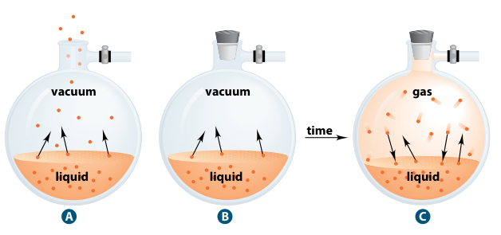

*Graph of vapour pressure v. time*

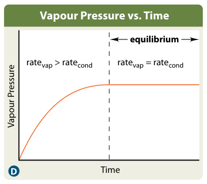

*2nd example:*

- iodine in closed flask
- some iodine sublime (s to g)
- gaseous iodine w/ lower KE deposit (g to s)
- *dynamic equilibrium*

### Conditions Necessary to Establish Equilbirium

- System must be *closed*
	- i.e. in water vapour, the gaseous mcls. could escape when system was open
	- no other mcls. / surrounding environ. may interfere w/ system

#### Thermal Energy Requirements of Reversible Reactions

- in reversible reaction
	- reaction in one direction: exothermic
	- reaction in other direction: endothermic
	- vice versa
- changing temp. alters rate of fwd. and rev. reactions
- temp. inc. adds thermal energy
	- causes reaction that absorbs thermal energy to proceed faster
	- than reaction that releases thermal energy
- temp. inc. rem. thermal energy
	- favours reaction that releases thermal energy

### Homogeneous and Heterogeneous Equilibria

- **homogeneous equilibrium:** chemical sys. in equilibrium where all components have the same physical state
- **heterogeneous equilibrium:** chemical sys. in equilibrium where components have diff. physical states

*Homogeneous equilibrium ex:*

$$
\ce{N2(g) + 3H2(g) <=> 2NH3(g)}
$$

Prod. of ammonia

*Heterogeneous equilibrium ex:*

$$
\ce{H2O(l) <=> H2O(g)}
$$

Water changing state

$$
\ce{CaCO3(s) <=> CaO(s) + CO2(g)}
$$

limestone decomposes to form quicklime and carbon dioxide

### Common Factors in Equilibrium Systems

- system in *equilibrium* when rate of forward process = rate of reverse process
- *macroscopic properties* are *constant* in equilibrium
- equilibrium can only be reached in closed system
	- where matter cannot cross sys. boundary
	- true equilibrium occurs in isolated systems
- equilibrium can be established from either direction

### Equilibrium Constant Expression

#### Law of Chemical Equilibrium

1864: Norwegian chemists Cato Guldberg and Peter Waage proposed *law of chemical equilibrium*

> **Law of Chemical Equilibrium** a.k.a. *Law of Mass Action*
>
> In a chemical system at equilibrium, there is a constant ratio between the concentrations of the products and the concentrations of the reactants.

#### Understanding the Law of Chemical Equilibrium

Example reaction:

$$
\ce{N2O4(g) <=> 2NO2(g)}
$$

dinitrogen oxide (colourless) converts into nitrogen dioxide (brown)

- small qty. of dinitrogen oxide added into bottle
- initial rate of forward reaction is very fast
- initial rate of rev. reaction is 0
- rate fwd. dec. while rate rev. inc.
- at equilibrium, both reach same rate
- there is a constant ratio between product and reactant ratios at equilibrium

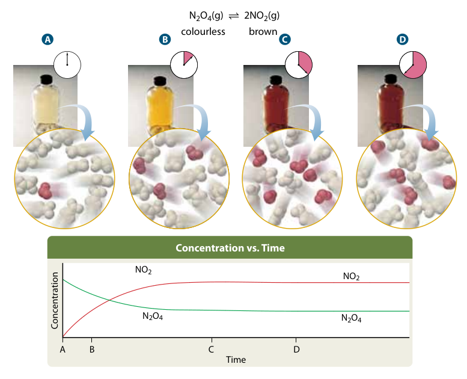

#### Deriving Equilibrium Constant, $K_\text{eq}$

*Using example reaction above*

At equilibrium, rate of fwd. reaction = rate of rev. react.

$$
r_\text{fwd} = r_\text{rev}
$$

- both reactions are elementary steps
- so rate laws can be written from balanced chem. equation
- "eq" denotes equilibrium

$$
k_\text{fwd}[\ce{N2O4}]_\text{eq} = k_\text{rev}[\ce{NO2}]^2_\text{eq}
$$

Writing rate law equations as ratio

$$
\frac{k_\text{fwd}}{k_\text{rev}} = \frac{[\ce{NO2}]^2_\text{eq}}{[\ce{N2O4}]_\text{eq}}
$$

Ratio is rate law equations is called equilibrium constant, $K_\text{eq}$

$$
K_\text{eq} = \frac{[\ce{NO2}]^2_\text{eq}}{[\ce{N2O4}]_\text{eq}}
$$

- **equilibrium constant ($K_\text{eq}$):** ratio of equilibrium concentrations at particular temp. for particular chem. sys.
	- no units
	- each conc. value div. by reference state, and has no units

*General equilibrium reaction:*

$$
\ce{aA + bB <=> cC + dD}
$$

**Equilibrium Constant Expression:**

$$
\therefore K_\text{eq} = \frac{[\text C]^c[\text D]^d}{[\text A]^a[\text B]^b} = \frac{[\text{products}]}{[\text{reactants}]}
$$

- $[\text A], [\text B]$ &mdash; concentrations of reactants at equilibrium
- $[\text C], [\text D]$ &mdash; concentrations of products at equilibrium
- $a, b, c, d$ &mdash; stochiometric coefficients of each component in equation

*Position of Equilibrium:*

- When $K_\text{eq} > 1$, product formation is favoured
	- *equilibrium lies to the right*
	- $K_\text{eq} > 10^{10}$ indicates reaction will proceed to completion
- When $K_\text{eq} \approx 1$, system in equilibrium
	- approx. equal amounts of reactants and products at equilibrium
- When $K_\text{eq} < 1$, reactant formation is favoured
	- *equilibrium lies to the left*
	- $K_\text{eq} < 10^{-10}$ indicates reaction will not take place at all

*Diagram visualizing position of equilibrium:*

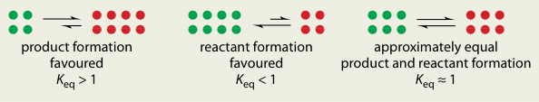

#### Ex: Expressions for Homogeneous Equilibrium

Simply use balanced chemical equation

> **Problem:** Sulfuric acid is produced through the contact process, which involves the catalytic oxidation of sulfur dioxide as an intermediate reaction:
> 
> $\ce{2SO2(g) + O2(g) <=> 2SO3(g)}$
>
> Write equilibrium expression for this process.

**Required:** Expression for $K_\text{eq}$

**Given:** Balanced chem. eq.

**Solution:**

*Utilize chemical equation above to write equilibrium constant expression. Coefficient of 2 indicates squaring:*

$$
\therefore K_\text{eq} = \frac{[\ce{SO3}]^2}{[\ce{SO2}]^2[\ce{O2}]}
$$

**Check Solution:**

- Square brackets = concentration
- Products in num., reactants in den.
- Each term is raised to power of its coefficient
- Power of 1 not written ?

#### Expressions for Heterogeneous Equilibrium

*Example:* Dynamic liquid-vapour equilibrium of ethanol

$$
\ce{C2H5OH(l) <=> C2H5OH(g)}
$$

Writing equilibrium expression for above using general form:

$$
K = \frac{[\ce{C2H5OH(g)}]}{[\ce{C2H5OH(l)}]}
$$

Liquid ethanol has constant concentration, so it is brought outside expression:

$$
[\ce{C2H5OH(l)}]K = [\ce{C2H5OH(g)}]
$$

Conc. of pure substance ethanol is combined w/ $K$, and that becomes equilibrium constant

$$
K_\text{eq} = [\ce{C2H5OH(g)}]
$$

*Equilibrium constant depends only on concentration of gaseous ethanol*

#### Pure Substances in Equilibrium Expressions

- Pure liquids and solids are not included in equilibrium constant expressions
	- Reason: Their concentrations remain constant
- Only gases and solutions are included in expression

#### Ex: Equilibrium Constant Expression for Heterogeneous Sys.

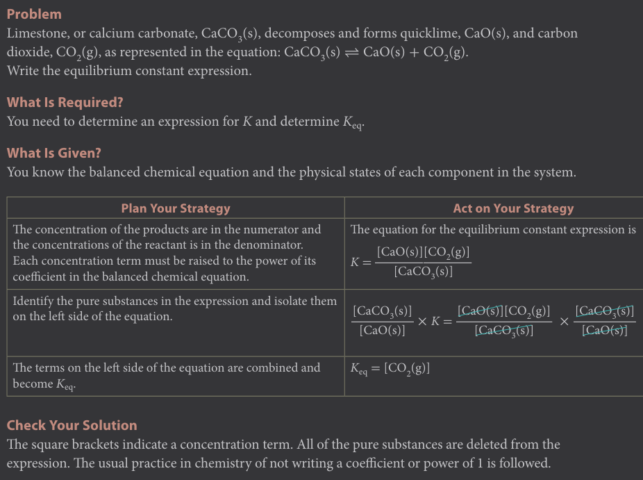

---

## C7.2 - Effects of External Changes on Equilibrium

### Le Châtelier's Principle

Proposed by Henri Le Châtelier, French chemist in 1888

> **Le Châtelier's Principle:**
> 
> If an external stress (a change in concentration, pressure, volume, or temperature) is applied to a chemical system at equilibrium, ...
> 
> the rates of the forward and reverse reactions are temporarily unequal because the stress affects the reaction rates.
> 
> However, equilibrium is eventually restored in the chemical system.

#### Effects of Concentration Changes on Equilibrium

*Example:* Haber-Bosch process to manufacture ammonia

$$
\ce{N2(g) + 3H2(g) <=> 2NH3(g)}
$$

- ammonia removed from mixture of gases by cooling
- when temp. decreases, ammonia liquifies before nitrogen or hydrogen
- when ammonia removed, equilibrium temporarily shifts to right
	- fewer ammonia to do rev. reaction
- more ammonia is prod. until equilibrium is reached
- if more hydrogen and nitrogen added, more mcls. to do fwd. reaction
	- more ammonia prod.

*Reaction vessel for ammonia:*

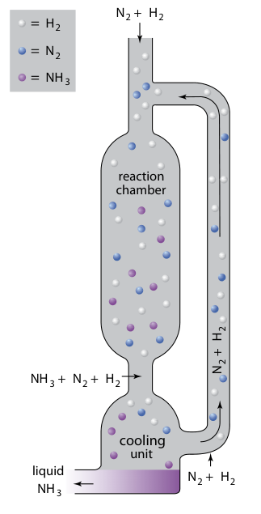

*Example:* Dinitrogen tetroxide to nitrogen dioxide

$$
\ce{N2O4(g) <=> 2NO2(g)}
$$

- when more dinitrogen tetroxide is injected, that gas has a sharp increase
- concentration then immediately begins to drop
- rate of rev. reaction also begins to increase
- *KEY:* ratio of new concentrations of products to reactants is SAME as original ratio

*Graph of concentration v. time for reaction above:*

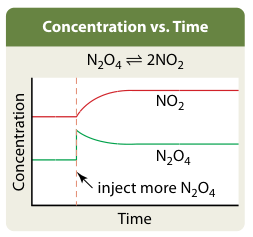

**Summary of Concentration Effects:**

- Increasing conc. of product causes reaction to shift left (reactants)
- Decreasing conc. of product causes reaction to shift right (products)
- Increasing conc. of reactant causes reaction to shift right (products)
- Decreasing conc. of reactant causes reaction to shift left (reactants)
- Equilibrium tries to "fill" the "missing" components
- $K_\text{eq}$ unaffected, since product : reactant ratio remains constant

*Concentration changes in body:*

Carbonic acid in blood:

$$
\ce{H2CO3(aq) <=> CO2(aq) + H2O(l)}
$$

- body controls levels of carbonic acid by rem. carbon dioxide
- decreases carbonic acid in blood
- helps maintain safe levels of this acid

#### Effects of Volume and Pressure Changes on Equilibrium

- when vol. of gas mixture decreases, pressure of gases increases
- **Boyle's law** states volume of fixed amount of gas at constant temp. varies inversely w/ pressure
	- equation: $V \propto \dfrac 1 P$

*Example:* Decomp. of sulfur trioxide

$$
\ce{2SO3(g) <=> 2SO2(g) + O2(g)}
$$

- when vol. of reaction vessel suddenly decreases (P inc.), system no longer at equilibrium
- volume change &rarr; concentration change
- increase in reactant conc. causes inc. in mcl. collisions
- inc. in fwd. and rev. rate
- gas pressure caused by gas particles striking walls of reaction vessel
- to restore equilibrium, reaction temporarily shifts in dir. that decreases no. of molecules and at same time, decreases system pressure
- to red. pressure here, rev. reaction favoured bcz. less gas mcls.
- if pressure decreases, reaction temp. shifts in dir. w/ more gas mcls.
- ratio of product concentrations to reactant conc. does not change

*Concentration v. time graph*

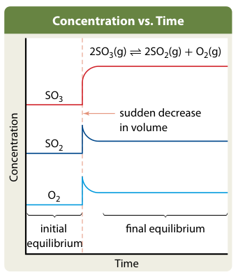

Notice the sudden spike of all components

*Illustration of equilibrium shift*

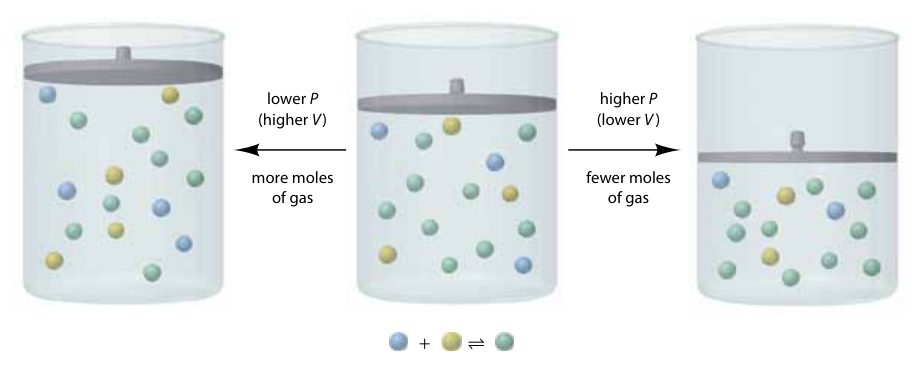

- if reaction has same no. of gas mcls. on both sides
	- inc. of fwd. rate = inc. in rev. rate
	- no effect on equilibrium
- inert gas can also be used to increase pressure
	- does not react w/ system components
	- higher component conc.
	- equal conc. changes does not cause shift

**Summary of effects of pressure-volume changes:**

- If pressure increases, reaction shifts so that total gas particles decreases (less gas)
	- or volume decrease
	- dec. pressure
- If pressure decreases, reaction shifts so that total gas particles increases (more gas)
	- or volume increase
	- inc. pressure
- Inert gas added to system at equilibrium does not cause shift
- $K_\text{eq}$ unaffected because products : reactants is constant

*Example: Freeze-drying foods*

1. Freeze foods so that water becomes ice
2. Pressurize container in which food is in
	1. When pressure decreases, water in food sublimes
3. Remove water vapour from vessel

$$
\ce{H2O(s) <=> H2O(g)}
$$

#### Effects of Temperature Changes on Equilibrium

*Example:* Decomposition of dinitrogen tetroxide, endothermic

$$
\ce{N2O4(g) + 58.0 kJ/mol <=> 2NO2(g)}
$$

- if chemical system cooled, energy in system decreases
- less energy available for fwd. reaction
	- net result: rev. reaction occurs faster than fwd. reaction
	- reaction shifts to left
- as reaction shifts to left, amount of energy in system increases too
- as energy increases, fwd. reaction rate inc.
- eventually, equilibrium reached
- when temp. increases (L to R), endothermic reaction is favoured
	- $K_\text{eq}$ increases as a result
- when temp. decreases (R to L), exothermic reaction is favoured
	- $K_\text{eq}$ decreases as a result

**Summary of Temperature Changes:**

- Temp. increase favours endothermic reaction
	- Shifts away from heat if it were a prod. / react.
- Temp. decrease favours exothermic reaction
	- Shifts toward heat
- In endothermic sys., temp. inc. increases $K_\text{eq}$
	- and vice versa
- In exothermic sys., temp. inc. decreases $K_\text{eq}$
	- and vice versa

*Concentration v. time graphs for endothermic v. exothermic reactions, on temp. increase:*

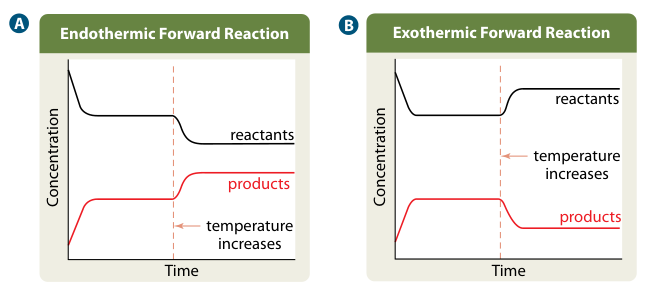

#### Effect of Catalyst on Equilibrium

- Catalyst increases rates of reaction in both directions, when added
- System reaches equilibrium, but catalyst does not shift equilibrium
- $K_\text{eq}$ remains unaffected

> Presence of catalyst does not shift equilibrium.

#### Summary of Effects of Changing Conditions

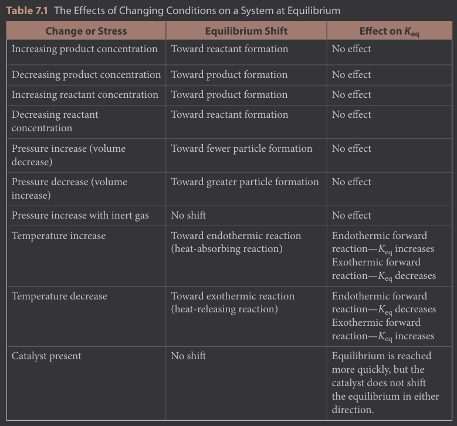

#### Sample Problem: Using Le Châtelier's Principle

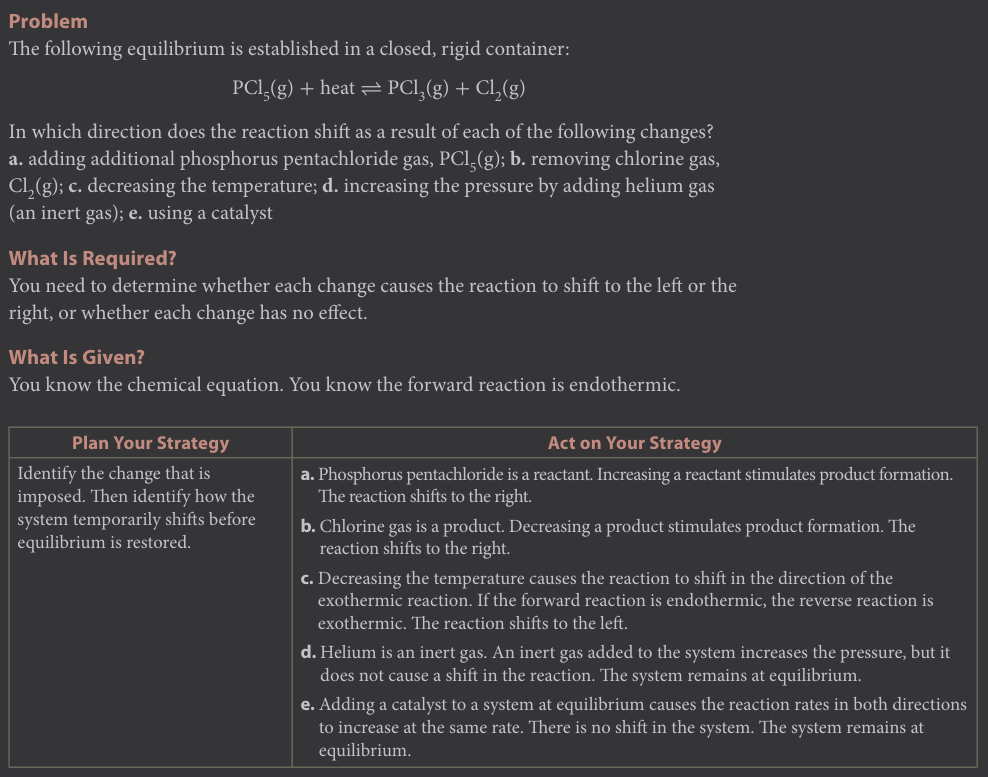

---

## C7.3 - Calculating Equilibrium Constants

### Calculating $K_\text{eq}$

*Ex:* dinitrogen tetroxide to nitrogen dioxide

- many experiments show that equilibrium constant remains constant w/ experimental error at 100&deg;C
- changing concentrations of products and reactants does not change this fact

Reaction:

$$
\ce{2N2O4(g) <=> 2NO2(g)}
$$

*Table of concentrations of reaction:*

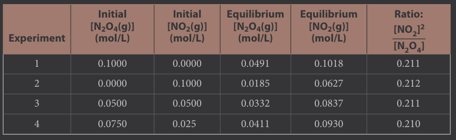

*Equilibrium constant at 100 &deg;C*

$$
K_\text{eq} = \frac{[\ce{NO2}]^2}{[\ce{N2O4}]} = 0.211
$$

#### Ex: Calc. Equilibrium Constant at Equilibrium

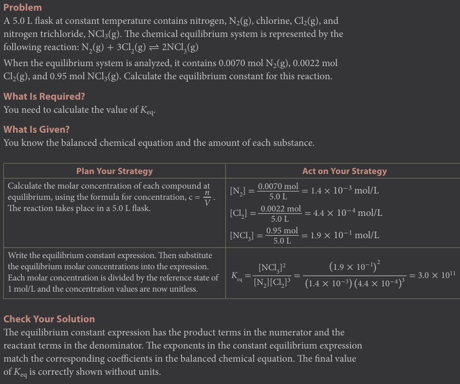

#### Ex: Calc. Molar Concentrations at Equilibrium

> **Problem**
>
> Nitrogen, $\ce{N2(g)}$, and hydrogen, $\ce{H2(g)}$, gases are mixed in a closed 3,500 mL flask. They react and form ammonia, $\ce{NH3(g)}$, as shown below.
> 
> At equilibrium, the mixture contains 0.25 mol of ammonia gas and 0.080 mol of hydrogen gas. The equilibrium constant for this reaction is $K_\text{eq} = 5.81 \times 10^5$.
> 
> What amount of nitrogen gas is present at equilibrium?
>
> $\ce{N2(g) + 3H2(g) <=> 2NH3(g)}$

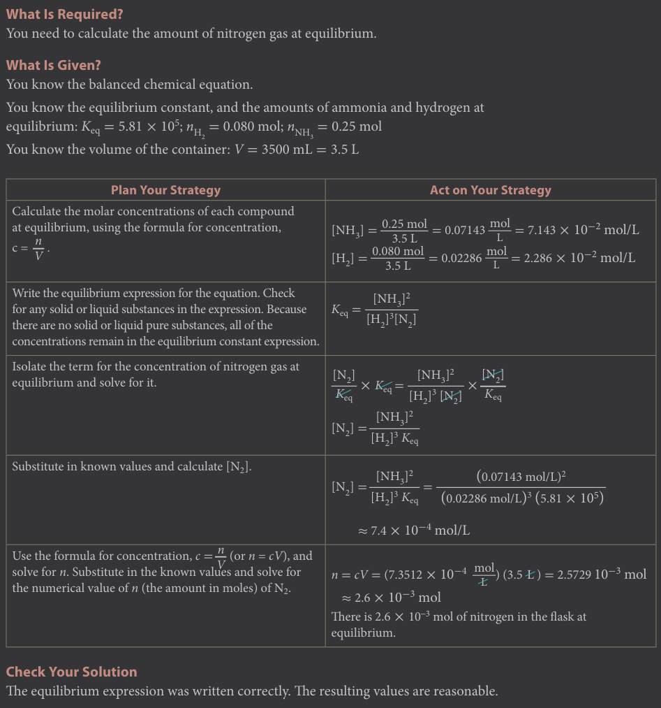

### The Equilibrium Constant, $K_p$

- chem. system w/ only gases can have equilibrium expressed using gas partial pressures
	- for gases, easier to measure partial pressure
- ideal gas law can be used to derive equilibrium constant, as long as all gases are ideal

Ideal gas law, rearranged for concentration

$$
\begin{align*}
PV &= nRT \\
\frac P{RT} &= \frac n V = c
\end{align*}
$$

- $P$ &mdash; pressure (kPa)
- $R$ &mdash; universal gas constant
- $n$ &mdash; amount of gas (mol)
- $V$ &mdash; volume (L)

#### Calculating $K_p$

*Example:*

$$
\ce{CO(g) + 3H2(g) <=> CH4(g) + H2O(g)}
$$

Molar concentrations are replaced with partial pressures

$$
K_p = \frac{P_\ce{CH4}P_\ce{H2O}}{P_\ce{CO}(P_\ce{H2})^3}
$$

Generic equation, letters have same meaning:

$$
\begin{gather*}
\ce{aA + bB <=> cC + dD} \\
K_p = \frac{(P_\text C)^c(P_\text D)^d}{P_\text A)^a(P_\text B)^b}
\end{gather*}
$$

Values of $K_\text{eq}$ and $K_p$ are **NOT** the same

Convert $K_p$ to $K_\text{eq}$

$$
K_p = K_\text{eq}(RT)^{\Delta n}
$$

$\Delta n$ = sum of coeff. of gas products - sum of coeff. of gas reactants

#### Ex: Calc. Equilibrium Constant Using Gas Partial Pressures

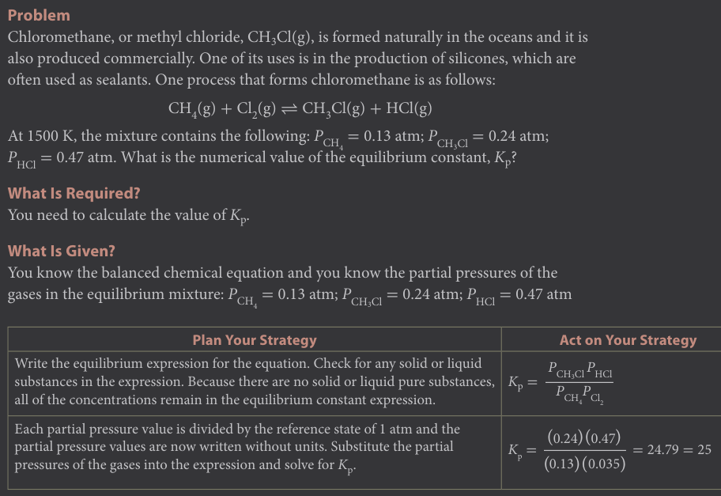

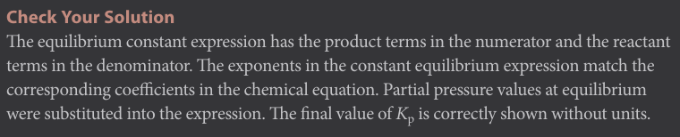

### Using ICE Tables to Det. Equilibrium

- **ICE table:** table that organizes molar concentrations of a chemical system
	- ICE stands for
	- **[I]nitial** molar concentrations of reactants / products
	- **[C]hange** of concentration to reach equilibrium
	- **[E]quilibrium** &mdash; molar concentration at *equilibrium*

*Sample Problem:*

> You want to experimentally determine the equilibrium constant for the decomposition of hydrogen iodide, $\ce{HI(g)}$, at 453°C.
> 
> You fill an evacuated 2.0 L flask with 0.200 mol of hydrogen iodide at 453°C. You let the hydrogen iodide gas decompose into hydrogen gas, $\ce{H2(g)}$, and iodine gas, $\ce{I2(g)}$, until it reaches equilibrium. 
>
> You determine that the concentration of hydrogen iodide gas is 0.078 mol/L at equilibrium, but you do not know the concentrations of the hydrogen or iodine gases.

1. Write out equilibrium eq. and make column below each reactant and product
	1. Label rows with I, C, E

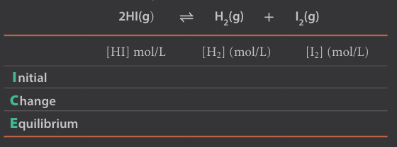

2. Add known values to table ("I" section)
	1. From question, you have initial concentration of reactant
	2. You just started reaction, so no products yet

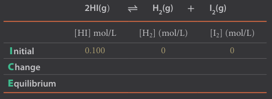

3. Fill in the "C" section of ICE table
	1. Let $x$ be change in conc. for 1 mol of given component
	2. Reactant will decrease and there is 2 mol, so reactant's change is: $-2x$
	3. Product will increase and there is 1 mol each, so product's change is $+x$

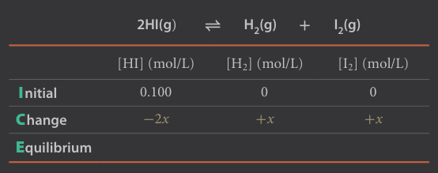

4. Fill in the "E" section of ICE table
	1. Equilibrium concentration is initial conc. + change

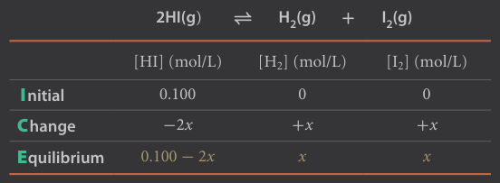

5. Use equilibrium concentration of a component to **solve for $x$**
	1. In this case, equilibrium conc. of HI is 0.078 mol/L

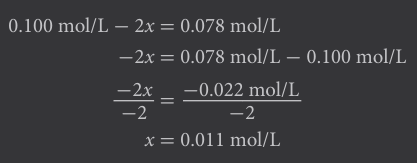

6. Fill in equilibrium concentrations for all components
	1. Conc. of H and I are 0.011 M at equilibrium
7. Solve for equilibrium constant

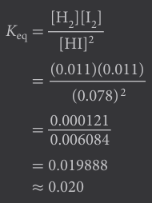

#### Ex: Finding Equilibrium Concentrations

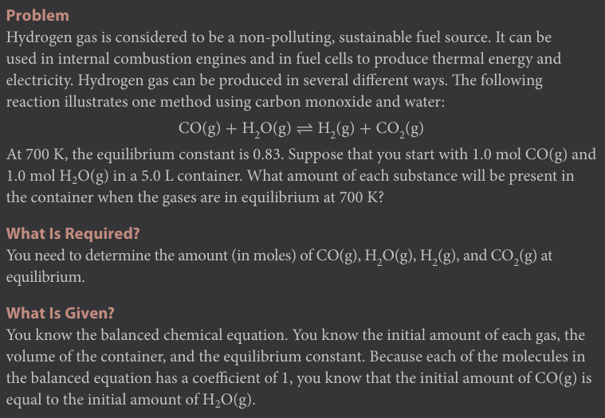

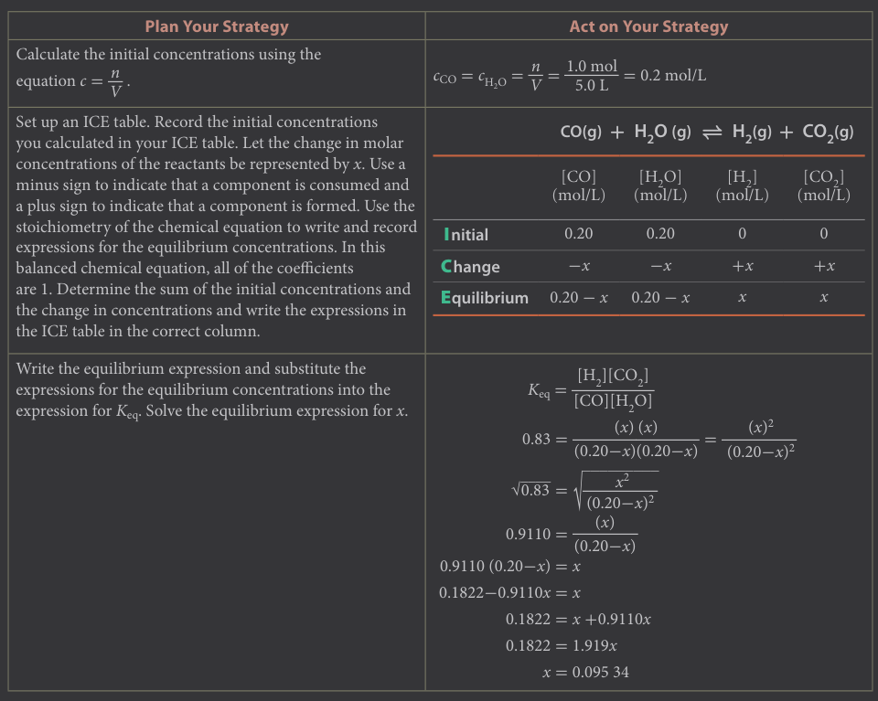

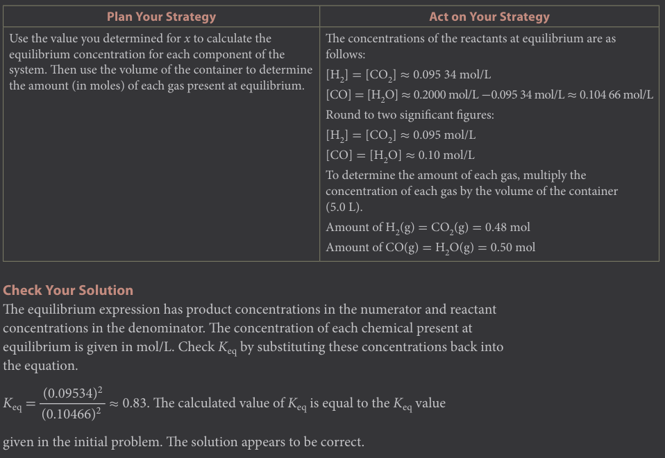

*NOTE:* Keep as much digits as possible, until the last step

### Using Quadratic Formula to Det. Equilibrium

- **quadratic equation:** algebraic equation in form $ax^2 + bx + c$
- **quadratic formula:** algebraic equation used to determine possible solutions to algebraic equations

*Quadratic formula:*

$$
x = \frac{-b \pm \sqrt{b^2 - 4ac}}{2a}
$$

#### Ex: Using Quadratic Form. to Det. Equilibrium

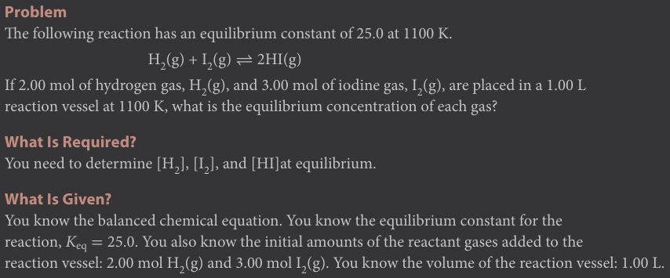

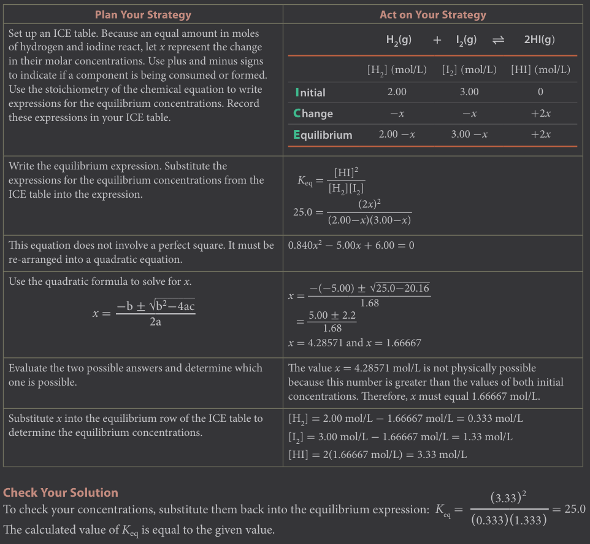

### Solving Problems w/ a Small Equilibrium Constant

- some approximations allow solving equilibrium conc. to be much simpler
- if equilibrium constant is very small, then very small conc. of product is present at equilibrium
- *Example:*
	- Init conc: 0.065 M
	- Change in conc: 0.000032 M
	- Equilibrium conc: 0.064968 M = 0.065 M
- **approximation rule:** the change from initial concentration to equilibrium is negligible
	- *if initial concentration is at least 1000x greater than $K_\text{eq}$*
	- In Mr. Tk's class, 100x greater suffices
	- $\dfrac I K > 100(0)$

#### Ex: Using Approximation Method to find Equilibrium

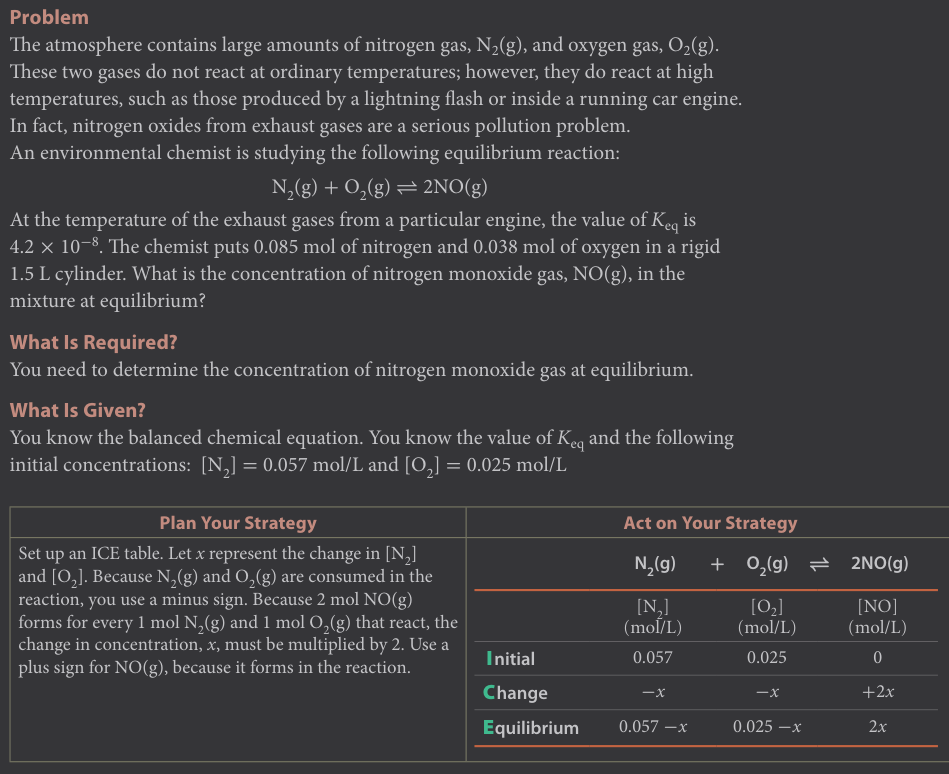

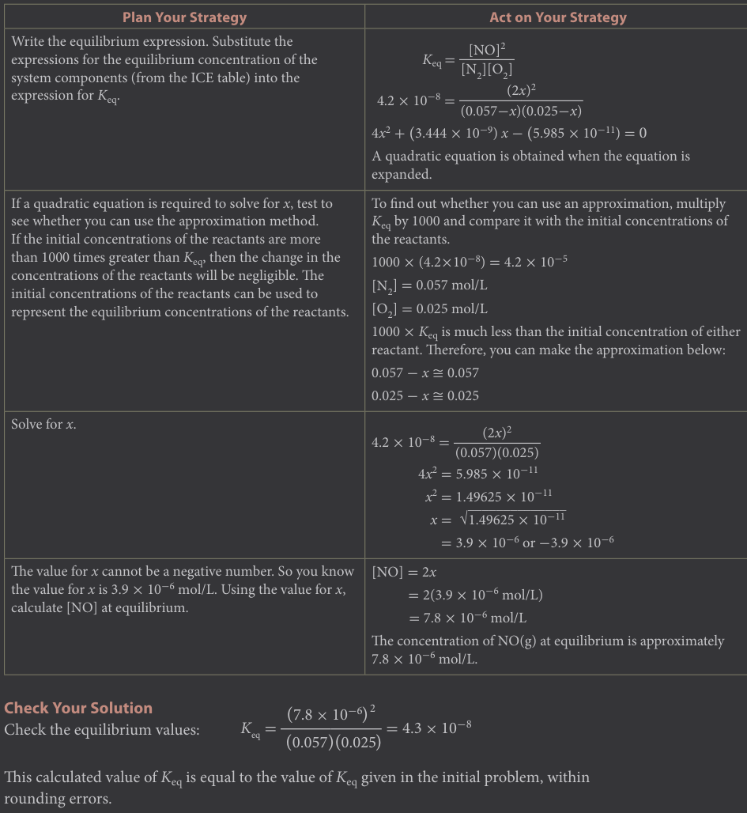

### Measuring Equilibrium Concentrations Using Colour

- equilibrium concentrations need to sometimes be determined indirectly
- *change in colour intensity* can be measured to determine equilibrium constant for reaction

i.e. iron(III) nitrate + potassium thiocyanate &rarr; iron(III) thiocyanate + potassium nitrate

*Net ionic equation:*

$$
\ce{Fe^3+(aq) + SCN-(aq) <=> Fe(SCN)^2+(aq)}
$$

- reactants are nearly colourless, product is orange/blood red
- by measuring intensity of colour, you can calc. equilibrium concentration
- by knowing initial conc., you can det. equilibrium constant
- *Example:*
	- I det. conc. of $\ce{Fe(SCN)^2+}$ to be 4.5 &times 10-4 M
	- Use ICE table to solve rest

### Reaction Quotients, $Q_\text{eq}$ and $Q_p$

- **reaction quotient ($Q$):** numerical value determined by using same formula as equilibrium constant,
	- using data for reversible reaction that may / may not be at equilibrium

*General reaction formula:*

$$
\ce{aA + bB <=> cC + dD}
$$

*Reaction quotient formulas:*

$$
\begin{gather*}
Q_\text{eq} = \frac{[\text C]^c[\text D]^d}{[\text A]^a[\text B]^b} \\
Q_p = \frac{(P_\text C)^c(P_\text D)^d}{(P_\text A)^a(P_\text B)^b}
\end{gather*}
$$

*Q* can be used to predict reaction behaviour

Rules below apply to both "eq" and "p" variants:

- P : R = ratio of products to reactants
- If $Q < K$, then $P:R < K$ &mdash; *Reaction shifts to right*
	- More products need to form and reactants need to be consumed to reach equilibrium
- If $Q = K$, then system at equilibrium
- If $Q > K$, then $P:R > K$ &mdash; *Reaction shifts to left*
	- Products must decompose into reactants to reach equilibrium

#### Ex: Using Reaction Quotient

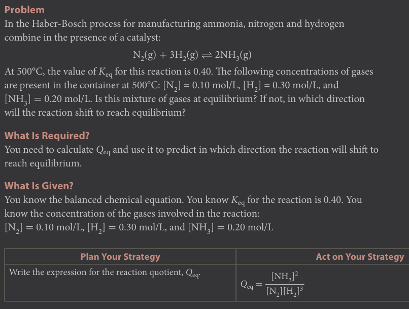

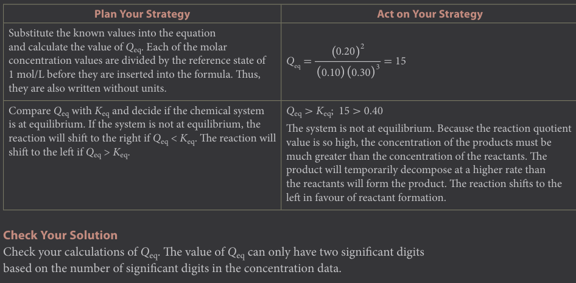