# C8 - Special Equilibria

## C8.1 - Understanding Acid-Base Equilibrium

### Acids, Bases, and Water

Many acid-base reactions occur in water

i.e. hydrochloric acid and sodium hydroxide

$$
\ce{HCl(aq) + NaOH(aq) -> NaCl(aq) + H2O(l)}
$$

NIE for acid-base reaction (strong):

$$
\ce{H+(aq) + OH-(aq) -> H2O(l)}
$$

- HCl is a molecule where hydrogen and chlorine have a polar covalent bond
- when hydrogen atom loses electron, it is basically just a proton
- **dissocation\*:** the process of breaking apart into smaller particles, such as ions or smaller neutral particles
- when HCl dissociates, the hydrogen ion is attracted to electrons in surrounding water molecules

*Hydrogen ion forming bond with water:*

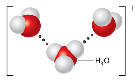

Hydrogen ion forms covalent bond w/ water, forming $\ce{H3O+(aq)}$

$$
\ce{HCl(aq) + H2O(l) -> Cl-(aq) + H3O+(aq)}
$$

- **hydronium ion ($\ce{H3O+}$):** proton bonded to water molecule by covalent bond
- **ionization:** process in which a charged particle is formed
- when hydronium forms, both dissociation and ionization occurs
- $\ce{H3O+}$ is sometimes simplified to just $\ce{H+}$

### Limitations of the Arrhenius Theory

- Swedish chemist Svanté Arrhenius (1859-1927) proposed early def. of acids and bases
- Arrhenius classified them according to chem. formulas and how they dissociated in water
- **Arrhenius acid:** substance that contains hydrogen in chem. formula, and ionizes in water to form hydronium
- **Arrhenius base:** substance that contains OH in chem. formula, and ionizes in water to form hydroxide ion
- **hydroxide ion ($\ce{OH-}$):** negatively charged ion made of 1 hydrogen and 1 oxygen
- over time, chemists found out about chemicals that yield hydroxide ions even though they do not have OH in formula
	- i.e. ammonia, $\ce{NH3}$, acts as base

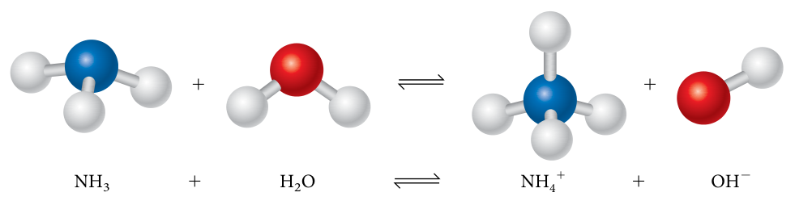

### Brønsted-Lowry Theory of Acids and Bases

- 1923: Def. of acids and bases improved by
	- Danish chemist Johannes Brønsted
	- British chemist Thomas Lowry
- **Brønsted-Lowry theory of acids and bases:** theory defining acids and bases according to donation / acceptance of proton
	- acids / bases do not need to be in water

#### Brønsted-Lowry Definitions of Acids and Bases

- **Brønsted-Lowry acid:** *proton donor* &mdash; any substance that donates a hydrogen ion
	- acid must contain hydrogen in formula
	- all Arrhenius acids are Brønsted-Lowry acids
- **Brønsted-Lowry base:** *proton acceptor* &mdash; any substance that accepts a hydrogen ion
	- base must have lone pair of electrons to bind w/ hydrogen ion
	- all Arrhenius bases are also Brønsted-Lowry bases
	- def also incl. bases like ammonia or HF
- according to def, any substance that behaves as acid can do so
	- only if another substance behaves as base at same time
	- i.e. reaction between HCl and water
		- HCl is acid &mdash; proton donor
		- water is base &mdash; proton acceptor

*Reaction between hydrochloric acid and water*

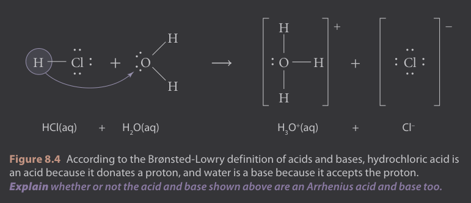

#### Conjugate Pairs

- **conjugate acid-base pair:** 2 substances that are related by the gain or loss of a proton
	- conjugate means "linked together"
- **conjugate base (CB):** particle formed when a proton is removed from an acid
- **conjugate acid (CA):** particle formed when a proton is accepted by a base 
- acid of acid-base pair has one more proton than conj. base
- acid-base reaction always contains 2 conjugate acid-base pairs

Ex: Ionization of ethanoic acid, $\ce{CH3COOH(aq)}$ in water

- ethanoic acid is Brønsted-Lowry acid since it donates proton
- water is base since it accepts proton
- ethanoate is conjugate base
- hydronium is conjugate acid
- reaction is reversible; equilibrium established
	- equilibrium lies to left for this reaction
	- in rev. reaction, hydronium gives proton to ethanoate to form ethanoic acid

*Reaction visual:*

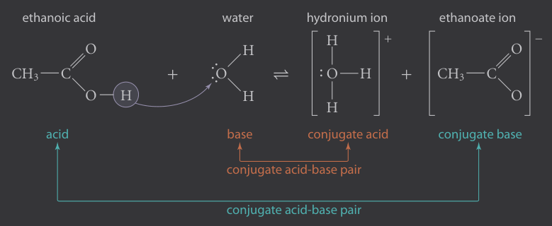

#### Ex 1: Identifying Conjugate Acid-Base Pairs

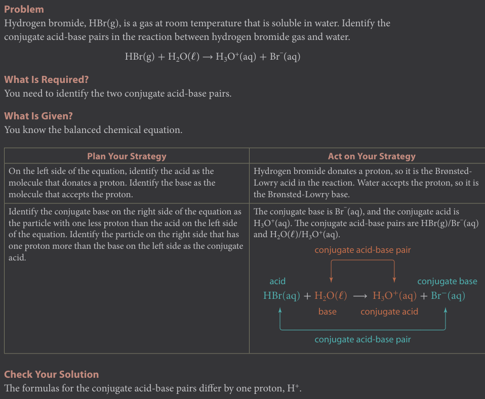

#### Ex 2: Identifying More Conjugate Acid-Base Pairs

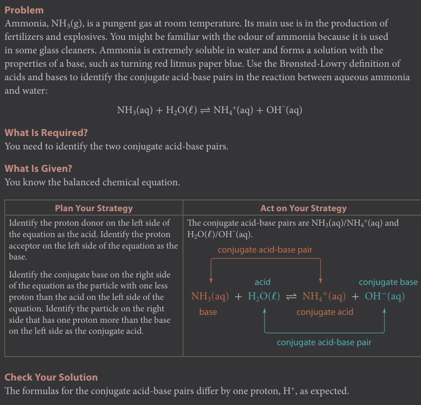

### Both an Acid and a Base: Amphiprotic Substances

- **amphiprotic:** a molecule / ion that can accept or donate a proton, thus acting as an acid / base
	- i.e. water (unique *solvent*)

Water acts as base when reacting w/ acids:

$$
\ce{HCl(aq) + H2O(l) -> Cl-(aq) + H3O+(aq)}
$$

Water acts as acid when reacting w/ bases:

$$
\ce{NH3(aq) + H2O(l) <=> NH4+(aq) + OH-(aq)}
$$

- amphiprotic substances can be molecules or ions w/ hydrogen atom that can ionize
	- former: water
	- latter: hydrogen sulfate ion, $\ce{HSO4-}$
- **electrolyte:** substance that conducts electric current when it forms ions
	- water is *very* weak electrolyte
	- water can undergo ionization to small extended
- **autoionization of water:** when water ionizes itself to form hydrogen and hydroxide ions
	- a.k.a. *self-ionization of water*

*Autoionization of water:*

$$
\ce{H2O(l) <=> H+(aq) + OH-(aq)}
$$

In autoionization:

- first conjugate acid-base pair: water (acid) and hydroxide (base)
- 2nd conjugate pair: water (base) and hydronium (acid)
- one water acts as acid, while other acts as base

*Illustration of self-ionization of water:*

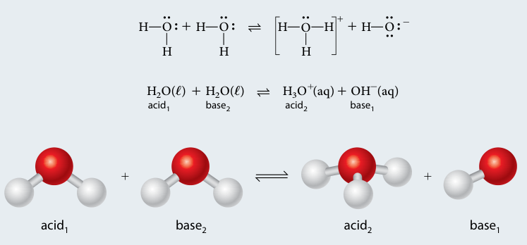

### Ion-Product Constant of Water, $K_w$

*Equilibrium constant equation for water's self-ionization:*

$$
\begin{gather*}
\ce{H2O(l) + H2O(l) <=> H3O+(aq) + OH-(aq)} \\
K = \frac{[\ce{H3O+}][\ce{OH-}]}{[\ce{H2O}]^2}
\end{gather*}
$$

- conc. of solids / liquids not incl. in equilibrium constant
- **ion-product constant of water ($K_w$):** equilibrium constant for the autoionization of water

*Simplifying equilibrium constant equation above:*

$$
\begin{gather*}
K[\ce{H2O}]^2 = \ce{[H3O+][OH-]} \\
K_w = \ce{[H3O+][OH-]} \\
K_w = 1.0 \times 10^{-14}\text{ (at 25 $\degree$C)}
\end{gather*}
$$

- $K_w$ can be used determine molar conc. of hydronium and hydroxide at 25 &deg;C
- conc. of hydronium and hydroxide in autoionization of water is equal

$$
\begin{align*}
[\ce{H3O+}] &= [\ce{OH-}] \\
[\ce{H3O+}]^2 &= 1.0\times 10^{-14} \\
\sqrt{[\ce{H3O+}]^2} &= \sqrt{1.0\times 10^{-14}} \\
[\ce{H3O+}] &= 1.0\times 10^{-7}\text{ M (at 25 $\degree$C)} \\
[\ce{OH-}] &= 1.0\times 10^{-7}\text{ M (at 25 $\degree$C)} \\
\end{align*}
$$

From this, chemists det. that these conc. occur when 1 in 555 mil. water mcls. ionize

#### Autoionization of Water in Acid-Base Solutions

- conc. of hydronium and hydroxide have inverse relationship
- if additional acid is acid, hydronium inc. and hydroxide dec.
	- and vice versa
- at constant temp., conc. changes do not change $K_w$

#### Ion Concentrations and the Acidic-Basic Nature of Solutions

- hydronium and hydroxide present in all aqueous systems due to water's self-ionization
- conc. of ions used to determine relative acidic or basic nature of solutions

|Nature of Solution|Cause|
|-|-|
|acidic|$[\ce{H3O+}] > [\ce{OH-}]$|
|neutral|$[\ce{H3O+}] = [\ce{OH-}]$|
|basic|$[\ce{H3O+}] < [\ce{OH-}]$|

$K_w$ can be used to det. molar conc. of either hydronium, or hydroxide

$$
\begin{gather*}
K_w = \ce{[OH-][H3O+]} \\
\ce{[H3O+]} = \frac{K_w}{\ce{[OH-]}} \\
\ce{[OH-]} = \frac{K_w}{\ce{[H3O+]}} \\
\end{gather*}
$$

#### Ex: Calculating $\ce{[H3O+]}$ or ${\ce{[OH-]}}$ in Aqueous Solution

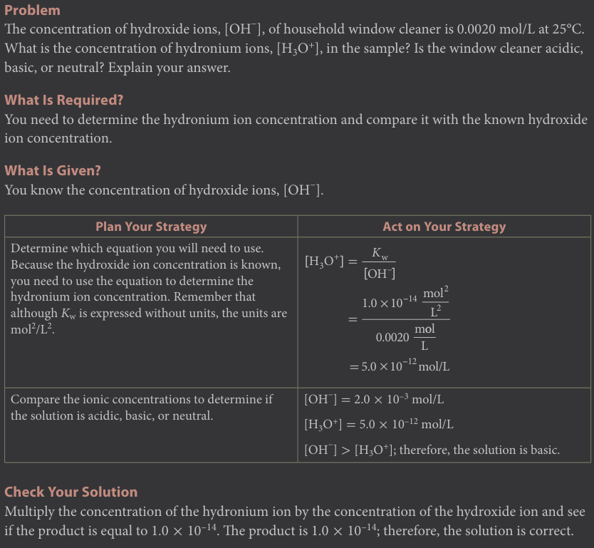

### Establishing pH and pOH

- hydronium and hydroxide ion conc. are very small nums
- 1909: Danish chemist Søren Sørensen introduced pH
- **pH:** negative logarithm of hydronium ion molar concentration (unitless)

$$
\text{pH} = -\log\ce{[H3O+]}
$$

*pH significant digit rules:*

- pH must have same no. of decimal places as no. of sig figs
- i.e. if solution has $\ce{[H3O+]} = 6.3\times 10^{-4}\text{ M}$, what is pH?

$$
\begin{align*}
\text{pH} &= -\log\ce{[H3O+]} \\
&= -\log(6.3\times 10^{-4}) \\
&= 3.20
\end{align*}
$$

*Not* 3.2 (1 dec. place to right)

*Calculating hydronium ion conc. from pH*

General equation:

$$
\ce{[H3O+]} = 10^{-\text{pH}}
$$

i.e. pH of solution is 4.85

$$
\begin{align*}
\text{pH} &= 4.85 \\
-\log\ce{[H3O+]} &= 4.85 \\
\ce{[H3O+]} &= 10^{-4.85} \\
&= 1.4\times 10^{-5}\text{ M}
\end{align*}
$$

*pH and acidity:*

- inc. of 1 pH value is 10x inc. of ion conc.
- pH < 7 is acidic
- pH of 7 is neutral
- pH > 7 is basic

*Calculating pOH:*

**pOH:** negative logarithm of concentration of hydroxide ion

$$
\begin{gather*}
\text{pOH} = -\log\ce{[OH-]} \\
\ce{[OH-]} = 10^{-\text{pH}}
\end{gather*}
$$

Used similarly as pH

### Relationship among pH, pOH and p$K_w$

**p$K_w$:** negative logarithm of $K_w$

*Equations apply only at 25 &deg;C*

$$
\begin{gather*}
K_w = \ce{[H3O+][OH-]} = 1.0\times 10^{-14} \\
-\log K_w = (-\log\ce{[H3O+]}) + (-\log\ce{[OH-]}) = -\log(1.0\times 10^{-14}) \\ \\
\therefore \text pK_w = \text{pH} + \text{pOH} = 14.00
\end{gather*}
$$

pH + pOH = 14.00 for any aqueous solution at 25 &deg;C

#### Ex: Calc. pH, pOH, and $\ce{[OH-]}$

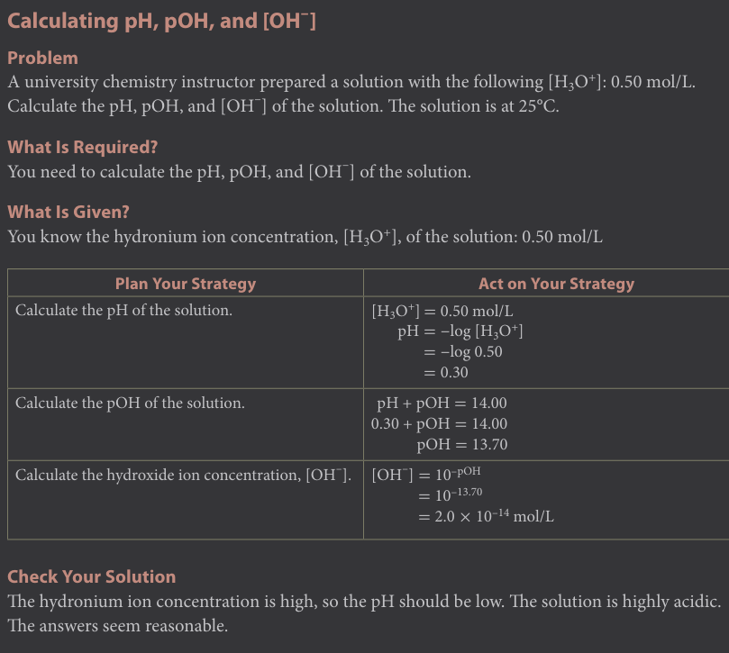

---

## C8.2 - Acid-Base Strength and Acid Dissociation

### Strength of Acids

- different acids / bases have different levels of ionization
- **strong acid (SA):** an acid that dissociates completely into ions in water
- $\ce{HA}$ represents generic acid, w/ H repr. hydrogen ion attached

*General strong acid dissociation equation:*

$$
\ce{HA(g or aq) + H2O(l) -> H3O+(aq) + A-(aq)}
$$

acid + water &rarr; hydronium + conjugate base

- in dilute sol. of strong acid, all of acid dissociates into ions
- no strong acid molecule left intact

*Strong acid dissociation graph + close-up view:*

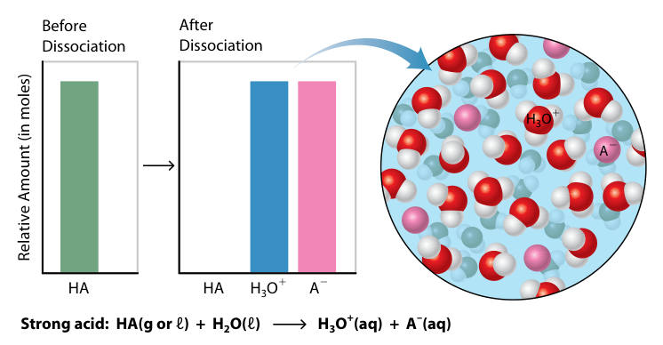

- **weak acid:** acid that ionizes to a limited extent in water
- most molecules of weak acid remain intact
- only few hydronium ions form at equilibrium
- weak acid ionization is reversible

*General weak acid dissociation equation:*

$$
\ce{HA(g or aq) + H2O(l) <=> H3O+(aq) + A-(aq)}
$$

acid + water &rarr; hydronium + conjugate base

*Weak acid dissociation graph + close-up view:*

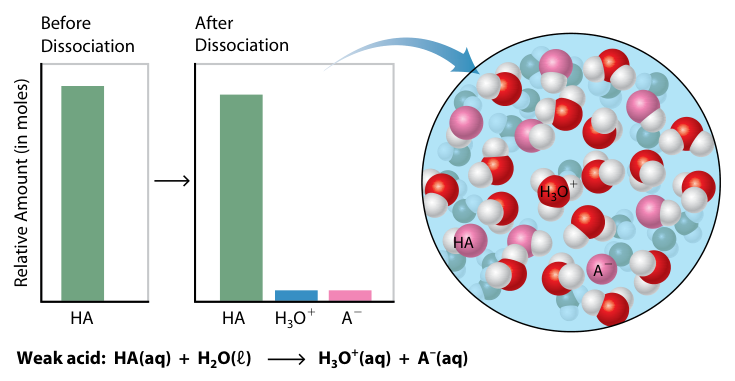

- in strong acid, reaction proceeds rapidly
- in weak acid, reaction proceeds much more slowly

### Strength of Bases

- **strong bases (SB):** base that completely ionizes in water
	- includes hydroxides of some alkali and alkaline earth metals
	- incl. hydroxides of Na and below
	- incl. hydroxides of Ca and below
- they are bases bcz. they accept protons and form hydroxide ions

*Sample equations repr. ionization of 3 strong bases:*

$$
\begin{gather*}
\ce{NaOH(s) ->[H2O] Na+(aq) + OH-(aq)} \\
\ce{KOH(s) ->[H2O] K+(aq) + OH-(aq)} \\
\ce{Ba(OH)2(s) ->[H2O] Ba^2+(aq) + OH-(aq)}
\end{gather*}
$$

*NOTE:* H2O indicates water required as solvent, but not considered reactant

- **weak bases:** base that ionizes to a limited extent in water
	- i.e. ammonia

*Ionization of ammonia:*

$$
\ce{NH3(aq) + H2O(l) <=> NH4+(aq) + OH-(aq)}
$$

- ammonia is base bcz. it accepts proton and forms hydroxide
- *amines* are a group of compounds that can act as a *base*
	- amine general formula: $\ce{R3N}$
	- where R is a carbon group or hydrogen atom

### Equilibrium Position of Acid-Base Reaction

- acid-base reactions involve 2 conjugate acid-base pairs
- strength of acids and bases involved in chemical determine net direction of reaction

> In general, an acid-base equilibrium reaction shifts in the *direction* in which a *stronger acid and a stronger base form a weaker acid and a weaker base*.
>
> Equilibrium favours: strong &rarr; weak

*Example:*

$$
\ce{H2S(aq) + NH3(aq) <=> HS-(aq) + NH4+(aq)}
$$

- reaction shifts right since hydrogen sulfide, $\ce{H2S}$ is stronger than ammonium, $\ce{NH4+}$ as acid
- ammonia is stronger than hydrogen sulfide ion, $\ce{HS-}$ as base

#### Equilibrium Position and Strength of Acids and Bases

- for strong acids and bases ionizing in water, the reaction always shifts to the right
- in some acid-base reaction, equilibrium shift is so far right or left, that the reaction can't be considered reversible
	- ex. below

i.e. hydrochloric acid ionization

$$
\begin{array}{cccccc}
\ce{HCl(aq) &+ &H2O(l) &-> &H3O+(aq) &+ &Cl-(aq)} \\
\text{acid} &&\text{base} &&\text{CA} &&\text{CB} \\
\text{stronger} &&\text{stronger} &&\text{weaker} &&\text{weaker}
\end{array}
$$

- since hydrochloric acid loses proton more easily than hydronium ion, hydrochloric acid is stronger
- water gains proton more readily than chloride
- trends show that as the strength of the acid / base increases, the strength of the conjugate decreases

#### Table: Relative Strengths of Conjugate Acid-Base Pairs

Use to memorize the strong acids

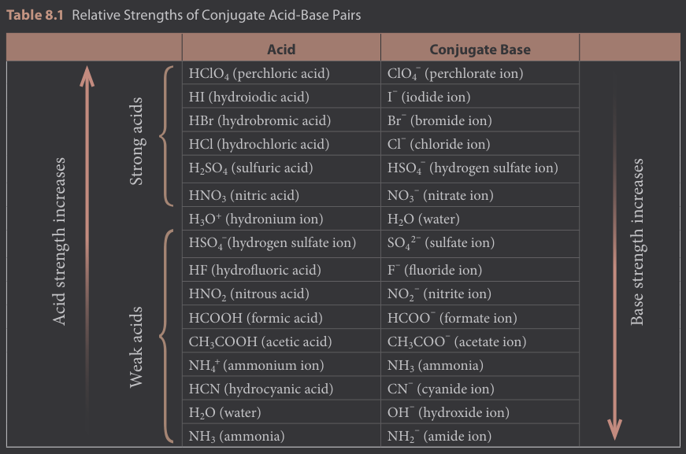

#### Ex: Predicting Direction of Acid-Base Reaction

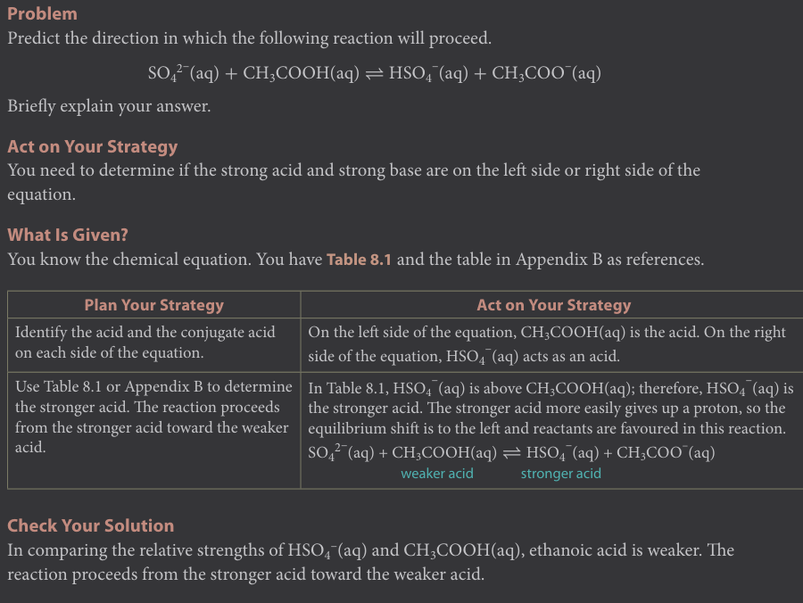

### Acid-Dissociation Constant, $K_a$

- strong acids ionize completely, no need for equilibrium expression
- weak acids do establish equilibrium
- **acid-dissociation constant ($K_a$):** equilibrium constant for the ionization or dissociation of an acid into ions
	- a.k.a. *acid-ionization constant*
- **monoprotic acid:** an acid that donates one proton ($\ce{H+}$), when ionizing

i.e. ionization of generic weak monoprotic acid

$$
\ce{HA(aq) + H2O(l) <=> H3O+(aq) + A-(aq)}
$$

Equilibrium expression:

$$
\begin{gather*}
K = \frac{\ce{[H3O+][A-]}}{\ce{[H2O][HA]}} \\ \\
K\ce{[H2O]} = K_a = \frac{\ce{[H3O+][A-]}}{\ce{[H2O]}}
\end{gather*}
$$

- where concentration of water doesn't change
- $K_a$ is temp-dependent
- the more an acid ionizes, the higher the value of $K_a$
- at given temp., the stronger acid is, the higher the hydronium conc., and the higher the $K_a$

> stronger acid &rarr; higher $\ce{[H3O+]}$ &rarr; larger $K_a$ value

- **percent dissociation / ionization:** ratio of concentration of ionized acid at equilibrium comp. to acid's initial concentration
	- expressed as %
	- I write as "% ion" or "% dis."

$$
\begin{gather*}
\text{\% ion} = \frac{\ce{[HA]}_\text{dissociated}}{\ce{[HA]}_\text{initial}} \cdot 100\% \\
\text{\% ion} = \frac{\ce{[A-]}}{\ce{[HA]}_i} \cdot 100\%
\end{gather*}
$$

for weak acid, smaller $K_a$ value, means lower percent dissociation

> weaker acid &rarr; lower percent ionization of acid &rarr; smaller $K_a$ value

*Some $K_a$ values:*

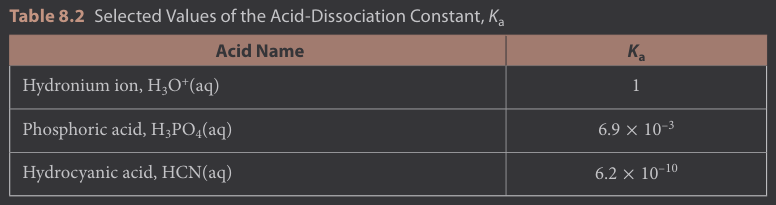

**Assumptions made when solving weak acid problems:**

- Concentration of hydronium ion from autoionization of water is negligible
	- so much smaller than conc. of hydronium from weak acid
- Weak acid dissociates into ions to such a small extent that in calcs. to determine equilibrium concentration
	- *Change of concentration is ignored*
	- $\dfrac{\ce{[HA]}_i}{K_a} > 100?$

$$
\ce{[HA]_{eq}} = \ce{[HA]}_i - \ce{[HA]_{dissociated}} \approx \ce{[HA]}_i
$$

#### Ex. 1: Det. Acid-Dissociation Constant, $K_a$ and Percent Dissociation

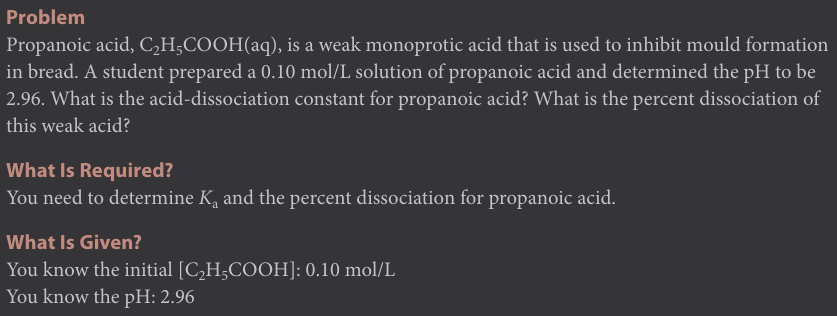

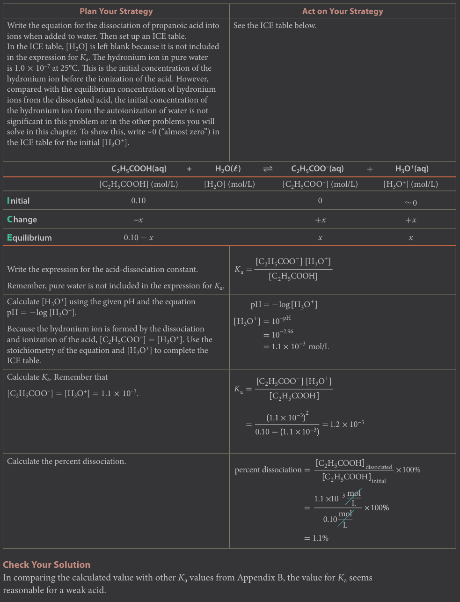

#### Ex 2: Det. pH using $K_a$

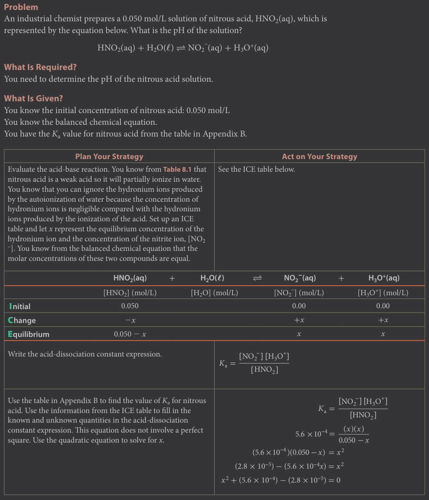

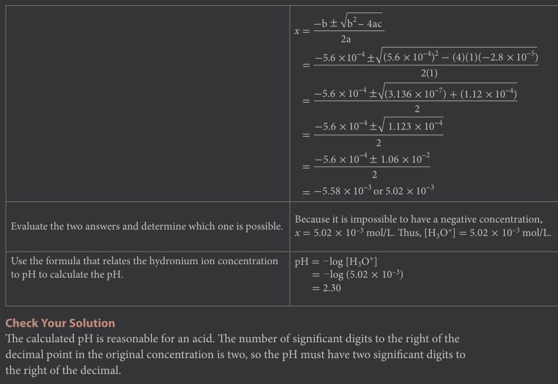

#### Ex 3: Det. Concentrations from $K_a$ and Init. Weak Acid Conc.

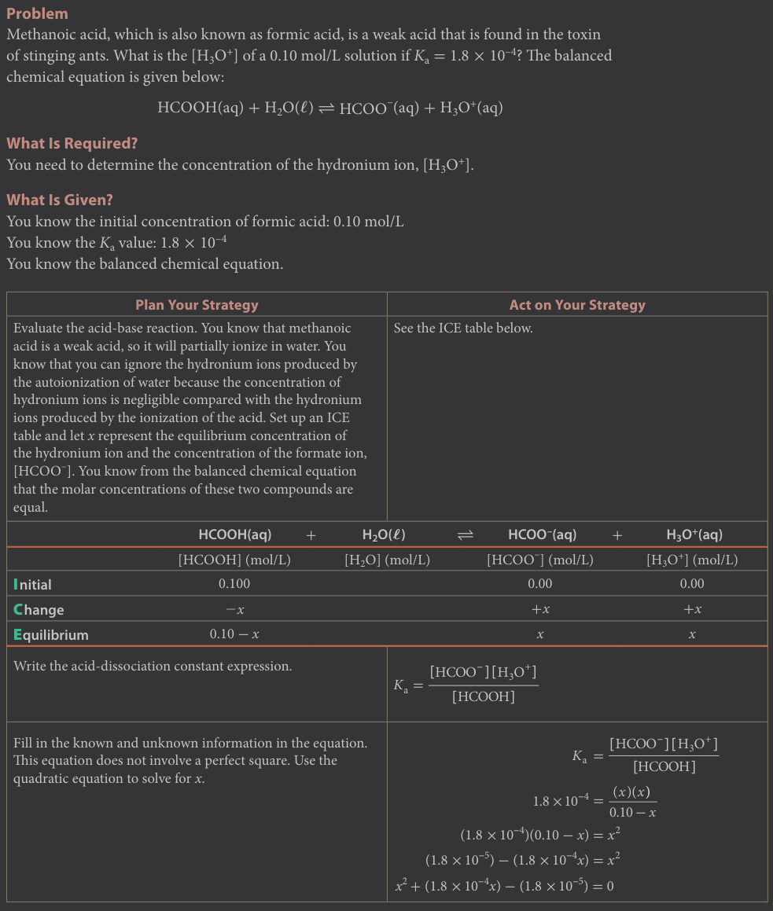

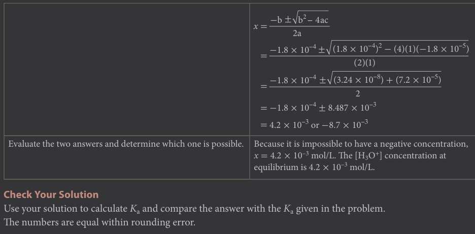

### Polyprotic Acids and Ionization

- **polyprotic acid:** an acid that yields two or more protons ($\ce{H+}$) when it ionizes
	- diprotic acid: 2 protons
	- triprotic acid: 3 protons
- protons in polyprotic acids ionize one at a time

i.e. Ionization of phosphoric acid in steps

*Reaction 1 and $K_a$*

$$
\begin{gather*}
\ce{H3PO4(aq) + H2O(l) <=> H2PO4-(aq) + H3O+(aq)} \\ \\
K_{a1} = \frac{\ce{[H2PO4-][H3O+]}}{\ce{[H3PO4]}} = 7.2\times 10^{-3}
\end{gather*}
$$

*Reaction 2, $K_a$*

CB of 1st reaction becomes acid here:

$$
\begin{gather*}
\ce{H2PO4-(aq) + H2O(l) <=> HPO4^2-(aq) + H3O+(aq)} \\ \\
K_{a2} = \frac{\ce{[HPO4^2-][H3O+]}}{\ce{[H2PO4-]}} = 6.3\times 10^{-8}
\end{gather*}
$$

*Reaction 3, $K_a$*

CB of 2nd reaction acts as acid:

$$
\begin{gather*}
\ce{HPO4^2-(aq) + H2O(l) <=> PO4^3-(aq) + H3O+(aq)} \\ \\
K_{a3} = \frac{\ce{[PO4^3-][H3O+]}}{\ce{[HPO4^2-]}} = 4.2\times 10^{-13}
\end{gather*}
$$

- phosphoric acid is much stronger than other 2 acids
- $K_a$ value decreases as more protons are removed
- it is easier to remove hydrogen ion from a neutral atom, than it is to remove more from a negatively charged ion

*$K_a$ values of some polyprotic acids:*

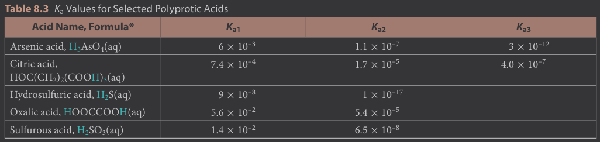

*\*Ionizable protons in cyan type*

---

## C8.3 - Base Ionization

### Base-Ionization Constant, $K_b$

Generic weak base repr. by B

*General formula for weak base dissociation:*

$$
\ce{B(aq) + H2O(l) <=> BH+(aq) + OH-(aq)}
$$

- base has lone pair of electrons that accepts donated proton
- ammonia and amines are ex. of weak bases

*Equation for ammonia reacting w/ water:*

$$
\ce{NH3(aq) + H2O(l) <=> NH4+(aq) + OH-(aq)}
$$

- ammonia doesn't dissociate, but it ionizes
- **base-ionization constant ($K_b$):** equilibrium constant for ionization of base
	- a.k.a. *base-dissociation constant*
	- even though base doesn't have to dissociate
	- temp-dependent

*General base-ionization constant equation:*

$$
K_b = \frac{\ce{[BH+][OH-]}}{\ce{[B]}} = K\ce{[H2O]}
$$

*Base-ionization constant for ammonia:*

$$
K_b = \frac{\ce{[NH4+][OH-]}}{\ce{NH3}} = 1.8\times 10^{-5}
$$

Conjugate base of weak acid can also act as base

*Fluoride reaction w/ water:*

$$
\begin{gather*}
\ce{F-(aq) + H2O(l) <=> HF(aq) + OH-(aq)} \\
K_b = \frac{\ce{[HF][OH-]}}{\ce{[F-]}}
\end{gather*}
$$

Same procedures used as acids to solve problems involving bases and $K_b$

*$K_b$ values for some bases:*

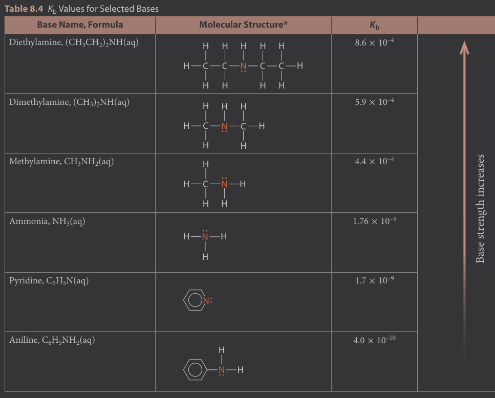

*NOTE:* Nitrogen and its lone pair are shown in orange

#### Ex 1: Calc. $K_b$ for Weak Base

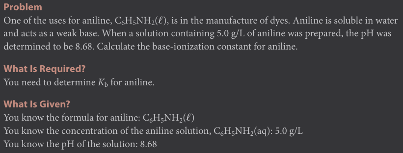

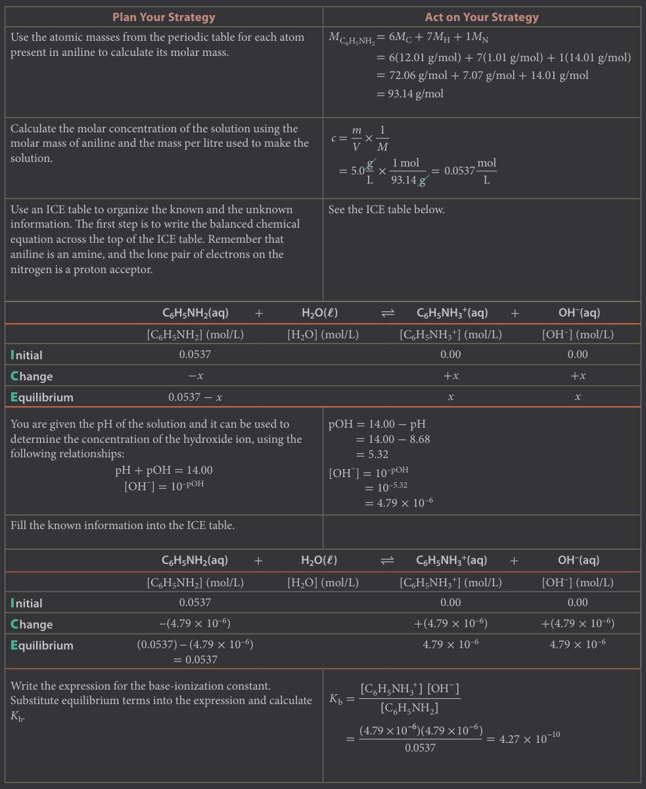

#### Ex 2: Calc. pH of Weak Base

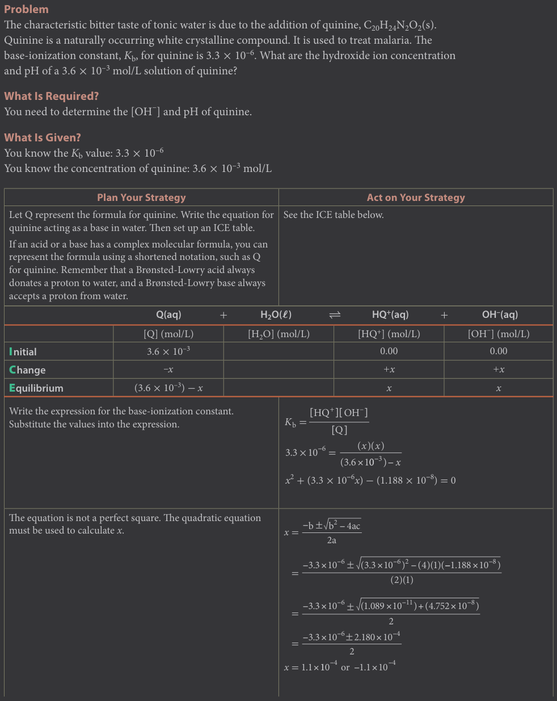

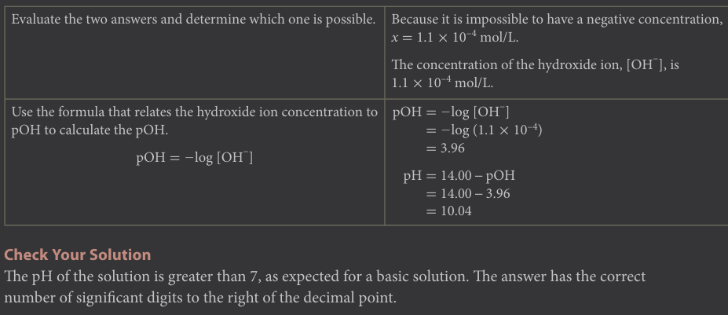

### Relationship Among $K_a$, $K_b$, and $K_w$

Ex: Dissociation of acetic acid in water

$$
\ce{CH3COOH(aq) + H2O(l) <=> H3O+(aq) + CH3COO-(aq)}
$$

Conj. base, $\ce{CH3COO-(aq)}$ also reacts w/ water

$$
\ce{CH3COO-(aq) + H2O(l) <=> CH3COOH(aq) + OH-(aq)}
$$

Acid and base-ionization constant for acid and CB

$$
\begin{gather*}
K_a = \frac{\ce{[H3O+][CH3COO-]}}{\ce{[CH3COOH]}} \\ \\
K_b = \frac{\ce{[CH3COOH][OH-]}}{\ce{[CH3COO-]}}
\end{gather*}
$$

Product of both constants yields ion-product constant of water

$$
\begin{align*}
K_aK_b &= \frac{\ce{[H3O+]}\cancel{\ce{[CH3COO-]}}}{\cancel{\ce{[CH3COOH]}}} \cdot \frac{\cancel{\ce{[CH3COOH]}}\ce{[OH-]}}{\cancel{\ce{[CH3COO-]}}} \\
&= \ce{[H3O+][OH-]} = K_w
\end{align*}
$$

If you add both reactions together, you get autoionization of water:

$$
\begin{align*}
\ce{\cancel{\ce{CH3COOH(aq)}} + H2O(l) &<=> H3O+(aq) + \cancel{\ce{CH3COO-(aq)}}} \\
\ce{\cancel{\ce{CH3COO-(aq)}} + H2O(l) &<=> \cancel{\ce{CH3COOH(aq)}} + OH-(aq)} \\
\hline \ce{2H2O(l) &<=> H3O+(aq) + OH-(aq)}
\end{align*}
$$

**Conclusion:**

*For a reaction that is the sum of two or more reactions, the overall equilibrium constant is the product of the individual equilibrium constants.*

Overall equilibrium constant for acid and conj. base:

$$
\begin{gather*}
K_aK_b = K_w \\
K_a = \frac{K_w}{K_b} \\
K_b = \frac{K_w}{K_a}
\end{gather*}
$$

#### Ex: Equilibrium Constants for Conjugate Acid-Base Pairs

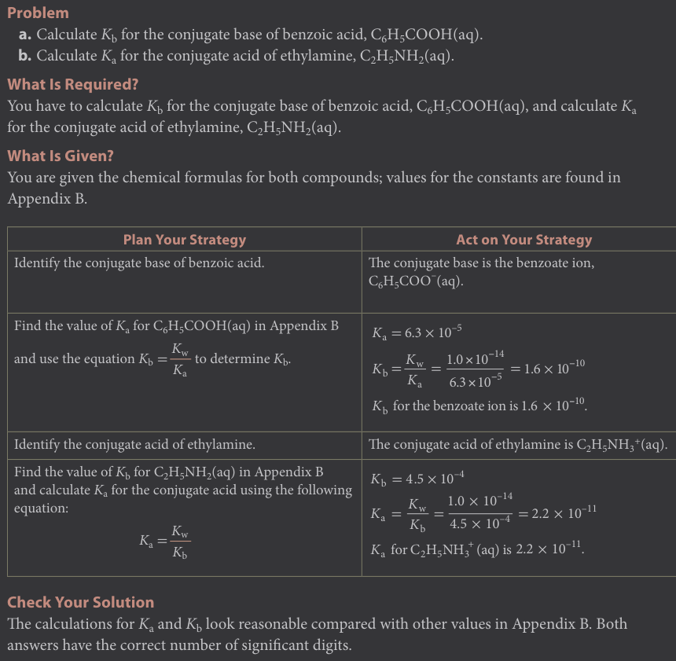

---

## C8.4 - Salts, Buffers, Titrations, and Solubility

### Salt Hydrolysis

- when acid and base react, water and salt are formed
- **salt:** ionic compound that results from an acid-base reaction
- **neutralization reaction:** chemical reaction between an acid and a base that yields salt and water
- salts are strong electrolytes that completely ionize in water and they often affect pH of solution
- when salt dissociates in water, it forms an anion and cation
- **anion:** negatively charged ion
- **cation:** positively charged ion
- **salt hydrolysis:** process in which a salt reacts w/ water

#### Neutral Salt Solutions

- when salt consisting of anion from *strong acid* and cation from *strong base*, ...
- hydrolysis (react. w/ water) usually does not occur

i.e. Ionization of nitric acid (SA)

$$
\ce{HNO3(aq) + H2O(l) -> NO3-(aq) + H3O+(aq)}
$$

i.e. ionization of sodium hydroxide (SB)

$$
\ce{NaOH(s) ->[H2O] Na+(aq) + OH-(aq)}
$$

- sodium ion does not react further w/ water
- nitrate ion does not react further w/ water
- if equal amounts of acid and base added, equal amounts of hydronium and hydroxide prod.
- $\therefore$ pH is about 7

#### Acidic Salt Solution

- when salt consisting of strong acid anion and weak base cation, ...
- solution is acidic bcz. cation acts as weak acid
- when ammonium chloride dissolves in water, chloride don't react w/ water, bcz. ion is very weak base

Ionization of ammonium chloride:

$$
\ce{NH4Cl(s) ->[H2O] NH4+(aq) + Cl-(aq)}
$$

Ammonium is a weak acid that does react w/ water:

$$
\ce{NH4+(aq) + H2O(l) <=> NH3(aq) + H3O(aq)}
$$

$\therefore$ solution is acidic, since hydronium prod.

- highly charged metal ions in salts also prod. acidic solutions
	- i.e. $\ce{Al3^3+, Cr3^3+, Fe^3+, Bi^3+, Be^2+}$
	- they also yield hydronium

 Ex of highly charged metal ions forming acidic solution:

$$
\ce{[Al(H2O)6]^3+(aq) + H2O(l) <=> [Al(OH)(H2O)5]^2+(aq) + H3O+(aq)}
$$

#### Basic Salt Solution

- when salt consisting of weak acid anion and strong acid cation, ...
- solution is basic

i.e. ionization of sodium acetate

$$
\ce{CH3COONa(s) ->[H2O] Na+(aq) + CH3COO-(aq)}
$$

acetate then reacts w/ water and forms hydroxide

$$
\ce{CH3COO-(aq) + H2O(l) <=> CH3COOH(aq) + OH-(aq)}
$$

$\therefore$ resulting solution is basic

#### Acid-Base Solutions from Other Salts

If weak acid and weak base form a salt, then $K_a$ and $K_b$ values must be compared

*Acid-base properties of salts, table:*

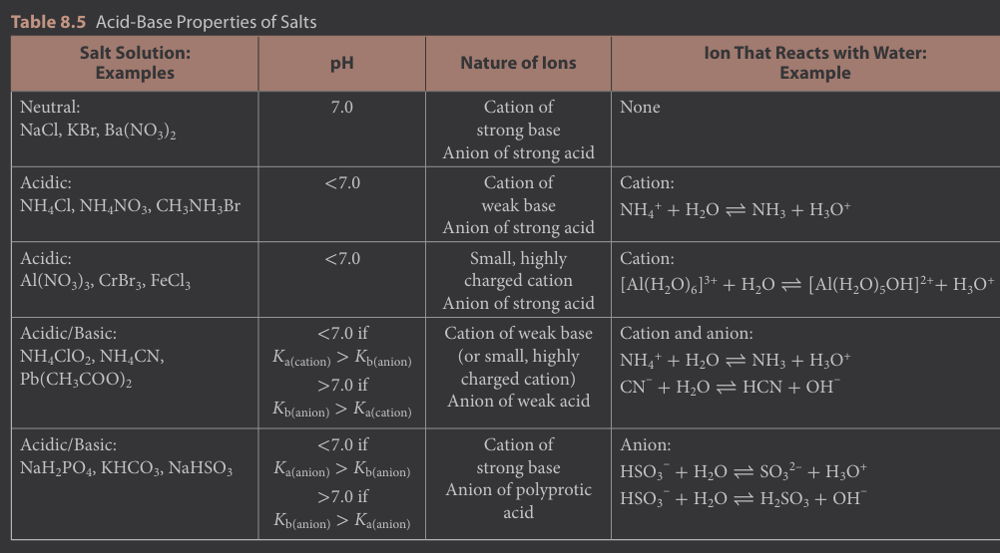

### Buffered Solutions

**buffer solution:** solution that resists changes in pH when a limited amount of acid or base is added to solution

*Acid and base added to non-buffered solution, pH change:*

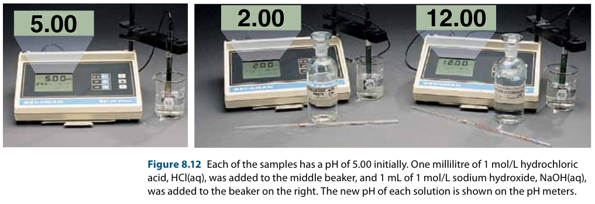

*Acid and base added to buffered solution, pH change:*

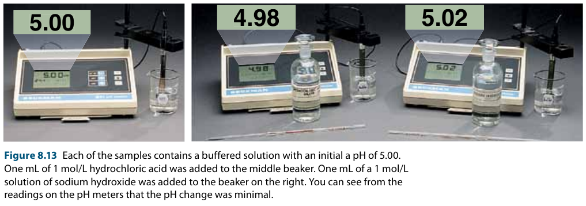

- buffer solution must contain large qty. of acid to react w/ any base that is added to solution
- it must contain large qty. of base to react w/ any additional acid added to sol.
- *Components of buffer*
	- mixture of weak acid and added conjugate base
	- *~or~* weak base and added conjugate acid

Ex buffer: Acetic acid + its salt sodium acetate (made by adding similar molar amounts)

$$
\ce{CH3COONa(s) ->[H2O] + CH3COO-(aq) + Na+(aq)}
$$

- when acid is added to buffer, acetate ion (CB) reacts w/ hydrogen ions in acid,
- and neutralizes additional acid

See below:

$$
\ce{CH3COO-(aq) + H+(aq) -> CH3COOH(aq)}
$$

when base added to buffer, hydroxide ions neutralized by acid in solution:

$$
\ce{CH3COOH(aq) + OH-(aq) -> CH3COO-(aq) + H2O(l)}
$$

- acetate is common in both reactions where acid or base is consumed
- **common-ion effect:** shift in equilibrium position caused by addition of compound that has ion in common w/ one of the dissolved substances
	- when given ion (i.e. acetate) is added to equilibrium mixture that contains that ion
	- equilibrium shifts away from forming more of the ion
- *buffering capacity* depends on how much acid or base the solution can absorb w/o significant change in pH
	- greater that amount &rarr; greater the buffering capacity

#### Ex 1: Calculating pH of Acidic Buffer (Nelson 8.8)

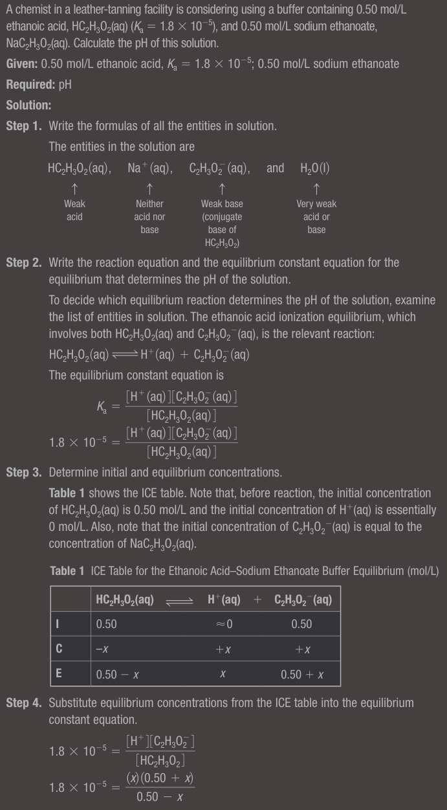

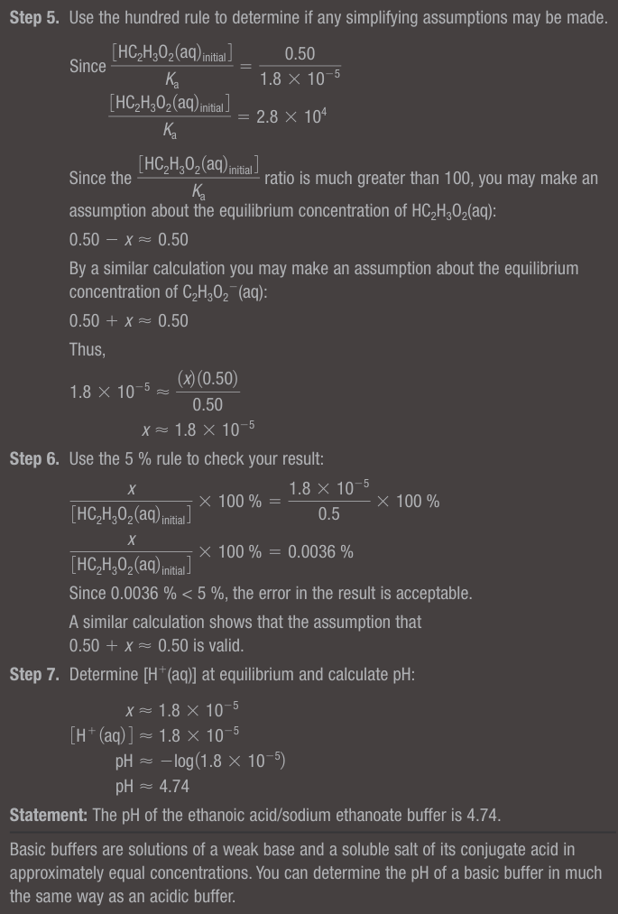

#### Ex 2: Calculating pH of Basic Buffer (Nelson 8.8)

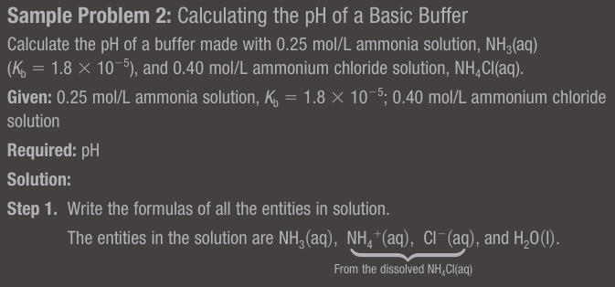

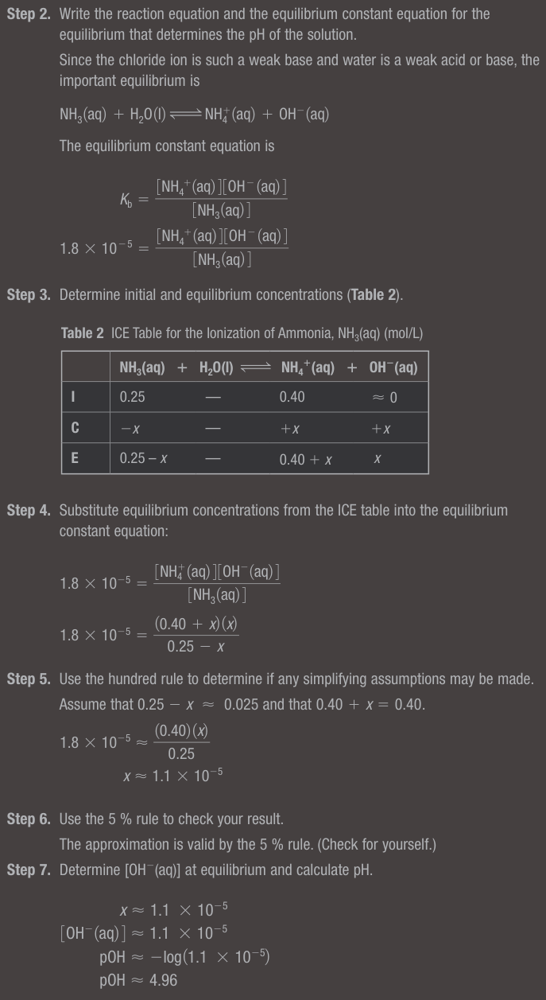

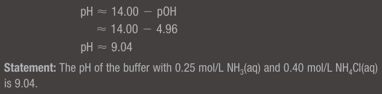

#### pH of Buffer w/ Shortcut

Acidic:

$$
\text{pH} = \text{p}K_a + \log\frac{\ce{[A-]}}{\ce{[HA]}}
$$

Basic:

$$
\text{pOH} = \text pK_b + \log\frac{\ce{[HB+]}}{\ce{[B]}}
$$

### Acid-Base Titration

3 types of titration:

1. strong acid - strong base
2. weak acid - strong base
3. strong acid - weak base

#### Endpoint Indicators

- indicator used to det. endpoint
- **endpoint:** pH at which the indicator changes colour in a titration
	- many acid-base indicators w/ diff. pH ranges
- *indicators* are *weak acids*
	- acid is one colour
	- conjugate base is another colour
- HInd &mdash; acid form of indicator
	- has one colour
- Ind- &mdash; indicator's conjugate base
	- has another colour

*General equilibrium equation for indicators:*

$$
\ce{HInd(aq) + H2O(l) -> H3O+(aq) + Ind-(aq)}
$$

*Indicator colour ranges:*

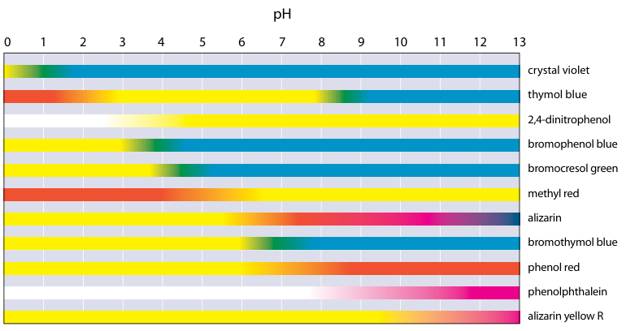

#### Strong Acid - Strong Base Titration

- titration often monitored w/ pH meter to get more accurate pH results during reaction
- **equivalence point:** point in titration at which amount of substance (mol) added is shtoichiometrically equal to...
	- amount present in o.g. test solution (mol)
	- *or* pt. at which acid and base have completely reacted
- equivalence point &ne; endpoint

i.e. titration: 40.00 mL of solution of 0.1000 M hydrochloric acid is titrated w/ 0.1000 M sodium hydroxide:

$$
\ce{HCl(aq) + NaOH(aq) -> NaCl(aq) + H2O(l)}
$$

Net ionic equation:

$$
\ce{H+(aq) + OH-(aq) -> H2O(l)}
$$

- **titration curve:** a plot that graphs pH v. the titrant's volume added 
	- **titrant:** solution that is added to unknown solution (NaOH in this case)
- pH of solution increases slowly at first
- low pH indicates high conc. of hydronium
- as more NaOH is added, conc. of hydroxide inc.
- near the equivalence point, slope of curve almost vertical, pH reaches 7
	- at that point, small drop of titrant can cause large increase in pH
- as more NaOH added, pH slowly inc. as you go beyond equivalence point

*Titration curve of example scenario:*

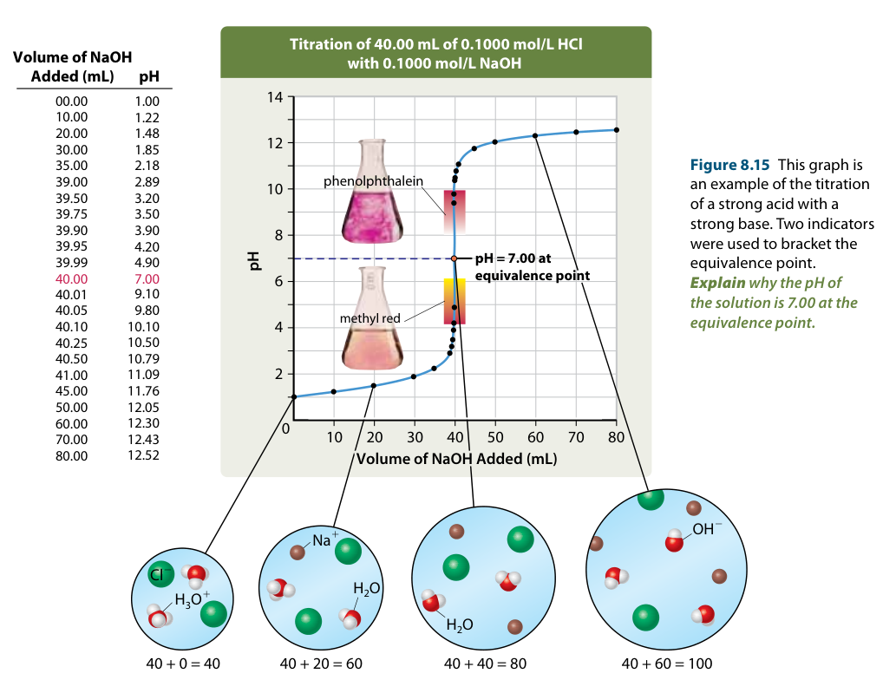

#### Ex: Calc. pH During Strong Acid - Strong Base Titration

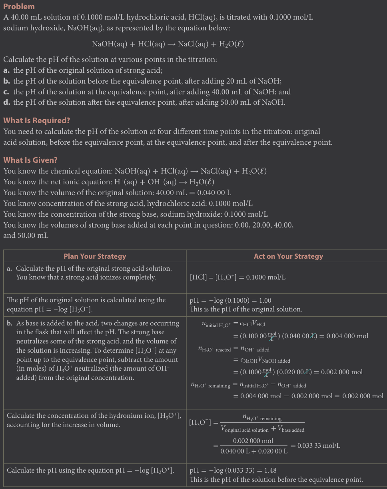

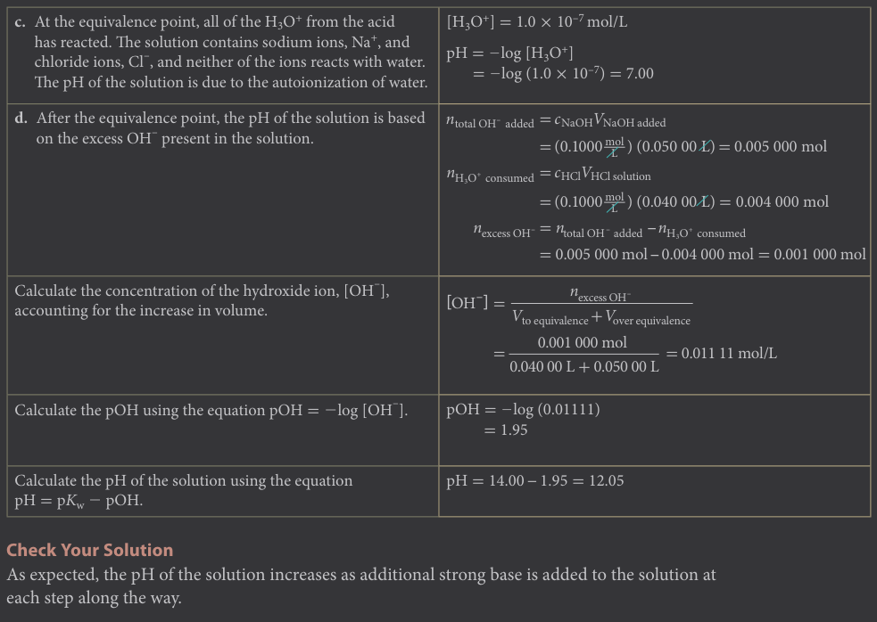

#### Weak Acid - Strong Base Titration

- partial ionization of weak acid needs to be factored in calculations
- in titration curve below, ...
	- dotted line can represent strong acid-strong base curve

i.e. 40.00 mL of 0.1000 M propanoic acid (abbr. HPr) is titrated w/ 0.1000 M propanoate (Pr-):

$$
\ce{CH3CH2COOH(aq) + NaOH(aq) -> CH3CH2COONa(aq) + H2O(l)}
$$

- initial pH for WA higher than SA
- WA ionizes partially, less hydronium
- in curve, there is also buffer region
	- as WA reacts w/ SB, more CB forms
	- that creates acid-conjugate base pair: $\ce{HA/A-}$ (this case: $\ce{HPr/Pr-}$)
	- at midpoint of buffer, half of acid has reacted
	- so, $\ce{[HA]} = \ce{[A-]}$ (this case: $\ce{[HPr]} = \ce{[Pr-]}$)
- pH at equivalence point is greater than 7.00
- weak acid anion acts as weak base and accepts proton from water
	- yields hydroxide ions
- beyond equivalence pt., pH of solution inc. as excess base is added

*Titration curve of HPr w/ NaOH:*

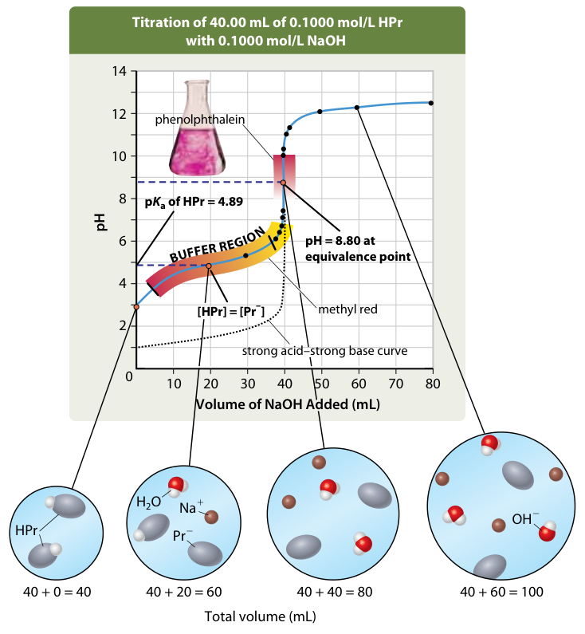

#### Ex: Calc. pH during Weak Acid - Strong Base Titration

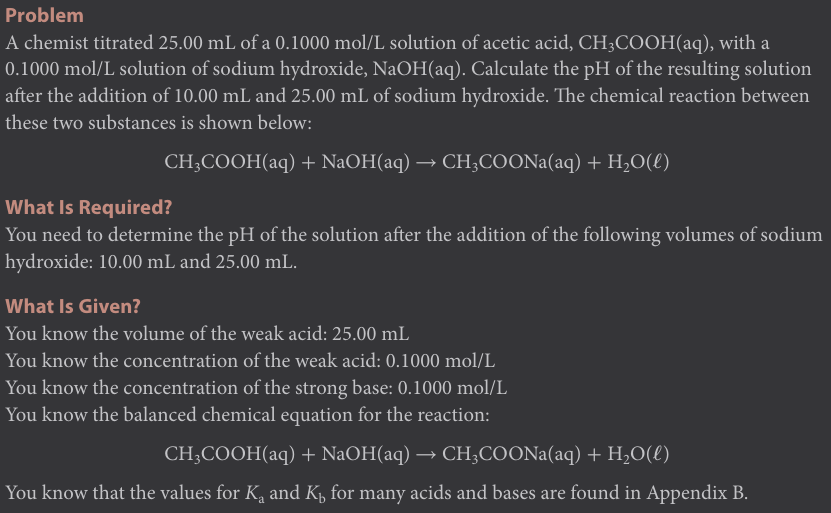

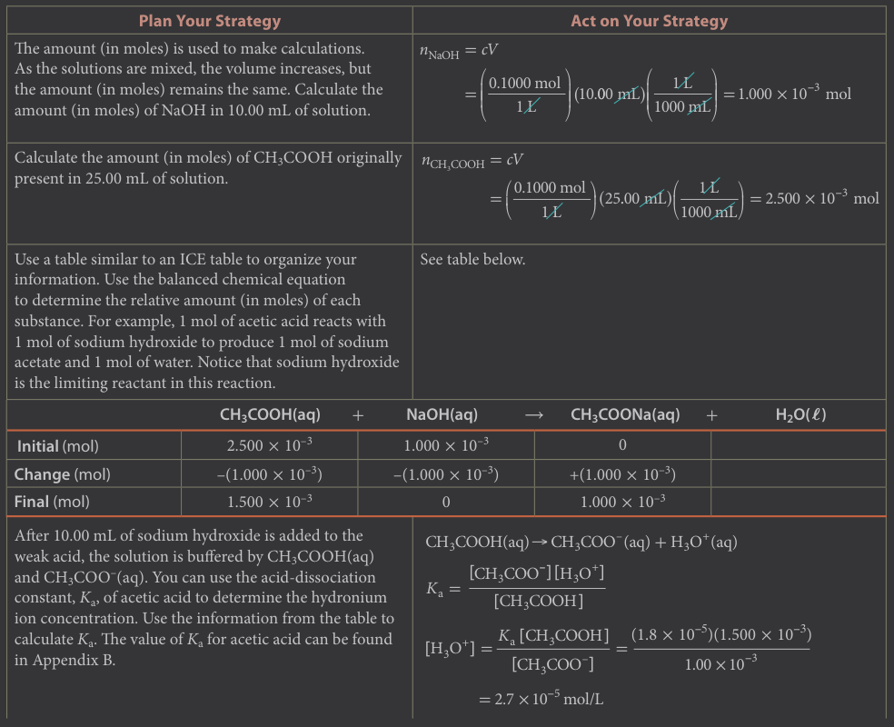

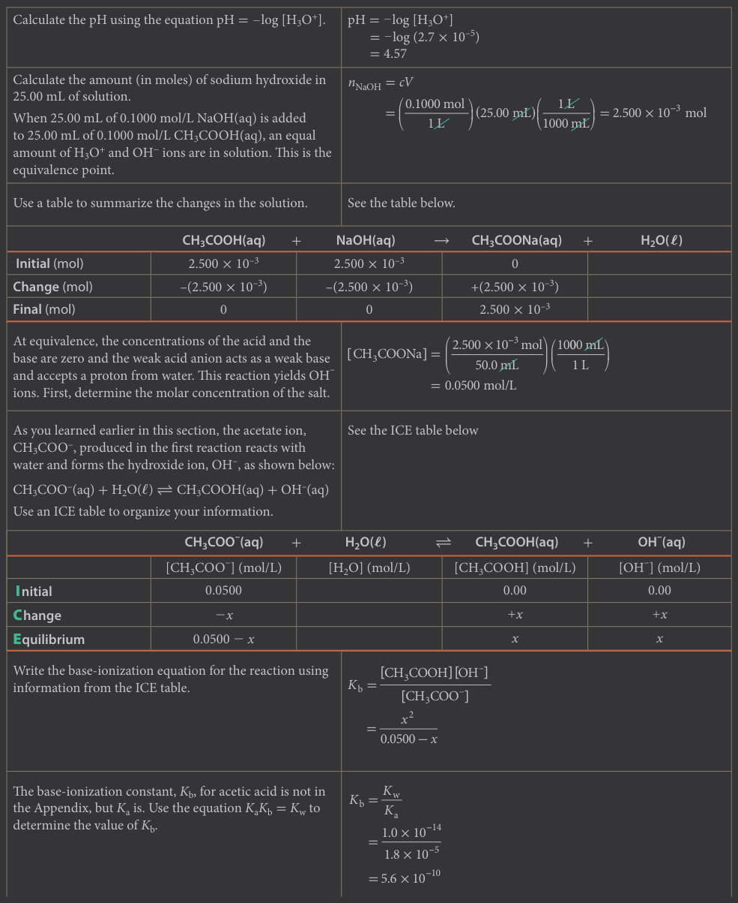

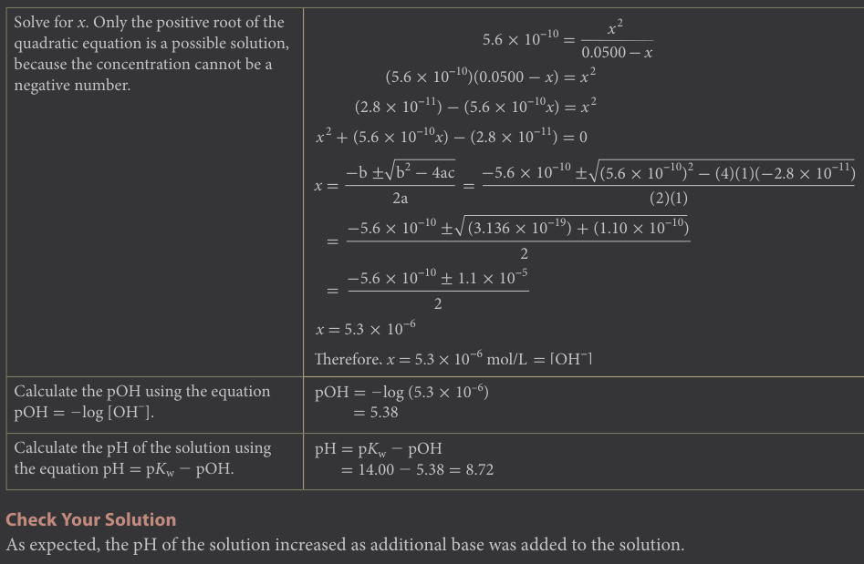

#### Weak Base - Strong Acid Titration

- graph is similar to weak acid - strong base titration
	- has inverted shape of prev. titration

Ex: 40.00 mL of 0.1000 M ammonia titrated w/ 0.1000 M hydrochloric acid

- pH decreases throughout process, with init. pH being basic
- only weak base present at beginning
- buffered region contains significant amounts of base ($\ce{NH3}$) and CA ($\ce{NH4+}$)
- at midpoint in buffered region, pH = p*Ka* of CA
- after buffer region, pH drops almost vertically
- at equivalence point, all of ammonia has reacted w/ strong acid (HCl)
	- solution contains ammonium and chloride ions
- pH at equivalence point is 5.27
	- solution is acidic at equivalence
	- bcz. ammonium reacts w/ water to form hydronium

*Initial reaction of titration:*

$$
\begin{gather*}
\ce{HCl(aq) + NH3(aq) -> NH4Cl(aq)} \\
\text{or} \\
\ce{HCl(aq) + NH3(aq) -> NH4+(aq) + Cl-(aq)}
\end{gather*}
$$

*Net ionic equation:*

$$
\ce{H+(aq) + NH3(aq) -> NH4+(aq)}
$$

At equivalence, hydrolysis of ammonium prod. hydronium:

$$
\ce{NH4+(aq) + H2O(l) <=> NH3(aq) + H3O+(aq)}
$$

*Titration curve of example:*

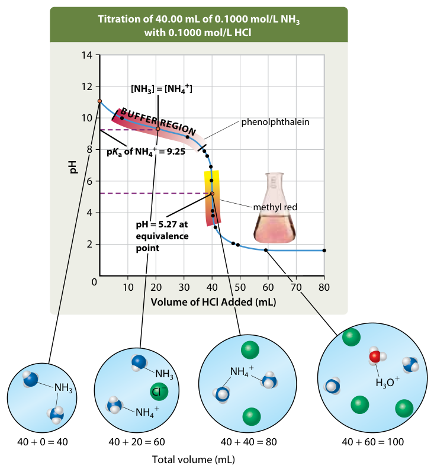

#### Ex: Calc. pH at Equivalence for Weak Base - Strong Acid Titration

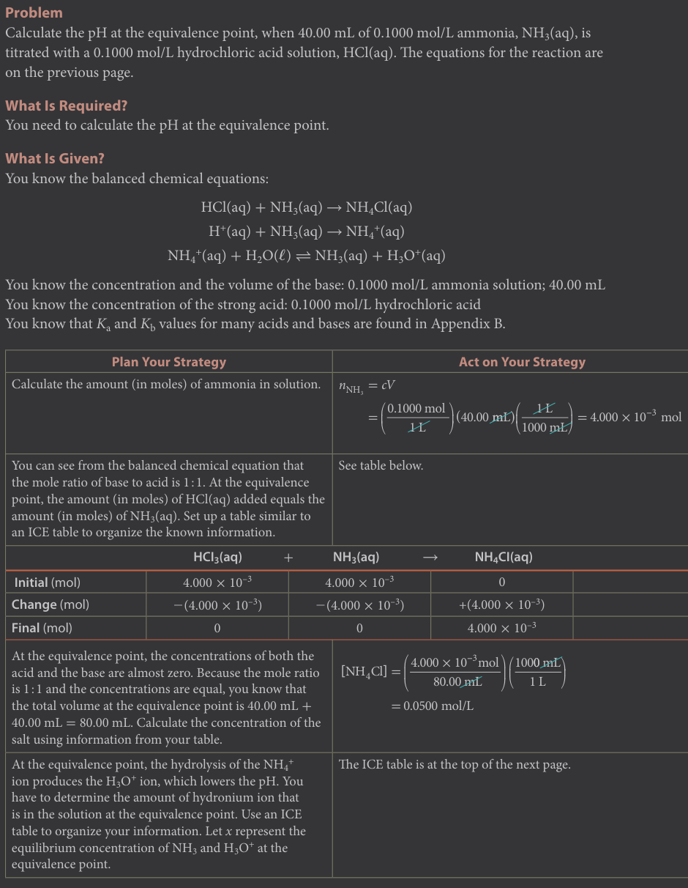

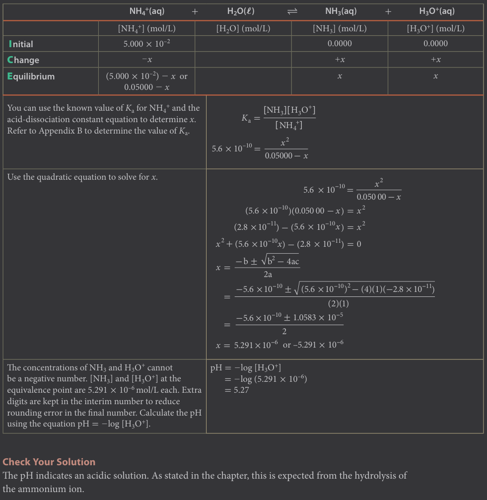

### Equilibrium of Slightly Soluble Ionic Compounds

- slightly soluble ionic compounds reach equilibrium w/ only small amounts of *solute* dissolved in *solvent*
	- low solubility	
	- i.e. barium sulfate (toxic), but our body can easily remove it since it has low solubility
- **solubility:** maximum amount of solute that can dissolve in given qty. of solvent at particular temp.
- when *soluble* ionic compound dissolves in water, it dissolves *completely* in water
- only small amount of slightly soluble ionic compounds dissolve in water
	- it is assumed that particles that do dissolve ionize completely (for gr. 12)

i.e. silver chloride is slightly soluble ionic compound:

$$
\ce{AgCl(s) <=> Ag+(aq) + Cl-(aq)}
$$

Reaction quotient:

$$
Q = \frac{\ce{[Ag+][Cl-]}}{\ce{[AgCl]}}
$$

Ion-product expression, $Q_\text{sp}$:

$$
\begin{align*}
Q_\text{sp} &= Q\ce{[AgCl]} \\
&= \ce{[Ag+][Cl-]}
\end{align*}
$$

- **ion-product expression ($Q_\text{sp}$):** speical reaction quotient for the dissolving of slightly soluble compounds
- when solution becomes saturated, solid reaches equilibrium w/ dissociated ions
- **solubility-product constant ($K_\text{sp}$):** equilibrium constant for slightly soluble ionic compounds
	- at equilibrium, $Q_\text{sp}$ becomes constant
	- $Q_\text{sp}\text{ at eq.} = K_\text{sp}$

*General chemical equation for slightly soluble ionic compound, $\ce{M_pX_q}$*

$$
\ce{M_pX_q <=> pM^n+ + qX^z-}
$$

Ion-product expression and solubility-product constant:

$$
\begin{gather*}
Q_\text{sp} = [\ce{M^n+}]^p[\ce{X^z-}]^q \\
K_\text{sp} = [\ce{M^n+}]^p[\ce{X^z-}]^q \tag{at eq.} \\
\end{gather*}
$$

$K_\text{sp}$ for silver chloride

$$
K_\text{sp} = \ce{[Ag+][Cl-]}
$$

Other $K_\text{sp}$ expressions:

$$
\begin{array}{ll}
\ce{BaSO4(s) <=> Ba^2+(aq) + SO4^2-(aq)} & K_\text{sp} = \ce{[Ba^2+][SO4^2-]} \\
\ce{MgF2(s) <=> Mg^2+(aq) + 2F-(aq)} & K_\text{sp} = \ce{[Mg^2+][F-]^2} \\
\ce{Ca3(PO4)2(s) <=> 3Ca^2+(aq) + 2PO4^3-(aq)} & K_\text{sp} = \ce{[Ca^2+]^3[PO4^3-]^2}
\end{array}
$$

#### Solubility-Product Constant Values

$K_\text{sp}$ values det. experimentally, at 25 &deg;C

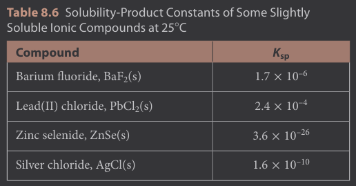

#### Predicting Formation of Precipitate

- **precipitate:** insoluble product formed in reaction between 2 soluble ionic compounds
- can predict by comparing $Q_\text{sp}$ and $K_\text{sp}$

*Precipitate outcomes*

- If $Q_\text{sp} < K_\text{sp}$ &mdash; solution unsaturated, *no precipitate*
- If $Q_\text{sp} = K_\text{sp}$ &mdash; solution saturated, no change
- If $Q_\text{sp} > K_\text{sp}$ &mdash; *precipitate forms* until solution is saturated

#### Calculating Involving Solubility-Product Constant

- **molar solubility:** amount (mol) of solute in 1 L of saturated solution
- solubility often expressed as mass dissolved in 100 g of water
	- at 25 &deg;C, density of water = 1 g/mL
	- $\therefore$ 1 g/100 g = 1 g/100 mL at 25 &deg;C

#### Ex 1: Calc. $K_\text{sp}$ from Molar Solubility

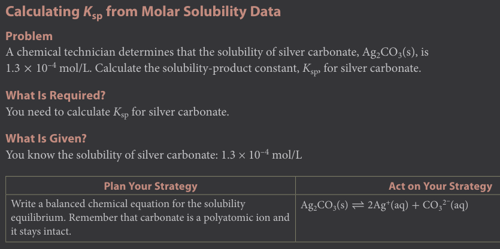

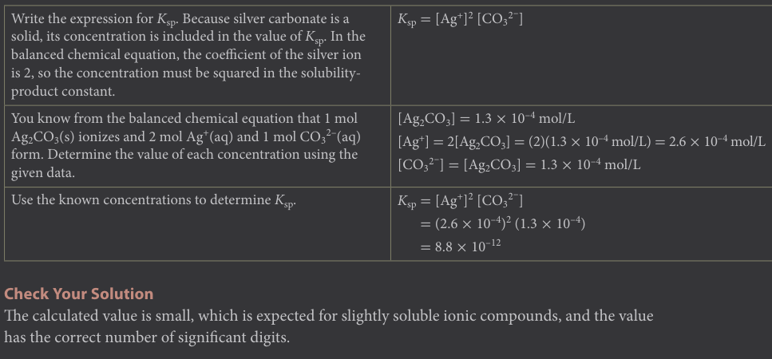

#### Ex 2: Det. Solubility from $K_\text{sp}$

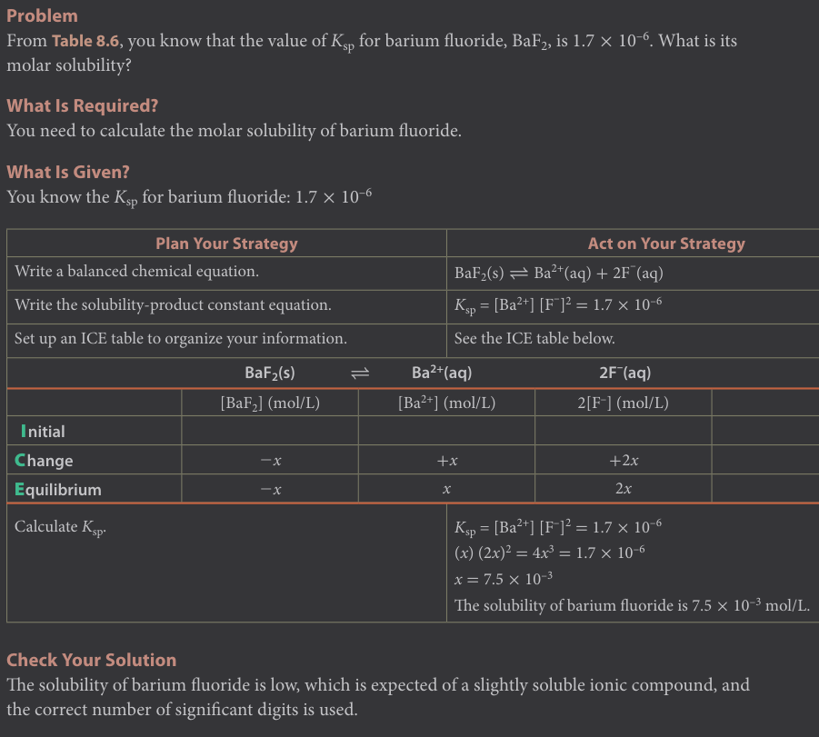

#### Ex 3: Calc. $K_\text{sp}$ from Solubility Data

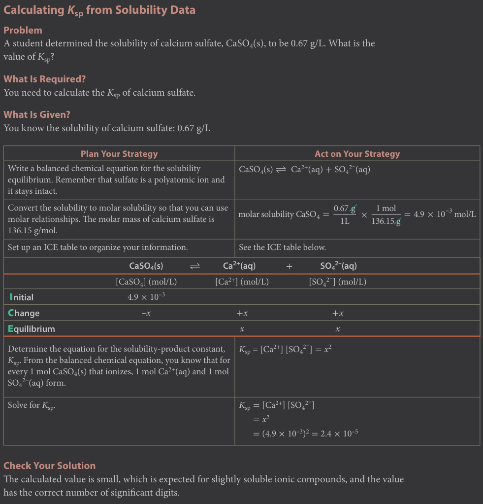

#### Ex 4: Det. Whether Precipitate Will Form

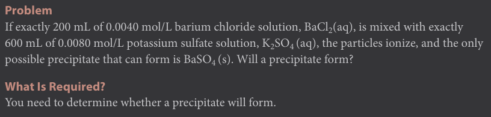

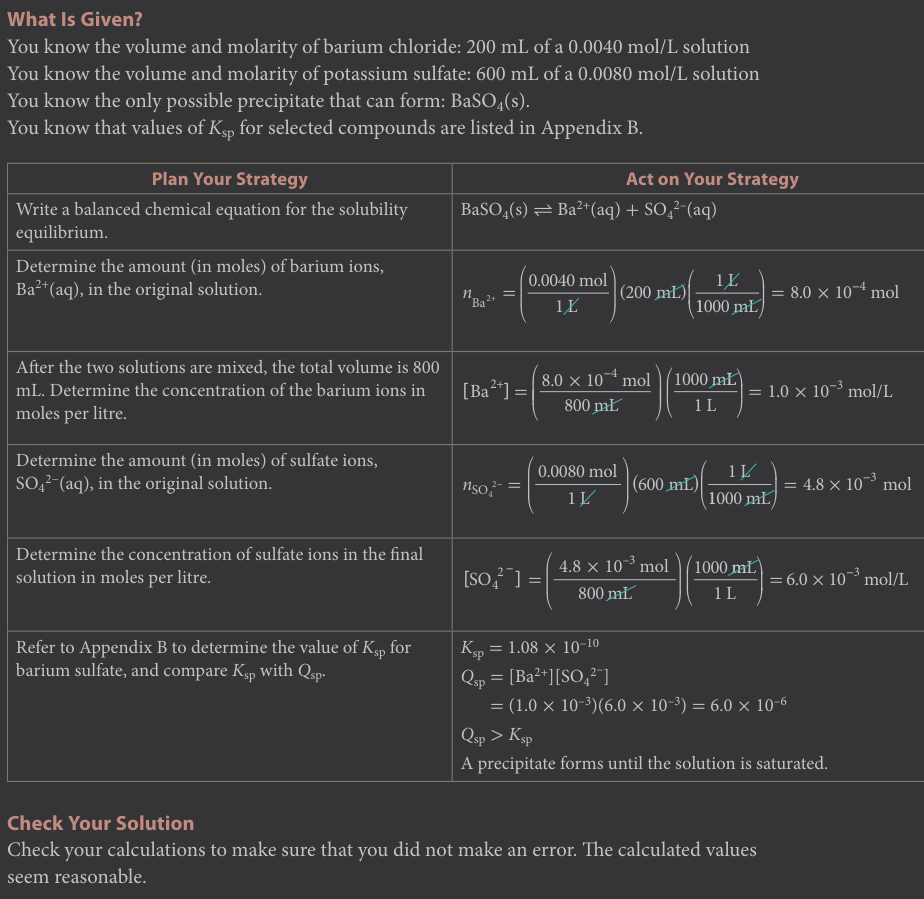