# C10 - Electrochemical Cells

## C10.1 - Galvanic Cells

### Electrochemistry

- **electric current:** flow / directional motion of electric charges
- **electrochemistry:** study of processes involved to convert chemical energy into electrical energy

### History of Galvanic Cell

- First "battery" discovered by Alessandro Volta in 1800
	- copper and zinc disk placed together sep. by paper soaked in salt water
	- copper became pos. charged
	- zinc became neg. charged
	- when placed in circuit, electricity flowed from zinc to copper via the wires
	- copper-zinc set stacked to provide more electricity

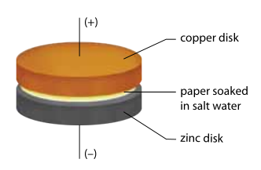

Reaction of first Voltaic / Galvanic Cell:

$$
\begin{equation*}
\ce{Zn($s$) + Cu^{2+}($aq$) -> Zn^{2+}($aq$) + Cu($s$) + energy}
\end{equation*}
$$

- "Battery" inspired by Luigi Galvani's experiment (1737-1798)
	- Galvani was dissecting a frog
	- He touched brass pin w/ steel scalpel
	- Noticed that frog muscle twitched every time this happened
	- Galvani believed living tissue was needed to cause interaction between metals
	- Volta showed electrical energy obtained by contact between metals alone

### Galvanic Cell

- **galvanic cell:** device that uses redox reactions to convert chemical potential energy into electrical energy
	- a.k.a. *voltaic cell*
	- works by preventing direct contact between reactants
- **external circuit:** circuit outside reactions vessel where redox reactions are occuring
	- electrons can move through wire from one electrode to the other
- **salt bridge:** electrical connection between half-cells (reactants) containing electrolyte solution
	- allows current to flow but prevents contact between oxidizing and reducing agent
	- the electrons must flow through the external circuit for the reaction to occur
	- the cation moves to cathode
	- the anion moves to anode
- **electrode:** conductor that carries current into and out of electrochemical cells
	- i.e. the copper and zinc disks
- **electrolyte:** substance that conducts electric current when dissolved in water
	- i.e. the saltwater paper
- **anode:** electrode where oxidation occurs
	- i.e. zinc
- **cathode:** electrode where reduction occurs
	- i.e. copper

#### Daniell Cell

- **Historical Context**
  - First practical galvanic cell developed by **John Frederic Daniell (1790–1845)**.

- **Daniell Cell Components**
  - **Zinc strip** in $\ce{ZnSO4(aq)}$  
  - **Copper strip** in $\ce{CuSO4(aq)}$  
  - Solutions connected by a **salt bridge** ($\ce{KCl(aq)}$, plugged with porous material like cotton or glass wool)  
  - Wire connects electrodes to an electrical device (e.g., voltmeter)

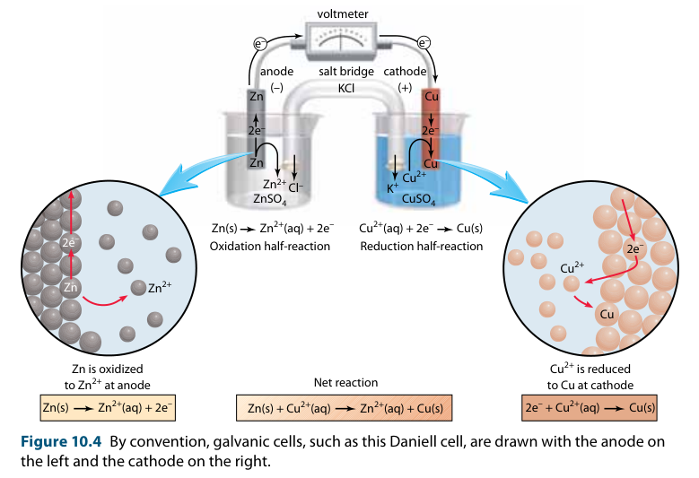

- **Electrodes and Electrolytes**
  - Metal strips act as **electrical conductors**  
  - **Electrodes:** conductors where electrons enter/exit the cell  
  - **Electrolytes:** solutions containing ions that conduct electricity (e.g., $\ce{ZnSO4}$, $\ce{CuSO4}$)

- **Galvanic Cell Operation**
  - **Oxidation at anode:** $\ce{Zn(s) -> Zn^{2+}(aq) + 2 e^-}$  
  - **Reduction at cathode:** $\ce{Cu^{2+}(aq) + 2 e^- -> Cu(s)}$  
  - **Overall reaction:**  
    $$ \ce{Zn(s) + Cu^{2+}(aq) -> Zn^{2+}(aq) + Cu(s)} $$

- **Electron and Ion Flow**
  - Electrons flow **through external circuit** from anode ($\ce{Zn}$) to cathode ($\ce{Cu}$)  
  - $\ce{Cu^{2+}}$ ions accept electrons → deposit as copper metal  
  - **Salt bridge ions** maintain charge balance:  
    - $\ce{K+}$ moves to cathode solution  
    - $\ce{Cl-}$ moves to anode solution  
  - **Electron flow diagram (conceptual):**  
    $$ 
    \ce{
    Zn(s) -> Zn^{2+}(aq) + 2 e^- ->[external circuit] Cu^{2+}(aq) + 2 e^- -> Cu(s)
    }
    $$
- **Change in Mass of Electrodes**
  - ***Mass*** of copper cathode *increases*
	  - as copper(II) *reduced to* copper atoms
  - ***Mass*** of zinc anode *decreases*
	  - as zinc oxidized and goes into solution
- **Salt Bridge Considerations**
  - Electrolyte must **not interfere** with reaction (e.g., avoid $\ce{AgCl}$ precipitation)
- **Current and Energy**
  - Current flows through a **complete circuit** (electrons in wires, ions in solutions)  
  - Energy comes from the reaction: chemical energy → electrical energy  
  - Current continues until **solution concentrations and electrode changes** halt the reaction

### Electrode Types & Inert Electrodes

* Varieties of electrodes
  * Example: chromium and silver electrodes
* **Salt bridge electrolytes**
  * Choice of salt bridge must **avoid unwanted reactions** (e.g., precipitation)
  * Example: use $\ce{KNO3}$ instead of $\ce{KCl}$ to prevent $\ce{AgCl}$ formation
* **Key principle**
  * Always select components to **prevent interference** between the salt bridge and electrode solutions
  
#### Inert Electrodes
  
- **inert electrode:** electrode made from a material that is neither a reactant nor a product *but provides a surface where redox reactions can occur*
	- used when oxidizing / reducing agents are dissolved electrolytes or gases

 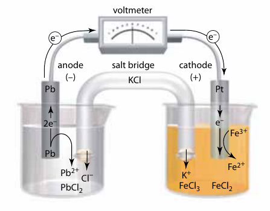

Reaction Equations:

$$
\begin{gather*}
\ce{Pb($s$) + 2FeCl3($aq$) -> 2FeCl2($aq$) + PbCl2($aq$)} \tag{bal.} \\
\ce{Pb($s$) + 2Fe^3+($aq$) -> 2Fe^2+($aq$) + Pb^2+($aq$)} \tag{NIE} \\
\ce{Pb($s$) -> Pb^2+($aq$) + 2e^-} \tag{Ox.} \\
\ce{Fe^3+($aq$) + e^- -> Fe^2+($aq$)} \tag{Red.}
\end{gather*}
$$

- anode: lead
	- lead atoms lose electrons that go through electrode
	- lead(II) ions dissolve in solution
- cathode: platinum
	- reduction half-reaction involves iron(III) ions
	- iron(III) accepts electrons from platinum to become iron(II)

### Sketching a Galvanic Cell: Example

**Problem:**

Sketch galvanic cell based on these reactions and write balanced ionic equation:

$$
\begin{gather*}
\ce{Al^3+(aq) + 3e^- -> Al(s)} \\
\ce{Ni^2+(aq) + 2e^- -> Ni(s)}
\end{gather*}
$$

**Solution:**

*Note:* By convention, anode is shown on left and cathode is shown on right

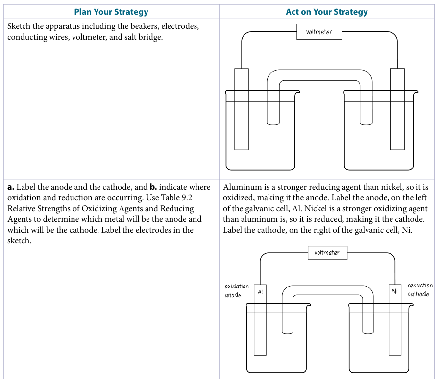

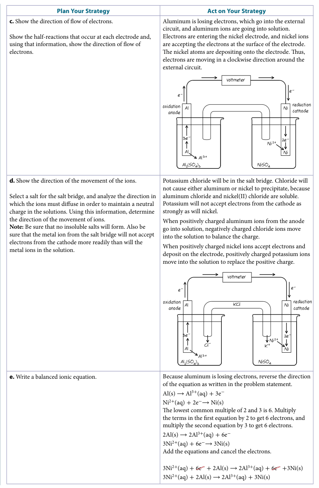

### Cell Notation

**cell notation:** shorthand method for representing galvanic cells

**Rules:**

1. Left side is anode and right side is cathode
2. Each single vertical line, |, repr. phase / state boundary
	1. i.e. electrode is solid and ion is aqueous
3. A comma is used to seperate the half-cell components w/ the same state
4. The anode and cathode are separated by a double vertical line, ||, representing the **salt bridge**
5. Inert electrodes are also represented at the very end even though they don't partake in the reaction
6. The order of the components from left to right are:
	1. the anode
	2. the anode's electrolyte (aq)
	3. the salt bridge
	4. the cathode's electrolyte (aq)
	5. the cathode
	6. the inert electrode (if available)

*Example: Daniell Cell*

$$
\begin{equation*}
\ce{Zn($s$) | Zn^2+($aq$) || Cu^2+($aq$) + Cu($s$)}
\end{equation*}
$$

*Example: Lead and iron cell with inert electrode platinum*

$$
\begin{equation*}
\ce{Pb($s$) | Pb^2+($aq$) || Fe^3+($aq$), Fe^2+($aq$) | Pt($s$)}
\end{equation*}
$$

### Cell Potentials

- when seperation of charges, force acts on charged particles &rarr; potential energy
- **electrical potential difference** *(between two points)*: amount of energy that a unit charge would gain by moving from one point to the other
	- a.k.a. ***voltage***
	- unit: volts (V)
- **cell potential ($E_\text{cell}$):** electrical potential difference between two electrodes of a cell
	- depends on many factors incl.
		- nature of ox. / red. agents
		- concentrations of salt solutions in half-cells
		- temp. of solutions
		- atm. pressure
- **standard cell potential ($E^\circ_\text{cell}$):** cell potential in standard conditions
	- Standard Conditions
		- concentration of salt solution: 1.0 mol/L
		- atmospheric pressure: 101.325 kPa (1.0 atm)
		- temperature: 25 &deg;C
		- electrodes are pure metals
	- no current flowing inside cell
	- only factor affecting cell potential in this scenario are the ox. / red. agents themselves
	- $\circ$ (circle) is used to indicate std. conditions

#### Half-Cell Potentials

- **hydrogen half-cell:** reference point to describe half-cell potential
	- $\ce{H2(g) -> 2H^+(aq) + 2e^-}$
	- platinum electrode
	- 1.0 mol/L solution of monoprotic acid
	- hydrogen gas bubbled past electrode at 1.0 atm pressure
	- half-cell potential of hydrogen **defined as 0**
	- can be oxidizing or reducing half-cell

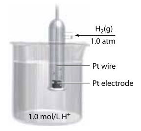

*Hydrogen half-cell being used to measure half-cell potentials*

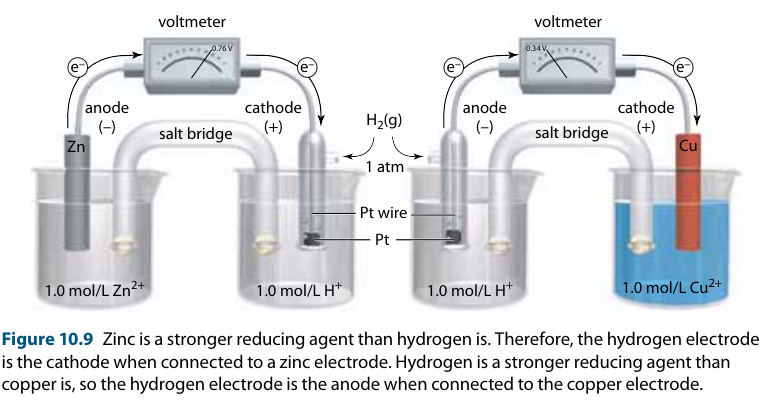

- Cell potential for zinc-hydrogen cell: 0.76 V
- Cell potential for hydrogen-copper cell: 0.34 V

Cell notation for above cells:

$$
\begin{gather*}
\ce{Zn($s$) | Zn^2+($aq$) || H^+($aq$) | H2($g$) | Pt($s$)} \\
\ce{Pt($s$) | H2($g$) | H^+($aq$) || Cu^2+($aq$) | Cu($s$)}
\end{gather*}
$$

### Standard Reduction Potential

- **standard reduction potential ($E^\circ$):** potential difference between between given half-cell and hydrogen half-cell *written as reduction reactions under standard conditions*
	- potential diff. is negative when given half-cell is oxidized
- choice of salt bridge must be correct for proper reduction
	- if ion in salt bridge is stronger oxidizing agent than the ions in reduction solution, they will accept electrons in place of the desired ion
	- i.e. silver nitrate salt bridge in Daniell cell

Standard reduction potential for zinc and copper

$$
\begin{align*}
\ce{Zn^2+($aq$) + 2e^- &-> Zn($s$)} &\quad E^\circ = -0.76\text{ V} \\
\ce{Cu^2+($aq$) + 2e^- &-> Cu($s$)} &\quad E^\circ = +0.34\text{ V} \\
\end{align*}
$$

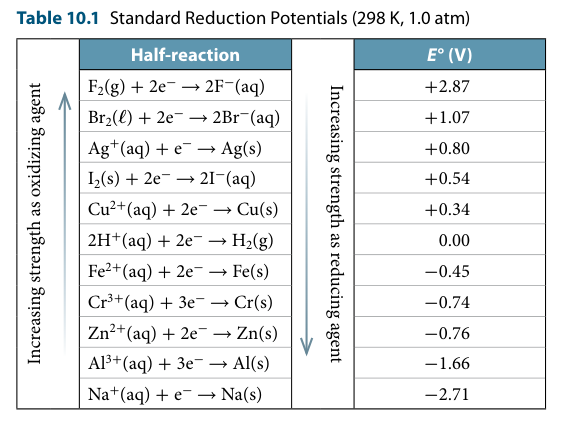

### Calculating Standard Cell Potentials

$$
\begin{equation*}
E^\circ_\text{cell} = E^\circ_\text{cathode} - E^\circ_\text{anode}
\end{equation*}
$$

- $E^\circ_\text{cell}$: standard cell potential
- $E^\circ_\text{cathode}$: standard reduction potential for reduction (cathode) half-reaction
- $E^\circ_\text{anode}$: standard reduction potential for oxidation (anode) half-reaction

Interpretation:

- positive standard cell potential = spontaneous reaction in direction indicated
- negative $E^\circ_\text{cell}$ = reaction proceeds in reverse direction

#### Example

What is the standard cell potential for the galvanic cell with the reaction below?

$$
\begin{equation*}
\ce{2I^-($aq$) + Br2($l$) -> I2($s$) + 2Br^-($aq$)}
\end{equation*}
$$

Will the reaction proceed spontaneously as written?

**Solution:**

1. Write oxidation and reduction half-reactions:

$$
\begin{gather*}
\ce{2I^-($aq$) -> I2($s$) + 2e^-} \tag{Ox., anode} \\
\ce{Br2($l$) + 2e^- -> 2Br^-($aq$)} \tag{Red., cathode}
\end{gather*}
$$

2. Find standard red. potentials of anode and cathode

$$
\begin{gather*}
\ce{2I^-($aq$) -> I2($s$) + 2e^-} \\
E^\circ_\text{anode} = +0.54\text{ V} \\ \\
\ce{Br2($l$) + 2e^- -> 2Br^-($aq$)} \\
E^\circ_\text{cathode} = +1.07\text{ V} \\ \\
\end{gather*}
$$

3. Calculate cell potential

$$
\begin{align*}
E^\circ_\text{cell} &= E^\circ_\text{cathode} - E^\circ_\text{anode} \\
&= +1.07\text{ V} - (+0.54\text{ V}) \\
&= +0.53\text{ V}
\end{align*}
$$

$\therefore$ The standard cell potential is +0.53 V and since it is positive, the reaction is spontaneous as written.

---

## C10.2 - Applications of Galvanic Cells

### Dry Cells

- **dry cell:** galvanic cell where the electrolyte has been thickened into paste
	- first invented in 1886 by Fr. chemist Georges Leclanché
	- called the "Leclanché cell"
- **battery:** set of galvanic cells connected *in series*
	- negative electrode of one cell connected to positive electrode of next cell
	- *misconception:* a "battery" is not a single cell
- **primary battery:** disposable, non-rechargeable battery
- **secondary battery:** rechargeable battery

#### Typical Dry Cell

***Structure:***

- zinc anode
- inert graphite cathode
- electrolyte (moist paste of...)
	- manganese(IV) oxide
	- zinc chloride
	- ammonium chloride
	- "carbon black" (carbon)

**Oxidation and Reduction Half-Reactions:**

$$
\begin{gather*}
\ce{Zn(s) -> Zn^2+(aq) + 2e-} \tag{Ox.} \\
\ce{MnO2(s) + H2O($l$) + 2e- -> Mn2O3(s) + 2OH-(aq)} \tag{Red.}
\end{gather*}
$$

**Overall Cell Reaction:**

$$
\begin{equation*}
\ce{2MnO2(s) + Zn(s) + H2O($l$) -> Mn2O3(s) + Zn^2+(aq) + 2OH-(aq)}
\end{equation*}
$$

#### Alkaline and Button Batteries

- **alkaline battery\*:** dry cell that has an alkaline (basic) electrolyte in the paste
	- typically produces 1.5 V
- **button battery\*:** very small dry cell
	- usually has alkaline electrolyte in paste
	- zinc-mercury or zinc-silver electrodes
	- mercury is cheaper, but environ. toxic

**Alkaline Battery** Structure

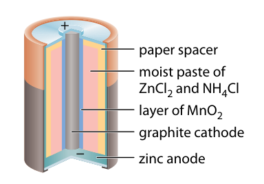

Alkaline battery reactions

$$
\begin{gather*}
\ce{Zn(s) + 2OH-(aq) -> ZnO(s) + H2O($l$) + 2e-} \tag{Ox.} \\
\ce{MnO2(s) + 2H2O(l) + 2e- -> Mn(OH)2(s) + 2OH-(aq)} \tag{Red.} \\
\therefore \ce{Zn(s) + MnO2(s) + H2O($l$) -> ZnO(s) + Mn(OH)2(s)}
\end{gather*}
$$

**Button battery** structure

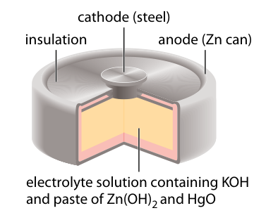

Button battery reactions

$$
\begin{gather*}
\ce{Zn(s) + 2OH-(aq) -> ZnO(s) + H2O(l) + 2e-} \tag{Ox.} \\
\ce{HgO(s) + H2O($l$) + 2e- -> Hg($l$) + 2OH-(aq)} \tag{Red.} \\
\therefore \ce{Zn(s) + HgO(s) -> ZnO(s) + Hg($l$)}
\end{gather*}
$$

### Health and Safety Concerns of Batteries

- Batteries can corrode and alkaline substances can leak out
- Explosive if burned; can release alkaline material and toxic heavy metals (some batts.)

#### Accidental swallowing of button batteries
	
- involves children <5 yrs.
- most of time, swallowing of battery goes quickly through digestive sys., expelled, no harm
- dangerous if lodged in esophagus
	- body fluids provide electrolyte for battery
	- current flows through fluids
	- causes chem. reactions that make strong alkaline compounds
	- above compounds burn tissues
	- serious damage can begin within 2 h after swallowing

### Fuel Cell

**fuel cell:** battery that can be re-fueled

- reactants flow into fuel cell
- products flow out of it
- conversion of fuel directly into electrical energy
- "waste" product: water

#### History

- 1st demo by Sir William Robert Grove, 1839
	- called it "gas battery"
- 1889: Ludwig Mond and Charles Langer tried and fail to produce practical fuel cell from Grove's design
	- coined the term "fuel cell"
- 1932: Dr. Francis Thomas Bacon created fuel cell to power welding machine; mod Mond and Langer's fuel cell
	- not practical or economical
- 1960: NASA developed fuel cell for space flights with people
	- looking for safe, efficient, lightweight source of electricity
	- expensive but practical
	- produced pure water for astronauts to drink

#### Fuel Cell Technology

All based on principle of galvanic cell, but reactants are gases that flow past electrodes

**Technology 1:** proton exchange membrane (PEM) fuel cell by NASA

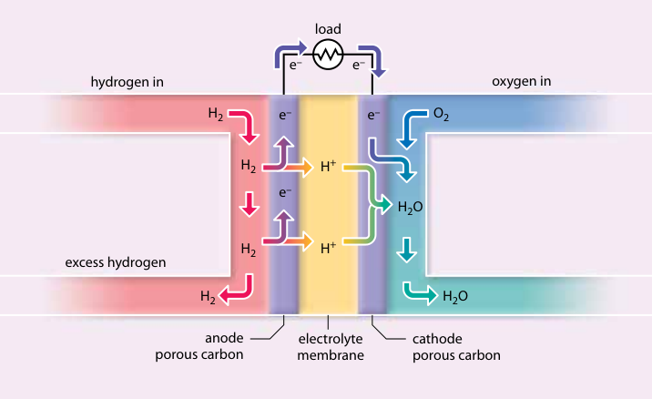

- *anode:* porous carbon coated with platinum
	- Pt catalyzes ox. H-R
- *electrolyte:* thin solid polymer
	- allows passage of H+ ions
	- blocks electrons
- *cathode:* porous carbon
- *oxidized / RA:* hydrogen gas
- *reduced / OA:* oxygen gas, from air

*Reactions:*

$$
\begin{gather*}
\ce{H2(g) -> 2H+(s) + 2e-} \tag{Ox.} \\
\ce{O2(g) + 4H+(s) + 4e- -> 2H2O($l$)} \tag{Red.} \\
\therefore \ce{2H2(g) + O2(g) -> 2H2O($l$)}
\end{gather*}
$$

- **fuel cell stack:** consists of many individual cell layers
- PEM: 40% to 50% efficient
- operating temps: 60&deg;C and 100&deg;C

**Technology 2:** phosphoric acid fuel cell

- *same ox. and red. H-R*
- *electrolyte:* phosphoric acid
- slightly higher temps. for slightly higher efficiencies

**Technology 3:** alkaline fuel cell

- developed for NASA's Apollo program, still used in space shuttles
- *anode / cathode:* most likely porous carbon
- *electrolyte:* potassium hydroxide (aq.)

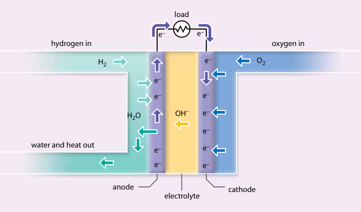

*Reactions:*

$$
\begin{gather*}
\ce{2H2(g) + 4OH-(aq) -> 4H2O($l$) + 4e-} \tag{Ox.} \\
\ce{O2(g) + 2H2O($l$) + 4e- -> 4OH-(aq)} \tag{Red.} \\
\therefore \ce{2H2(g) + O2(g) -> 2H2O($l$)}
\end{gather*}
$$

#### Sources of Hydrogen Gas

- trace amounts of hydrogen in atmos.
- hydrogen must be extracted from other compounds
	- i.e. electrolysis of water into hydrogen and oxygen
	- *reforming:* process where hydrogen is chemically removed from hydrocarbons
- development of fuel cells w/ internal *reformers* underway
	- i.e. direct methanol fuel cell (DMFC)

*DMFC Reactions*

$$
\begin{gather*}
\ce{CH3OH($l$) + H2O($l$) -> CO2(g) + 6H+ + 6e-} \tag{Ox.} \\
\ce{O2(g) + 4H+ + 4e- -> 2H2O($l$)} \tag{Red.} \\
\therefore \ce{2CH3OH($l$) + 3O2(g) -> 2CO2(g) + 4H2O($l$)}
\end{gather*}
$$

### Corrosion: Unwanted Galvanic Cells

**corrosion:** spontaneous redox reaction between materials and substances in their environment

- many metals easily oxidized by oxygen (powerful OA)
- some corrosion beneficial: green layer (*patina*) formed on copper roof
- copper corrosion used in art

#### Rusting

- **rust:** hydrated iron(III) oxide = $\ce{Fe2O3 * xH2O(s)}$
- surface of piece of iron behaves as though it's made of many small galvanic cells
	- electrochemical reactions form rust
- in each small cell, iron = anode
- cathode is inert
	- may be: impurity in or deposited on iron
	- i.e. piece of soot (carbon) from air
- water (rain) needed for rusting
	- carbon dioxide reacts with waater to form carbonic acid
	- carbonic acid partially dissociates into ions: $\ce{H2CO3(aq) <=> H+(aq) + HCO3-(aq)}$
	- carbonic acid &rarr; electrolyte
	- circuit completed by iron, conducting electrons from anode to cathode

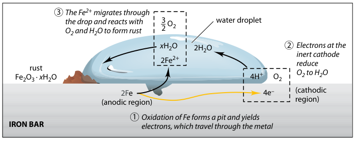

**Simplified Description of Half-Reactions:**

$$
\begin{gather*}
\ce{Fe(s) + Fe^2+(aq) + 2e-} \tag{Ox.} \\
\ce{O2(g) + 2H2O($l$) + 4e- -> 4OH-(aq)} \tag{Red.} \\
\therefore \ce{2Fe(s) + O2(g) + 2H2O($l$) -> 2Fe^2+($aq$) + 4OH-(aq)}
\end{gather*}
$$

**Formation of Rust**

1. No barrier in cell; dissolved iron(II) and hydroxide mix and react

$$
\ce{2Fe(s) + O2(g) + 2H2O($l$) -> 2Fe(OH)2(s)}
$$

2. iron(II) hydroxide further oxidized by oxygen in air

$$
\ce{4Fe(OH)2(s) + O2(g) + 2H2O($l$) -> 4Fe(OH)3(s)}
$$

3. iron(III) hydroxide readily breaks down to form rust

$$
\ce{2Fe(OH)3(s) -> Fe2O3 * 3H2O(s)}
$$

- both iron(III) hydroxide and hydr. iron(III) oxide are reddish-brown ("rust color")
	- easily corrodes and causes damage
- some metals corrode in air to form protective layer of oxide
	- i.e. Al, Cr, Mg

#### Corrosion Prevention

1. **Protective Layers**
	- painting iron object &rarr; paint protects iron from water and air
	- or grease, oil, plastic, metal more resistant than iron to corrosion
	- *enamel coating* where enamel = shiny, hard, unreactive glass that can be melted on metal surface
2. **Alloys**
	- make alloy of iron with more resistant metal
	- *stainless steel:* iron alloy w/ at least 10% Cr by mass + other metals like Ni (sometimes)
	- too expensive for large-scale apps. like bridges
3. **galvanizing:** the process of covering iron with a protective layer of zinc
	- used for metal buckets and chain-link fences
	- zinc acts as protective layer until iron is exposed
	- iron still protected because zinc more easily oxidized &rarr; zinc becomes *sacrificial anode*
	- **sacrificial anode:** a metal that oxidizees more easily than iron and is destroyed to protect an iron object
	- iron not oxidized until all zinc reacted
4. **cathodic protection:** process of attaching a more reactive metal to an iron object that will act as anode to prevent iron corrosion
	- reactive metal acts as *sacrificial anode*
		- does not completely cover iron
		- destroyed slowly, needs periodic replacement
	- unfavourable results if metal is less reactive than iron
		- when layer intact = good protection
		- damaged layer = iron corrodes faster w/ layer than it would on its own
		- i.e. tin can (tin-plated steel)
			- tin < iron
			- tin acts as cathode in each mini cell on can's surface
			- tin provides large area of cathodes for galvanic cells on can
			- iron acts as anode
		- i.e. iron pipe to copper pipe
			- speeds up corrosion of iron
			- Cu < Fe
			- Cu = cathode, Fe = anode at cells on intersection

---

## C10.3 - Driving Non-Spontaneous Reactions

### Electrolytic Cells

- **electrolytic cell:** electrochemical cell that uses external source of energy to drive a non-spontaneous reaction
- **electrolysis:** the process of using electrical energy to drive a non-spontaneous redox reaction

...

- electrolytic cells are similar to galvanic cells
- galvanic cells can be converted into electrolytic cells by using an external power source
	- change in direction
	- cathode &rarr; anode
	- anode &rarr; cathode

*Conversion of Daniell cell into electrolytic cell*

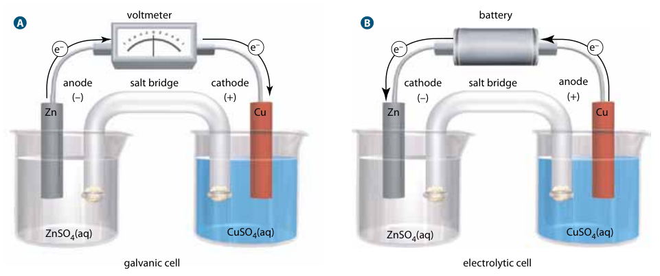

#### Galvanic vs. Electrolytic Cell

*Examples used are from the Daniell cell above*

| Galvanic Cell | Electrolytic Cell |
|---------------|--------------------|
| Spontaneous reaction | Non-spontaneous reaction |
| Converts chemical energy to electrical energy | Converts electrical energy to chemical energy |
| Anode (negatively charged): zinc electrode | Anode (positively charged): copper electrode |
| Cathode (positively charged): copper electrode | Cathode (negatively charged): zinc electrode |
| Oxidation (at anode): $\ce{Zn(s) -> Zn^{2+}(aq) + 2e^-}$ | Oxidation (at anode): $\ce{Cu(s) -> Cu^{2+}(aq) + 2e^-}$ |
| Reduction (at cathode): $\ce{Cu^{2+}(aq) + 2e^- -> Cu(s)}$ | Reduction (at cathode): $\ce{Zn^{2+}(aq) + 2e^- -> Zn(s)}$ |
| Cell reaction: $\ce{Zn(s) + Cu^{2+}(aq) -> Zn^{2+}(aq) + Cu(s)}$ | Cell reaction: $\ce{Cu(s) + Zn^{2+}(aq) -> Cu^{2+}(aq) + Zn(s)}$ |

#### Standard Cell Potential for Electrolytic Cells

The standard cell potential is non-spontaneous = negative

$$
\begin{align*}
E^\circ_\text{cell} &= E^\circ_\text{cat.} - E^\circ_\text{an.} \\
&= E^\circ_\text{Cu} - E^\circ_\text{Zn} \tag{example} \\
&= -0.76\text{ V} - (0.34\text{ V}) \\
&= -1.10\text{ V}
\end{align*}
$$

This means 1.10 V of voltage is required to drive the electrolytic reaction.

### Electrolysis in Aqueous Solutions

#### Galvanic-Electrolytic Cell Reaction Reversibility

- Some electrolytic cells have *reverse reactions* of their galvanic variants
- Depending on nature of electrolyte, not all electrolytic cells have *reverse reaction* of their galvanic cell counterpart
- Sir Humphry Davy (1778-1829) attempted to reduce metal ions in salts to produce pure metals
- He tried to decompose sodium chloride into sodium and chlorine gas

*Expected Result:*

$$
\begin{gather*}
\ce{2Cl-(aq) -> Cl2(g) + 2e-} \tag{Ox.} \\
\ce{Na+(aq) + e- -> Na(s)} \tag{Red.}
\end{gather*}
$$

*Observed Result:*

- chlorine gas formed at anode
- hydrogen gas formed at cathode
	- only source of hydrogen was water in which sodium chloride was dissolved
- water was being reduced at cathode instead of sodium

#### Electrolysis of Water

- Some water molecules are oxidized at anode
- Other water molecules are reduced at cathode

**Redox Reactions of Water Electrolysis:**

*Since oxidation written in oxidation form, $E^\circ$ is negative*

$$
\begin{align*}
&\ce{2H2O($l$) -> O2(g) + 4H+ + 4e-} \quad &-E^\circ = -1.23\text{ V} \tag{Ox.} \\
&\ce{2H2O($l$) + 2e- -> H2(g) + 2OH-(aq)} \quad &E^\circ = -0.83\text{ V} \tag{Red.}
\end{align*}
$$

- Oxygen generated at anode
- Hydrogen generated at cathode

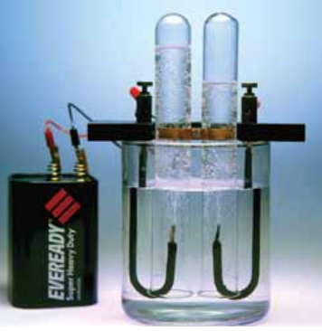

*The volume of hydrogen generated is twice that of oxygen*

#### Limitations of Water Electrolysis under Standard Conditions

- pure water is poor conductor of current
	- $\therefore$ electrolysis of water is *slooooooow*
- salt (that will not interfere) can be used as catalyst to speed up reactions
	- commonly used: sodium sulfate, $\ce{NaSO4(aq)}$
- concentrations of reactants and products in water electrolysis are not 1.0 mol/L
	- conc. of H and OH ions: 1.0 &times; 10-7 mol/L
	- standard reaction potential predictions *cannot* be used

**Water Electrolysis under Non-Standard Conditions**

*No $\circ$, since not under std. conds.*

$$
\begin{align*}
&\ce{2H2O($l$) -> O2(g) + 4H+ + 4e-} \quad &-E = -0.82\text{ V} \tag{Ox.} \\
&\ce{2H2O($l$) + 2e- -> H2(g) + 2OH-(aq)} \quad &E^\circ = -0.42\text{ V} \tag{Red.}
\end{align*}
$$

#### The Chlor-Alkali Process

**chlor-alkali process:** electrolysis procedure for making chlorine gas and sodium hydroxide from brine

- *brine:* saltwater, aq. solution of high concentration sodium chloride
- Used to produce sodium hydroxide and chlorine
	- 2 of most produced chemicals in N.A.
- Uses of Chlorine
	- make laundry bleach
	- bleach pulp for paper
	- make compounds for treating water
	- disinfectant
	- hydrochloric acid
	- make polyvinyl chloride (PVC) plastic
- Uses of Sodium Hydroxide
	- break down lignin in wood for paper prod.
	- soaps and detergents
	- prod. of aluminum
	- manufacturing of many chems.

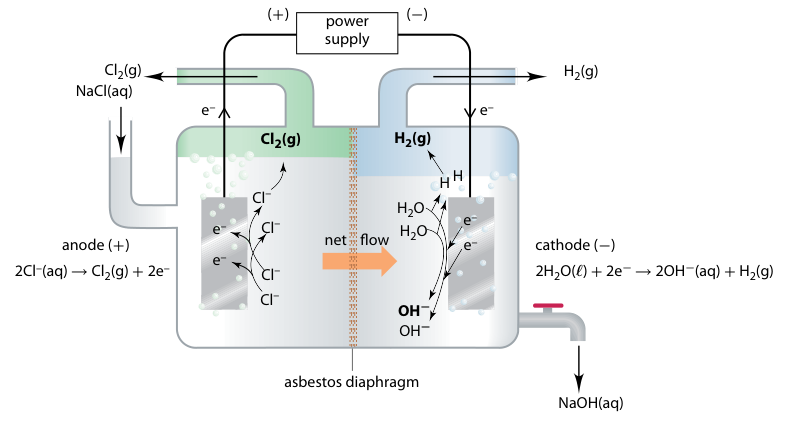

*Chemical Equation:*

$$
\begin{gather*}
\ce{2NaCl(aq) + 2H2O($l$) -> Cl2(g) + H2(g) + 2NaOH(aq)} \tag{bal. eq.} \\
\ce{2Cl-(aq) -> Cl2(g) + 2e-} \tag{Ox.} \\
\ce{2H2O($l$) + 2e- -> 2OH-(aq) + H2(g)} \tag{Red.} \\
\end{gather*}
$$

**Explanation:**

- chlorine, hydrogen, and sodium hydroxide highly reactive with each other
	- must be separated as they're being produced
- diff. in liquid levels between compartments causes net flow of solution into cathode compartment of hydrogen prod.
- chlorine produced at anode
	- removed to prevent mixing w/ hydroxide
- sodium hydroxide removed from cell periodically and fresh brine added to cell
- sodium hydroxide dried by evaporation and packaged as solid
- hydrogen gas is "waste product," not used widely commercially
	- sometimes used as fuel to heat and dry sodium hydroxide
	- can be used as hydrogen source for fuel cells

### Electrolysis of Molten Salts

- Many pure metals like sodium cannot be purified via electrolysis in aqueous solution
- Sir Humphry Davy found answer
- **Purification Steps**
	- Heat salts until they melt
	- Apply electrolysis to molten solids
	- Water cannot interfere
- Davy was able to purify Na, K, Mg, Ca, Sr, Ba

*Electrolysis of molten sodium chloride:*

$$
\begin{gather*}
\ce{Na+($l$) + e- -> Na(s)} \tag{Red., an.} \\
\ce{2Cl-(aq) -> Cl2(g) + 2e-} \tag{Ox., cat.}
\end{gather*}
$$

*Diagram of electrolysis:*

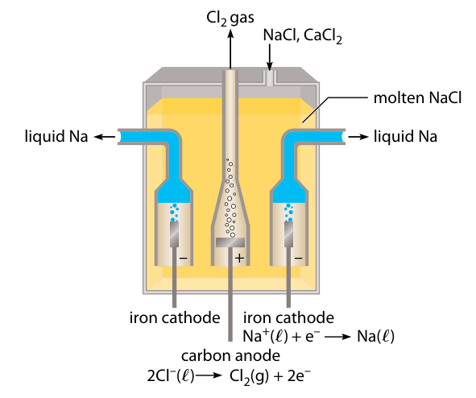

Cell above also known as *Downs cell*

### Rechargeable Batteries

- Secondary (rechargeable) batteries use electrolysis to recharge
	- most common found in car engines &rarr; lead-acid battery

#### Lead-Acid Batteries

- When in use, lead-acid battery partially discharges
	- cells in battery act as galvanic cells to produce electricity
	- spontaneous reaction
- When charging, external power is supplied to battery
	- source: alternator in car engine, if in car
	- external power reverses reaction
	- non-spontaneous reaction
- Reversibility is not perfect
	- lead-acid battery can go through many charge/discharge cycles until it wears out

**Lead-acid battery diagram:**

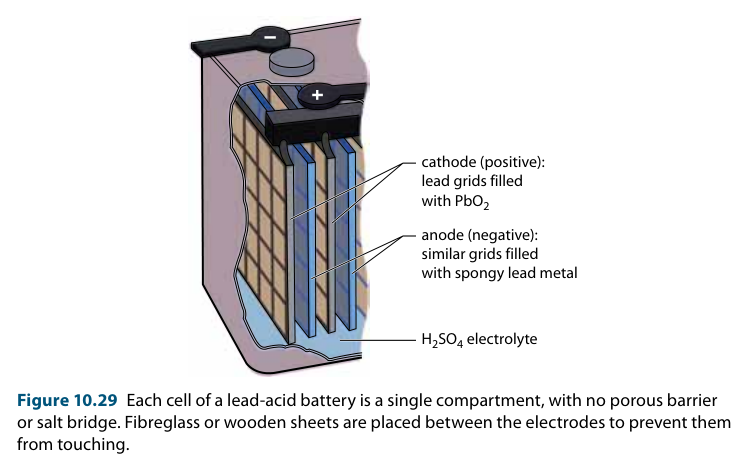

**Lead-acid battery reactions, being used:**

$$
\begin{gather*}
\ce{Pb(s) + SO4^2-(aq) -> PbSO4(s) + 2e-} \tag{Ox., Pb anode} \\
\ce{PbO2(s) + 4H+(aq) + SO4^2-(aq) + 2e- -> PbSO4(s) + 2H2O($l$)} \tag{Red., $\ce{PbO2}$ cat.} \\
\therefore \ce{Pb(s) + PbO2(s) + 2SO4^2-(aq) + 4H+(aq) -> 2PbSO4(s) + 2H2O($l$)}
\end{gather*}
$$

**Lead-acid battery reactions, being charged:**

$$
\begin{gather*}
\ce{PbSO4(s) + 2e- -> Pb(s) + SO4^2-(aq)} \tag{Red., Pb cathode} \\
\ce{PbSO4(s) + 2H2O($l$) -> PbO2(s) + 4H+(aq) + SO4^2-(aq) + 2e-} \tag{Ox. $\ce{PbO2}$ anode} \\
\therefore \ce{2PbSO4(s) + 2H2O($l$) -> Pb(s) + PbO2(s) + 2SO4^2-(aq) + 4H+(aq)}
\end{gather*}
$$

#### Nickel-Cadmium Cell

More portable secondary bettery

**Half-Reactions when cell is galvanic:**

$$
\begin{gather*}
\ce{Cd(s) + 2OH-(aq) -> Cd(OH)2(s) + 2e-} \tag{Ox., Cd anode} \\
\ce{NiO(OH)(s) + H2O($l$) + e- -> Ni(OH)2(s) + OH-(aq)} \tag{Red., NiO(OH) cat.} \\
\therefore \ce{Cd(s) + 2NiO(OH)(s) + 2H2O($l$) -> Cd(OH)2(s) + 2Ni(OH)2(s)}
\end{gather*}
$$

**Nickel-cadmium cell diagram:**

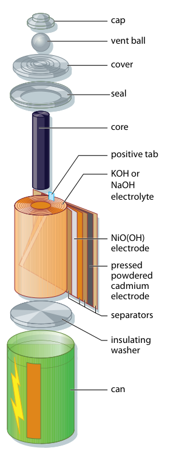

**Risks of landfill disposal:**

- Recycle Ni-Cd batteries
- Over time, Ni-Cd batteries release toxic cadmium
- Cadmium environmentally harmful, can enter food chain
- *Effects of long-term exposure* to cadmium on humans
	- serious medical effects like...
	- high blood pressure
	- heart disease

### Industrial Extraction and Refining of Metals

- **Smelting** is used to extract some metals like iron
- **Reactive metals** (sodium, lithium, beryllium, magnesium, calcium, radium) are extracted through **electrolysis of molten chlorides**
- **Aluminum** is extracted from **bauxite ore** using electrolysis
- **Refining** is the process of purifying metals
    - After extraction, some metals are refined in **electrolytic cells**
    - Example: Copper is 99% pure after extraction, suitable for plumbing, but needs further refining for electrical wiring
    - **Nickel** can also be refined electrolytically