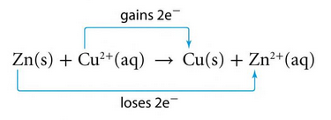
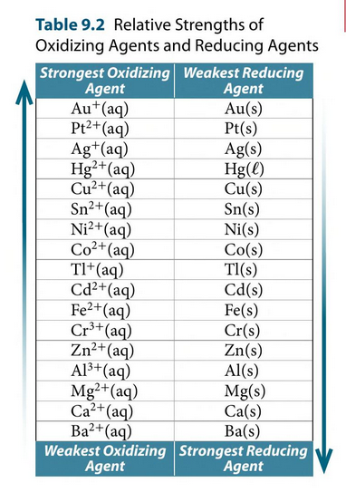
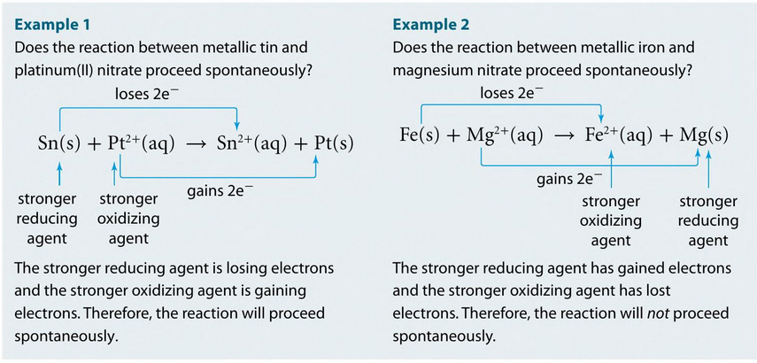
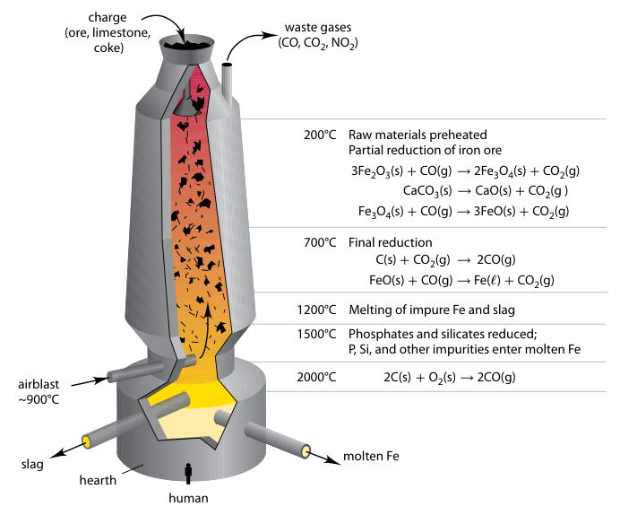
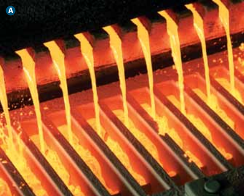
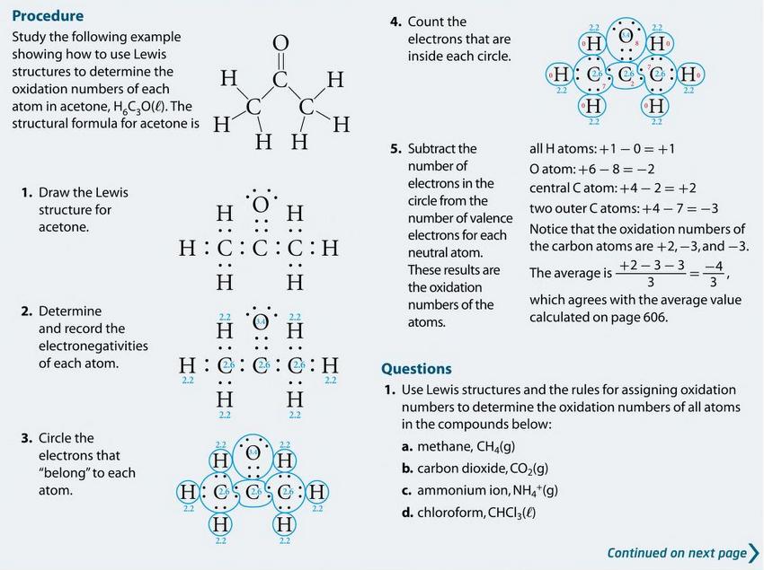
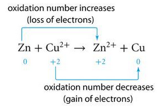
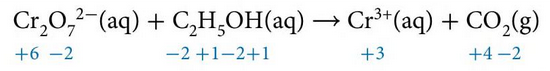
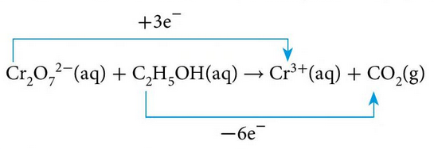
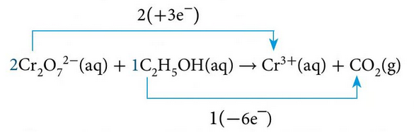

# C9 - Oxidation-Reduction Reactions

## C9.1 - Oxidation and Reduction

- **oxidation:** loss of electrons
- **reduction:** gain of electrons
- **oxidation-reduction reactions:** reaction where electrons are gained by one atom/ion and lost by another atom/ion
	- a.k.a. ***redox reactions***
	- Examples
		- synthesis and decomposition (usually)
		- single displacement (always)
- Conservation of Charge

### Ionic Equations

- **ionic equation:** equation where soluble ionic compounds are written as individual ions
	- **total ionic equation (TIE):** ionic equation including all ions
- **spectator ions:** ions that do not change in a reaction
- **net ionic equation (NIE):** ionic equation w/ spectator ions omitted
	- NOTE: NIEs should have atoms and charges balanced

i.e. Single displacement redox reaction between zinc and copper(II) sulfate

let BCE be balanced chemical equation

$$
\begin{gather*}
\ce{Zn($s$) + CuSO4($aq$) -> ZnSO4($aq$) + Cu($s$)} \tag{BCE} \\
\ce{Zn($s$) + Cu^2+($aq$) + SO4^2-($aq$) -> Zn^2+($aq$) + SO4^2-($aq$) + Cu($s$)} \tag{TIE} \\
\ce{SO4^2-($aq$)} \text{ is a spectator ion} \\
\ce{Zn($s$) + Cu^2+($aq$) -> Zn^2+($aq$) + Cu($s$)} \tag{NIE}
\end{gather*}
$$

### Tracking Electron Transfer

- Use arrows to track gain and loss of electrons
	- metal ion gains e-
	- solid metal loses e-
- **oxidizing agent (O.A.):** agent that accepts electrons and oxidizes another agent
- **reducing agent (R.A.):** agent that donates electrons and reduces another agent
- 💡 *TIP:* oxidizing agent is being reduced / reducing agent is being oxidized

Same example as above

Zn(s) is being *oxidized* and Cu2+(aq) is being *reduced*

$\therefore$ Zn(s) is the **reducing agent** and Cu2+ is the **oxidizing agent**.

### Predicting Spontaneity of Redox Reactions

- **spontaneous reaction:** the reaction proceeds immediately when the agents come into contact
	- occurs when the OA is stronger at oxidizing another agent than the RA
	- and when the RA is stronger at reducing another agent than the OA

#### Activity Series

*In this table, OA above RA leads to spontaneous reaction*

#### Step-by-Step Process of Predicting Spontaneity

1. Write NIE
2. Track gain / loss of e-
3. Identify stronger OA and stronger RA
4. If stronger RA is gaining e- and stronger OA is losing e-, reaction ***is*** spontaneous
5. If stronger OA is gaining e- and stronger RA is losing e-, reaction is ***not*** spontaneous

---

## C9.2 - Balancing Redox Reactions

- **half-reaction:** reaction that shows only the oxidation or the reduction part of a NIE
- *oxidation half-reactions* have e- on right side (products)
- *reduction half-reactions* have e- on left side (reactants)

### Steps for All Conditions

1. Write net ionic equation if necessary
2. Split net ionic equation into half-reactions
3. For each half-reaction
	1. Label half-reaction as *oxidation* or *reduction*, if necessary
	2. Balance # of atoms on both sides, except for hydrogen or oxygen
	3. Balance oxygen by adding H2O(l) on the other side
	4. Balance hydrogen by adding H+(aq) on the other side
	5. Add electrons to the side w/ the higher charge (pos. dir.) so that it matches the other side's charge &mdash; *Balance charges*
4. Multiply each half-reaction by a whole number to make the electron count of both sides equal
5. Add the multiplied half-reactions together w/ the electrons cancelled out
6. Cancel out any products and reactants that are common

*Proceed to step 7 only if the conditions are basic*

Steps 7-9 can also be done before step 4 in step 3

7. Add the same # of OH- ions on both sides as there are H+ ions
8. Combine the H+ and OH- to form water
9. Do step 6 again

#### How to cancel out common agents

1. If the coefficients of the common agent are the same, remove them
2. If they have different coefficients
	1. Find leftover count for the common agent: $\text{reactants} - \text{products} = \text{leftovers}$
	2. If leftover count is positive, add the leftover to the reactant side
	3. If negative, add leftovers to product side

### Examples

#### No Hydrogen or Oxygen, Neutral State

$$
\begin{gather*}
\ce{Cd($s$) + Ag^+($aq$) -> Cd^2+($aq$) + Ag($s$)} \tag{unbalanced} \\ \\
\text{Oxidation half-reaction: } \ce{Cd($s$) -> Cd^2+($aq$) + 2e^-} \\
\text{Reduction half-reaction: } (\ce{Ag^+($aq$) + e^- -> Ag($s$)}) \cdot 2 \\ \\
\therefore \ce{Cd($s$) + 2Ag^+($aq$) -> Cd^2+($aq$) + 2Ag($s$)}
\end{gather*}
$$

#### Acidic or Neutral Conditions

sulfur + nitric acid &rarr; sulfur dioxide

let Ox. be oxidation half-reaction, Re. be reduction half-reaction

$$
\begin{align*}
\ce{S($s$) + HNO3($aq$) &-> SO2($g$) + NO($g$) + H2O($l$)} \tag{unbal.} \\
\ce{S($s$) + H^+($aq$) + NO3^-($aq$) &-> SO2($g$) + NO($g$) + H2O($l$)} \tag{NIE} \\ \\
\ce{S($s$) &-> SO2($g$)} \tag{Ox.} \\
(\ce{S($s$) + 2H2O($l$) &-> SO2($g$) + 4H^+($aq$) + 4e^-}) \cdot 3 \\ \\
\ce{NO3^-($aq$) &-> NO($g$)} \tag{Re.} \\
(\ce{NO3^-($aq$) + 4H^+($aq$) + 3e^- &-> NO($g$) + 2H2O($l$)}) \cdot 4 \\ \\
\ce{3S($s$) + 4NO3^-($aq$) + 6H2O($l$) + 16H^+($aq$) &-> 3SO2($g$) + 4NO($g$) + 12H^+($aq$) + 8H2O($l$)} \tag{1} \\
\ce{3S($s$) + 4NO3^-($aq$) + 4H^+($aq$) &-> 3SO2($g$) + 4NO($g$) + 2H2O($l$)} \tag{2} \\ \\ \text{Better to convert } &\ce{S} \text{ into } \ce{S_8} \\ \\ \therefore \ce{3S_8($s$) + 32NO3^-($aq$) + 32H^+($aq$) &-> 24SO2($g$) + 32NO($g$) + 16H2O($l$)} \\ \\ \end{align*}
$$

For the last step, all coeffecients except for S8 must be multiplied by 8

#### Basic Conditions

cyanide + permanganate &rarr; cyanate + manganese(IV) oxide

let Ox. be oxidation half-reaction, Re. be reduction half-reaction, U. be unbalanaced

$$
\begin{align*}
\ce{CN^-($aq$) + MnO4^-($aq$) &-> CNO^-($aq$) + MnO2($s$)} \tag{U. NIE} \\ \\
\ce{CN^-($aq$) &-> CNO^-($aq$)} \tag{Ox.} \\
(\ce{CN^-($aq$) + H2O($l$) &-> CNO^-($aq$) + 2H^+($aq$) + 2e^-}) \cdot 3 \\ \\
\ce{MnO4^-($aq$) &-> MnO2($s$)} \tag{Re.} \\
(\ce{MnO4^-($aq$) + 4H^+($aq$) + 3e^- &-> MnO2($s$) + 2H2O($l$)}) \cdot 2 \\ \\
\ce{3CN^-($aq$) + 2MnO4^-($aq$) + 3H2O($l$) + 8H^+($aq$) &-> 3CNO^-($aq$) + 2MnO2($s$) + 6H^+($aq$) + 4H2O($l$)} \tag{1} \\
\ce{3CN^-($aq$) + 2MnO4^-($aq$) + [2H^+($aq$) + 2OH^-($aq$)] &-> 3CNO^-($aq$) + 2MnO2($s$) + H2O($l$) + 2OH^-($aq$)} \tag{2} \\
\overset{\ce{2H2O($l$)} \quad\quad\quad\quad\ } \\ \\ \\
\therefore \ce{3CN^-($aq$) + 2MnO4^-($aq$) + H2O($l$) &-> 3CNO^-($aq$) + 2MnO2($s$) + 2OH^-($aq$)}
\end{align*}
$$

### Check Your Work

- Check if the number of each atom is the same on both sides
- Check if the total charge of each side is equal
- Also applies to C9.3

### Disproportionation Reactions

**disproportionation reaction:** reaction where atoms of the same element are both oxidized and reduced

*Example:*

$$
\begin{gather*}
\ce{Cu2O($aq$) + H2SO4($aq$) -> Cu($s$) + CuSO4($aq$) + H2O($l$)} \tag{bal. eq.} \\
\ce{2Cu^+($aq$) + O^2-($aq$) + 2H^+($aq$) -> Cu($s$) + Cu^2+($aq$) + H2O($l$)} \tag{NIE} \\
\ce{Cu^+($aq$) -> Cu^2+($aq$) + e-} \tag{Ox.} \\
\ce{Cu+($aq$) + e- -> Cu($s$)} \tag{Red.}
\end{gather*}
$$

One copper(I) ion is reduced to copper metal, other is oxidized into copper(II)

### Reducing Iron Ore

* **Reduction** originally referred to extracting metal from ore.
* Today, **smelting** and **refining** are used for processing and purifying ores.
* **Ancient copper extraction** (around 3600 BCE) used high temperatures in clay ovens to separate copper from malachite ore.
* **Iron** was first processed from meteorites, then from **hematite ore** (about 2500 BCE).
* **Iron reduction**: heating iron ore with charcoal to produce iron, reducing the mass of ore.
* Modern **smelting** uses carbon (charcoal) as the reducing agent to extract **iron** from ore in a blast furnace.

#### Purification of Iron Ore: Steps

- **charge:** mixture of pulverized iron ore
	- consisting of limestone [*calcium carbonate*] and coke [*carbon*]
	- Coke is made by heating coal without oxygen
- *Charge* is added to the blast furnace  
- As charge falls, hot air is blown in at the bottom (~2000°C).  
- Coke burns with oxygen, incomplete combustion:  

$$
\begin{equation*}
\ce{2C(s) + O2(g) -> 2CO(g) + heat}
\end{equation*}
$$  

- Carbon monoxide rises and reduces iron ore in steps.  
- Metallic iron melts and collects at the bottom.  

*Diagram of reaction:*

Limestone ($\ce{CaCO3}$) breaks down:  

$$
\begin{equation*}
\ce{CaCO3(s) -> CaO(s) + CO2(g)}
\end{equation*}
$$  

Lime reacts with impurities → forms slag:  

$$
\begin{gather*}
\ce{CaO(s) + SiO2(s) -> CaSiO3(l)} \\
\ce{CaO(s) + Al2O3(s) -> Ca(AlO2)2(l)}
\end{gather*}
$$

Slag floats on molten iron and both are removed separately

- Molten iron contains impurities and is poured into long narrow moulds to make bars  
	- impurities: mainly carbon (~5%), silicon, phosphorus, manganese, sulfur
- **pig iron:** the final iron result from the blast furance

*Pig iron* &mdash; resembles piglets nursing

#### Making Steel

- Pig iron contains impurities (about 5% C, plus Si, P, Mn, S).  
- These impurities make iron brittle and must be removed.  
- Refining = process of purifying pig iron into steel.  
- Impurities are oxidized more easily than iron.  
- **Process:**
  - Pig iron poured into upright vessel.  
  - Oxygen gas blown over molten iron.  
  - Lime (flux) added.  

Oxidized impurities react with lime → slag:

$$
\begin{gather*}
\ce{SiO2($l$) + CaO(s) -> CaSiO3($l$)} \\
\ce{P4O10($l$) + 6CaO(s) -> 2Ca3(PO4)2($l$)}
\end{gather*}
$$

- Slag is less dense than iron → floats on top → removed.  
- Steel recovered after slag removal.  
- Steel still has small carbon content (0.03%–1.4%), much less than pig iron.  

---

## C9.3 - Redox Reactions of Molecular Compounds

### Assigning Oxidation Numbers

**oxidation number:** number equal to the charge of an atom if the electrons were possessed by the atom w/ the greatest electronegativity

- charges are written as: *number sign* (i.e. 2+)
- oxidation numbers are written as: *sign number* (i.e. -1)

|Rule|Description|Example|
|---|---|---|
|1|Pure elements have an oxidation number of 0.|Na, Br₂, P₄ → 0|
|2|Oxidation number of a monatomic ion equals its charge.|Al³⁺ → +3 Se²⁻ → −2|
|3|H is +1 in compounds, −1 in metal hydrides.|H₂O: H → +1 NaH: H → −1|
|4|O is usually −2, except in peroxides (O22-), superoxides (O2-), and OF₂.|H₂O: O → −2|
|5|In compounds without H or O, the more electronegative element has an oxidation number equal to the negative charge it usually has in ionic compounds.|PCl₃: Cl → −1|
|6|Sum of oxidation numbers in a neutral compound is 0.|CF₄: C → +4 F &rarr; -1 each 4 + 4(-1) = 0|
|7|Sum of oxidation numbers in a polyatomic ion equals the ion’s charge.|NO₂⁻: N → +3, O −2 each 3 + 2(-2) = -1|

#### Assigning Oxidation \#s to Atoms, Ex. 1: $\ce{SiBr4(l)}$

1. The compound does not have H or O, apply rule 5
	- Br has charge of 1- in ionic compounds
	- The oxidation number of Br is -1
2. The net oxidation number is 0, apply rule 6
	1. Find oxidation # of Si; there is 1 Si
	2. There is 4 Br with oxidation # -1
	3. $x + 4(-1) = 0$ (let x be the oxidation # of Si)
	4. The oxidation number of Si is +4

$\therefore$ The oxidation numbers of Br and Si are -1 and +4 respectively.

#### Example 2: $\ce{HClO4(aq)}$

let ON be oxidation number

1. The compound has O, apply rule 4
	- ON of O is -2
2. The compound has H, apply rule 3
	- ON of H is +1
3. The net oxidation number is 0, apply rule 6
	- Find oxidation number of Cl; there is 1 Cl
	- 4 O w/ -2 ON + 1 H w/ +1 ON
	- let x be the oxidation number of Cl
	$$
	\begin{gather*}
	1 + x + 4(-2) = 0 \\
	x - 7 = 0 \\
	x = 7
	\end{gather*}	
	$$
	- ON of Cl is +7

$\therefore$ The oxidation numbers of H, Cl, and O are +1, +7, and -2 respectively.

#### Example 3: $\ce{Cr2O7^2-(aq)}$

let ON be oxidation number

1. The compound has O, apply rule 4
	- ON of O is -2
2. The net ON is -2, apply rule 7
	- Find ON of Cr; there are 2 Cr
	- 7 O w/ -2 ON
	- let x be ON of Cr
	$$
	\begin{gather*}
	2x + 7(-2) = -2 \\
	2x - 14 = -2 \\
	x - 7 = -1 \\
	x = 6
	\end{gather*}
	$$

$\therefore$ The oxidation numbers of Cr and O are +6 and -2 respectively.

#### Example 4: $\ce{Fe3O4(s)}$ (Fractional Oxidation Numbers)

1. The compound has O, apply rule 4
	- ON of O is -2
2. The net ON is 0, apply rule 6
	- Find ON of Fe; there are 3 Fe
	- 4 O w/ -2 ON
	- let x be ON of Fe
	$$
	\begin{gather*}
	3x + 4(-2) = 0 \\
	3x - 8 = 0 \\
	3x = 8 \\
	x = \frac 8 3
	\end{gather*}
	$$

$\therefore$ The oxidation numbers of Fe and O are +8&frasl;3 and -2 respectively.

*The fractional oxidation number is the average.*

#### Using Lewis Structures

1. Draw lewis structures of the molecular compound without converting dots to lines
2. Determine electronegatives for each atom from periodic table
3. Circle the electrons that "belong" to each atom
	1. The electrons "belong" to the more electronegative atom, otherwise they are split 50/50
4. Count valence electrons inside each circle
5. For each atom, calculate the oxidation numbers
	1. oxidation number = valence electrons in neutral atom - valence electrons in circle
6. If there are atoms of a same element with different oxidation numbers, find the average of each element's oxidation numbers

### Applying Oxidation Numbers (ON) to Redox Reactions

#### Determining if Reaction is Redox

1. Assign ON to each atom and ion in a net ionic equation
2. If the ON of at least 2 atoms changes, the reaction is redox
3. If the ON of the same element both oxidizes and reduces, the reaction is also disproportionate

- **oxidation:** increase in oxidation number
- **reduction:** decrease in oxidation number
- **disproportionation reaction:** redox reaction where atoms of the same element both oxidize and reduce

i.e. zinc + copper(II) sulfate &rarr; copper + zinc sulfate

1. Assigning oxidation numbers to each atom and ion

2. The oxidation number of Zn changes from 0 to +2
3. The ON of Cu changes from +2 to 0
4. The same element does not simultaneously oxidize or reduce

$\therefore$ This reaction is redox.

#### Balancing using Oxidation Numbers (ON)

1. Write unbalanced equation if necessary
2. Assign oxidation numbers to each atom
3. Determine whether reaction is redox
4. If reaction is redox, identify atoms whose ON increases, and those whose ON decreases
5. Pre-balance equations (excl. O, H in acidic/basic) to allow for proper electron transfer
	1. If more than 1 product, pre-balance reactant for 1 product only
	2. (most confusing step)
6. Determine numerical values of ON changes, which are the transfer of electrons
7. Determine LCM of electrons gained of reducing agent and electrons gained of oxidizing agent
8. Balance the oxidizing and reducing agent by setting their coefficients to satisfy:
	1. coefficient x transfer of electrons = LCM
9. Balance remaining atoms by inspection
10. If occuring in acidic solution, balance oxygen using water and hydrogen by hydrogen ions
11. If occuring in basic solution, do step 9, then neutralize hydrogen ions with OH ions

#### Example

dichromate + ethanol &rarr; chromium(III) + carbon dioxide (acidic conditions)

1. Write unbalanced equation

$$
\begin{equation*}
\ce{Cr2O7^2-($aq$) + C2H5OH($aq$) -> Cr^3+($aq$) + CO2($g$)}
\end{equation*}
$$

2. Assign oxidation numbers

3. Identifying atoms whose ON changes
	- ON of Cr decreases from +6 &rarr; +3
	- ON of C increases from -2 &rarr; +4

4. Determine numerical transfer of electrons

5. Determine the LCM (which is 6 in this case)
6. Multiply the agents by the coefficient necessary to reach the LCM

7. Balance by inspection except for O or H in acidic/basic conditions

$$
\begin{equation*}
\ce{2Cr2O7^2-($aq$) + C2H5OH($aq$) -> 4Cr^3+($aq$) + 2CO2($g$)}
\end{equation*}
$$

8. Balance H and O for basic conditions

$$
\begin{gather*}
\therefore \ce{2Cr2O7^2-($aq$) + C2H5OH($aq$) + 16H^+($aq$) -> 4Cr^3+($aq$) + 2CO2($g$) + 11H2O($l$)} \\
\end{gather*}
$$